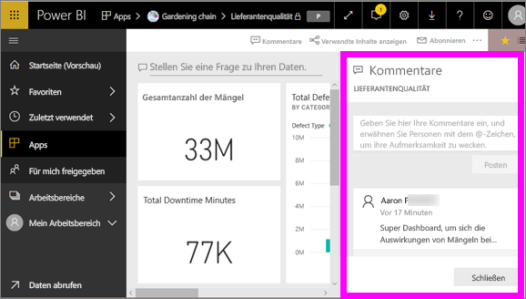
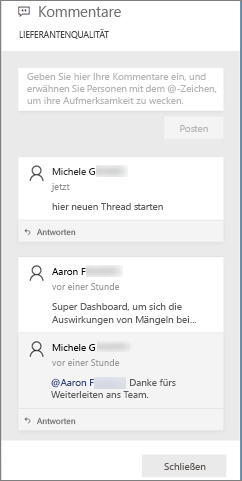

# Hinzufügen von Kommentaren zu einem Dashboard oder Bericht
Fügen Sie einen privaten Kommentar hinzu, oder Starten einer Konversations zu einem Dashboard oder Bericht für Ihre Kollegen. Das Feature **Kommentare** ist nur eine der Möglichkeiten, wie ein *Endbenutzer* mit anderen Personen interagieren kann. 

## Verwenden des Features „Kommentare“
Kommentare können auf ein gesamtes Dashboard, um einzelne visuelle Elemente in einem Dashboard, an eine Berichtsseite und auf einzelne visuelle Elemente auf einer Berichtsseite hinzugefügt werden. Fügen Sie einen allgemeinen Kommentar oder einen Kommentar auf bestimmte Kollegen ausgerichtet sind.  

Wenn Sie einen Kommentar zu einem Bericht hinzufügen, wird in Power BI die aktuellen Filter und Slicer Werte erfasst. Dies bedeutet, dass, wenn Sie auswählen, oder auf einen Kommentar, der die Berichtsseite zu reagieren oder berichtsvisualisierung ändern kann, damit Sie sehen, dass den Filter und Auswahl von Slicern, die aktiv waren, wenn der Kommentar wurde hinzugefügt.  

Warum ist das wichtig? Angenommen Sie, ein Kollege ein Filter angewendet, der interessante Einblicke gewonnen werden, die er für das Team freigeben möchte. Ohne diesen Filter ausgewählt ist kann der Kommentar nicht sinnvoll. 

### Fügen Sie einen allgemeinen Kommentar zu einem Dashboard oder Bericht
Die Prozesse zum Hinzufügen von Kommentaren zu einem Dashboard oder Bericht sind ähnlich. In diesem Beispiel verwenden wir ein Dashboard. 

1. Öffnen Sie eine Power BI-Dashboard oder Bericht, und wählen Sie die **Kommentare** Symbol. Daraufhin wird das Dialogfeld „Kommentare“ geöffnet.

    

    Auf der folgenden Abbildung hat der Ersteller des Dashboards bereits einen allgemeinen Kommentar hinzugefügt.  Jedem Benutzer mit Zugriff auf dieses Dashboard wird dieser Kommentar angezeigt.

    

2. Klicken Sie zum Beantworten auf **Antworten**, geben Sie Ihre Antwort ein, und klicken Sie anschließend auf **Post** (Posten).  

    

    Standardmäßig leitet Power BI Ihre Antwort an den Kollegen weiter, der den Kommentarthread gestartet hat, in diesem Fall Aaron F. 

    

 3. Wenn Sie möchten einen Kommentar hinzuzufügen, der nicht Teil eines vorhandenen Threads ist, geben Sie im Textfeld für den oberen Ihre Kommentar.

    

    Die Kommentare für dieses Dashboard werden jetzt wie folgt dargestellt:

    

### Hinzufügen eines Kommentars zu einem bestimmten Dashboard oder Bericht visual
Zusätzlich zum Hinzufügen von Kommentaren aus, um ein gesamtes Dashboard oder für eine gesamte Berichtsseite, können Sie Kommentare zu einzelnen dashboardkacheln und Visualisierungen aus einzelnen Berichten hinzufügen. Die Prozesse sind ähnlich, und in diesem Beispiel verwenden wir einen Bericht.

1. Zeigen Sie auf das Visual, und klicken Sie auf die Auslassungspunkte (...).    
2. Wählen Sie in der Dropdownliste **Kommentar hinzufügen** aus.

      

3.  Die **Kommentare** Dialogfeld wird geöffnet, und die anderen Visualisierungen auf der Seite werden abgeblendet. Zu diesem Visual gibt es noch keine Kommentare. 

      

4. Geben Sie Ihren Kommentar ein, und klicken Sie auf **Post** (Posten).

      

    - In einem Bericht hervorgehoben Seite wählen einen Kommentar, der auf ein visuelles Element, erfolgt diese Visualisierung aus (siehe oben).

    - In einem Dashboard das Symbol "Diagramm"  ermöglicht es uns wissen, dass ein Kommentar an ein bestimmtes Visual gebunden ist. Ein besonderes Symbol keine Kommentare, die für das gesamte Dashboard gelten. Wählen das Symbol "Diagramm" werden die zugehörigen Visualisierung auf dem Dashboard hervorgehoben.

        

5. Klicken Sie auf **Schließen**, um zum Dashboard oder zum Bericht zurückzukehren.

### Kollegen mit dem @-Zeichen auf Kommentare aufmerksam machen
Gibt an, ob Sie ein Dashboard, Kachel oder den Bericht visual Kommentar Ziehpunkte Ihrer Kollegen Aufmerksamkeit mit erstellen, die "\@" Symbol.  Bei der Eingabe der "\@" Symbol öffnet eine Dropdownliste, in dem Sie suchen und Auswählen von Personen in Ihrer Organisation können Powerbi. Überprüfte Namen, denen ein \@-Zeichen vorangestellt wurde, werden in blauer Schrift dargestellt. 

Hier ist eine Konversation mit dem *Designer* der Visualisierung zu sehen. Er benutzt das @-Symbol, um sicherzustellen, dass ich den Kommentar sehe. Ich weiß, dass dieser Kommentar für mich ist. Wenn ich dieses App-Dashboard in Power BI öffne, wähle ich in der Kopfzeile **Kommentare** aus. Im Bereich **Kommentare** wird unsere Konversation angezeigt.

  

## Nächste Schritte
Zurück zu [Visualisierungen für Consumer](end-user-visualizations.md)    
<!--[Select a visualization to open a report](end-user-open-report.md)-->
