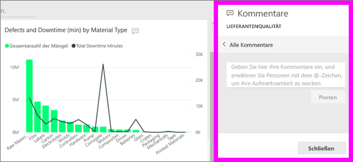
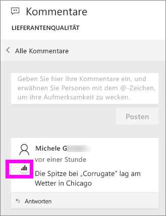
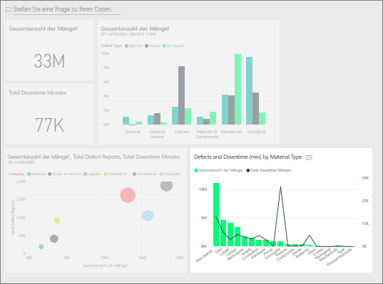
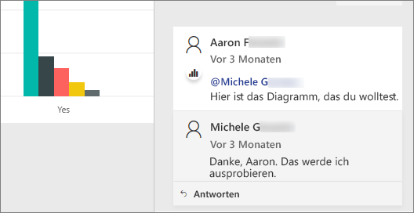

# Hinzufügen von Kommentaren zu einem Dashboard
Sie können einen persönlichen Kommentar hinzufügen oder mit Ihren Kollegen eine Unterhaltung über ein Dashboard beginnen. Das Feature **Kommentare** ist nur eine der Möglichkeiten, wie ein *Endbenutzer* mit anderen Personen interagieren kann. 

## Verwenden des Features „Kommentare“
Kommentare können einem gesamten Dashboard oder einzelnen Visuals eines Dashboards hinzugefügt werden. Sie können einen allgemeinen Kommentar hinzufügen oder einen Kommentar an bestimmte Kollegen richten.  

### Hinzufügen eines allgemeinen Kommentars zu einem Dashboard
1. Öffnen Sie ein Power BI-Dashboard, und klicken Sie auf das Symbol **Kommentare**. Daraufhin wird das Dialogfeld „Kommentare“ geöffnet.

    

    Auf der folgenden Abbildung hat der Ersteller des Dashboards bereits einen allgemeinen Kommentar hinzugefügt.  Jedem Benutzer mit Zugriff auf dieses Dashboard wird dieser Kommentar angezeigt.

    

2. Klicken Sie zum Beantworten auf **Antworten**, geben Sie Ihre Antwort ein, und klicken Sie anschließend auf **Post** (Posten).  

    

    Standardmäßig leitet Power BI Ihre Antwort an den Kollegen weiter, der den Kommentarthread gestartet hat, in diesem Fall Aaron F. 

    

 3. Wenn Sie einen Dashboard-Kommentar nicht zu einem vorhandenen Thread hinzufügen möchten, geben Sie Ihren Kommentar in das obere Textfeld ein.

    

    Die Kommentare für dieses Dashboard werden jetzt wie folgt dargestellt:

    

### Hinzufügen eines Kommentars zu einem bestimmten Dashboardvisual
1. Zeigen Sie auf das Visual, und klicken Sie auf die Auslassungspunkte (...).    
2. Wählen Sie in der Dropdownliste **Kommentar hinzufügen** aus.

      

3.  Daraufhin wird das Dialogfeld **Kommentare** geöffnet. Zu diesem Visual gibt es noch keine Kommentare. 

      

4. Geben Sie Ihren Kommentar ein, und klicken Sie auf **Post** (Posten).

      

    Das Diagrammsymbol  informiert Sie darüber, dass dieser Kommentar an ein bestimmtes Visual gebunden ist. Wenn Sie auf das Symbol klicken, wird das zugehörige Visual auf dem Dashboard hervorgehoben.

    

5. Klicken Sie auf **Schließen**, um zum Dashboard oder zum Bericht zurückzukehren.

### Kollegen mit dem @-Zeichen auf Kommentare aufmerksam machen
Beim Erstellen von Kommentaren für ein Dashboard oder ein bestimmtes Visual können Sie mit dem \@-Zeichen Kollegen auf Kommentare aufmerksam machen.  Bei der Eingabe des \@-Zeichens wird in Power BI eine Dropdownliste geöffnet, in der Sie nach Personen in Ihrer Organisation suchen und diese auswählen können. Überprüfte Namen, denen ein \@-Zeichen vorangestellt wurde, werden in blauer Schrift dargestellt. 

Hier ist eine Konversation mit dem *Designer* der Visualisierung zu sehen. Er benutzt das @-Symbol, um sicherzustellen, dass ich den Kommentar sehe. Ich weiß, dass dieser Kommentar für mich ist. Wenn ich dieses App-Dashboard in Power BI öffne, wähle ich in der Kopfzeile **Kommentare** aus. Im Bereich **Kommentare** wird unsere Konversation angezeigt.

  

## Nächste Schritte
Zurück zu [Visualisierungen für Consumer](end-user-visualizations.md)    
<!--[Select a visualization to open a report](end-user-open-report.md)-->
