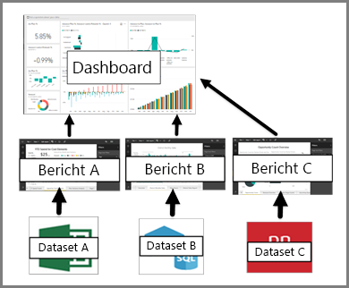

# Dashboard für Benutzer des Power BI-Diensts

Ein Power BI-***Dashboard*** ist eine einzelne Seite (häufig als Zeichenbereich bezeichnet), auf der mithilfe von Visualisierungen eine Geschichte erzählt wird. Wegen der Beschränkung auf eine Seite erkennen Sie ein gut gestaltetes Dashboard daran, dass die Geschichte auf ihre Kernaussagen verdichtet ist.

Die Visualisierungen auf einem Dashboard werden als *Kacheln* bezeichnet. Kacheln stammen aus Berichten und werden an ein Dashboard *angeheftet*. Wenn Sie mit Power BI noch nicht vertraut sind, lesen Sie den Artikel [Grundkonzepte des Power BI-Diensts](end-user-basic-concepts.md).

> [!NOTE]
> Dashboards sind ein Feature des Power BI-Diensts. In Power BI Desktop sind sie nicht verfügbar. Obwohl Dashboards nicht mit Mobilgeräten erstellt werden können, lassen sie sich dort [anzeigen und freigeben](/mobile/mobile-apps-view-dashboard.md).
> 
> 

Die Visualisierungen eines Dashboards stammen aus Berichten. Jeder Bericht basiert auf einem Dataset. Sie können sich ein Dashboard als Fenster zu den zugrunde liegenden Berichten und Datasets vorstellen. Wenn Sie eine Visualisierung auswählen, gelangen Sie zu dem Bericht (und damit dem Dataset), mit dem sie erstellt wurde.

## Vorteile von Dashboards
Mit Dashboards können Sie die Entwicklung Ihres Geschäfts verfolgen, entscheidenden Fragen nachgehen und die wichtigsten Metriken immer im Auge behalten. Jede Visualisierung eines Dashboards kann auf einem oder vielen Datasets, auf einem einzelnen Bericht oder zahllosen Berichten basieren. Ein Dashboard fasst lokale und cloudbasierte Daten zusammen und bietet eine konsolidierte Ansicht – unabhängig vom Speicherort der Daten.

Ein Dashboard sieht nicht nur gut aus, es ist ausgesprochen interaktiv, weitgehend anpassbar und immer aktuell, wenn sich die zugrunde liegenden Daten ändern.

## Vergleich: Dashboards und Berichte
Als Zeichenbereiche, die ebenfalls Visualisierungen enthalten, werden Berichte gerne mit Dashboards verwechselt. Es gibt aber einige wichtige Unterschiede.

| **Eigenschaften** | **Dashboards** | **Berichte** |
| --- | --- | --- |
| Pages |Eine Seite |Eine oder mehrere Seiten |
| Datenquellen |Ein oder mehrere Berichte und ein oder mehrere Datasets pro Dashboard |Ein Dataset pro Bericht |
| In Power BI Desktop verfügbar |Nein |Ja, Berichte können erstellt und angezeigt werden. |
| Anheften |Vorhandene Visualisierungen (Kacheln) können vom aktuellen Dashboard aus nur an andere Ihrer Dashboards angeheftet werden. |Visualisierungen können (als Kacheln) an beliebige Ihrer Dashboards angeheftet werden. Gesamte Berichtsseiten können an beliebige Ihrer Dashboards angeheftet werden. |
| Abonnieren |Ein Dashboard kann nicht abonniert werden. |Berichtsseiten können abonniert werden. |
| Filter |Keine Filter, keine Slices |Viele Filter, Hervorhebungen und Slices |
| Benachrichtigungen festlegen |Benachrichtigungen können erstellt werden. Sie erhalten eine E-Mail, wenn bestimmte Bedingungen erfüllt sind. |Nein |
| Ausgewählt |Ein Dashboard kann als „ausgewähltes“ Dashboard festgelegt werden. |Ein ausgewählter Bericht kann nicht erstellt werden. |
| Abfragen in natürlicher Sprache |Über das Dashboard verfügbar |Über Berichte nicht verfügbar |
| Visualisierungstyp veränderbar |Nein. Wenn der Besitzer eines Berichts den Visualisierungstyp im Bericht ändert, wird die an das Dashboard angeheftete Visualisierung außerdem nicht aktualisiert. |Ja |
| Zugrunde liegende Dataset-Tabellen und Felder sichtbar |Nein. Exportieren von Daten, aber Tabellen und Felder im Dashboard nicht sichtbar |Ja. Tabellen, Felder und Werte des Datasets sichtbar |
| Visualisierungen erstellen |Es können ausschließlich Widgets zum Dashboard hinzugefügt werden („Kachel hinzufügen“). |Viele verschiedene Visuals können erstellt, benutzerdefinierte Visuals hinzugefügt und Visuals (mit Bearbeitungsberechtigungen) bearbeitet werden. |
| Anpassung |Visualisierungen (Kacheln) können u.a. verschoben und angeordnet, vergrößert und verkleinert, mit Links versehen, umbenannt, gelöscht und im Vollbildmodus angezeigt werden. Die Daten und Visualisierungen selbst sind allerdings schreibgeschützt. |In der Leseansicht können Berichte u.a. veröffentlicht, eingebettet, gefiltert, exportiert, als PBIX heruntergeladen und in Excel analysiert werden. Außerdem können Sie verwandte Inhalte anzeigen und QR-Codes generieren.  In der Bearbeitungsansicht haben Sie noch mehr Möglichkeiten. |

## Ersteller und Anwender von Dashboards
Erstellen Sie Dashboards für den eigenen Gebrauch, oder geben Sie sie später für Ihre Mitarbeiter frei? Dann sollten Sie wissen, wie Dashboards erstellt und freigegeben werden. Oder erhalten Sie Dashboards von anderen? Dann möchten Sie vielleicht wissen, wie Dashboards funktionieren und wie Sie mit ihnen interagieren.

Hier finden Sie die entsprechenden Anleitungen für jede dieser Rollen.

Power BI Pro ist sowohl für Freigeben eines Dashboards als auch Anzeigen eines freigegebenen Dashboards erforderlich.

### Wenn Sie Dashboards erhalten und verwenden
* Machen Sie sich mit Dashboards vertraut, indem Sie sich eine Tour durch eines unserer [Beispiel-Dashboards](../sample-tutorial-connect-to-the-samples.md) ansehen.
* Informieren Sie sich über [Dashboardkacheln](end-user-tiles.md), und erfahren Sie, wie Sie damit interagieren.
* Sie möchten eine bestimmte Dashboardkachel im Auge behalten und eine E-Mail erhalten, wenn ein bestimmter Grenzwert erreicht wird? [Erstellen Sie Datenwarnungen auf Kacheln](end-user-alerts.md).
* Stellen Sie Fragen zu Dashboards. Mit [Power BI Q&A](end-user-q-and-a.md) können Sie Fragen zu Ihren Daten stellen und erhalten eine Antwort in Form einer Visualisierung.

> [!TIP]
> Über das Inhaltsverzeichnis finden Sie bei Bedarf weitere Antworten.
> 

## Nächste Schritte
[Was ist Power BI?](../power-bi-overview.md)  
[Power BI – Grundkonzepte](end-user-basic-concepts.md)  