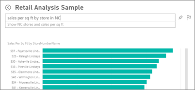
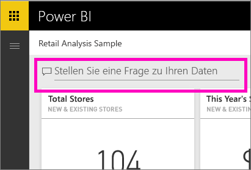
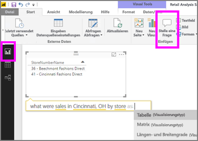

# Q&A im Power BI-Dienst und in Power BI Desktop
## Was ist Q&A?
Manchmal ist die schnellste Möglichkeit, um eine Antwort auf Basis Ihrer Daten zu erhalten, eine Frage in natürlicher Sprache zu stellen. Beispiel: „Wie lautet der Gesamtumsatz für das letzte Jahr“.  Verwenden Sie den Bereich für Fragen und Antworten (F&A), um Ihre Daten mithilfe intuitiver Möglichkeiten der natürlichen Sprache zu untersuchen und die entsprechenden Antworten in Form von Diagrammen und Grafiken zu erhalten. Der Bereich für Fragen und Antworten unterscheidet sich von einer Suchmaschine. Dieser Bereich stellt ausschließlich Ergebnisse zu den Daten in Power BI bereit.

Dieser Artikel ist der Ausgangspunkt für alle Themen rund um Q&A. Wählen Sie unten einen Link aus, um sich über die Funktionsweise von Q&A im Power BI-Dienst (Dashboards und Berichte), in Power BI Desktop (Berichte), in Power BI Embedded und in Power BI Mobile zu informieren.  

> [!NOTE]
> **Power BI Q&A** unterstützt nur die Beantwortung von Fragen in natürlicher Sprache, die in Englisch gestellt werden. Sie können auch ein Feature in Vorschauversion für Fragen, die in Spanisch gestellt werden, anzeigen. Wechseln Sie in **Power BI Desktop** zu **Datei** > **Optionen und Einstellungen** > **Optionen**, und suchen Sie nach der Registerkarte **Vorschaufeatures**. Aktivieren Sie das Kontrollkästchen **Unterstützung für Spanisch als Sprache für Q&A**.  
>
>

Fragen stellen ist erst der Anfang.  Viel Spaß bei Ihrer Reise, bei der Sie Daten optimieren oder eine Frage erweitern, vertrauenwürdige neue Informationen entdecken, sich die Details genauer ansehen und für eine breitere Übersicht den Fokus herausnehmen. Sie werden begeistert sein, welche Einblicke Sie gewinnen und welche Entdeckungen Sie machen werden.

Die Erfahrung ist wahrhaft interaktiv... und schnell! Unterstützt durch einen In-Memory-Speicher wird die Antwort nahezu unmittelbar zurückgegeben.

##  Q&A für *Nutzer*
Wenn ein Kollege ein Dashboard für Sie freigegeben hat, befindet sich das Q&A-Fragefeld im Power BI-Dienst (app.powerbi.com) im Dashboard, in Power BI Mobile am unteren Rand des Dashboards und in Power BI Embedded über der Visualisierung. Sie können mit Q&A Daten untersuchen, jedoch keine mit Q&A erstellten Visualisierungen speichern, es sei denn, der Besitzer hat Ihnen Bearbeitungsberechtigungen erteilt.

## Q&A für *Ersteller*
Wenn Sie ein *Ersteller* von Power BI-Berichten sind oder über Bearbeitungsberechtigungen für ein Dataset verfügen, finden Sie im Power BI-Dienst das Q&A-Fragefeld im Dashboard und im Power BI-Dienst sowie in Power BI Desktop auf jeder Berichtsseite. Jede Visualisierung, die Sie mit Q&A erstellen, kann in einem Dashboard gespeichert werden und in einem Bericht gespeichert werden.

Ersteller und Datasetbesitzer können nicht nur mit Q&A Daten untersuchen, sondern die Verwendung von Q&A durch Benutzer verbessern, indem sie [ihre Datasets ändern](../service-prepare-data-for-q-and-a.md), [ausgewählte Fragen](../service-q-and-a-create-featured-questions.md) hinzufügen sowie für lokale, über eine Liveverbindung verwendete Datasets [Q&A aktivieren und deaktivieren](end-user-q-and-a-direct-query.md). In [Embedded-Szenarien](../developer/qanda.md) haben Entwickler die Wahl zwischen zwei Modi: **interaktiv** und **nur Ergebnis**.

## Wie kann Q&A Fragen beantworten?
### Welche Datasets verwendet Q&A?
Wie kann der Bereich für Fragen und Antworten datenbezogene Fragen beantworten? Q&A bezieht sich auf die Namen der Tabellen, Säulen und berechneten Felder in einer Arbeitsmappe im zugrunde liegenden Dataset. Daher ist es wichtig, wie Sie (oder der Besitzer des Datasets) Dinge benennen!

Nehmen wir an, Sie haben eine Excel-Tabelle namens „Vertrieb“, die die Spalten „Produkt“, „Monat“, „Verkaufte Einheiten“, „Bruttoumsätze“ und „Gewinn“ enthält. Sie können Fragen zu diesen Entitäten stellen.  Geben Sie z. B. Fragen wie „*Umsätze* anzeigen“, „Gesamter *Gewinn* nach *Monat* “, „*Produkte* nach *verkauften Einheiten* sortieren“ ein.

Q&A beantwortet Fragen, die auf der Organisation Ihres Datasets basieren. Wie sieht die Vorgehensweise bei Daten in Salesforce aus? Wenn Sie eine Verbindung zu Ihrem Konto bei salesforce.com aufbauen, erstellt Power BI automatisch ein Dashboard.  Bevor Sie Fragen in Q&A eingeben, prüfen Sie zunächst die Daten, die in den Dashboardvisualisierungen sowie in der Q&A-Dropdownliste angezeigt werden.

* Wenn die Achsenbeschriftungen und -werte der Visualisierungen Begriffe wie „Umsätze“, „Konto“, „Monat“ und „Chancen“ enthalten, können Sie ganz einfach Fragen wie „Welches *Konto* hat die besten *Chancen* “ oder „*Umsätze* nach Monat als Balkendiagramm anzeigen“ eingeben.
* Enthält die Dropdownliste Begriffe wie „Verkäufer“, „Bundesland“ und „Jahr“, dann werden Fragen wie: „welcher *Verkäufer* verzeichnete die geringsten *Umsätze* in *Hessen* im Jahr *2013* “ zuverlässig beantwortet.

Wenn Sie Website-Leistungsdaten in Google Analytics haben, könnten Sie bei Q&A in Erfahrung bringen, wie viel Zeit auf einer Website verbracht wird, wie häufig einzelne Seiten aufgerufen werden und wie die Benutzerbindung aussieht. Wenn Sie demografische Daten benötigen, können Sie auch Alter und Haushaltseinkommen nach Ort erfragen.

### Welche Visualisierung verwendet Q&A?
Q&A wählt die beste Visualisierung basierend auf den angezeigten Daten aus. Manchmal werden Daten in den zugrunde liegenden Datasets als bestimmter Typ oder bestimmte Kategorie definiert. Dadurch weiß Q&A, wie sie angezeigt werden sollen. Wenn Daten z. B. als Datentyp definiert sind, müssen sie wahrscheinlich als Liniendiagramm angezeigt werden. Daten, die als eine Stadt kategorisiert werden, müssen wahrscheinlich als Karte angezeigt werden.

Sie können Q&A auch mitteilen, welche Visualisierung verwendet werden soll, indem Sie Ihrer Frage diese Information hinzufügen. Bedenken Sie jedoch, dass Q&A Daten nicht immer im angeforderten Visualisierungstyp anzeigen kann.

Informationen zu Schlüsselwörtern, die Q&A erkennt, finden Sie unter [Tipps zum Stellen von Fragen](end-user-q-and-a-tips.md).

## Weitere Informationen zu Power BI Q&A
[Übersicht: Verwenden von Q&A in Power BI-Dashboards und -Berichten:](../power-bi-tutorial-q-and-a.md) Schrittweise Anleitung zur Verwendung von Q&A und eine Übersicht über die Funktionsweise.

[Mobile Microsoft Power BI-App:](mobile/mobile-apps-ios-qna.md) Für iOS auf iPads, iPhones und iPod Touch-Geräten.

[Microsoft Power BI Embedded:](../developer/qanda.md) Integrieren Sie Q&A in eine Anwendung.

[Tipps zum Stellen von Fragen in Q&A:](end-user-q-and-a-tips.md) Erfahren Sie Näheres zur Kommunikation mit Q&A, um optimale Ergebnisse zu erhalten.

[Fügen Sie Ihren Datasets ausgewählte Fragen hinzu](../service-q-and-a-create-featured-questions.md), dann schlägt Q&A Ihren Kollegen diese Fragen vor.

[Aktivieren von Q&A für lokale Datasets:](end-user-q-and-a-direct-query.md) Wenn Sie ein Gateway für die Verbindung mit dem Dataset benötigen, verwenden Sie Power BI-Einstellungen, um Q&A zu aktivieren und zu deaktivieren.

[Tutorial: Verwenden von Q&A für das Einzelhandelsumsatz-Beispiel im Power BI-Dienst:](../power-bi-visualization-introduction-to-q-and-a.md) Verwenden Sie Q&A in einem realistischen Branchentutorial.

[Abstimmen der Daten auf Q&A:](../service-prepare-data-for-q-and-a.md) Sind Sie die Person, die Datasets und Datenmodelle erstellt?  Dann sind Sie bei diesem Thema richtig.

Weitere Fragen? [Wenden Sie sich an die Power BI-Community](http://community.powerbi.com/)
