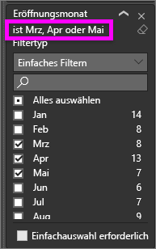
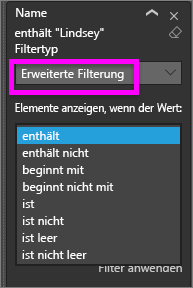
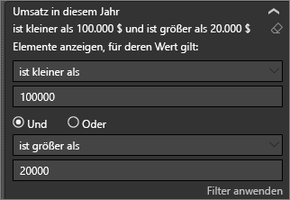

# Überblick über den Berichtsbereich „Filter“

Dieser Artikel befasst sich mit dem Berichtsbereich **Filter** im Power BI-Dienst. Sie können Filter verwenden, um neue Erkenntnisse zu Ihren Daten zu gewinnen.

Es gibt viele verschiedene Wege, Daten in Power BI zu filtern. Weitere Informationen zu Filtern finden Sie unter [Filters and highlighting in Power BI reports (Filter und Hervorhebungen in Power BI-Berichten)](../power-bi-reports-filters-and-highlighting.md).

## Arbeiten mit dem Bereich „Filter“ in Berichten

Wenn ein Kollege einen Bericht mit Ihnen teilt, suchen Sie immer nach dem Bereich **Filter**. Manchmal befindet er sich zugeklappt am rechten Rand des Berichts. Klicken Sie darauf, um ihn aufzuklappen.

Der Bereich **Filter** enthält Filter, die der *Berichts-Designer* zum Bericht hinzugefügt hat. *Berichtsnutzer* wie Sie können mit den vorhandenen Filtern interagieren und ihre Änderungen speichern, aber keine neuen Filter zum Bericht hinzufügen. Auf dem obigen Screenshot hat der Designer beispielsweise zwei Filter auf Seitenebene hinzugefügt: **Segment** und **Year** (Jahr). Sie können mit diesen Filtern interagieren und sie ändern, Sie können jedoch keinen dritten Filter auf Seitenebene hinzufügen.

Berichte behalten alle Änderungen bei, die Sie im Bereich **Filter** vornehmen. Der Dienst überträgt diese Änderungen auch in die mobile Version des Berichts.

Sie können den Bereich **Filter** auf die Standardwerte des Designers zurücksetzen, indem Sie auf  in der oberen Menüleiste klicken.

## Anzeigen aller Filter einer Berichtsseite

Der Bereich **Filter** zeigt alle Filter an, die der Designer zum Bericht hinzugefügt hat. Im Bereich **Filter** können Sie außerdem Informationen zu den Filtern anzeigen und mit ihnen interagieren. Sie können Ihre Änderungen speichern oder **Auf Standardwert zurücksetzen** verwenden, um die ursprünglichen Filtereinstellungen wiederherzustellen.

Wenn Sie Änderungen speichern möchten, können Sie auch ein persönliches Lesezeichen erstellen.  Weitere Informationen finden Sie unter [What are bookmarks? (Was sind Lesezeichen?)](end-user-bookmarks.md).

Im Bereich **Filter** werden mehrere Arten von Berichtsfiltern angezeigt und verwaltet. Diese können auf ein Visual, eine Berichtsseite oder auf den gesamten Bericht angewendet werden.

In diesem Beispiel wurde ein Visual mit zwei Filtern ausgewählt. Außerdem wurden Filter auf die Berichtsseite angewendet, die unter **Filter für diese Seite** aufgeführt werden. Darüber hinaus wurde auf den gesamten Bericht der Filter **Date** (Datum) angewendet.

Neben einigen der Filter steht **(All)** (Alle). **(All)** (alle) bedeutet, dass alle Werte im Filter enthalten sind. Im obigen Screenshot wird mit **Segment (All)** angegeben, dass diese Berichtsseite Daten zu allen Produktsegmenten enthält. Wenn Sie den Filter auf Seitenebene **Region is West** (Region ist Westen) auswählen, enthält die Berichtsseite nur die Daten für die Region „Westen“.

Jeder, der den Bericht aufruft, kann auch mit den Filtern interagieren.

### Ausschließliches Anzeigen der auf ein Visual angewendeten Filter

Sie können sich die Filter eines spezifischen Visuals genauer ansehen, indem Sie auf das Visual zeigen, um das Filtersymbol aufzudecken . Klicken Sie auf das Filtersymbol, um ein Popupfenster mit allen Filtern, Datenschnitten usw. zu öffnen, die auf das Visual angewendet wurden. Die Filter im Popupfenster sind die gleichen, die auch im Bereich **Filter** aufgeführt werden.

Die folgenden Filter können in dieser Ansicht angezeigt werden:

- Basisfilter

- Datenschnitte

- Übergreifende Hervorhebung

- Kreuzfilterung

- Erweiterte Filter

- Top N-Filter

- Relative Datenfilter

- Synchronisierungsslicer

- Einschluss-/Ausschlussfilter

- Per URL übergebene Filter

Im folgenden Beispiel:

1. können Sie sehen, dass Kreuzfilter auf das Säulendiagramm angewendet wurden.

1. gibt **Included** (Enthalten) an, dass die Kreuzfilterung für **Segment** gilt und dass drei enthalten sind.

1. wurde ein Datenschnitt für **Quarter** (Quartal) angewendet.

1. ist **Region** ein Filter, der auf die Berichtsseite angewendet wurde, und

1. **isVanArsdel** und **Year** (Jahr) sind Filter, die auf das Visual angewendet wurden.

### Suche in einem Filter

Manchmal kann ein Filter eine lange Liste von Werten aufweisen. Verwenden Sie das Suchfeld, um den gewünschten Wert zu finden und auszuwählen.

### Anzeigen von Filterdetails

Sehen Sie sich die verfügbaren Werte und Zahlen an, um einen Filter zu verstehen.  Sie können die Details zu einem Filter anzeigen, indem Sie auf den Pfeil neben dem Namen eines Filters klicken.
  

### Ändern der Filterauswahl

Eine Möglichkeit zum Ermitteln von Erkenntnissen zu Daten besteht darin, mit Filtern zu interagieren. Sie können die Filterauswahl mithilfe des Dropdownpfeils neben dem Feldnamen ändern.  Je nach Filter und Datentyp, der von Power BI gefiltert wird, reichen Ihre Optionen von der einfacher Auswahl aus einer Liste bis zum Identifizieren von Datumsbereichen oder Zahlen. Im folgenden erweiterten Filter wurde der Filter **Total Units YTD** (Gesamtanzahl der Einheiten seit Jahresbeginn) für das Kacheldiagramm auf den Bereich von 2.000 bis 3.000 beschränkt. Beachten Sie, dass Prirum aufgrund dieser Änderung aus dem Kacheldiagramm entfernt wurde.
  

> [!TIP]
> Halten Sie die STRG-TASTE gedrückt, um mehrere Filterwerte gleichzeitig auszuwählen. Die meisten Filter unterstützen die Auswahl mehrerer Werte.

### Zurücksetzen des Filters auf die Standardwerte

Wenn Sie all Ihre Änderungen an den Filtern zurücksetzen möchten, klicken Sie in der oberen Menüleiste auf **Auf Standardwert zurücksetzen**.  Dadurch werden die Filter wieder in den ursprünglichen Zustand versetzt, den der Berichts-Designer festgelegt hat.

### Löschen eines Filters

Wenn Sie nur einen Filter auf **(All)** (alle) festlegen möchten, können Sie die Filter löschen, indem Sie auf das Radierersymbol  neben dem Filternamen klicken.
  
<!--  too much detail for consumers

## Types of filters: text field filters
### List mode
Ticking a checkbox either selects or deselects the value. The **All** checkbox can be used to toggle the state of all checkboxes on or off. The checkboxes represent all the available values for that field.  As you adjust the filter, the restatement updates to reflect your choices. 

Note how the restatement now says "is Mar, Apr or May".

### Advanced mode
Select **Advanced Filtering** to switch to advanced mode. Use the dropdown controls and text boxes to identify which fields to include. By choosing between **And** and **Or**, you can build complex filter expressions. Select the **Apply Filter** button when you've set the values you want.  

## Types of filters: numeric field filters
### List mode
If the values are finite, selecting the field name displays a list.  See **Text field filters** &gt; **List mode** above for help using checkboxes.   

### Advanced mode
If the values are infinite or represent a range, selecting the field name opens the advanced filter mode. Use the dropdown and text boxes to specify a range of values that you want to see. 

By choosing between **And** and **Or**, you can build complex filter expressions. Select the **Apply Filter** button when you've set the values you want.

## Types of filters: date and time
### List mode
If the values are finite, selecting the field name displays a list.  See **Text field filters** &gt; **List mode** above for help using checkboxes.   

### Advanced mode
If the field values represent date or time, you can specify a start/end time when using Date/Time filters.  

-->

## Nächste Schritte

Erfahren Sie, wie und wieso Sie [Kreuzfilterung und Kreuzhervorhebung für Visuals auf einer Berichtsseite ausführen](end-user-interactions.md).