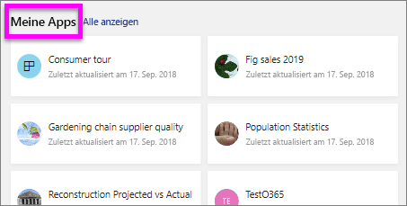

# Anzeigen eines Berichts im Power BI-Dienst für *Kunden*
Ein Bericht besteht aus einer oder mehreren Seiten mit visuellen Elementen. Berichte werden von Power BI erstellt *Designer* und [mit freigegebenen *Consumer* direkt](end-user-shared-with-me.md) oder als Teil einer [app](end-user-apps.md). 

Es gibt viele verschiedene Möglichkeiten zum Öffnen eines Berichts, und wir zeigen Ihnen zwei davon: Öffnen von zu Hause und aus einem Dashboard. 

<!-- add art-->

## Öffnen eines Berichts aus Power BI Startseite
Lassen Sie uns zuerst einen Bericht öffnen, der direkt mit Ihnen geteilt wurde, und dann einen Bericht, der als Teil einer App geteilt wurde.

   

### Öffnen eines Berichts, der mit Ihnen geteilt wurde
Power BI *Designer* können einen Bericht direkt mit Ihnen teilen. Inhalte, die auf diese Weise ist freigegeben wird in der **für mich freigegeben** -Container in Ihrer Nav-bar "und" in der **für mich freigegeben** Abschnitt des Zeichenbereichs Startseite.

1. Öffnen Sie Power BI-Dienst ("App.powerbi.com").

2. Wählen Sie in der Navigationsleiste **Startseite** Home Zeichenbereich angezeigt.  

   
   
3. Scrollen Sie nach unten, bis Sie **Für mich freigegeben** sehen. Suchen Sie nach dem Berichtssymbol . In diesem Screenshot haben wir ein Dashboard und einen Bericht mit dem Namen *Vertriebs- und marketingbeispiel*. 
   
   

4. Wählen Sie den Bericht einfach *Karte* zum Öffnen des Berichts.

   

5. Beachten Sie die Registerkarten auf der linken Seite aus.  Jede Registerkarte stellt eine *Seite* des Berichts dar. Zurzeit enthält das *Wachstum Verkaufschance* Seite öffnen. Wählen Sie die *YTD Category* Tab, um diese Berichtsseite stattdessen zu öffnen. 

   

6. Zurzeit wir die gesamte Berichtsseite angezeigt werden. Um die Anzeige der Seite (Zoom) zu ändern, wählen Sie die Dropdownliste in der oberen rechten Ecke ( **>** ), und wählen Sie **Originalgröße**.

   

   

### Öffnen eines Bericht, der Teil einer App ist
Wenn Sie apps von Kollegen oder aus AppSource erhalten haben, diese apps stehen über Startseite und von der **Apps** -Container auf der Navigationsleiste. Eine [App](end-user-apps.md) ist ein Paket aus Dashboards und Berichten.

1. Wechseln Sie zurück zur Startseite dazu **Startseite** über die Navigationsleiste.

7. Scrollen Sie nach unten, bis Sie **Meine Apps** sehen.

   

8. Wählen Sie eine der Apps aus, um sie zu öffnen. Abhängig von den Optionen, die vom *Designer* der App festgelegt wurden, öffnet die App entweder ein Dashboard, einen Bericht oder eine App-Inhaltsliste. Wenn durch das Auswählen der App:
    - der Bericht geöffnet wird, sind Sie startklar.
    - ein Dashboard geöffnet wird, siehe ***Öffnen eines Berichts aus einem Dashboard***.
    - die App-Inhaltsliste geöffnet wird, wählen Sie unter **Berichte** einen Bericht aus, um diesen zu öffnen.

## Öffnen eines Berichts aus einem Dashboard
Berichte können aus einem Dashboard geöffnet werden. Die meisten Dashboardkacheln sind aus Berichten *angeheftet*. Das Auswählen einer Kachel öffnet den Bericht, mit dem diese Kachel erstellt wurde. 

1. Wählen Sie in einem Dashboard eine Kachel aus. In diesem Beispiel wurde die Kachel „Total Units YTD...“ ausgewählt.

    

2.  Der entsprechende Bericht wird geöffnet. Beachten Sie, dass die Seite „YTD Category“ angezeigt wird. Dies ist die Berichtseite, die das im Dashboard ausgewählte Säulendiagramm enthält.

    

> [!NOTE]
> Nicht alle Kacheln führen zu einem Bericht. Wenn Sie eine Kachel auswählen, die [mit Q&A erstellt wurde](end-user-q-and-a.md), wird der Q&A-Bildschirm geöffnet. Wenn Sie eine Kachel auswählen, die [mit dem Widget **Kachel hinzufügen**](../service-dashboard-add-widget.md) erstellt wurde, kann dies verschiedene Folgen haben.  

##  Weitere Möglichkeiten zum Öffnen eines Berichts
Wie Sie wissen Sie, navigieren Sie in Power BI-Dienst erhalten, müssen Sie Workflows ermitteln, die für Sie am besten geeignet sind. Weitere Möglichkeiten zum Zugriff auf Berichte:
- Im Navigationsbereich Leiste mit **Favoriten** und **zuletzt verwendet**    
- Mit [Verwandte Inhalte anzeigen](end-user-related.md)    
- Über eine E-Mail, wenn jemand [einen Bericht für Sie freigibt](../service-share-reports.md) oder Sie [eine Benachrichtigung](end-user-alerts.md) festgelegt haben.    
- Über die [Mitteilungszentrale](end-user-notification-center.md)    
- usw.

## Nächste Schritte
Es gibt [viele verschiedene Möglichkeiten zur Interaktion mit einem Bericht](end-user-reading-view.md).  Starten Sie die einzelnen Registerkarten auf der Seite des berichtszeichenbereichs untersuchen.

