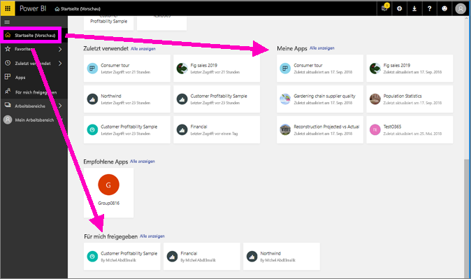
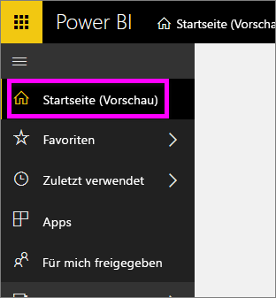
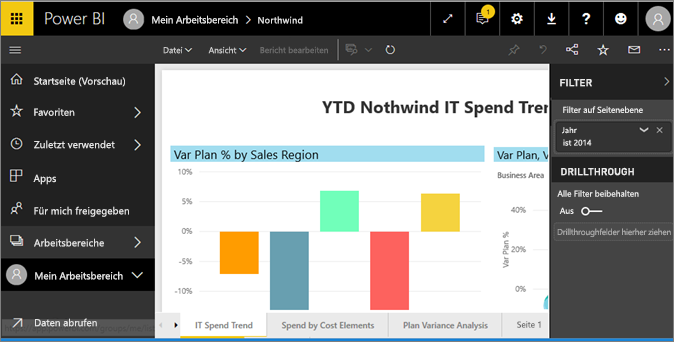
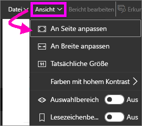
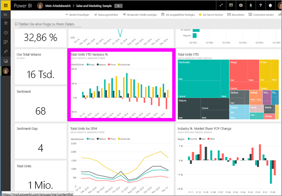
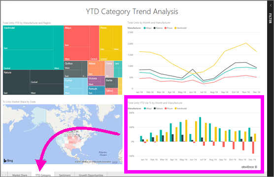

# Anzeigen eines Berichts im Power BI-Dienst für *Kunden*
Ein Bericht besteht aus einer oder mehreren Seiten mit visuellen Elementen. Power BI-Berichte werden von *Berichts-Designern* erstellt und entweder [direkt für *Kunden*](end-user-shared-with-me.md) oder als Teil einer [App](end-user-apps.md) freigegeben. 

Es gibt viele verschiedene Möglichkeiten zum Öffnen eines Berichts, und wir zeigen Ihnen zwei davon: Öffnen über die Startseite und Öffnen aus einem Dashboard. 

<!-- add art-->

## Öffnen eines Berichts von Ihrer Startseite
Lassen Sie uns zuerst einen Bericht öffnen, der direkt mit Ihnen geteilt wurde, und dann einen Bericht, der als Teil einer App geteilt wurde.

   

### Öffnen eines Berichts, der mit Ihnen geteilt wurde
Power BI-*Designer* können einen Bericht direkt mit Ihnen teilen, indem sie in ihrer oberen Menüleiste auf eine Schaltfläche **Teilen** klicken. Auf diese Weise geteilte Inhalte werden im Container **Für mich freigegeben** in der linken Navigationsleiste und im Abschnitt **Für mich freigegeben** auf Ihrer Startseite angezeigt.

1. Öffnen Sie den Power BI-Dienst (app.powerbi.com).

2. Wählen Sie in der linken Navigationsleiste **Start (Vorschau)** aus, um Ihrer Startseite zu öffnen.  

   
   
3. Scrollen Sie nach unten, bis Sie **Für mich freigegeben** sehen. Suchen Sie nach dem Berichtssymbol . In diesem Screenshot haben wir zwei Berichte: *Financial* und *Northwind*. 
   
   

4. Wählen Sie einfach eine der *Berichtskarten* aus, um den Bericht zu öffnen.

   

5. Beachten Sie die Registerkarten am unteren Rand. Jede Registerkarte stellt eine *Seite* des Berichts dar. Zurzeit ist die Seite *IT Spend Trend* geöffnet. Wählen Sie eine andere Registerkarte aus, um die jeweilige Berichtsseite zu öffnen. 

   

6. Im Moment können wir nur einen Teil der Berichtsseite sehen. Um die Anzeige (Zoom) der Seite zu ändern, wählen Sie **Ansicht** > **An Seite anpassen"** aus.

   

   

### Öffnen eines Bericht, der Teil einer App ist
Wenn Sie von Kollegen oder aus AppSource Apps erhalten haben, sind diese Apps über Ihre Startseite und den **Apps**-Container in der linken Navigationsleiste verfügbar. Eine [App](end-user-apps.md) ist ein Paket aus Dashboards und Berichten.

1. Wechseln Sie zurück zu Ihrer Startseite, indem Sie **Start (Vorschau)** in der linken Navigationsleiste auswählen.

7. Scrollen Sie nach unten, bis Sie **Meine Apps** sehen.

   

8. Wählen Sie eine der Apps aus, um sie zu öffnen. Abhängig von den Optionen, die vom *Designer* der App festgelegt wurden, öffnet die App entweder ein Dashboard, einen Bericht oder eine App-Inhaltsliste. Wenn durch das Auswählen der App:
    - der Bericht geöffnet wird, sind Sie startklar.
    - ein Dashboard geöffnet wird, siehe [Öffnen eines Berichts aus einem Dashboard](#Open-a-report-from-a-dashboard).
    - die App-Inhaltsliste geöffnet wird, wählen Sie unter **Berichte** einen Bericht aus, um diesen zu öffnen.

## Öffnen eines Berichts aus einem Dashboard
Berichte können aus einem Dashboard geöffnet werden. Die meisten Dashboardkacheln sind aus Berichten *angeheftet*. Das Auswählen einer Kachel öffnet den Bericht, mit dem diese Kachel erstellt wurde. 

1. Wählen Sie in einem Dashboard eine Kachel aus. In diesem Beispiel wurde die Kachel „Total Units YTD...“ ausgewählt.

    

2.  Der entsprechende Bericht wird geöffnet. Beachten Sie, dass die Seite „YTD Category“ angezeigt wird. Dies ist die Berichtseite, die das im Dashboard ausgewählte Säulendiagramm enthält.

    

> [!NOTE]
> Nicht alle Kacheln führen zu einem Bericht. Wenn Sie eine Kachel auswählen, die [mit Q&A erstellt wurde](end-user-q-and-a.md), wird der Q&A-Bildschirm geöffnet. Wenn Sie eine Kachel auswählen, die [mit dem Widget **Kachel hinzufügen**](../service-dashboard-add-widget.md) erstellt wurde, kann dies verschiedene Folgen haben.  

##  Weitere Möglichkeiten zum Öffnen eines Berichts
Wie Sie mit der Navigation im Power BI-Dienst besser vertraut sind, werden Sie feststellen, welche Arbeitsabläufe für Sie am besten geeignet sind. Weitere Möglichkeiten zum Zugriff auf Berichte:
- Über den linken Navigationsbereich mit **Favoriten** und **Zuletzt verwendet**    
- Mit [Verwandte Inhalte anzeigen](end-user-related.md)    
- Über eine E-Mail, wenn jemand [einen Bericht für Sie freigibt](../service-share-reports.md) oder Sie [eine Benachrichtigung](end-user-alerts.md) festgelegt haben.    
- Über die [Mitteilungszentrale](end-user-notification-center.md)    
- usw.

## Nächste Schritte
Es gibt [viele verschiedene Möglichkeiten zur Interaktion mit einem Bericht](end-user-reading-view.md).  Beginnen Sie damit, diese zu erkunden, indem Sie zunächst die einzelnen Registerkarten im unteren Bereich des Berichtszeichenbereichs auswählen.

