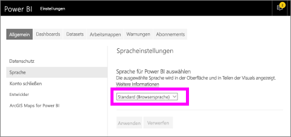
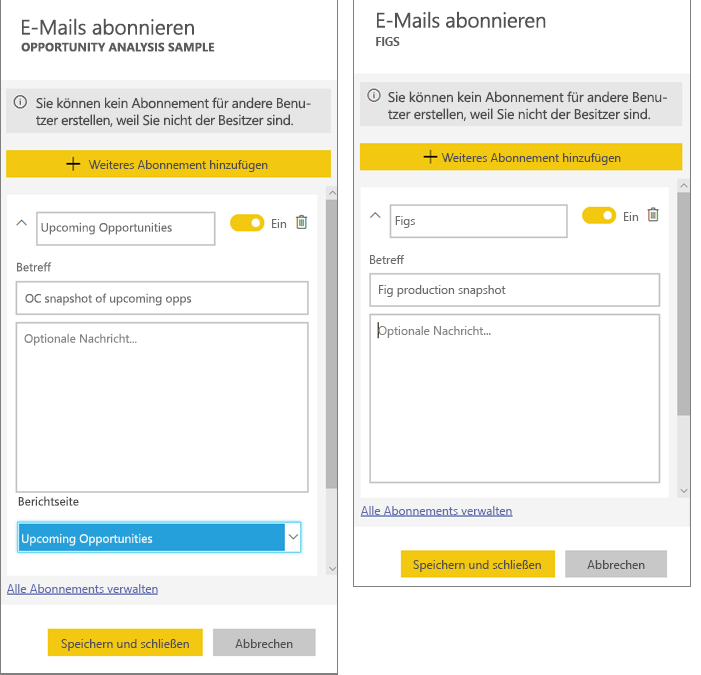
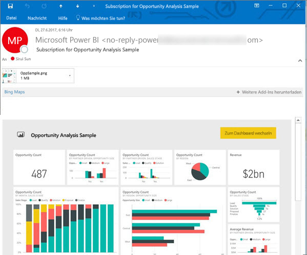
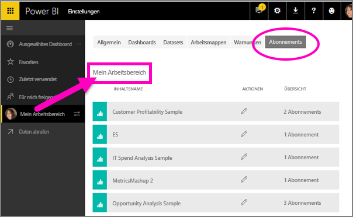

# Abonnieren eines Berichts oder Dashboards im Power BI-Dienst 
Es war noch nie so einfach, bei den wichtigsten Dashboards und Berichten auf dem aktuellen Stand zu bleiben. Wenn Sie die Berichtsseiten und Dashboards abonnieren, die für Sie am wichtigsten sind, erhalten Sie von Power BI per E-Mail eine Momentaufnahme. Sie legen fest, wie oft Power BI die E-Mail-Nachrichten senden soll: von einmal täglich bis einmal pro Woche. 

Für E-Mails und Momentaufnahmen wird die Sprache verwendet, die in den Power BI-Einstellungen festgelegt ist. Weitere Informationen finden Sie unter [Unterstützte Sprachen und Länder/Regionen für Power BI](../supported-languages-countries-regions.md). Wenn keine Sprache definiert ist, verwendet Power BI die Sprache, die der Gebietsschemaeinstellung Ihres aktuellen Browsers entspricht. Sie können die Spracheinstellung anzeigen bzw. festlegen, indem Sie zuerst auf das Zahnradsymbol  >  **und dann auf Einstellungen > Allgemein > Sprache** klicken. 

Die E-Mail, die Sie erhalten, enthält einen Link, mit dem Sie zum Bericht/Dashboard wechseln können. Wenn Sie diesen Link auf mobilen Geräten auswählen, auf denen Power BI-Apps installiert sind, wird die App gestartet (statt die Standardaktion auszuführen, d.h. den Bericht oder das Dashboard auf der Power BI-Website zu öffnen).

## Anforderungen
- Das **Erstellen** eines Abonnements ist ein Feature von Power BI Pro. 
- Da Abonnement-E-Mails nur dann gesendet werden, wenn ein zugrunde liegendes Dataset aktualisiert wird, funktionieren Abonnements von Datasets nicht, wenn diese Datasets nicht aktualisiert werden.

## Abonnieren eines Berichts oder Dashboards
Egal, ob Sie ein Dashboard oder einen Bericht abonnieren – der Vorgang ist sehr ähnlich. Sie können Dashboards und Berichte im Power BI-Dienst über dieselbe Schaltfläche abonnieren.
 
.

1. Öffnen Sie das Dashboard oder den Bericht.
2. Klicken Sie in der oberen Menüleiste auf **Abonnieren**, oder klicken Sie auf das Briefumschlagsymbol .
   
   

3. Mithilfe des gelben Schiebereglers können Sie das Abonnement aktivieren und deaktivieren.  Wenn Sie den Schieberegler auf „Aus“ stellen, wird das Abonnement nicht gelöscht. Verwenden Sie zum Löschen des Abonnements das Papierkorbsymbol.

4. Fügen Sie optional E-Mail-Adressinformationen hinzu. 

    In den unten stehenden Screenshots sehen Sie, dass Sie beim Abonnieren eines Berichts eigentlich eine *Berichtsseite* abonnieren.  Klicken Sie auf **Weiteres Abonnement hinzufügen**, und wählen Sie die gewünschten Seiten aus, um mehrere Seiten in einem Bericht zu abonnieren. 
      
   

5. Wählen Sie **Speichern und schließen** aus, um das Abonnement zu speichern. Sie erhalten jedes Mal eine E-Mail mit einer Momentaufnahme des Dashboards oder des Berichts, wenn eines der zugrunde liegenden Datasets geändert wurde. Wird das Dashboard oder der Bericht mehrmals an einem Tag aktualisiert, erhalten Sie nur eine E-Mail nach der ersten Aktualisierung.  
   
   
   
Durch das Aktualisieren der Berichtsseite wird nicht das Dataset aktualisiert. Nur der Besitzer des Datasets kann ein Dataset manuell aktualisieren. Um den Namen des zugrunde liegenden Datasets nachzuschlagen, wählen Sie in der oberen Menüleiste **Verwandte Inhalte anzeigen** aus.
   

## Bestimmung des E-Mail-Zeitplans
In der folgenden Tabelle wird beschrieben, wie häufig Sie E-Mail-Nachrichten erhalten. Dies ist abhängig von der Verbindungsmethode des Datasets, auf dem das Dashboard oder der Bericht basiert (DirectQuery, Live Connect, Import in Power BI oder Excel-Datei in OneDrive oder SharePoint Online) sowie von den verfügbaren und aktivierten Abonnementoptionen (täglich, wöchentlich oder keine).

|  | **DirectQuery** | **Live Connect** | **Geplante Aktualisierung (Import)** | **Excel-Datei in OneDrive/SharePoint Online** |
| --- | --- | --- | --- | --- |
| **Wie oft wird der Bericht/das Dashboard aktualisiert?** |Alle 15 Minuten |Power BI führt alle 15 Minuten eine Überprüfung aus. Wenn das Dataset geändert wurde, wird der Bericht aktualisiert. |Der Benutzer wählt keine, tägliche oder wöchentliche E-Mails aus. „Täglich“ kann bis zu 8 Mal pro Tag bedeuten. „Wöchentlich“ ist eigentlich ein wöchentlicher Zeitplan, den der Benutzer erstellt und für den er die Aktualisierung auf einen Wert zwischen einmal in der Woche und einmal täglich festgelegt. |Einmal pro Stunde |
| **Welche Kontrolle hat der Benutzer über den Zeitplan für die abonnierten E-Mails?** |Verfügbare Optionen: täglich oder wöchentlich |Keine Optionen: Der Benutzer erhält jedes Mal eine E-Mail-Nachricht, wenn der Bericht aktualisiert wird, jedoch nicht öfter als einmal pro Tag. |Wenn es sich um einen Zeitplan für die tägliche Aktualisierung handelt, lauten die Optionen „Täglich“ und „Wöchentlich“.  Bei einem Zeitplan für die wöchentliche Aktualisierung ist nur die Option „Wöchentlich“ verfügbar. |Keine Optionen: Der Benutzer erhält jedes Mal eine E-Mail-Nachricht, wenn das Dataset aktualisiert wird, jedoch nicht öfter als einmal pro Tag. |

## Verwalten Ihrer Abonnements
Nur Sie können Ihre Abonnements verwalten. Wählen Sie noch mal **Abonnieren** aus, und wählen Sie dann **Alle Abonnements verwalten** aus (siehe Screenshots unter Schritt 4 weiter oben). 

Ein Abonnement wird beendet, wenn die Pro-Lizenz abläuft, das Dashboard oder der Bericht vom Besitzer gelöscht wird oder das zum Erstellen des Abonnements verwendete Benutzerkonto gelöscht wird.

## Zu beachtende Aspekte und Problembehandlung
* Wenn auf Kacheln Sicherheit auf Zeilenebene (Row Level Security, RLS) angewendet wurde, werden diese Kacheln bei Dashboard-E-Mail-Abonnements nicht angezeigt.  Wenn das Dataset RLS verwendet, können Sie kein neues Abonnement für Berichts-E-Mail-Abonnements erstellen.
* Abonnements von Berichtseiten sind mit dem Namen der Berichtseite verknüpft. Wenn Sie eine Berichtsseite abonnieren und diese umbenannt wird, müssen Sie Ihr Abonnement erneut erstellen.
* Bestimmte Einstellungen Ihrer Organisation sind möglicherweise in Azure Active Directory konfiguriert, wodurch die Möglichkeit zur Verwendung von E-Mail-Abonnements in Power BI eingeschränkt werden kann.  Dies umfasst, ist aber nicht beschränkt auf, das Vorhandensein von Einschränkungen durch mehrstufige Authentifizierung oder IP-Adressbereiche beim Zugriff auf Ressourcen.
* Bei E-Mail-Abonnements für Live Connection-Datasets erhalten Sie nur dann E-Mail-Nachrichten, wenn die Daten geändert wurden. Wenn also eine Aktualisierung erfolgt, aber keine Daten geändert wurden, sendet Power BI keine E-Mail-Nachricht.
* E-Mail-Abonnements bieten keine Unterstützung für die meisten [benutzerdefinierten Visuals](../power-bi-custom-visuals.md).  Die einzige Ausnahme sind benutzerdefinierte Visuals, die [zertifiziert](../power-bi-custom-visuals-certified.md) wurden.  
* E-Mail-Abonnements bieten aktuell keine Unterstützung für R-gestützte benutzerdefinierte Visuals.  
* Wenn auf Kacheln vom Dashboard Sicherheit auf Zeilenebene (Row Level Security, RLS) angewendet wurde, werden diese Kacheln nicht angezeigt.
* E-Mail-Abonnements werden mit Standardzuständen für Filter und Slicer des Berichts gesendet. Alle Änderungen der Standardwerte, die Sie nach dem Abonnieren vornehmen, werden nicht in der E-Mail angezeigt.    
* Insbesondere für Abonnements von Dashboards werden bestimmte Typen von Kacheln noch nicht unterstützt.  Dazu zählen Streamingkacheln, Videokacheln und benutzerdefinierte Kacheln mit Webinhalten.     
* Aufgrund der Beschränkungen für die E-Mail-Größe können Dashboards oder Berichte mit extrem großen Bildern möglicherweise nicht abonniert werden.    
* Die Aktualisierung von Datasets, die mit Dashboards und Berichten verknüpft sind, die seit mehr als 2 Monaten nicht besucht wurden, wird von Power BI automatisch ausgesetzt.  Wenn Sie jedoch einem Dashboard oder Bericht ein Abonnement hinzufügen, wird die Aktualisierung nicht ausgesetzt, auch wenn das Dashboard bzw. der Bericht längere Zeit nicht besucht wurde.    

## Nächste Schritte
* Weitere Fragen? [Stellen Sie Ihre Frage in der Power BI-Community.](http://community.powerbi.com/)    
* [Blogbeitrag lesen](https://powerbi.microsoft.com/blog/introducing-dashboard-email-subscriptions-a-360-degree-view-of-your-business-in-your-inbox-every-day/)

