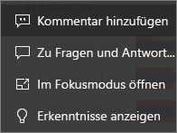
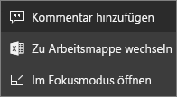

# Dashboardkacheln in Power BI
Dashboards und Dashboardkacheln sind ein Feature des Power BI-Diensts und nicht von Power BI Desktop. Obwohl Dashboardkacheln nicht in Power BI Mobile erstellt oder angeheftet werden können, lassen sie sich dort [anzeigen und freigeben](mobile/mobile-tiles-in-the-mobile-apps.md). 

## Dashboardkacheln

Eine Kachel ist eine Momentaufnahme Ihrer Daten, die von einem *Designer* an das Dashboard geheftet wurde. Eine Kachel kann aus einem Bericht, einem Dataset, einem Dashboard, dem Q&A-Fragefeld, Excel, SSRS (SQL Server Reporting Services) und noch mehr erstellt werden.  Der Screenshot zeigt viele verschiedene Kacheln, die an ein Dashboard angeheftet sind.

Neben den Kacheln, die an das Dashboard geheftet werden, können *Designer* eigenständige Kacheln mit **Kachel hinzufügen** direkt zum Dashboard hinzufügen. Eigenständige Kacheln können Textfelder, Bilder, Videos, Streamingdaten und Webinhalte enthalten.

Benötigen Sie Hilfe, um die Grundkomponenten zu verstehen, aus denen Power BI besteht?  Weitere Informationen finden Sie unter [Power BI – Grundkonzepte](end-user-basic-concepts.md).

## Interagieren mit Kacheln in einem Dashboard

### Zeigen Sie auf eine Kachel, um Aussehen und Verhalten zu ändern.
1. Zeigen Sie auf die Kachel, um die Auslassungspunkte anzuzeigen.
   
    
2. Wählen Sie die Auslassungspunkte (...) aus, um das Aktionsmenü zu öffnen. Die verfügbaren Optionen variieren je nach Typ des Visuals und Methode, die zum Erstellen der Kachel verwendet wurde. Im folgenden werden einige Beispiele aufgeführt, die Ihnen möglicherweise angezeigt werden.

    - Kachel, die mit Q&A erstellt wurde
   
        

    - Kachel, die aus einer Arbeitsmappe erstellt wurde
   
        

    - Kachel, die aus einem Bericht erstellt wurde
   
        
   
    Hier können Sie Folgendes tun:
   
   * [Den Bericht öffnen, mit dem diese Kachel erstellt wurde ](end-user-reports.md)   
   
   * [Die Q&A-Frage öffnen, mit der die Kachel erstellt wurde](end-user-reports.md)   
   

   * [Die Arbeitsmappe öffnen, mit der diese Kachel erstellt wurde](end-user-reports.md)   
    * [Die Kachel im Fokusmodus anzeigen](end-user-focus.md)   
     * [Einblicke ausführen ](end-user-insights.md) 
    * [Einen Kommentar hinzufügen und eine Diskussion starten](end-user-comment.md) 

3. Wählen Sie zum Schließen des Aktionsmenüs eine leere Fläche im Zeichenbereich aus.

### Auswählen einer Kachel
Wenn Sie eine Kachel auswählen, hängt das anschließenden Vorgehen davon ab, wie die Kachel erstellt wurde und ob sie über einen [benutzerdefinierten Link](../service-dashboard-edit-tile.md) verfügt. Wenn sie einen benutzerdefinierten Link aufweist, bringt Sie das Auswählen der Kachel zum Ziel dieses Links. Andernfalls gelangen Sie nach Auswählen der Kachel zu dem Bericht, der Excel Online-Arbeitsmappe, dem lokalen SSRS-Bericht oder der Q&A-Frage, der/die zum Erstellen der Kachel verwendet wurde.

> [!NOTE]
> Eine Ausnahme sind Videokacheln, die direkt auf dem Dashboard mit **Kachel hinzufügen** erstellt wurden. Bei Auswählen einer Videokachel (die auf diese Weise erstellt wurde) wird das Video direkt auf dem Dashboard wiedergegeben.   
> 
> 

## Zu beachtende Aspekte und Problembehandlung
* Wenn der Bericht, der zum Erstellen der Visualisierung verwendet wurde, nicht gespeichert wurde, löst das Auswählen der Kachel keine Aktion aus.
* Wenn die Kachel anhand einer Arbeitsmappe in Excel Online erstellt wurde und Sie nicht mindestens Leseberechtigungen für diese Arbeitsmappe haben, wird durch Auswählen der Kachel die Arbeitsmappe nicht in Excel Online geöffnet.
* Wenn für Kacheln, die mit **Kacheln hinzufügen** direkt auf dem Dashboard erstellt wurden, ein benutzerdefinierter Link festgelegt wurde, wird die betreffende URL durch Auswählen des Titels, des Untertitels oder der Kachel geöffnet.  Standardmäßig erfolgt bei Auswahl einer dieser Kacheln direkt auf dem Dashboard für ein Bild, einen Webcode oder ein Textfeld keine Aktion.
* Wenn Sie über keine Berechtigungen zum Bericht in SSRS verfügen, führt die Auswahl einer über SSRS erstellten Kachel zur Anzeige einer Fehlerseite. Auf dieser werden Sie darauf hingewiesen, dass Sie keinen Zugriff haben (rsAccessDenied).
* Wenn Sie keinen Zugriff auf das Netzwerk mit SSRS haben, führt die Auswahl einer über SSRS erstellten Kachel zur Anzeige einer Fehlerseite. Auf dieser werden Sie darauf hingewiesen, dass der Server nicht gefunden wurde (HTTP 404). Ihr Gerät muss Netzwerkzugriff auf den Berichtsserver besitzen, um den Bericht anzeigen zu können.
* Wenn sich die ursprüngliche Visualisierung ändert, die zum Erstellen der Kachel verwendet wurde, ändert sich die Kachel nicht.  Wenn der *Designer* beispielsweise ein Liniendiagramm aus einem Bericht angeheftet und dann das Liniendiagramm in ein Balkendiagramm geändert hat, wird auf der Dashboardkachel weiterhin ein Liniendiagramm angezeigt. Die Daten werden aktualisiert, der Visualisierungstyp hingegen nicht.

## Nächste Schritte
[Datenaktualisierung](../refresh-data.md)

[Power BI – Grundkonzepte](end-user-basic-concepts.md)
