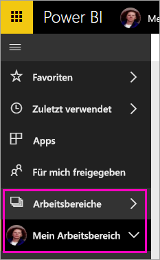
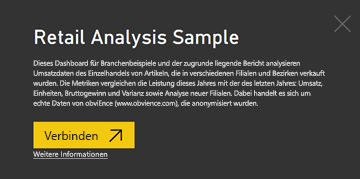
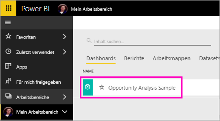
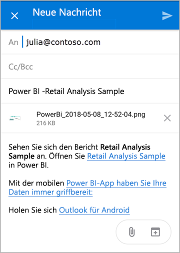

# Schnellstart: Erkunden von Dashboards und Berichten in den mobilen Power BI-Apps
In dieser Schnellstartanleitung erkunden Sie ein Beispieldashboard und einen Beispielbericht in den mobilen Power BI-Apps auf einem Android-Smartphone. Sie können diese Anleitung auch in anderen mobilen Apps nachvollziehen. 

Gilt für:

|  |  |  |  |
|:--- |:--- |:--- |:--- |
| iPhone | iPad | Android- | Windows 10 |

Dashboards sind Portale für den Lebenszyklus und die Prozesse des Unternehmens. Ein Dashboard stellt eine Übersicht dar, eine zentrale Stelle, um den aktuellen Status des Unternehmens zu überwachen. Ein Bericht ist eine interaktive Ansicht Ihrer Daten, und mit den darin enthaltenen Visuals werden verschiedene Ergebnisse und Erkenntnisse zu diesen Daten dargestellt. 

## Voraussetzungen

### Registrieren bei Power BI
Wenn Sie noch nicht bei Power BI registriert sind, müssen Sie sich zuerst für eine [kostenlose Testversion registrieren](https://app.powerbi.com/signupredirect?pbi_source=web).

### Installieren der Power BI für Android-App
[Laden Sie die Power BI für Android-App von Google Play herunter](http://go.microsoft.com/fwlink/?LinkID=544867).

Power BI funktioniert auf Android-Geräten mit dem Betriebssystem Android 5.0 oder höher. Um Ihr Gerät zu überprüfen, wechseln Sie zu **Einstellungen** > **Geräteinformationen** > **Android-Version**.

### Einzelhandelsanalyse: Herunterladen der Beispieldaten
Der erste Schritt in dieser Schnellstartanleitung ist das Herunterladen des Beispiels für die Einzelhandelsanalyse im Power BI-Dienst.

1. Öffnen Sie den Power BI-Dienst in einem Browser (app.powerbi.com), und melden Sie sich an.

1. Klicken Sie auf das globale Navigationssymbol, um den linken Navigationsbereich zu öffnen.

    

2. Wählen Sie im linken Navigationsbereich **Arbeitsbereiche** > **Mein Arbeitsbereich** aus.

    

3. Wählen Sie in der linken unteren Ecke **Daten abrufen** aus.
   
    

3. Wählen Sie auf der Seite „Daten abrufen“ das Symbol **Beispiele** aus.
   
   

4. Wählen Sie das **Beispiel für die Einzelhandelsanalyse** aus.
 
    
 
8. Wählen Sie **Verbinden** aus.  
  
   
   
5. Power BI importiert das Beispiel, wodurch dem Arbeitsbereich ein neues Dashboard, ein neuer Bericht und ein neues Dataset hinzugefügt werden.
   
   

Sie können das Beispiel jetzt auf Ihrem Android-Gerät anzeigen.

## Anzeigen eines Dashboards auf einem Android-Gerät
1. Öffnen Sie die Power BI-App auf Ihrem Android-Gerät, und melden Sie sich mit den Anmeldeinformationen Ihres Power BI-Kontos an – dies sind die gleichen, die Sie für den Power BI-Dienst im Browser verwendet haben.

1.  Tippen Sie auf die globale Navigationsschaltfläche .

2.  Tippen Sie auf **Arbeitsplatze** > **Mein Arbeitsbereich**.

    

3. Tippen Sie auf das Dashboard für das Beispiel für die Einzelhandelsanalyse, um es zu öffnen.
 
    
   
    Ein Hinweis unterhalb des Dashboardnamens (in diesem Fall der Buchstabe C) gibt an, wie die Daten im Dashboards klassifiziert sind. Erfahren Sie mehr über die [Klassifizierung von Daten in Power BI](../../service-data-classification.md).

    Power BI-Dashboards sehen auf Android-Mobiltelefonen etwas anders aus. Alle Kacheln werden in der gleichen Breite angezeigt und sind nacheinander von oben nach unten angeordnet.

4. Tippen Sie auf das Sternsymbol  in der Titelleiste, um dieses Dashboard als Favoriten festzulegen.

    Wenn Sie etwas in der mobilen App als Favoriten festlegen, gilt dieser Favorit auch für den Power BI-Dienst und umgekehrt.

4. Scrollen Sie nach unten, und tippen Sie auf das gefüllte Liniendiagramm „This Year's Sales, Last Year's Sales“.

    

    Es wird im Fokusmodus geöffnet.

7. Tippen Sie im Fokusmodus im Diagramm auf „Apr“. Oben im Diagramm werden die Werte für April angezeigt.

    

8. Tippen Sie auf das Berichtssymbol  in der rechten oberen Ecke. Der zu dieser Kachel gehörige Bericht wird im Querformat geöffnet.

    

9. Tippen Sie im Blasendiagramm auf die gelbe Blase „040 - Juniors“. Sehen Sie, wie die entsprechenden Werte in den anderen Diagrammen hervorgehoben werden? 

    

10. Wischen Sie nach oben, um die Symbolleiste unten anzuzeigen, und tippen Sie auf das Stiftsymbol.

    

11. Tippen Sie in der Symbolleiste für Anmerkungen auf das Smileysymbol, und fügen Sie Ihrer Berichtsseite Smileys hinzu.
 
    

12. Tippen Sie in der rechten oberen Ecke auf **Teilen**.

1. Geben Sie eine E-Mail-Adresse an, und fügen Sie nach Wunsch eine Nachricht hinzu.  

    

    Sie können diese Momentaufnahme mit jedem Benutzer innerhalb oder außerhalb Ihrer Organisation teilen. Wenn die Benutzer sich innerhalb Ihrer Organisation befinden und ein eigenes Power BI-Konto besitzen, können sie den Beispielbericht für die Einzelhandelsanalyse ebenfalls öffnen.

## Bereinigen von Ressourcen

Nachdem Sie diese Schnellstartanleitung abgeschlossen haben, können Sie das Dashboard, den Bericht und das Dataset zum Beispiel für die Einzelhandelsanalyse löschen, wenn Sie möchten.

1. Öffnen Sie den Power BI-Dienst (app.powerbi.com), und melden Sie sich an.

2. Wählen Sie im linken Navigationsbereich **Arbeitsbereiche** > **Mein Arbeitsbereich** aus.

    Sehen Sie den gelben Stern, der anzeigt, dass es sich um einen Favoriten handelt?

3. Klicken Sie auf der Registerkarte **Dashboards** neben dem Dashboard für die Einzelhandelsanalyse auf das Mülleimersymbol zum **Löschen**.

    

4. Wählen Sie die Registerkarte **Berichte**aus, und führen Sie die gleichen Schritte für den Bericht für die Einzelhandelsanalyse durch.

5. Wählen Sie die Registerkarte **Datasets**aus, und führen Sie die gleichen Schritte für das Dataset für die Einzelhandelsanalyse durch.

## Nächste Schritte

In dieser Schnellstartanleitung haben Sie ein Beispieldashboard und einen Beispielbericht auf Ihrem Android-Gerät erkundet. Erfahren Sie mehr über die Arbeit mit dem Power BI-Dienst. 

> [!div class="nextstepaction"]
> [Schnellstart: Navigation im Power BI-Dienst](../end-user-experience.md)

