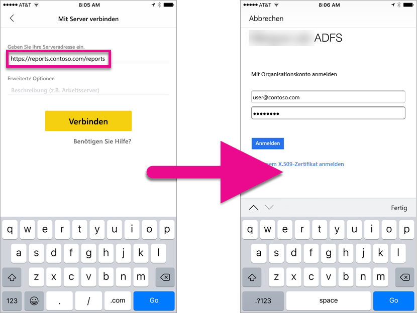
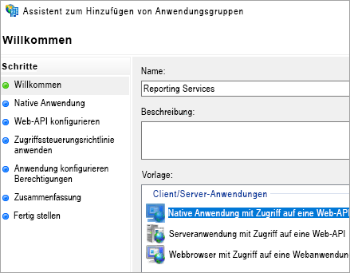
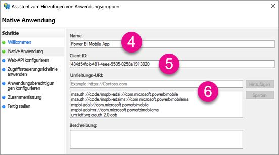
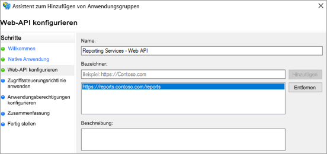
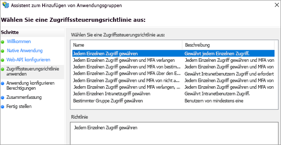
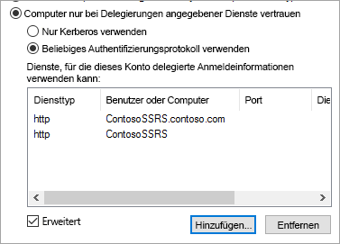
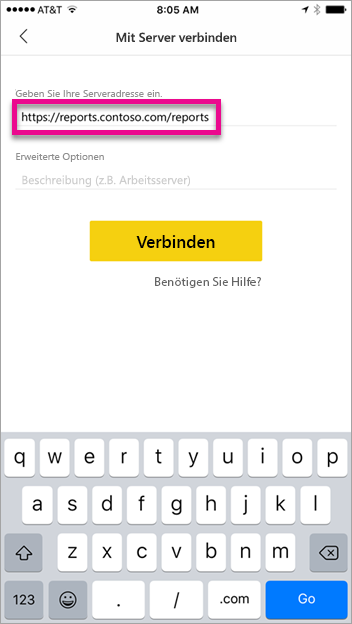
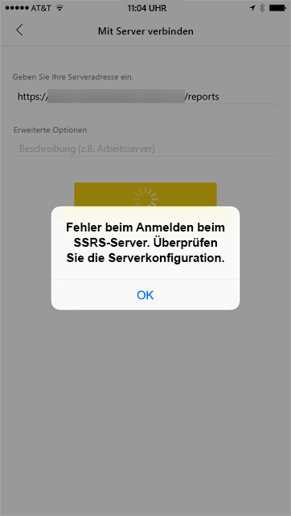

# <a name="using-oauth-to-connect-to-power-bi-report-server-and-ssrs"></a>Verwenden von OAuth zum Herstellen einer Verbindung mit dem Power BI-Berichtsserver und SSRS
In diesem Artikel erfahren Sie, wie Sie Ihre Umgebung für die Unterstützung der OAuth-Authentifizierung mit der mobilen Power BI-App konfigurieren, um eine Verbindung mit dem Power BI-Berichtsserver und SQL Server Reporting Services 2016 oder höher herzustellen.



Mit OAuth können Sie eine Verbindung zum Power BI-Berichtsserver und Reporting Services herstellen, um mobile Berichte oder KPIs anzuzeigen. Windows Server 2016 enthält einige Verbesserungen der Rolle „Webanwendungsproxy“ (WAP), um diese Art der Authentifizierung zu ermöglichen.

   > [!NOTE]
   > Das Anzeigen von Power BI-Berichten, die im Power BI-Berichtsserver mit WAP zur Authentifizierung gehostet werden, wird derzeit nicht offiziell unterstützt.

## <a name="requirements"></a>Anforderungen
Für den WAP-Server (Web Application Proxy, Webanwendungsproxy) und ADFS-Server (Active Directory Federation Services, Active Directory-Verbunddienste) ist Windows Server 2016 erforderlich. Sie benötigen keine Windows 2016-Domänenfunktionsebene.

## <a name="domain-name-services-dns-configuration"></a>DNS-Konfiguration (Domain Name Service)
Sie müssen die öffentliche URL ermitteln, mit der die mobile Power BI-App eine Verbindung herstellt. Dies könnte z.B. wie folgt lauten.

```
https://reports.contoso.com
```

Der DNS-Eintrag für **Berichte** muss auf die öffentliche IP-Adresse des WAP-Servers (Web Application Proxy, Webanwendungsproxy) verweisen. Außerdem müssen Sie einen öffentlichen DNS-Datensatz für den AD FS-Server konfigurieren. Angenommen, Sie haben den AD FS-Server mit der folgenden URL konfiguriert.

```
https://fs.contoso.com
```

Der DNS-Eintrag für **fs** muss auf die öffentliche IP-Adresse des WAP-Servers (Web Application Proxy, Webanwendungsproxy) verweisen, da er als Teil der WAP-Anwendung veröffentlicht wird.

## <a name="certificates"></a>Zertifikate
Sie müssen Zertifikate für die WAP-Anwendung und den AD FS-Server konfigurieren. Beide Zertifikate müssen Teil einer gültigen Zertifizierungsstelle sein, die Ihre mobilen Geräte erkennen.

## <a name="reporting-services-configuration"></a>Reporting Services-Konfiguration
Für Reporting Services muss nicht viel konfiguriert werden. Sie müssen lediglich sicherstellen, dass ein gültiger Dienstprinzipalname (Service Principal Name, SPN) vorhanden ist, damit die Kerberos-Authentifizierung ordnungsgemäß ausgeführt werden kann, und dass der Reporting Services-Server für die Aushandlungsauthentifizierung aktiviert ist.

### <a name="service-principal-name-spn"></a>Dienstprinzipalname (Service Principal Name, SPN)
Bei dem SPN handelt es sich um einen eindeutigen Bezeichner für einen Dienst, der Kerberos-Authentifizierung verwendet. Sie müssen sicherstellen, dass ein gültiger HTTP-SPN für den Berichtsserver vorhanden ist.

Informationen zum Konfigurieren des richtigen Dienstprinzipalnamens (Service Principal Name, SPN) für den Berichtsserver finden Sie unter [Registrieren eines Dienstprinzipalnamens (SPN) für einen Berichtsserver](https://msdn.microsoft.com/library/cc281382.aspx).

### <a name="enabling-negotiate-authentication"></a>Aktivieren der Aushandlungsauthentifizierung
Damit ein Berichtsserver die Kerberos-Authentifizierung verwenden kann, müssen Sie den Authentifizierungstyp des Berichtsservers als „RSWindowsNegotiate“ konfigurieren. Dies erfolgt in der Datei „rsreportserver.config“.

```
<AuthenticationTypes>  
    <RSWindowsNegotiate />  
    <RSWindowsKerberos />  
    <RSWindowsNTLM />  
</AuthenticationTypes>
```

Weitere Informationen finden Sie unter [Ändern einer Reporting Services-Konfigurationsdatei (RSreportserver.config)](https://msdn.microsoft.com/library/bb630448.aspx) und [Konfigurieren der Windows-Authentifizierung auf dem Berichtsserver](https://msdn.microsoft.com/library/cc281253.aspx).

## <a name="active-directory-federation-services-adfs-configuration"></a>AD FS-Konfiguration (Active Directory Federation Services, Active Directory-Verbunddienste)
Sie müssen AD FS auf einem Windows-2016-Server in Ihrer Umgebung konfigurieren. Hierzu können Sie im Server-Manager unter „Verwalten“ die Option „Rollen und Features hinzufügen“ auswählen. Weitere Informationen finden Sie unter [Active Directory-Verbunddienste](https://technet.microsoft.com/windows-server-docs/identity/active-directory-federation-services).

### <a name="create-an-application-group"></a>Erstellen einer Anwendungsgruppe
Auf dem Bildschirm „AD FS-Verwaltung“ erstellen Sie eine Anwendungsgruppe für Reporting Services, die Informationen für die Power BI Mobile-Apps enthält.

Hierzu führen Sie die folgenden Schritten aus.

1. Klicken Sie in der App „AD FS-Verwaltung“ mit der rechten Maustaste auf **Anwendungsgruppen**, und wählen Sie **Anwendungsgruppe hinzufügen** aus.
   
   
2. Geben Sie im Assistenten zum Hinzufügen von Anwendungsgruppen einen **Namen** für die Anwendungsgruppe ein, und wählen Sie **Systemeigene Anwendung mit Zugriff auf eine Web-API** aus.
   
   
3. Wählen Sie **Weiter**aus.
4. Geben Sie einen **Namen** für die hinzuzufügende Anwendung ein. 
5. Die **Client-ID** wird zwar automatisch generiert, geben Sie aber *484d54fc-b481-4eee-9505-0258a1913020* für iOS und Android ein.
6. Geben Sie Folgendes unter **Umleitungs-URLs** ein:
   
   **Einträge für Power BI Mobile – iOS:**  
   msauth://code/mspbi-adal://com.microsoft.powerbimobile  
   msauth://code/mspbi-adalms://com.microsoft.powerbimobilems  
   mspbi-adal://com.microsoft.powerbimobile  
   mspbi-adalms://com.microsoft.powerbimobilems
   
   **Für Android-Apps wird nur Folgendes angegeben:**  
   urn:ietf:wg:oauth:2.0:oob
   
   
7. Wählen Sie **Weiter**aus.
8. Geben Sie die URL für den Berichtsserver ein. Dies ist die externe URL, die auf den Webanwendungsproxy verweist. Das Format sollte wie folgt lauten.
   
   > [!NOTE]
   > Bei der URL wird die Groß- und Kleinschreibung beachtet.
   > 
   > 
   
   *https://<url to report server>/reports*
   
   
9. Wählen Sie **Weiter**aus.
10. Wählen Sie die **Zugriffssteuerungsrichtlinie** aus, die für Ihre Organisation am besten geeignet ist.
    
    
11. Wählen Sie **Weiter**aus.
12. Wählen Sie **Weiter**aus.
13. Wählen Sie **Weiter**aus.
14. Wählen Sie **Schließen** aus.

Abschließend sollten die Eigenschaften der Anwendungsgruppe ähnlich wie im folgenden Beispiel aussehen.


## <a name="web-application-proxy-wap-configuration"></a>WAP-Konfiguration (Web Application Proxy, Webanwendungsproxy)
Aktivieren Sie die Windows-Rolle „Webanwendungsproxy“ auf einem Server in Ihrer Umgebung. Dabei muss es sich um einen Windows 2016-Server handeln. Weitere Informationen finden Sie unter [Web-Anwendungsproxy in Windows Server 2016](https://technet.microsoft.com/windows-server-docs/identity/web-application-proxy/web-application-proxy-windows-server) und [Veröffentlichen von Anwendungen mit AD FS-Vorauthentifizierung](https://technet.microsoft.com/windows-server-docs/identity/web-application-proxy/publishing-applications-using-ad-fs-preauthentication#a-namebkmk14apublish-an-application-that-uses-oauth2-such-as-a-windows-store-app).

### <a name="constrained-delegation-configuration"></a>Konfiguration der eingeschränkten Delegierung
Um von der OAuth-Authentifizierung zur Windows-Authentifizierung zu wechseln, muss die eingeschränkte Delegierung mit Protokollübergang verwendet werden. Dies ist Teil der Kerberos-Konfiguration. Der Reporting Services-SPN wurde bereits bei der Reporting Services-Konfiguration definiert.

Nun muss die eingeschränkte Delegierung im Computerkonto des WAP-Servers in Active Directory konfiguriert werden. Möglicherweise müssen Sie einen Domänenadministrator hinzuziehen, wenn Sie nicht über Berechtigungen für Active Directory verfügen.

Gehen Sie zum Konfigurieren der eingeschränkten Delegierung wie folgt vor.

1. Starten Sie auf einem Computer mit Active Directory-Tools **Active Directory-Benutzer und -Computer**.
2. Suchen Sie das Computerkonto für den WAP-Server. Standardmäßig befindet sich dies im Computercontainer.
3. Klicken Sie mit der rechten Maustaste auf dem WAP-Server, und wechseln Sie zu **Eigenschaften**.
4. Wählen Sie die Registerkarte **Delegierung** aus.
5. Wählen Sie **Computer nur bei Delegierungen angegebener Dienste vertrauen** und dann **Beliebiges Authentifizierungsprotokoll verwenden** aus.
   
   
   
   Hiermit wird die eingeschränkte Delegierung für das Computerkonto des WAP-Servers eingerichtet. Nun müssen die Dienste angegeben werden, an die dieser Computer delegieren kann.
6. Wählen Sie unter dem Feld für Dienste **Hinzufügen** aus.
   
   
7. Wählen Sie **Benutzer oder Computer** aus.
8. Geben Sie das Dienstkonto ein, das Sie für Reporting Services verwenden. Dies ist das Konto, dem Sie bei der Reporting Services-Konfiguration den SPN hinzugefügt haben.
9. Wählen Sie den SPN für Reporting Services und dann **OK** aus.
   
   > [!NOTE]
   > Möglicherweise wird nur der NetBIOS-SPN angezeigt. Hiermit werden aber sowohl der NetBIOS- als auch der FQDN-SPN ausgewählt, wenn beide vorhanden sind.
   > 
   > 
   
   
10. Das Ergebnis sollte etwa wie folgt aussehen, wenn das Kontrollkästchen **Erweitert** aktiviert ist.
    
    
11. Wählen Sie **OK**aus.

### <a name="add-wap-application"></a>Hinzufügen einer WAP-Anwendung
Sie können Anwendungen innerhalb der Report Access Management Console veröffentlichen, hier wird die Anwendung allerdings über PowerShell erstellt. Der Befehl zum Hinzufügen der Anwendung lautet wie folgt:

```
Add-WebApplicationProxyApplication -Name "Contoso Reports" -ExternalPreauthentication ADFS -ExternalUrl https://reports.contoso.com/reports/ -ExternalCertificateThumbprint "0ff79c75a725e6f67e3e2db55bdb103efc9acb12" -BackendServerUrl http://ContosoSSRS/reports/ -ADFSRelyingPartyName "Reporting Services - Web API" -BackendServerAuthenticationSPN "http/ContosoSSRS.contoso.com" -UseOAuthAuthentication
```

| Parameter | Kommentare |
| --- | --- |
| **ADFSRelyingPartyName** |Dies ist der Name der Web-API, die Sie als Teil der Anwendungsgruppe in AD FS erstellt haben. |
| **ExternalCertificateThumbprint** |Dies ist das Zertifikat, das für externe Benutzer verwendet werden soll. Es ist wichtig, dass das Zertifikat auf mobilen Geräten gültig ist und von einer vertrauenswürdigen Zertifizierungsstelle stammt. |
| **BackendServerUrl** |Dies ist die URL zum Berichtsserver vom WAP-Server aus. Wenn sich der WAP-Server in einem Umkreisnetzwerk befindet, müssen Sie möglicherweise einen vollqualifizierten Domänennamen verwenden. Stellen Sie sicher, dass Sie diese URL im Webbrowser auf dem WAP-Server aufrufen können. |
| **BackendServerAuthenticationSPN** |Dies ist der SPN, den Sie bei der Reporting Services-Konfiguration erstellt haben. |

### <a name="setting-integrated-authentication-for-the-wap-application"></a>Festlegen der integrierten Authentifizierung für die WAP-Anwendung
Nachdem Sie die WAP-Anwendung hinzugefügt haben, müssen Sie „BackendServerAuthenticationMode“ auf die Verwendung von „IntegratedWindowsAuthentication“ festlegen. Hierfür benötigen Sie die ID aus der WAP-Anwendung.

```
Get-WebApplicationProxyApplication “Contoso Reports” | fl
```


Führen Sie den folgenden Befehl aus, um „BackendServerAuthenticationMode“ mit der ID der WAP-Anwendung festzulegen.

```
Set-WebApplicationProxyApplication -id 30198C7F-DDE4-0D82-E654-D369A47B1EE5 -BackendServerAuthenticationMode IntegratedWindowsAuthentication
```


## <a name="connecting-with-the-power-bi-mobile-app"></a>Herstellen einer Verbindung mit der mobilen Power BI-App
Innerhalb der mobilen Power BI-App erstellen Sie eine Verbindung mit der Reporting Services-Instanz. Geben Sie hierzu die **Externe URL** für die WAP-Anwendung an.



Wenn Sie **Verbinden** auswählen, werden Sie auf die AD FS-Anmeldeseite weitergeleitet. Geben Sie gültige Anmeldeinformationen für Ihre Domäne ein.


Nachdem Sie **Anmelden** ausgewählt haben, werden die Elemente vom Reporting Services-Server angezeigt.


## <a name="multi-factor-authentication"></a>Multi-Factor Authentication
Sie können die Multi-Factor Authentication aktivieren, um die Sicherheit für Ihre Umgebung zu erhöhen. Weitere Informationen finden Sie unter [Konfigurieren von AD FS 2016 und Azure MFA](https://technet.microsoft.com/windows-server-docs/identity/ad-fs/operations/configure-ad-fs-2016-and-azure-mfa).

## <a name="troubleshooting"></a>Problembehandlung

### <a name="you-receive-the-error-failed-to-login-to-ssrs-server-please-verify-server-configuration"></a>Folgender Fehler wird angezeigt: „Fehler beim Anmelden beim SSRS-Server. Überprüfen Sie die Serverkonfiguration.“



Sie können [Fiddler](http://www.telerik.com/fiddler) als Proxy für Ihre mobilen Geräte einrichten, um zu überprüfen, wie weit die Anforderung gesendet wurde. Wenn Sie einen Fiddler-Proxy für ein Smartphone aktivieren möchten, müssen Sie [CertMaker für iOS und Android](http://www.telerik.com/fiddler/add-ons) auf dem Computer mit Fiddler einrichten. Dabei handelt es sich um ein Add-On von Telerik für Fiddler.

Wenn die Anmeldung bei Verwendung von Fiddler erfolgreich ist, liegt möglicherweise ein Zertifikatsproblem mit der WAP-Anwendung oder dem ADFS-Server vor. Sie können dann mit einem Tool wie [Microsoft Message Analyzer](https://www.microsoft.com/download/details.aspx?id=44226) überprüfen, ob die Zertifikate gültig sind.

## <a name="next-steps"></a>Nächste Schritte
[Registrieren eines Dienstprinzipalnamens (SPN) für einen Berichtsserver](https://msdn.microsoft.com/library/cc281382.aspx)  
[Ändern einer Reporting Services-Konfigurationsdatei (RSreportserver.config)](https://msdn.microsoft.com/library/bb630448.aspx)  
[Konfigurieren der Windows-Authentifizierung auf dem Berichtsserver](https://msdn.microsoft.com/library/cc281253.aspx)  
[Active Directory-Verbunddienste](https://technet.microsoft.com/windows-server-docs/identity/active-directory-federation-services)  
[Webanwendungsproxy in Windows Server 2016](https://technet.microsoft.com/windows-server-docs/identity/web-application-proxy/web-application-proxy-windows-server)  
[Veröffentlichen von Anwendungen mit AD FS-Vorauthentifizierung](https://technet.microsoft.com/windows-server-docs/identity/web-application-proxy/publishing-applications-using-ad-fs-preauthentication#a-namebkmk14apublish-an-application-that-uses-oauth2-such-as-a-windows-store-app)  
[Konfigurieren von AD FS 2016 und Azure MFA](https://technet.microsoft.com/windows-server-docs/identity/ad-fs/operations/configure-ad-fs-2016-and-azure-mfa)  
Weitere Fragen? [Wenden Sie sich an die Power BI-Community](http://community.powerbi.com/)

