# Aggregationen in Power BI Desktop (Vorschau)

Durch **Aggregationen** können Sie interaktive Analysen von Big Data in Power BI wie nie zuvor durchführen. **Aggregationen** können die Kosten zum Nutzen großer Datasets zur Entscheidungsfindung drastisch senken.

Die Vorteile von **Aggregationen** sind die folgenden:

* **Abfrageleistung bei Big Data:** Bei der Interaktion der Benutzer mit Visuals in Power BI-Berichten werden DAX-Abfragen an das Dataset gesendet. Durch das Zwischenspeichern von Daten auf der aggregierten Ebene werden Abfragen beschleunigt, da nur ein Bruchteil der Ressourcen verwendet wird, die auf Detailebene erforderlich sind. Nutzen Sie Big Data wie noch nie zuvor.
* **Optimierte Datenaktualisierung:** Durch das Zwischenspeichern von Daten auf aggregierter Ebene wird die Cachegröße gesenkt und die Aktualisierungsdauer verkürzt. So können Sie Ihren Benutzern Daten noch schneller zur Verfügung stellen.
* **Ausgeglichene Architekturen:** Der In-Memory-Cache von Power BI verarbeitet aggregierte Abfragen effektiv. Schränken Sie Abfragen, die direkt an die Datenquelle gesendet wurden, im DirectQuery-Modus ein, um die Parallelitätsgrenzwerte nicht zu unter- oder überschreiten. Abfragen, die durchkommen, sind zumeist gefilterte Abfragen auf Transaktionsebene, die von Data Warehouse- und Big Data-Systemen normalerweise gut verarbeitet werden können.

### Speicher auf Tabellenebene
Der Speicher auf Tabellenebene wird normalerweise mit dem Aggregationsfeature verwendet. Weitere Informationen finden Sie im Artikel zum [Speichermodus in Power BI Desktop](desktop-storage-mode.md).

### Datenquellentypen
Aggregationen werden mit Datenquellen verwendet, die dimensionale Modelle darstellen, wie z.B. Data Warehouses und Data Marts, sowie mit Hadoop-basierten Datenquellen. In diesem Artikel werden typische Unterschiede bei der Modellierung in Power BI für jeden Datenquellentyp beschrieben.

Alle Power BI-Import- und DirectQuery-Quellen (mit einer Dimension) funktionieren mit Aggregationen.

## Aktivieren der Previewfunktion für Aggregationen

Das Feature **Aggregationen** befindet sich in der Vorschauphase und muss in **Power BI Desktop** aktiviert werden. Um **Aggregationen** zu aktivieren, wählen Sie **Datei > Optionen und Einstellungen > Optionen > Vorschaufeatures** aus, wählen Sie die **zusammengesetzten Modelle**, und aktivieren Sie anschließend das Kontrollkästchen **Aggregationen verwalten**. 

Sie müssen **Power BI Desktop** neu starten, damit das Feature aktiviert wird.

## Aggregationen basierend auf Beziehungen

**Aggregationen**, die auf Beziehungen basieren, werden normalerweise mit dimensionalen Modellen verwendet. Power BI-Datasets, die ihre Daten aus Data Warehouses und Data Marts beziehen, weisen ein Stern- oder Schneeflockenschema auf, bei dem Beziehungen zwischen Dimensionstabellen und Faktentabellen bestehen.

Sehen Sie sich das folgende Modell an, das sich auf eine einzelne Datenquelle bezieht. Gehen wir zunächst davon aus, dass alle Tabellen den Speichermodus „DirectQuery“ verwenden. Die Faktentabelle **Sales** enthält Milliarden von Zeilen. Wenn Sie den Speichermodus von **Sales** für das Zwischenspeichern auf **Import** festlegen, erfordert dies einen sehr hohen Arbeitsspeicher- und Verwaltungsaufwand.

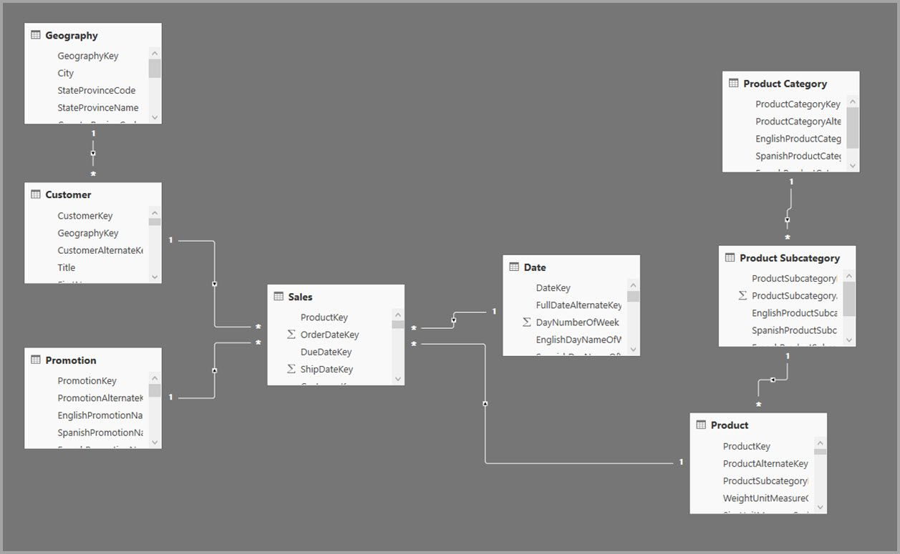

Stattdessen erstellen wir die Tabelle **Sales Agg** als Aggregationstabelle. Die Granularität ist höher als bei **Sales**. Deshalb enthält sie deutlich weniger Zeilen. Die Zeilenanzahl sollte mit der Summe von **SalesAmount** übereinstimmen (gruppiert nach **CustomerKey**, **DateKey** und **ProductSubcategoryKey**). Statt Milliarden sind jetzt nur noch Millionen Zeilen enthalten, was deutlich leichter verwaltet werden kann.

Gehen wir davon aus, dass die folgenden Dimensionstabellen am häufigsten für Abfragen mit hohem Unternehmenswert verwendet werden. Dabei handelt es sich um Tabellen, die **Sales Agg** mit *1:n*-Beziehungen (oder *n:1*-Beziehungen) filtern können.

* Geography
* Kunde
* Date
* Product Subcategory
* Product Category

Die folgende Abbildung zeigt dieses Modell.

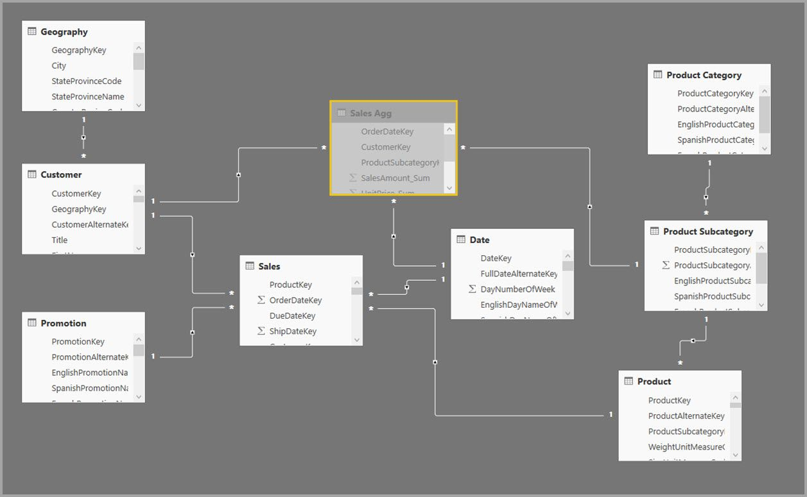

> [!NOTE]
> Die Tabelle **Sales Agg** ist nur eine weitere Tabelle, weshalb sie flexibel auf unterschiedlichen Arten geladen werden kann. Die Aggregation kann z.B. in der Quelldatenbank mit ETL- oder ELT-Vorgängen oder mit dem [M-Ausdruck](https://msdn.microsoft.com/query-bi/m/power-query-m-reference) für die Tabelle erfolgen. Die Tabelle kann den Speichermodus „Import“ mit oder ohne [inkrementelle Aktualisierung in Power BI Premium](service-premium-incremental-refresh.md) verwenden, oder ihr Modus kann auf „DirectQuery“ festgelegt werden, um mit [Columnstore-Indizes](https://docs.microsoft.com/sql/relational-databases/indexes/columnstore-indexes-overview) schnellere Abfragen zu ermöglichen. Diese Flexibilität ermöglicht ausgeglichene Architekturen, in denen die Abfragelast verteilt wird, um Engpässe zu vermeiden.

### Speichermodus 
Bleiben wir bei unserem Beispiel. Wir haben den Speichermodus von **Sales Agg** auf **Import** festgelegt, um Abfragen zu beschleunigen.

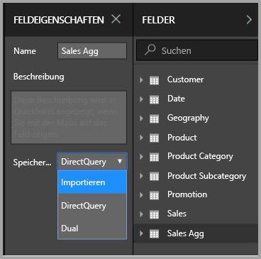

Anschließend wird ein Dialogfeld angezeigt, das uns darüber informiert, dass der Speichermodus der verwandten Dimensionstabellen auf **Dual** festgelegt werden kann. 

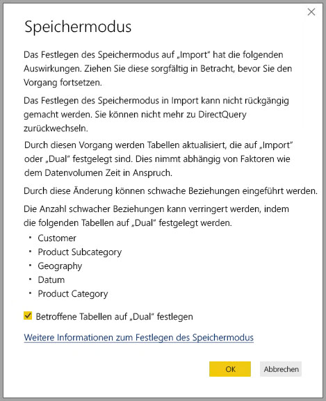

Wenn der Speichermodus der verwandten Dimensionstabellen auf **Dual** festgelegt wird, können Sie je nach Unterabfrage entweder „Import“ oder „DirectQuery“ verwenden.

* Abfragen, die Metriken aus der Tabelle **Sales Agg** aggregieren, deren Modus auf „Import“ festgelegt ist, und die GroupBy-Attribute aus der verwandten Dual-Tabelle können aus dem In-Memory-Cache zurückgegeben werden.
* Abfragen, die Metriken aus der Tabelle **Sales** aggregieren, deren Modus auf „DirectQuery“ festgelegt ist, und GroupBy-Attribute aus der verwandten Dual-Tabelle können im DirectQuery-Modus zurückgegeben werden. Die Abfragelogik mit dem „Gruppieren nach“-Vorgang wird an die Quelldatenbank übergeben.

Weitere Informationen zum Speichermodus **Dual** finden Sie im Artikel zum [Speichermodus in Power BI Desktop](desktop-storage-mode.md).

### Starke und schwache Beziehungen im Vergleich
Auf Beziehungen basierende Aggregationstreffer erfordern starke Beziehungen.

Starke Beziehungen umfassen die folgenden Kombinationen, bei denen beide Tabellen aus einer *einzelnen Quelle* stammen.

| Tabelle auf der n-Seite | Tabelle auf der *1*-Seite |
| ------------- |----------------------| 
| Dual          | Dual                 | 
| Import        | Import oder Dual       | 
| DirectQuery   | DirectQuery oder Dual  | 

Der einzige Fall, bei der eine *quellenübergreifende* Beziehung als stark eingestuft wird, ist der, wenn beide Tabellen den Speichermodus „Import“ aufweisen. m:n-Beziehungen werden immer als schwach eingestuft.

Informationen zu *quellenübergreifenden* Aggregationstreffern, die nicht von Beziehungen abhängen, finden Sie weiter unten im Abschnitt zu Aggregationen basierend auf gruppierten Spalten.

### Aggregationstabelle ist ausgeblendet
Die Tabelle **Sales Agg** ist ausgeblendet. Aggregationstabellen sollten für Benutzer des Datasets immer ausgeblendet werden. Benutzer und Abfragen verwenden die Detailtabelle, nicht die Aggregationstabelle. Sie müssen nicht wissen, dass es die Aggregationstabelle gibt.

### Dialogfeld „Aggregationen verwalten“
Als Nächstes definieren wir die Aggregationen. Klicken Sie mit der rechten Maustaste auf die Tabelle **Sales Agg**, um das Kontextmenü zu öffnen, und wählen Sie **Aggregationen verwalten** aus.

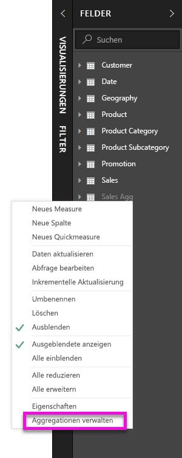

Das Dialogfeld **Aggregationen verwalten** wird angezeigt. Für jede Spalte in der Tabelle **Sales Agg** wird eine Zeile angezeigt, in der Sie das Aggregationsverhalten festlegen können. Abfragen an das Power BI-Dataset, das auf die Tabelle **Sales** verweist, werden intern an die Tabelle **Sales Agg** weitergeleitet. Consumer des Datasets müssen nicht wissen, dass die Tabelle **Sales Agg** existiert.

In der folgenden Tabelle werden die Aggregationen der **Sales Agg**-Tabelle gezeigt.

#### Zusammenfassungsfunktion

Sie können in der Dropdownliste „Zusammenfassung“ die folgenden Werte auswählen:
* Anzahl
* GroupBy
* Max
* Min
* Summe
* Count table rows

#### Überprüfungen

Die folgenden relevanten Überprüfungen werden vom Dialogfeld erzwungen:

* Die ausgewählte Detailspalte muss den gleichen Datentyp wie die Aggregationsspalte aufweisen. Ausgenommen sind die Zusammenfassungsfunktionen „Count“ und „Count table rows“. „Count“ und „Count table rows“ sind nur für Integeraggregationsspalten verfügbar und erfordern keinen übereinstimmenden Datentyp.
* Verkettete Aggregationen über drei oder mehr Tabellen sind nicht zulässig. Es ist beispielsweise nicht möglich, Aggregationen für **Tabelle A** einzurichten, wenn diese auf **Tabelle B** verweist, deren Aggregationen wiederum auf **Tabelle C** verweisen.
* Doppelte Aggregationen, bei denen zwei Einträge die gleiche Zusammenfassungsfunktion verwenden und auf die gleiche Detailtabelle bzw. -spalte verweisen, sind nicht zulässig.

Während dieser Phase der öffentlichen Vorschau für **Aggregationen** werden zudem die folgenden Überprüfungen erzwungen. Mit allgemeiner Verfügbarkeit sollen diese Überprüfungen entfernt werden.

* Aggregationen könne nicht mit der Sicherheit auf Zeilenebene verwendet werden. *Einschränkung der öffentlichen Vorschauversion.*
* Die Detailtabelle muss den Modus „DirectQuery“ aufweisen (und nicht „Import“). *Einschränkung der öffentlichen Vorschauversion.*

Die meisten dieser Überprüfungen werden durch das Deaktivieren von Dropdownwerten und das Anzeigen einer Erklärung in einer QuickInfo erzwungen. Dies wird im folgenden Bild veranschaulicht.

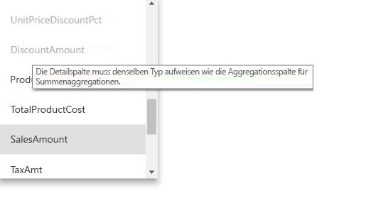

### Gruppierte Spalten

In diesem Beispiel sind die drei GroupBy-Einträge optional. Sie wirken sich nicht auf das Aggregationsverhalten aus (ausgenommen ist die Beispielabfrage DISTINCTCOUNT, die in einem der folgenden Bilder veranschaulicht wird). Sie werden der Lesbarkeit halber einbezogen. Ohne diese GroupBy-Einträge würden die Aggregationen immer noch basierend auf den Beziehungen gefunden werden. Dieses Verhalten unterscheidet sich vom Verhalten von Aggregationen ohne Beziehungen. Dieses wird im Big Data-Beispiel weiter unten in diesem Artikel veranschaulicht.

### Erkennen, ob Aggregationen von Abfragen gefunden werden

Im Artikel zum [Speichermodus in Power BI Desktop](desktop-storage-mode.md) erhalten Sie weitere Informationen dazu, wie Sie erkennen, ob Abfragen aus dem In-Memory-Cache (Speicher-Engine) oder von DirectQuery mit dem SQL Server Profiler (an die Datenquelle gepusht) zurückgegeben werden. Dieser Vorgang kann auch verwendet werden, um zu erkennen, ob Aggregationen gefunden werden.

Darüber hinaus wird das folgende erweiterte Ereignis im SQL Server Profiler bereitgestellt:

    Query Processing\Aggregate Table Rewrite Query

Der folgende JSON-Codeausschnitt ist ein Beispiel für die Ausgabe des Ereignisses, wenn eine Aggregation verwendet wird.

* **matchingResult** gibt an, dass für die Unterabfrage eine Aggregation verwendet wurde.
* **dataRequest** gibt die Spalten an, nach denen gruppiert wurde, sowie die aggregierten Spalten, die von der Unterabfrage verwendet wurde.
* **mapping** gibt die Spalten in der Aggregationstabelle an, die zugeordnet wurden.

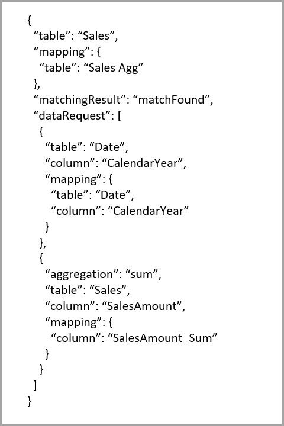

### Beispielabfragen
Die folgende Abfrage findet die Aggregation, weil Spalten in der *Date*-Tabelle der Granularität entsprechen, die zum Finden der Aggregation erforderlich ist. Die Aggregation **Sum** für **SalesAmount** wird verwendet.

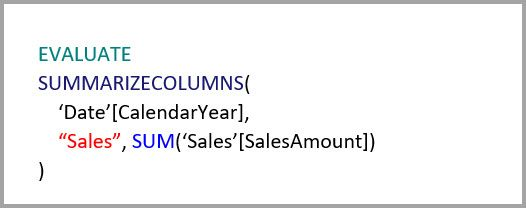

Die folgende Abfrage führt nicht zu einem Aggregationstreffer. Obwohl Sie die Summe von **SalesAmount** angefordert haben, wird ein „Gruppieren nach“-Vorgang für eine Spalte in der **Product**-Tabelle ausgeführt. Das entspricht nicht der Granularität, die zum Finden der Aggregation erforderlich ist. Wenn Sie sich die Beziehungen im Modell ansehen, werden Sie feststellen, dass eine Produktunterkategorie mehrere **Product**-Zeilen aufweisen kann. Die Abfrage könnte nicht feststellen, für welches Produkt die Aggregation durchgeführt werden soll. In diesem Fall kehrt die Abfrage zu DirectQuery zurück und übermittelt eine SQL-Abfrage an die Datenquelle.

Aggregationen können nicht nur für einfache Berechnungen eingesetzt werden (wie z.B. das Berechnen einer Summe). Sie können auch bei komplexen Berechnungen nützlich sein. Eine komplexe Berechnung wird in mehrere Unterabfragen aufgeteilt: SUM, MIN, MAX und COUNT. Jede Unterabfrage wird ausgewertet, um zu bestimmen, ob die Aggregation gefunden werden kann. Dies gilt aufgrund einer Optimierung des Abfrageplans nicht immer. Das folgende Beispiel findet die Aggregation:

Die Funktion COUNTROWS kann von Aggregationen profitieren. Die folgende Abfrage findet die Aggregation, weil eine **Count table rows**-Aggregation in der **Sales**-Tabelle definiert wurde.

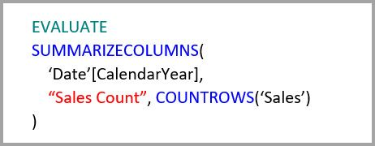

Die Funktion AVERAGE kann von Aggregationen profitieren. Die folgende Abfrage findet die Aggregation, weil AVERAGE intern in SUM geteilt durch COUNT gefaltet wird. Da für die Spalte **UnitPrice** Aggregationen für SUM und COUNT definiert sind, wird die Aggregation gefunden.

In einigen Fällen kann die Funktion DISTINCTCOUNT von Aggregationen profitieren. Die folgenden Abfrage findet die Aggregation, weil es einen GroupBy-Eintrag für **CustomerKey** gibt, wodurch **CustomerKey** in der Aggregationstabelle eindeutig bleibt. Diese Vorgehensweise unterliegt immer noch dem Leistungsschwellenwert, bei dem circa zwei bis fünf Millionen eindeutige Werte die Abfrageleistung beeinflussen können. Sie kann jedoch bei Szenarios nützlich sein, in denen die Detailtabelle Milliarden von Zeilen und die Spalten zwei bis fünf Millionen eindeutige Werte enthält. In diesem Fall kann DISTINCTCOUNT schneller sein als das Überprüfen der Tabelle mit Milliarden Zeilen, auch wenn diese im Arbeitsspeicher zwischengespeichert werden würde.

## Aggregationen basierend auf gruppierten Spalten 

Hadoop-basierte Big Data-Modelle unterscheiden sich von dimensionalen Modellen. Sie verlassen sich zumeist nicht auf Beziehungen, um Joins zwischen großen Tabellen zu vermeiden. Stattdessen werden Dimensionsattribute oft zu Faktentabellen denormalisiert. Derartige Big Data-Modelle können für interaktive Analysen mit **Aggregationen** basierend auf gruppierten Spalten eingesetzt werden.

Die folgende Tabelle enthält die numerische Spalte **Movement**, die aggregiert werden soll. Alle anderen Spalten sind Attribute, nach denen gruppiert werden kann. Sie enthält IoT-Daten und eine sehr hohe Anzahl an Zeilen. Der Speichermodus ist „DirectQuery“. Abfragen der Datenquelle, die das gesamte Dataset aggregieren, sind aufgrund des hohen Volumens sehr langsam.

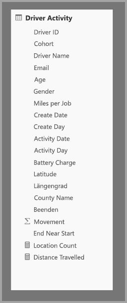

Fügen Sie eine Aggregationstabelle hinzu, die nach den meisten Attributen gruppiert ist, aber Attribute mit hoher Kardinalität ausschließt (wie z.B. longitude und latitude), um eine interaktive Analyse dieses Datasets zu ermöglichen. Dadurch wird die Anzahl der Zeilen deutlich verringert und ist nun klein genug, um gut in den In-Memory-Cache zu passen. Der Speichermodus von **Driver Activity Agg** ist „Import“.

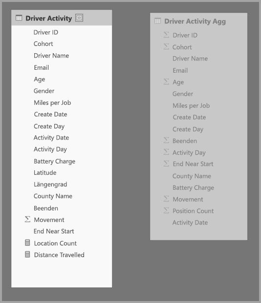

Als Nächstes definieren wir die Aggregationszuordnungen im Dialogfeld **Aggregationen verwalten**. Für jede Spalte in der Tabelle **Driver Activity Agg** wird eine Zeile angezeigt, in der Sie das Aggregationsverhalten festlegen können.

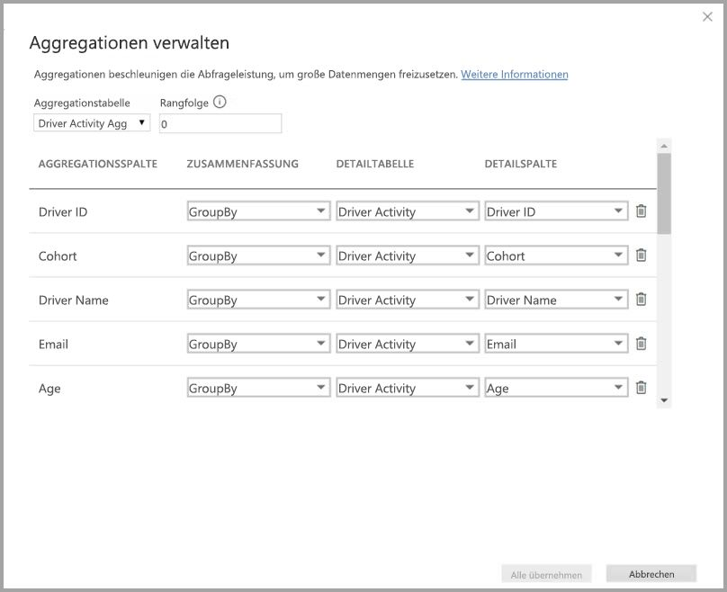

In der folgenden Tabelle werden die Aggregationen der **Driver Activity Agg**-Tabelle gezeigt.

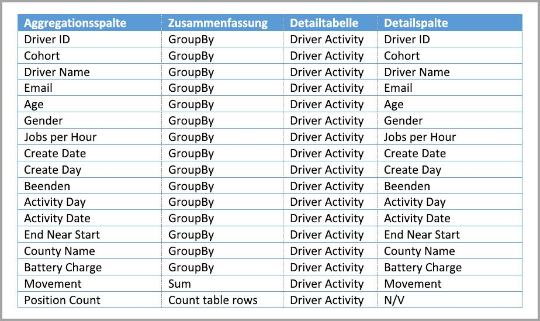

### Gruppierte Spalten

In diesem Beispiel sind die **GroupBy**-Einträge **nicht optional**. Ohne diese Einträge würden Aggregationen nicht gefunden werden. Dieses Verhalten unterscheidet sich vom Verhalten beim Verwenden von Aggregationen basierend auf Beziehungen, was bereits weiter oben in diesem Artikel mit einem Beispiel zu dimensionalen Modellen veranschaulicht wurde.

### Beispielabfragen

Die folgende Abfrage findet die Aggregation, weil die Spalte **Activity Date** von der Aggregationstabelle abgedeckt wird. Die Aggregation „Count table rows“ wird von der Funktion COUNTROWS verwendet.

Besonders für Modelle, die Filterattribute in Faktentabellen enthalten, kann es sich als nützlich erweisen, „Count table rows“-Aggregationen zu verwenden. Power BI kann Abfragen des Datasets mit COUNTROWS durchführen, auch wenn dies nicht explizit vom Benutzer angefordert wurde. Das Dialogfeld „Filter“ zeigt z.B. die Zeilenanzahl für jeden Wert an.

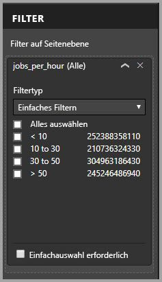

## Aggregationsrangfolge

Durch eine Aggregationsrangfolge können mehrere Aggregationstabellen von einer einzelnen Unterabfrage berücksichtigt werden.

Sehen Sie sich das folgende Beispiel an. Dies ist ein [zusammengesetztes Modell](desktop-composite-models.md), das mehrere DirectQuery-Quellen enthält.

* Die Import-Tabelle **Driver Activity Agg2** weist eine hohe Granularität auf, weil es nur wenige GroupBy-Attribute gibt und die Kardinalität gering ist. Die Anzahl der Zeilen kann nur wenige Tausend betragen, sodass sie problemlos in einen In-Memory-Cache passt. Diese Attribute werden von einem Dashboard einer wichtigen Führungsperson verwendet, weshalb darauf verweisende Abfragen so schnell wie möglich ausgeführt werden sollen.
* Die Tabelle **Driver Activity Agg** ist eine Zwischenaggregationstabelle im DirectQuery-Modus. Sie enthält über eine Milliarde Zeilen und wird an der Quelle mit Columnstore-Indizes optimiert.
* Die Tabelle **Driver Activity** befindet sich im DirectQuery-Modus und enthält über eine Billion Zeilen mit IoT-Daten, die aus einem Big Data-System stammen. Sie verarbeitet Drillthroughabfragen zum Anzeigen einzelner IoT-Lesevorgänge in kontrollierten Filterkontexten.

Der Speicherbedarf dieses Modells ist relativ gering, obwohl es ein großes Dataset verfügbar macht. Es stellt eine ausgeglichene Architektur dar, weil es die Abfragelast auf alle Komponenten der Architektur verteilt und diese abhängig von ihren Stärken einsetzt.

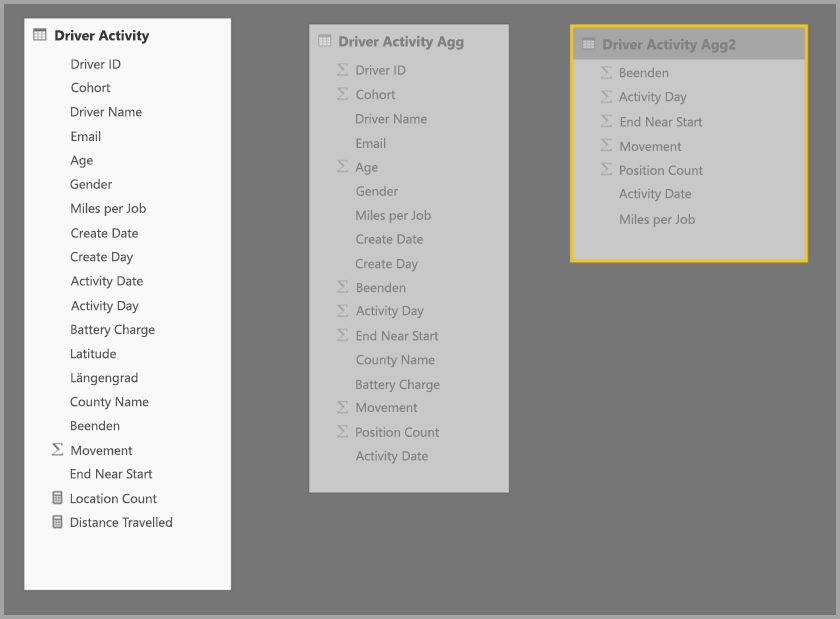

Das Dialogfeld **Aggregationen verwalten** für **Driver Activity Agg2** enthält das Feld *Precedence* (Rangfolge) mit einem Wert von 10. Dieser ist höher als der Wert für **Driver Activity Add**, was bedeutet, dass „Driver Activity Agg2“ von Abfragen mit Aggregationen als erstes berücksichtigt wird. Unterabfragen, deren Granularität es nicht ermöglicht, dass sie von **Driver Activity Agg2** beantwortet werden könnten, berücksichtigen stattdessen **Driver Activity Agg**. Detailabfragen, die von keiner der Aggregationstabellen beantwortet werden können, werden an **Driver Activity** weitergeleitet.

In der Spalte **Detailtabelle** ist **Driver Activity** und nicht **Driver Activity Agg** angegeben, weil verkettete Aggregationen nicht zulässig sind (weitere Informationen unter [Überprüfungen](#validations) weiter oben in diesem Artikel).

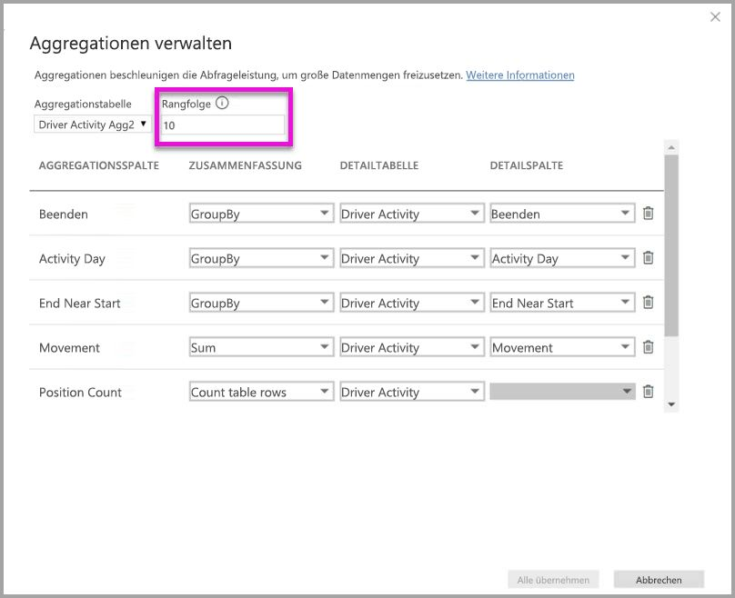

In der folgenden Tabelle werden die Aggregationen der **Driver Activity Agg2**-Tabelle gezeigt.

## Aggregationen basierend auf GroupBy-Spalten und Beziehungen

Sie können die beiden Methoden für Aggregationen, die in diesem Artikel beschrieben wurden, auch miteinander kombinieren. **Aggregationen**, die auf Beziehungen basieren, erfordern möglicherweise, dass die denormalisierten Dimensionstabellen in mehrere Tabellen aufgeteilt werden. Wenn dies für bestimmte Dimensionstabellen zu aufwändig oder zu unpraktisch ist, können die erforderlichen Attribute in der Aggregationstabelle für bestimmte Dimensionen repliziert werden, und für andere können Beziehungen verwendet werden.

Im folgenden Modell werden *Month*, *Quarter*, *Semester* und *Year* in der Tabelle **Sales Agg** repliziert. Es gibt keine Beziehung zwischen den Tabellen **Sales Agg** und **Date**. Es gibt Beziehungen zu **Customer** und **Product Subcategory**. **Sales Agg** befindet sich im Speichermodus „Import“.

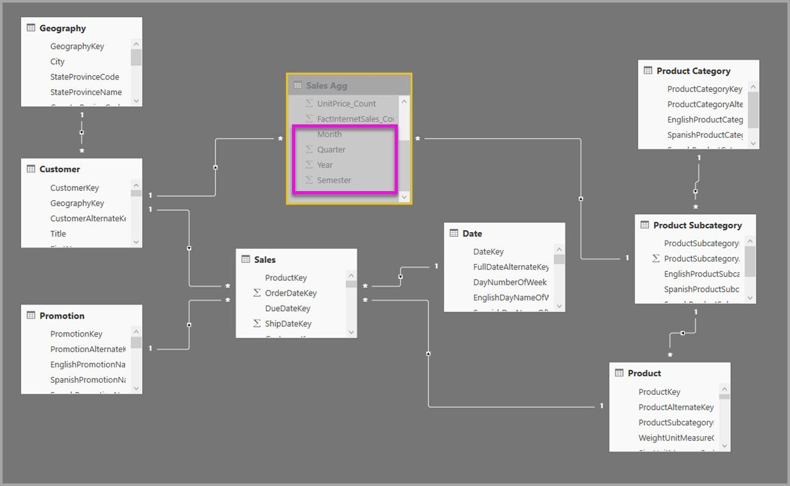

In der folgenden Tabelle werden die Einträge angezeigt, die Sie im Dialogfeld **Aggregationen verwalten** für die Tabelle **Sales Agg** festgelegt haben. Die GroupBy-Einträge, bei denen **Date** die Detailtabelle ist, müssen Aggregationen für Abfragen finden, die nach den Date-Attributen gruppieren. Wie auch im vorherigen Beispiel wirken sich die GroupBy-Einträge für CustomerKey und ProductSubcategoryKey nicht darauf aus, ob Aggregationen gefunden werden, da Beziehungen vorhanden sind (DISTINCTCOUNT wieder ausgenommen).

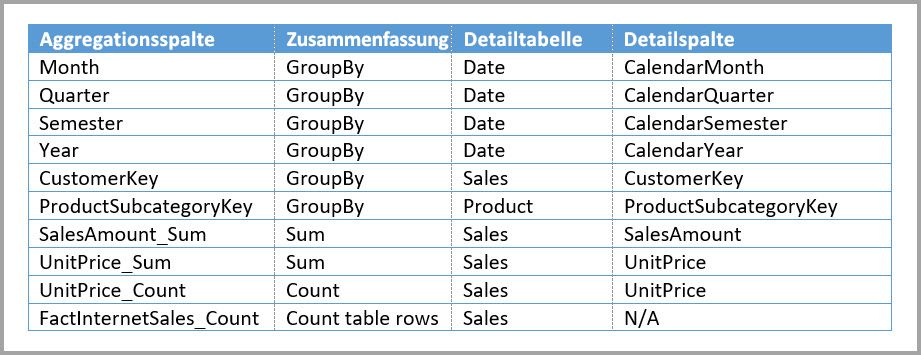

> Hinweis: Dieses Modell erfordert, dass sich die **Date**-Tabelle im DirectQuery-Modus befindet, damit das Dialogfeld „Aggregationen verwalten“ ausgefüllt werden kann. Dies liegt daran, dass die Tabelle eine Detailtabelle ist. Diese Einschränkung gilt nur für die Vorschauversion. Sie soll bei allgemeiner Verfügbarkeit nicht mehr bestehen.

### Beispielabfragen

Die folgende Abfrage findet die Aggregation, weil CalendarMonth von der Aggregation abgedeckt wird und weil auf CategoryName über eine 1:n-Beziehung zugegriffen werden kann. Die Aggregation „Sum“ für **SalesAmount** wird verwendet.

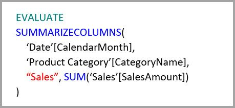

Die folgende Abfrage findet die Aggregation nicht, weil die Spalte „CalendarDay“ nicht von der Aggregationstabelle abgedeckt wird.

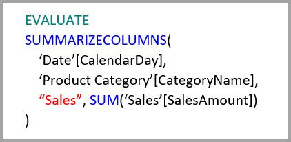

Die folgende Zeitintelligenzabfrage findet die Aggregation nicht, weil die Funktion DATESYTD eine Tabelle aus CalendarDay-Werten generiert, die nicht von der Aggregationstabelle abgedeckt wird.

## Bedeutung der Synchronisierung von Caches

**Aggregationen**, die die Modi „DirectQuery“ und „Import“ miteinander kombinieren und/oder den Speichermodus „Dual“ haben, geben unterschiedliche Daten zurück, wenn der In-Memory-Cache nicht mit den Quelldaten synchron ist. Bei der Abfrageausführung wird nicht versucht, Datenprobleme, zu maskieren, indem z.B. DirectQuery-Ergebnisse entsprechend den zwischengespeicherten Werten gefiltert werden. Diese Features sind Leistungsoptimierungen und sollten nur entsprechend der Unternehmensanforderungen eingesetzt werden. Sie sind dafür zuständig, Ihre Datenflüsse zu kennen, und müssen deshalb den Entwurf entsprechend anpassen. Bei Bedarf können Sie auf etablierte Verfahren zum Umgang mit derartigen Problemen an der Quelle zurückgreifen.

## Nächste Schritte

Die folgenden Artikeln enthalten weitere Informationen über zusammengesetzte Modelle sowie Details zu DirectQuery.

* [Zusammengesetzte Modelle in Power BI Desktop (Vorschau)](desktop-composite-models.md)
* [m:n-Beziehungen in Power BI Desktop (Vorschau)](desktop-many-to-many-relationships.md)
* [Speichermodus in Power BI Desktop (Vorschau)](desktop-storage-mode.md)

Artikel zu DirectQuery:

* [Verwendung von DirectQuery in Power BI](desktop-directquery-about.md)
* [Von DirectQuery in Power BI unterstützte Datenquellen](desktop-directquery-data-sources.md)
