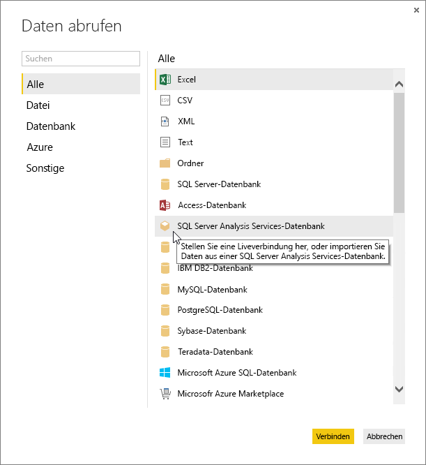
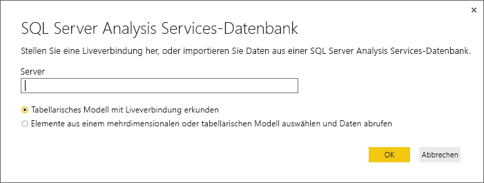
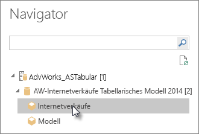
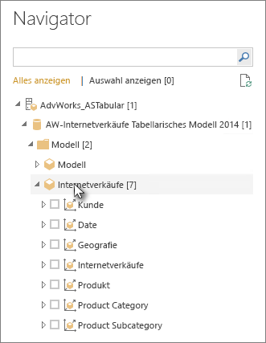
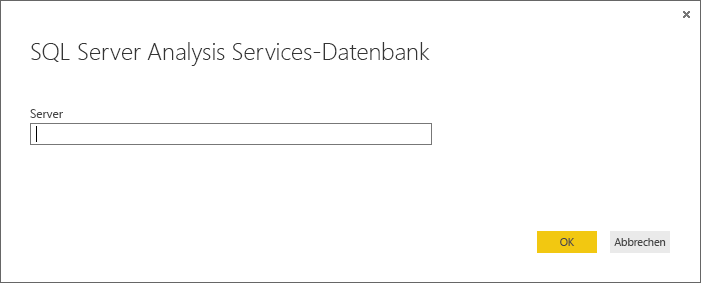

# Verwenden tabellarischer Analysis Services-Daten in Power BI Desktop
Mit Power BI-Desktop verfügen Sie über zwei Möglichkeiten, eine Verbindung mit tabellarischen Modellen von SQL Server Analysis Services herzustellen und Daten aus diesen Modellen abzurufen: Durchsuchen mit Live-Verbindung, oder Auswählen und Importieren von Elementen in Power BI Desktop.

Sehen wir uns das einmal näher an.

**Durchsuchen mit Live-Verbindung** – Bei Verwendung einer Live-Verbindung werden Elemente im tabellarischen Modell oder einer Perspektive, wie Tabellen, Spalten und Maße, in der Liste der Power BI Desktop-Felder angezeigt. Die erweiterte Visualisierung und Bericht-Tools von Power BI bieten Ihnen neue und hoch interaktive Möglichkeiten zum Untersuchen Ihres tabellarischen Modells.

Bei einer Live-Verbindung werden keine Daten aus dem tabellarischen Modell in Power BI Desktop importiert. Bei jeder Interaktion mit einer Visualisierung fragt Power BI Desktop das tabellarische Modell ab und berechnet die angezeigten Ergebnisse. Es werden immer die neuesten Daten angezeigt. Beachten Sie, dass tabellarische Modelle eine hohe Sicherheit bieten. Die in Power BI-Desktop angezeigten Elemente hängen von Ihren Berechtigungen für das tabellarische Modell ab, mit dem Sie verbunden sind.

Dynamische Berichte, die Sie in Power BI Desktop erstellt haben, können Sie durch die Veröffentlichung auf Ihrer Power BI-Website freigeben. Wenn Sie eine Power BI Desktop-Datei mit einer Liveverbindung mit einem tabellarischen Modell auf Ihrer Power BI-Website veröffentlichen möchten, muss ein lokales Datengateway installiert sein und von einem Administrator konfiguriert werden. Lesen Sie zu diesem Thema den Artikel [Lokales Datengateway](service-gateway-onprem.md).

**Auswählen und Importieren von Elementen in Power BI Desktop** – Wenn Sie eine Verbindung mit dieser Option herstellen, können Sie Elemente wie Tabellen, Spalten und Measures in Ihrem tabellarischen Modell bzw. einer Perspektive auswählen und in ein Power BI Desktop-Modell laden. Mit dem erweiterten Abfrage-Editor von Power BI Desktop können Sie Ihre Suche noch weiter präzisieren. Mithilfe der Modellierungsfunktionen von Power BI Desktop können Sie die Daten noch weitergehender modellieren. Zwischen Power BI-Desktop und dem tabellarischen Modell wird keine Live-Verbindung aufrechterhalten. Sie können dann Ihr Power BI Desktop-Modell offline untersuchen oder auf Ihrer Power BI-Website veröffentlichen.

## So stellen Sie eine Verbindung mit einem tabellarischen Modell her
1. Klicken Sie in Power BI Desktop auf der Registerkarte **Start** auf **Daten abrufen**.
   
   
2. Klicken Sie auf **SQL Server Analysis Services-Datenbank**und dann auf **Verbinden**.
   
   
3. Geben Sie den Namen des Servers ein, und wählen Sie einen Verbindungsmodus aus. 
   
   
4. Dieser Schritt hängt von dem von Ihnen ausgewählten Verbindungsmodus ab:

* Wenn Sie eine Live-Verbindung herstellen, wählen Sie im Navigator ein tabellarisches Modell oder eine Perspektive aus.
  
  
* Wenn Sie Auswählen und Importieren von Elementen verwenden, wählen Sie im Navigator ein tabellarisches Modell oder eine Perspektive aus. Weiter können Sie nur bestimmte Tabellen oder Spalten zum Laden auswählen. Um Ihre Daten vor dem Laden zu modellieren, rufen Sie den Abfrage-Editor auf, indem Sie auf "Bearbeiten" klicken. Wenn Sie dies abgeschlossen haben, klicken Sie auf "Laden", um die Daten in Power BI Desktop zu importieren.

  

## Häufig gestellte Fragen
**Frage:** Benötige ich ein lokales Datengateway?

**Antwort:** Das kommt darauf an. Wenn Sie Power BI Desktop verwenden, um eine Live-Verbindung mit einem tabellarischen Modell herzustellen, jedoch keine Veröffentlichung auf Ihrer Power BI-Website beabsichtigen, benötigen Sie kein Gateway. Wenn Sie jedoch eine Veröffentlichung auf Ihrer Power BI-Website beabsichtigen, benötigen Sie ein Datengateway, um eine sichere Kommunikation zwischen dem Power BI-Dienst und dem lokalen Analysis Services-Server sicherzustellen. Wenden Sie sich unbedingt an Ihren Analysis Services Server-Administrator, bevor Sie ein Datengateway installieren.

Wenn Sie „Elemente auswählen“ und „Daten abrufen“ auswählen, importieren Sie tabellarische Modelldaten direkt in Ihre Power BI Desktop-Datei. Daher ist kein Gateway erforderlich.

**Frage:** Was ist der Unterschied zwischen einer Live-Verbindung mit einem tabellarischen Modell im Power BI-Dienst gegenüber einer Live-Verbindung in Power BI Desktop?

**Antwort:** Bei einer Liveverbindung mit einem tabellarischen Modell Ihrer Website im Power BI-Dienst mit einer lokal in Ihrem Unternehmen vorhandenen Analysis Services-Datenbank ist ein lokales Datengateway erforderlich, um eine sichere Kommunikation zwischen diesen sicherzustellen. Bei einer Live-Verbindung mit einem tabellarischen Modell in Power BI Desktop benötigen Sie kein Gateway, da sowohl Power BI Desktop als auch der Analysis Services-Server, mit denen Sie die Verbindung herstellen, in Ihrer Organisation lokal ausgeführt werden. Wenn Sie jedoch Ihre Power BI Desktop-Datei auf Ihrer Power BI-Website veröffentlichen, ist ein Gateway erforderlich.

**Frage:** Kann ich, wenn ich eine Live-Verbindung hergestellt habe, auch eine Verbindung zu einer anderen Datenquelle in derselben Power BI Desktop-Datei herstellen?

**Antwort:** Nein. Sie können keine Livedaten untersuchen und auch keine Verbindung mit einem anderen Datenquellentyp in derselben Datei herstellen. Wenn Sie bereits Daten importiert oder eine Verbindung mit einer anderen Datenquelle in einer Power BI Desktop-Datei hergestellt haben, müssen Sie für eine Live-Untersuchung eine neue Datei erstellen.

**Frage:** Kann ich, wenn ich eine Live-Verbindung erstellt habe, das Modell oder die Abfrage in Power BI-Desktop bearbeiten?

**Antwort:** Sie können in Power BI Desktop Measures auf Berichtsebene erstellen, aber alle anderen Abfrage- und Modellierungsfeatures sind beim Untersuchen von Livedaten deaktiviert.

**Frage:** Ist eine von mir erstellte Live-Verbindung sicher?

**Antwort:** Ja. Ihre aktuellen Windows-Anmeldeinformationen werden für die Verbindung mit dem Analysis Services-Server verwendet. Sie können Basic- oder gespeicherte Anmeldeinformationen bei der Untersuchung von Livedaten weder im Power BI-Dienst noch im Power BI Desktop verwenden.

**Frage:** Im Navigator werden ein Modell und eine Perspektive angezeigt. Was ist der Unterschied?

**Antwort:** Eine Perspektive ist eine bestimmte Ansicht eines tabellarischen Modells. Sie enthält ggf. nur bestimmte Tabellen, Spalten oder Maße in Abhängigkeit von einem speziellen Datenanalysebedarf. Ein tabellarisches Modell enthält immer mindestens eine-Perspektive, die alles, was im Modell enthalten ist, umfassen kann. Wenn Sie nicht sicher sind, was Sie auswählen sollen, wenden Sie sich an Ihren Administrator.

## So ändern Sie den Namen des Servers nach der ersten Verbindung
Nachdem Sie eine Power BI Desktop-Datei mit einer Live-Verbindung erstellt haben, kann es in einigen Fällen erforderlich sein, die Verbindung auf einen anderen Server umzuschalten. Wenn Sie beispielsweise Ihre Power BI-Desktop-Datei bei der Verbindung mit einem Entwicklungsserver und vor der Veröffentlichung im Power BI-Dienst erstellt haben, möchten Sie die Verbindung zum Produktionsserver umschalten.

1. Wählen Sie im Menüband **Abfragen bearbeiten** aus.
   
   
2. Geben Sie den neuen Namen ein.
   
   
   
   
## Problembehandlung 
In der folgenden Liste sind alle bekannten Probleme beim Verbinden mit SQL Server Analysis Services (SSAS) und Azure Analysis Services aufgeführt. 

* **Error: Couldn't load model schema** (Fehler: Modellschema konnte nicht geladen werden.): Dieser Fehler tritt normalerweise nur dann auf, wenn der Benutzer, der versucht, eine Verbindung mit Analysis Services herzustellen, keine Zugriffsberechtigungen für die Datenbank/das Modell besitzt.

