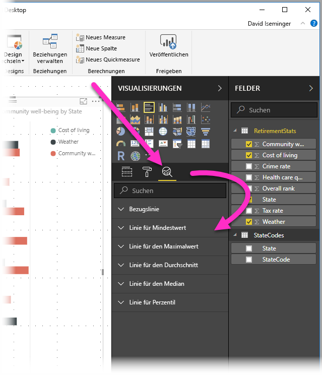
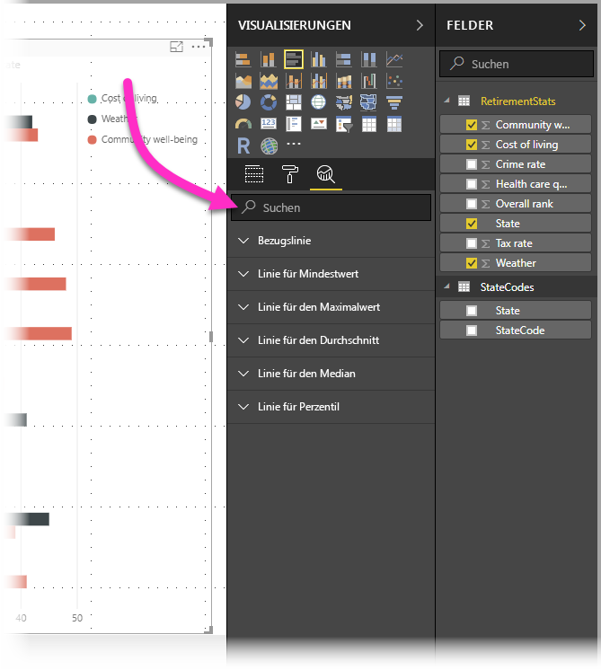
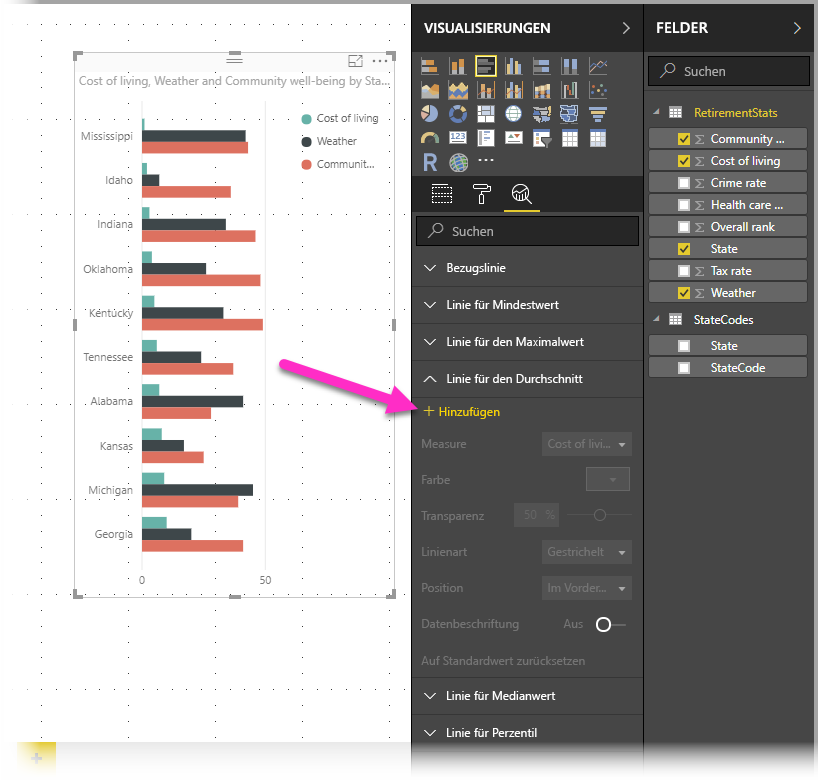
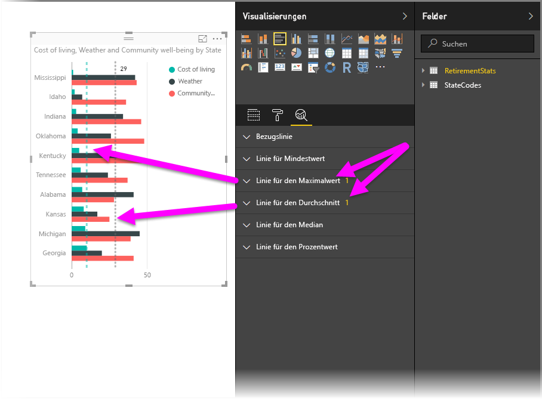
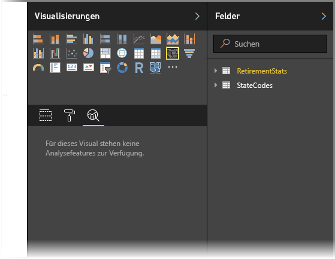
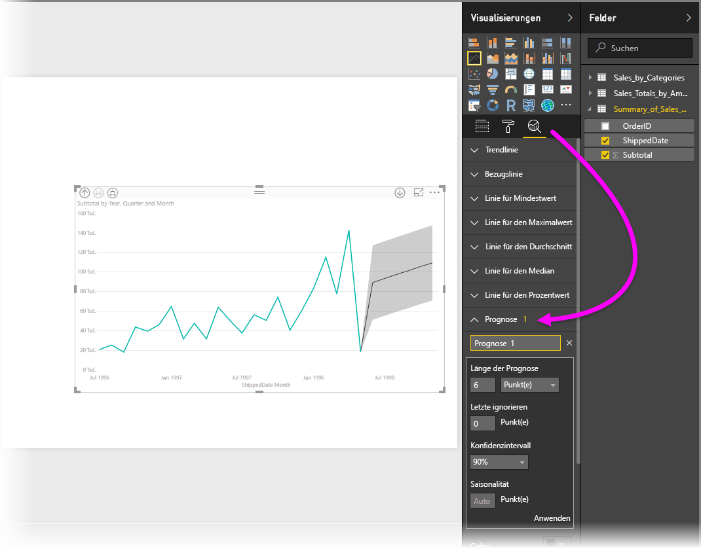

# Verwenden des Analysebereichs in Power BI Desktop
Mit dem Bereich **Analyse** in **Power BI Desktop** können Sie dynamische *Bezugslinien* zu Visualisierungen hinzufügen und wichtige Trends und Erkenntnisse identifizieren. Der Bereich **Analyse** befindet sich im Bereich **Visualisierungen** von Power BI Desktop und ist mit der Version von August 2016 (Version 2.37.4464.321 oder höher) verfügbar (siehe unten).

> [!NOTE]
> Der Bereich **Analyse** wird nur angezeigt, wenn Sie im Power BI Desktop-Zeichenbereich ein Visual auswählen.
> 
> 

## Aktivieren von Vorhersagen (Preview)
Ab der **Power BI Desktop**-Version von September 2016 (Version 2.39.4526.362 oder höher) können Sie außerdem *Vorhersagen* im Bereich **Analyse** ausführen. Sie müssen diese Previewfunktion aktivieren, indem Sie im linken Bereich **Datei > Optionen und Einstellungen > Optionen** und dann **Vorschaufeatures** auswählen. Aktivieren Sie das Kontrollkästchen neben **Prognose**, um das Feature zu aktivieren, wie in der folgenden Abbildung dargestellt. Sie müssen **Power BI Desktop** neu starten, damit die Änderungen wirksam werden.

## Verwendung des Bereichs „Analyse“
Mithilfe des Bereichs **Analyse** können Sie die folgenden Arten von dynamischen Bezugslinien erstellen (wobei nicht alle Linien für alle Visualisierungstypen verfügbar sind):

* Bezugslinie für X-Achse
* Bezugslinie für Y-Achse
* Linie für Mindestwert
* Linie für Maximalwert
* Durchschnittslinie
* Linie für Medianwert
* Linie für Perzentil

In den folgenden Abschnitten erfahren Sie, wie Sie den Bereich **Analyse** und die dynamischen Bezugslinien in Ihren Visualisierungen verwenden können.

Um die für eine Visualisierung verfügbaren dynamischen Bezugslinien anzuzeigen, führen Sie die folgenden Schritte aus:

1. Wählen Sie eine Visualisierung aus, oder erstellen Sie eine Visualisierung. Wählen Sie dann das Symbol **Analyse** im Bereich **Visualisierungen** aus.
   
   
2. Wählen Sie für die gewünschte Linie den Pfeil nach unten aus, um die entsprechenden Optionen zu erweitern. In diesem Fall entscheiden wir uns für die **Durchschnittslinie**.
   
   
3. Um eine neue Linie zu erstellen, wählen Sie **+ Hinzufügen** aus. Dann können Sie der Linie einen Namen geben, indem Sie auf das Textfeld doppelklicken und dann den Namen eingeben.
   
   Für jede Linie steht eine Reihe an Optionen zur Verfügung, z.B. *Farbe*, *Transparenz*, *Stil* und *Position* (relativ zu den Datenelementen der Visualisierung). Sie können auch festlegen, ob die Bezeichnung angezeigt werden soll. Vor allem können Sie bestimmen, auf welchem **Measure** der Visualisierung die Linie basieren soll. Wählen Sie dazu das Dropdownfeld **Measure** aus, das automatisch mit den Datenelementen der Visualisierung ausgefüllt wird. In diesem Fall entscheiden wir uns für *Wetter* als Measure, geben als Bezeichnung *Durchschnittliches Wetter* ein und passen einige weitere Optionen an (siehe unten).
   
   
4. Wenn die Datenbezeichnung angezeigt werden soll, aktivieren Sie diese Option mit dem Schieberegler **Datenbeschriftung**. Dadurch werden eine Reihe an weiteren Optionen für die Datenbeschriftung angezeigt, wie Sie der folgenden Abbildung entnehmen können.
   
   
5. Beachten Sie die Zahl, die neben dem Element **Durchschnittslinie** im Bereich **Analyse** angezeigt wird. Dieser Wert steht für die Anzahl der in Ihrer Visualisierung verwendeten dynamischen Linien und verrät auch, von welchem Typ diese sind. Wenn wir eine **Linie für Maximalwert** für *Lebenshaltungskosten* hinzufügen, wird im Bereich **Analyse** angezeigt, dass nun auch eine dynamische Bezugslinie vom Typ **Linie für Maximalwert** in der Visualisierung verwendet wird.
   
   

Wenn Ihre Visualisierung keine dynamischen Bezugslinien verwenden kann (hier eine Visualisierung vom Typ **Karte**), sehen Sie das Folgende, wenn Sie den Bereich **Analyse** aufrufen.

Sie können viele interessante Einblicke gewinnen, wenn Sie mithilfe des Bereichs **Analyse** dynamische Bezugslinien erstellen.

Wir arbeiten an der Umsetzung weiterer Features und Funktionen, u.a. daran, dynamische Bezugslinien für mehr Visualisierungen verfügbar zu machen. Es gibt also regelmäßig Neues zu entdecken.

## Anwenden von Vorhersagen
Sie können das Feature **Vorhersage** verwenden, indem Sie ein visuelles Element auswählen und dann den Abschnitt **Vorhersage** des Bereichs **Analyse** erweitern. Sie können viele Eingaben zum Ändern der Vorhersage festlegen, z. B. die *Prognoselänge*, das *Konfidenzintervall* und weitere Eingaben. Die folgende Abbildung zeigt ein einfaches visuelles Linienelement mit angewendeter Vorhersage. Sie können jedoch selbst ermitteln (und mit dem Feature *Vorhersage* experimentieren), wie das Feature auf Ihre Modelle angewendet werden kann.

## Einschränkungen
Die Möglichkeit zum Verwenden von dynamischen Bezugslinien ist abhängig vom verwendeten visuellen Element. Die folgende Liste zeigt, welche dynamischen Linien zurzeit für welche visuellen Objekte verfügbar sind:

Dynamische Linien sind für die folgenden visuellen Elemente in vollem Umfang verfügbar:

* Flächendiagramm
* Liniendiagramm
* Punktdiagramm
* Gruppiertes Säulendiagramm
* Gruppiertes Balkendiagramm

Für die folgenden visuellen Elemente kann nur eine *Bezugslinie* aus dem Bereich **Analyse** verwendet werden:

* Gestapelte Fläche
* Gestapelter Balken
* Gestapelte Säule
* Gestapelter Balken (100 %)
* Gestapelte Säule (100 %)

Für die folgenden visuellen Elemente ist die einzige Option zurzeit eine *Trendlinie*:

* Nicht gestapelte Linie
* Gruppiertes Säulendiagramm

Außerdem können für nicht kartesische visuelle Elemente zurzeit keine dynamischen Linien im Bereich **Analyse** anwendet werden, z. B.:

* Matrix
* Kreisdiagramm
* Ringdiagramm
* Tabelle (Table)

## Nächste Schritte
Mit Power BI Desktop können Sie viele Aufgaben ausführen. Weitere Informationen zu den Funktionen und Möglichkeiten finden Sie in folgenden Ressourcen:

* [Neuigkeiten in Power BI Desktop](desktop-latest-update.md)
* [Laden Sie Power BI Desktop herunter](desktop-get-the-desktop.md)
* [Erste Schritte mit Power BI Desktop](desktop-getting-started.md)
* [Übersicht zu Abfragen mit Power BI Desktop](desktop-query-overview.md)
* [Datentypen in Power BI Desktop](desktop-data-types.md)
* [Strukturieren und Kombinieren von Daten mit Power BI Desktop](desktop-shape-and-combine-data.md)
* [Allgemeine Abfrageaufgaben in Power BI Desktop](desktop-common-query-tasks.md)    

