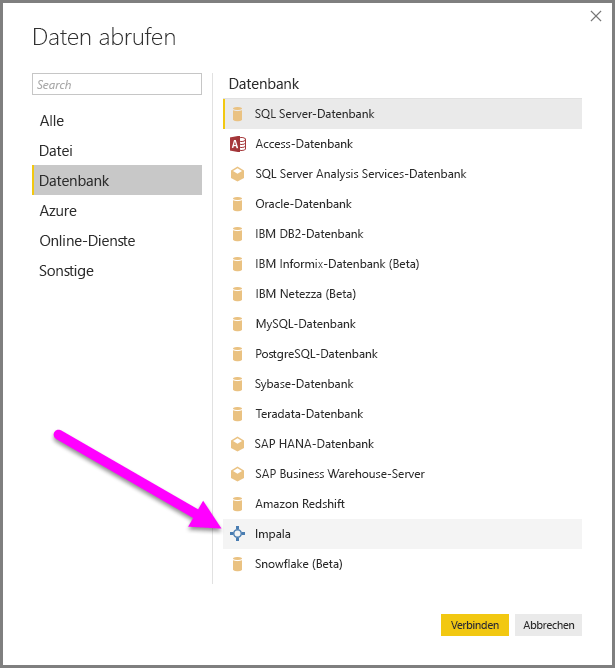
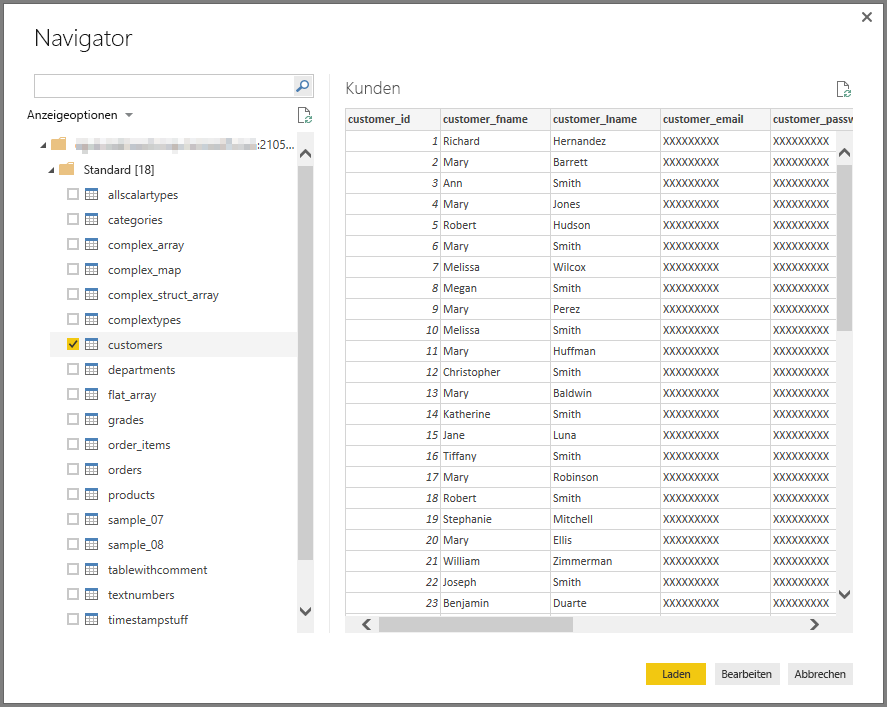

# Herstellen einer Verbindung mit einer Impala-Datenbank in Power BI Desktop
In Power BI Desktop können Sie eine Verbindung mit einer **Impala**-Datenbank herstellen und die zugrunde liegenden Daten wie alle anderen Datenquellen in Power BI Desktop verwenden.

## Herstellen einer Verbindung mit einer Impala-Datenbank
So stellen Sie eine Verbindung zu einer **Impala**-Datenbank her 

1. Wählen Sie in Power BI Desktop im Menüband **Start** die Option **Daten abrufen** aus. 

2. Wählen Sie in den Kategorien auf der linken Seite **Datenbank** aus. Daraufhin wird **Impala** angezeigt.

    

3. Geben oder fügen Sie in das angezeigte Fenster **Impala** den Namen des Impala-Servers ein. Wählen Sie dann **OK** aus. Sie können Daten direkt in Power BI **Importieren** oder **DirectQuery** verwenden. Weitere Informationen finden Sie unter [Verwendung von DirectQuery](desktop-use-directquery.md).

    

4. Wenn Sie dazu aufgefordert werden, geben Sie Ihre Anmeldeinformationen ein, oder stellen Sie anonym eine Verbindung her. Der Impala-Connector unterstützt die anonyme, Standard- (Benutzername + Kennwort) und Windows-Authentifizierung.

    

    > [!NOTE]
    > Wenn Sie Ihren Benutzernamen und Ihr Kennwort für einen bestimmten **Impala**-Server einfügen, verwendet Power BI Desktop für darauffolgende Verbindungen die gleichen Anmeldeinformationen. Sie können diese Anmeldeinformationen unter **Datei > Optionen und Einstellungen > Datenquelleneinstellungen** ändern.

5. Nach dem Verbinden wird das Fenster **Navigator** angezeigt, in dem Sie die Daten sehen, die auf dem Server verfügbar sind. Wählen Sie aus diesen Daten die Elemente aus, die Sie in **Power BI Desktop** importieren und verwenden möchten.

    

## Überlegungen und Einschränkungen
Beachten Sie Folgendes für den **Impala**-Connector:

* Der Impala-Connector wird auf dem lokalen Datengateway mit einem der drei unterstützten Authentifizierungsmechanismen unterstützt.

## Nächste Schritte
Es gibt viele verschiedene Datenquellen, mit denen Sie über Power BI Desktop eine Verbindung herstellen können. Weitere Informationen zu Datenquellen finden Sie in den folgenden Ressourcen:

* [Was ist Power BI Desktop?](desktop-what-is-desktop.md)
* [Datenquellen in Power BI Desktop](desktop-data-sources.md)
* [Strukturieren und Kombinieren von Daten mit Power BI Desktop](desktop-shape-and-combine-data.md)
* [Verbinden mit Excel in Power BI Desktop](desktop-connect-excel.md)   
* [Eingeben von Daten direkt in Power BI Desktop](desktop-enter-data-directly-into-desktop.md)   

