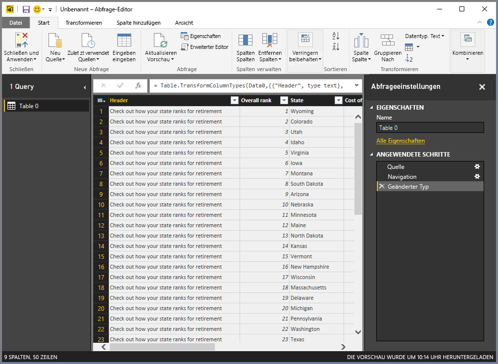
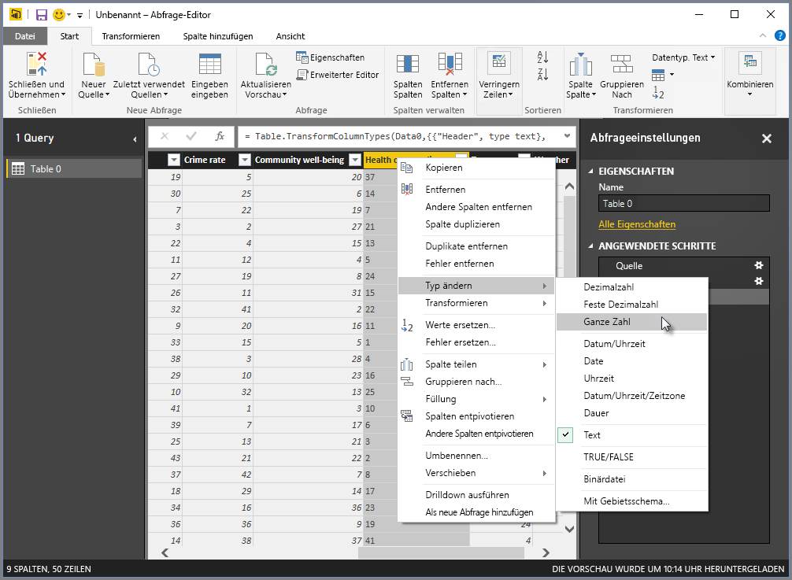
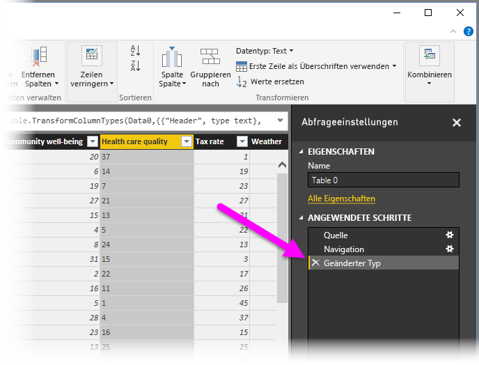
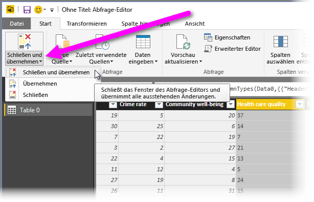
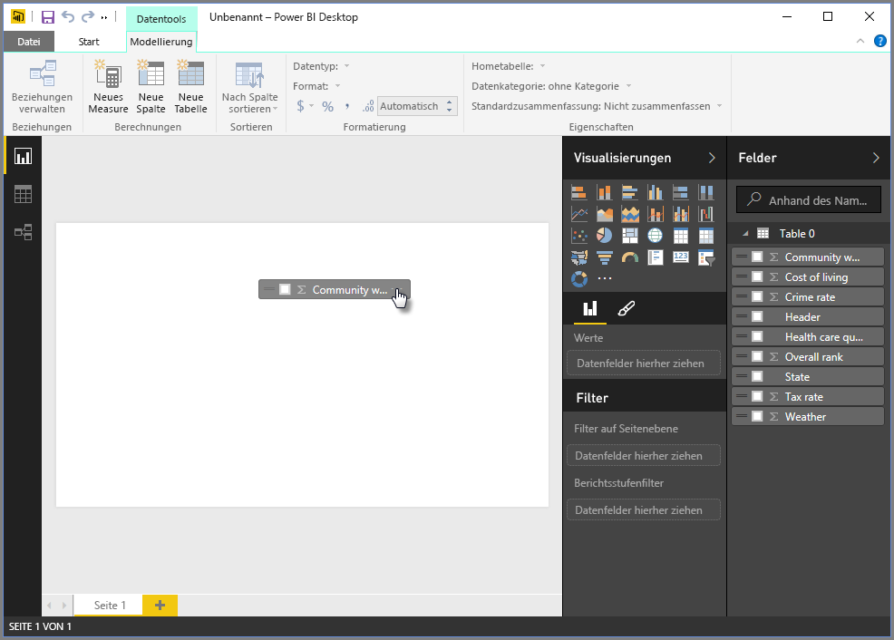

# Verbinden mit Daten in Power BI Desktop
Mit Power BI Desktop können Sie problemlos Verbindungen zur ständig wachsenden Welt der Daten herstellen. Wenn Sie noch nicht über Power BI Desktop verfügen, können Sie die Anwendung [herunterladen](http://go.microsoft.com/fwlink/?LinkID=521662) und installieren.

In Power BI Desktop sind *alle möglichen Arten* von in Power BI Desktop verfügbaren Datenquellen enthalten. Aus der folgenden Abbildung geht hervor, wie Sie eine Verbindung zu Daten herstellen. Wählen Sie dazu zuerst das Menüband **Datei** und dann **Daten abrufen \> Mehr** aus.

## Beispiel für das Herstellen einer Verbindung mit einer Datenquelle
In diesem Beispiel wird die Verbindung mit einer **Web** -Datenquelle hergestellt.

Stellen Sie sich vor, Sie gehen in Rente. Sie möchten dort leben, wo die Sonne scheint und die Steuern sowie das Gesundheitswesen akzeptabel sind. Vielleicht sind Sie auch Datenanalyst und benötigen diese Informationen, um Ihren Kunden zu helfen, die vielleicht Hersteller von Regenkleidung sind und ihre Umsätze auf Orte ausrichten möchten, wo es *viel* regnet.

In beiden Fällen finden Sie eine Webressource, die interessante Daten und mehr zu diesen Themen enthält:

[*http://www.bankrate.com/finance/retirement/best-places-retire-how-state-ranks.aspx*](http://www.bankrate.com/finance/retirement/best-places-retire-how-state-ranks.aspx)

Wählen Sie **Daten abrufen \> Web** aus, und geben Sie die Adresse ein.

Mit der Auswahl von **OK**beginnt die **Abfragefunktion** von Power BI Desktop ihre Arbeit. Power BI Desktop kontaktiert die Webressource und gibt im Fenster **Navigator** die auf der Webseite gefundenen Ergebnisse zurück. In diesem Fall hat sie eine Tabelle („Table 0“) und das allgemeine Dokument gefunden. Da wir an der Tabelle interessiert sind, wählen wir diese in der Liste aus. Im Fenster **Navigator** wird eine Vorschau angezeigt.

An dieser Stelle können wir vor dem Laden der Tabelle die Abfrage bearbeiten (durch Auswahl von **Bearbeiten** unten im Fenster) oder die Tabelle direkt laden.

Wenn wir **Bearbeiten** auswählen, wird die Tabelle geladen, und der Abfrage-Editor wird geöffnet. Der Bereich **Abfrageeinstellungen** wird angezeigt. (Sollte der Bereich nicht angezeigt werden, wählen Sie im Menüband die Option **Ansicht** und dann **Anzeigen \> Abfrageeinstellungen** aus, um den Bereich **Abfrageeinstellungen**anzuzeigen) So sieht die Ansicht aus.

Alle diese Ergebnisse sind eher Text als Zahlen, aber wir benötigen Zahlen. Kein Problem: Klicken Sie einfach mit der rechten Maustaste auf die Spaltenüberschrift, und wählen Sie **Typ ändern \> Ganze Zahl** aus, um die Werte zu ändern. Um mehr als eine Spalte auszuwählen, wählen Sie zuerst eine Spalte aus, drücken Sie die **UMSCHALTTASTE**, und wählen Sie dann mit gedrückter Taste weitere angrenzende Spalten aus. Klicken Sie anschließend mit der rechten Maustaste auf eine Spaltenüberschrift, um alle ausgewählten Spalten zu ändern. Drücken Sie **STRG**, um nicht benachbarte Spalten auszuwählen.

In den **Abfrageeinstellungen**werden alle vorgenommenen Änderungen unter **Angewendete Schritte** angezeigt. Wenn Sie weitere Änderungen an den Daten vornehmen, werden diese Änderungen vom Abfrage-Editor im Abschnitt **Angewendete Schritte** aufgezeichnet, den Sie bei Bedarf anpassen, erneut besuchen, neu anordnen oder löschen können.

Nach dem Laden der Tabelle können immer noch Änderungen vorgenommen werden. In diesem Fall wird dies jedoch nicht benötigt. Wenn wir fertig sind, wählen wir **Schließen und übernehmen** im Menüband **Start** aus. Daraufhin wendet Power BI Desktop unsere Änderungen an und schließt den Abfrage-Editor.

Nachdem das Datenmodell in der **Berichtsansicht** in Power BI Desktop geladen ist, können wir mit der Erstellung von Visualisierungen beginnen, indem wir Felder in den Zeichenbereich ziehen.

Dies ist natürlich nur ein einfaches Modell mit einer einzelnen Datenverbindung. Die meisten Power BI-Desktop-Berichte sind mit verschiedenen Datenquellen verbunden, die Ihren Anforderungen entsprechend strukturiert sind und Beziehungen aufweisen, die ein umfassendes Datenmodell erzeugen. 

## Nächste Schritte
Mit Power BI Desktop können Sie viele Aufgaben ausführen. Weitere Informationen zu den Funktionen und Möglichkeiten finden Sie in den folgenden Ressourcen:

* [Was ist Power BI Desktop?](desktop-what-is-desktop.md)
* [Übersicht zu Abfragen mit Power BI Desktop](desktop-query-overview.md)
* [Datenquellen in Power BI Desktop](desktop-data-sources.md)
* [Strukturieren und Kombinieren von Daten mit Power BI Desktop](desktop-shape-and-combine-data.md)
* [Allgemeine Abfrageaufgaben in Power BI Desktop](desktop-common-query-tasks.md)   

Möchten Sie uns Feedback senden? Prima! verwenden Sie das Menüelement **Vorschlag einreichen** in Power BI Desktop oder besuchen Sie [Community-Feedback](http://community.powerbi.com/t5/Community-Feedback/bd-p/community-feedback). Wir freuen uns, von Ihnen zu hören!

