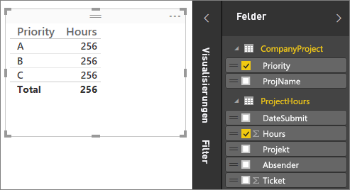
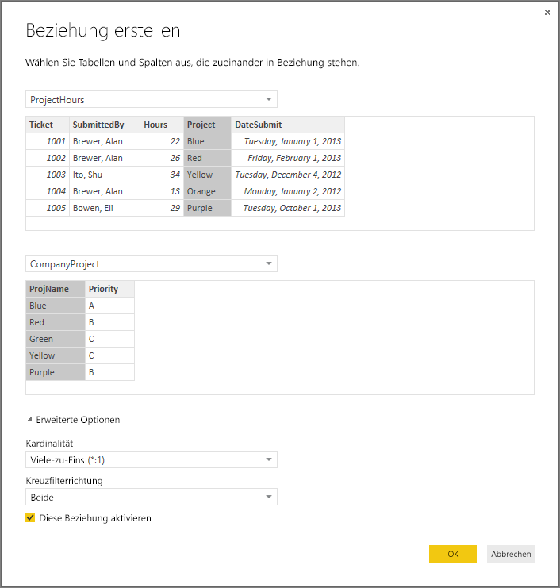
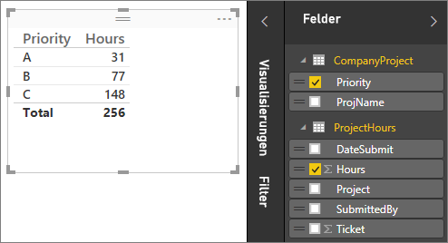
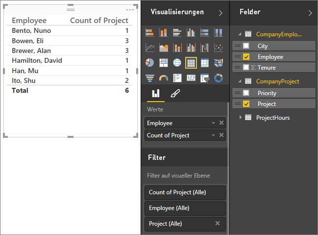
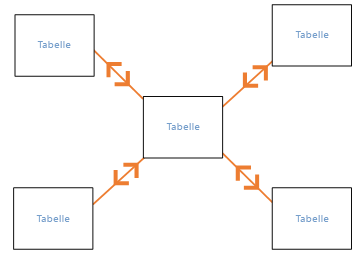
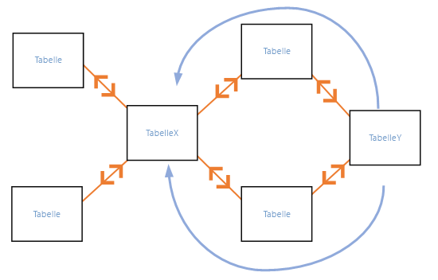
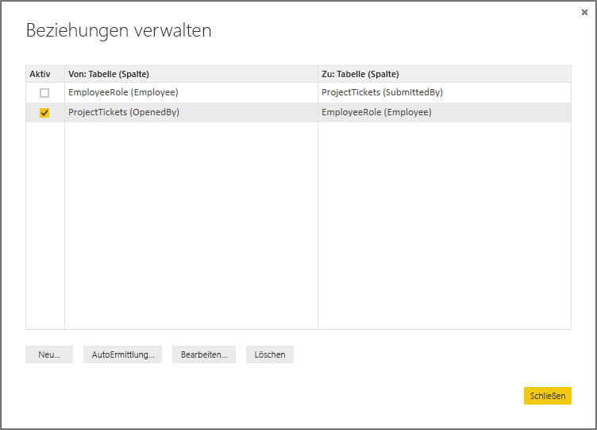
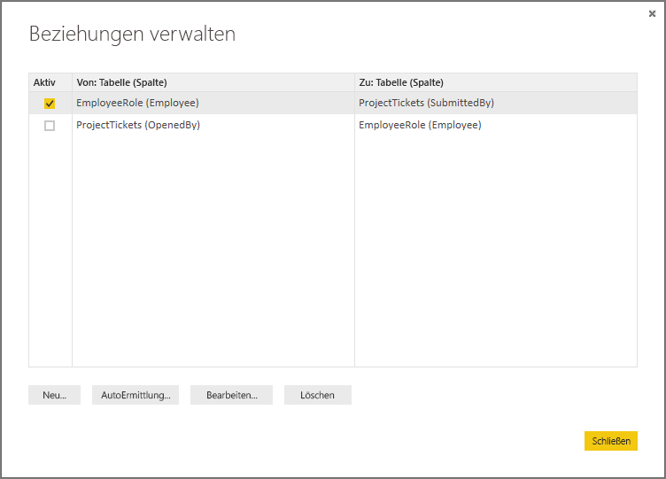

# Erstellen und Verwalten von Beziehungen in Power BI Desktop
Wenn Sie mehrere Tabellen importieren, werden Sie mit großer Wahrscheinlichkeit einige Analysen mit Daten aus allen diesen Tabellen durchführen. Beziehungen zwischen diesen Tabellen sind erforderlich, um die Ergebnisse genau zu berechnen und die richtigen Informationen in Ihren Berichten anzuzeigen. Mit Power BI Desktop können diese Beziehungen ganz leicht erstellt werden. Tatsächlich müssen Sie in den meisten Fällen keine weiteren Schritte unternehmen, da die AutoErmittlungsfunktion dies für Sie übernimmt. In einigen Fällen müssen Sie die Beziehungen jedoch möglicherweise selbst erstellen oder Änderungen an einer Beziehung vornehmen. In beiden Fällen ist es wichtig zu verstehen, wie Beziehungen in Power BI funktionieren und wie sie erstellt und bearbeitet werden.

## AutoErmittlung beim Laden
Wenn Sie zwei oder mehr Tabellen gleichzeitig abfragen, nachdem die Daten geladen sind, versucht Power BI Desktop, die Beziehungen zu finden und für Sie zu erstellen. Kardinalität, Kreuzfilterrichtung und aktive Eigenschaften werden automatisch festgelegt. Power BI Desktop untersucht die Spaltennamen in den abgefragten Tabellen, um festzustellen, ob mögliche Beziehungen vorhanden sind. Wenn Beziehungen vorhanden sind, werden sie automatisch erstellt. Wenn Power BI Desktop nicht mit hoher Zuverlässigkeit ermitteln kann, dass eine Übereinstimmung vorliegt, wird die Beziehung nicht automatisch erstellt. Sie können das Dialogfeld "Beziehungen verwalten" weiterhin dazu verwenden, Beziehungen zu erstellen oder zu bearbeiten.

## Erstellen einer Beziehung mit AutoErmittlung
Klicken Sie auf der Registerkarte **Start** auf **Beziehungen verwalten**\>**AutoErmittlung**.

## Manuelles Erstellen einer Beziehung
1. Klicken Sie auf der Registerkarte **Start** auf **Beziehungen verwalten**\>**Neu**.
2. Wählen Sie im Dialogfeld **Beziehung erstellen** in der ersten Dropdownliste für Tabellen eine Tabelle aus, und wählen Sie dann die Spalte aus, die Sie in der Beziehung verwenden möchten.
3. In der zweiten Dropdownliste für Tabellen wählen Sie die andere Tabelle aus, die in die Beziehung einbezogen werden soll. Wählen Sie dann die andere zu verwendende Spalte aus, und klicken Sie auf **OK**.

Standardmäßig konfiguriert Power BI Desktop automatisch die Kardinalität (Richtung), Kreuzfilterrichtung und aktiven Eigenschaften für die neue Beziehung. Sie können diese jedoch bei Bedarf unter "Erweiterte Optionen" ändern. Weitere Informationen finden Sie im Abschnitt "Informationen zu erweiterten Optionen" weiter unten in diesem Artikel.

## Bearbeiten einer Beziehung
1. Klicken Sie auf der Registerkarte **Start** auf **Beziehungen verwalten**.
2. Wählen Sie im Dialogfeld **Beziehungen verwalten** die Beziehung aus, und klicken Sie dann auf **Bearbeiten**.

## Konfigurieren der erweiterten Optionen
Beim Erstellen oder Bearbeiten einer Beziehung können Sie erweiterte Optionen konfigurieren.  Die erweiterten Optionen werden standardmäßig auf Basis einer bestmöglichen Schätzung automatisch konfiguriert. Dies kann für jede Beziehung auf Basis der in den Spalten enthaltenen Daten unterschiedlich verlaufen.

## Kardinalität
**N zu Eins (\*:1)** – Dies ist der am häufigsten verwendete Typ und somit der Standardtyp. Das bedeutet, dass die Spalte in einer Tabelle mehrere Instanzen eines Werts aufweisen kann, während die andere verknüpfte Tabelle, die häufig als Nachschlagetabelle bezeichnet wird, nur eine Instanz eines Werts besitzt.

**Eins zu Eins (1:1)** – Dies bedeutet, dass die Spalte in einer Tabelle nur eine Instanz eines bestimmten Werts aufweist, wobei die andere verknüpfte Tabelle ebenfalls nur eine Instanz eines bestimmten Werts besitzt.

Weitere Informationen über den geeigneten Zeitpunkt zum Ändern der Kardinalität finden Sie im Abschnitt "Informationen zu erweiterten Optionen" weiter unten in diesem Artikel.

## Kreuzfilterrichtung
**Beide** – Dies ist die am häufigsten verwendete und somit die Standardrichtung. Es bedeutet, dass beide Tabellen zu Filterzwecken so behandelt werden, als wären sie eine einzelne Tabelle.  Dies funktioniert problemlos mit einer einzelnen Tabelle, die über eine Reihe von Nachschlagetabellen verfügt, die sie umgeben.  Ein Beispiel dafür ist eine Tabelle von Ist-Umsatzwerten mit einer Nachschlagetabelle für Abteilung.  Dies wird häufig als Sternschema-Konfiguration bezeichnet (eine zentrale Tabelle mit mehreren Nachschlagetabellen).  Wenn Sie jedoch zwei oder mehr Tabellen haben, die ebenfalls über Nachschlagetabellen verfügen (wobei einige gemeinsam genutzt werden), empfiehlt es sich nicht, die Einstellung "Beide" zu verwenden.  Um mit dem vorherigen Beispiel fortzufahren: In diesem Fall Sie haben Sie auch eine Tabelle "Budgetverkauf", die das Zielbudget für jede Abteilung aufzeichnet.  Und die Abteilungstabelle ist sowohl mit der Umsatz- als auch mit der Budget-Tabelle verbunden.  Vermeiden Sie die Einstellung "Beide" für diese Art von Konfiguration.

**Einfach** – Dies bedeutet, dass Filteroptionen in verknüpften Tabellen auf die Tabelle angewendet werden, in der die Werte aggregiert werden. Wenn Sie eine Power Pivot-Tabelle in ein Datenmodell von Excel 2013 oder früher importieren, weisen alle Beziehungen nur eine Richtung auf. 

Weitere Informationen zum geeigneten Zeitpunkt zum Ändern der Kreuzfilterrichtung finden Sie im Abschnitt „Informationen zu erweiterten Optionen“, der später in diesem Artikel folgt.

## Aktivieren dieser Beziehung
Wenn dieses Kontrollkästchen aktiviert ist, bedeutet dies, dass die Beziehung als aktive Standardbeziehung dient.  Wenn zwischen zwei Tabellen mehrere Beziehungen vorhanden sind, bietet die aktive Beziehung Power BI Desktop eine Möglichkeit, automatisch visuelle Elemente zu erstellen, die beide Tabellen einbeziehen.

Weitere Informationen zum geeigneten Zeitpunkt zum Aktivieren einer bestimmten Beziehung finden Sie im Abschnitt „Informationen zu erweiterten Optionen“, der später in diesem Artikel folgt.

## Informationen zu Beziehungen
Nachdem Sie zwei Tabellen mit einer Beziehung verbunden haben, können Sie mit den Daten in beiden Tabellen arbeiten, als würde es sich um eine einzelne Tabelle handeln. Dadurch brauchen Sie sich nicht um Details der Beziehung kümmern oder diese Tabellen vor dem Importieren auf eine einzelne Tabelle reduzieren.  In vielen Situationen kann Power BI Desktop automatisch Beziehungen erstellen, sodass es möglicherweise für Sie nicht erforderlich ist, dies selbst zu tun. Wenn jedoch Power BI Desktop nicht mit hoher Zuverlässigkeit feststellen kann, dass eine Beziehung zwischen den beiden Tabellen besteht, wird die Beziehung nicht automatisch erstellt. In diesem Fall müssen Sie die Beziehung zu erstellen.   

Führen wir ein kurzes Lernprogramm durch, um Ihnen besser zu vermitteln, wie Beziehungen in Power BI Desktop funktionieren.

>[!TIP]
>Sie können diese Lektion selbst durchführen. Kopieren Sie die nachfolgende Tabelle „Projektstunden“ in ein Excel-Arbeitsblatt, wählen Sie alle Zellen aus, und klicken Sie auf **EINFÜGEN**\>**Tabelle**. Klicken Sie im Dialogfeld **Tabelle erstellen** einfach auf **OK**. Nehmen Sie dann im Feld **Tabellenname**die Eingabe **Projektstunden**vor. Gehen Sie für die Tabelle „UnternehmenProjekt“ auf dieselbe Weise vor. Sie können die Daten dann mithilfe der Option **Daten abrufen** in Power BI-Desktop importieren. Wählen Sie die Arbeitsmappe und Tabellen als Datenquelle aus.

Diese erste Tabelle, „Projektstunden“, stellt einen Datensatz von Arbeitstickets dar, der die Anzahl der Stunden aufzeichnet, die eine Person an einem bestimmten Projekt gearbeitet hat.  

**Projektstunden**

| **Ticket** | **Absender** | **Stunden** | **Projekt** | **Sendedatum** |
| ---:|:--- | ---:|:--- | ---:|
| 1001 |Brewer, Alan |22 |Blau |1/1/2013 |
| 1002 |Brewer, Alan |26 |Rot |2/1/2013 |
| 1003 |Ito, Shu |34 |Gelb |12/4/2012 |
| 1004 |Brewer, Alan |13 |Orange |1/2/2012 |
| 1005 |Bowen, Eli |29 |Violett |10/1/2013 |
| 1006 |Bento, Nuno |35 |Grün |2/1/2013 |
| 1007 |Hamilton, David |10 |Gelb |10/1/2013 |
| 1008 |Han, Mu |28 |Orange |1/2/2012 |
| 1009 |Ito, Shu |22 |Violett |2/1/2013 |
| 1010 |Bowen, Eli |28 |Grün |10/1/2013 |
| 1011 |Bowen, Eli |9 |Blau |10/15/2013 |

Diese zweite Tabelle, „UnternehmenProjekt“, stellt eine Liste von Projekten mit zugeordneter Priorität dar: A, B oder C. 

**UnternehmenProjekt**

| **Projektname** | **Priorität** |
| --- | --- |
| Blau |A |
| Rot |B |
| Grün |C |
| Gelb |C |
| Violett |B |
| Orange |C |

Beachten Sie, dass jede Tabelle eine Projektspalte besitzt. Die Benennung ist etwas unterschiedlich, aber die Werte scheinen gleich zu sein. Das ist wichtig, und wir kommen in Kürze darauf zurück.

Nachdem wir die beiden Tabellen in ein Modell importiert haben, erstellen wir einen Bericht. Zuerst möchten wir die Anzahl der nach Projektpriorität übermittelten Stunden erhalten. Daher wählen wir unter „Felder“ **Priorität** und **Stunden** aus.

 

Wenn Sie unsere Tabelle im Berichtszeichenbereich betrachten, sehen Sie, dass die Anzahl der Stunden **256,00** für jedes Projekt ergibt, was außerdem auch der Summe entspricht. Natürlich ist dies nicht korrekt. Warum? Der Grund hierfür ist, dass es nicht möglich ist, aus Werten einer Tabelle (Stunden in der Tabelle „Projekt“), die durch Werte in einer anderen Tabelle („Priorität“ in der Tabelle „UnternehmenProjekt“) segmentiert werden, ohne eine Beziehung zwischen diesen beiden Tabellen eine Endsumme zu berechnen.

Erstellen wir daher eine Beziehung zwischen diesen beiden Tabellen.

Erinnern Sie sich an die Spalten, die in beiden Tabellen mit einem Projektnamen vorhanden waren, jedoch mit anscheinend gleichen Werten? Wir werden diese beiden Spalten verwenden, um eine Beziehung zwischen den Tabellen zu erstellen.

Warum diese Spalten? Wenn wir die Spalte „Projekt“ in der Tabelle „Projektstunden“ betrachten, sehen wir Werte wie „Blau“, „Rot“, „Gelb“, „Orange“ usw. Tatsächlich sehen wir mehrere Zeilen, die denselben Wert enthalten. Tatsächlich liegen viele Farbwerte für „Projekt“ vor.

Wenn wir die Spalte „Projektname“ in der Tabelle „UnternehmenProjekt“ betrachten, ist dort nur einer der einzelnen Farbwerte für „Projekt“ vorhanden. Jeder Farbwert in dieser Tabelle ist eindeutig, und das ist wichtig, da zwischen diesen beiden Tabellen eine Beziehung erstellt werden kann. In diesem Fall eine n:1-Beziehung. In einer n:1-Beziehung muss mindestens eine Spalte in einer der Tabellen eindeutige Werte enthalten. Es gibt für einige Beziehungen erweiterte Optionen, die wir später betrachten. Zunächst jedoch erstellen wir eine Beziehung zwischen den Spalten „Projekt“ Spalten in den beiden Tabellen.

### So erstellen Sie eine neue Beziehung
1. Klicken Sie auf **Beziehungen verwalten**.
2. In **Beziehungen verwalten**klicken Sie auf **Neu**. Daraufhin wird das Dialogfeld **Beziehung erstellen** geöffnet, in dem die für unsere Beziehung gewünschten Tabellen, Spalten und erweiterten Einstellungen ausgewählt werden können.
3. Wählen Sie in der ersten Tabelle **Projektstunden**und dann die Spalte **Projekt** aus. Das ist die n-Seite („viele“) unserer Beziehung.
4. Wählen Sie in der zweiten Tabelle **UnternehmenProjekt**und dann die Spalte **Projektname** aus. Dies ist die 1-Seite unserer Beziehung.  
5. Fahren Sie fort, und klicken Sie sowohl im Dialogfeld **Beziehung erstellen** als auch im Dialogfeld **Beziehungen verwalten** auf **OK** .

Im Interesse der vollständigen Offenlegung wurde diese Beziehung soeben auf manuelle Weise erstellt. Wir hätten auch einfach im Dialogfeld „Beziehungen verwalten“ auf die Schaltfläche „AutoErmittlung“ klicken können. Tatsächlich würde die AutoErmittlung dies bereits beim Laden der Daten für Sie erledigen, wenn beide Spalten den gleichen Namen haben. Aber wo bleibt da die Herausforderung?

Betrachten wir die Tabelle jetzt erneut im Berichtszeichenbereich.

 

Das sieht doch schon viel besser aus, oder?

Wenn wir die Stunden nach Priorität addieren, sucht Power BI Desktop nach jeder Instanz der eindeutigen Farbwerte in der Nachschlagetabelle „UnternehmenProjekt“ und dann nach jeder Instanz dieser Werte in der Tabelle „UnternehmenProjekt“, um dann für jeden eindeutigen Wert die Endsumme zu berechnen.

Das war doch ziemlich einfach, und mithilfe der AutoErmittlung wäre es noch einfacher gewesen.

## Informationen zu erweiterten Optionen
Wenn eine Beziehung entweder mithilfe der AutoErmittlung oder manuell erstellt wird, konfiguriert Power BI Desktop die erweiterten Optionen automatisch auf Basis der Daten in Ihren Tabellen. Sie können erweiterte Beziehungseigenschaften konfigurieren, indem Sie im Dialogfeld „Beziehung erstellen/bearbeiten“ die Option „Erweiterte Optionen“ erweitern.

 

Wie bereits erwähnt, werden diese in der Regel automatisch festgelegt, und Sie müssen sich nicht darum kümmern. Es gibt jedoch verschiedene Situationen, in denen Sie die erweiterten Optionen möglicherweise selbst konfigurieren möchten.

## Zukünftige Updates für die Daten erfordern eine andere Kardinalität
Normalerweise kann Power BI Desktop automatisch die beste Kardinalität für die Beziehung bestimmen.  Wenn Sie jedoch die automatische Einstellung außer Kraft setzen müssen, weil Sie wissen, dass sich die Daten in der Zukunft ändern, können Sie die Auswahl über das Steuerelement „Kardinalität“ vornehmen. Betrachten wir ein Beispiel, in dem wir eine andere Kardinalität auswählen müssen.

Die nachfolgende Tabelle „UnternehmenPriorität“ stellt eine Liste aller UnternehmenProjekte und deren Priorität dar. Die Tabelle „Projektbudget“ umfasst die Projekte, deren Budget genehmigt wurde.

**Projektbudget**

| **Genehmigte Projekte** | **Budgetzuteilung** | **Zuteilungsdatum** |
|:--- | ---:| ---:|
| Blau |40,000 |12/1/2012 |
| Rot |100,000 |12/1/2012 |
| Grün |50,000 |12/1/2012 |

**UnternehmenProjektPriorität**

| **Projekt** | **Priorität** |
| --- | --- |
| Blau |A |
| Rot |B |
| Grün |C |
| Gelb |C |
| Violett |B |
| Orange |C |

Wenn wir zwischen der Spalte „Projekt“ in der Tabelle „UnternehmenProjektPriorität“ und der Spalte „Genehmigte Projekte“ in der Tabelle „Projektbudget“ wie folgt eine Beziehung erstellen:

 

wird für die Kardinalität automatisch Eins-zu-Eins („1: 1“) und für die Kreuzfilterrichtung „Beide“ festgelegt (wie dargestellt).  Dies liegt daran, dass für Power BI Desktop die beste Kombination aus beiden Tabellen tatsächlich wie folgt aussieht:

| **Projekt** | **Priorität** | **Budgetzuteilung** | **Zuteilungsdatum** |
|:--- | --- | ---:| ---:|
| Blau |A |40,000 |12/1/2012 |
| Rot |B |100,000 |12/1/2012 |
| Grün |C |50,000 |12/1/2012 |
| Gelb |C |  |  |
| Violett |B |  |  |
| Orange |C |  |  |

Zwischen den beiden Tabellen besteht eine 1:1-Beziehung, da in der Spalte „Projekt“ der kombinierten Tabelle keine sich wiederholenden Werte enthalten sind. Die Spalte „Projekt“ ist eindeutig, da jeder Wert nur einmal auftritt. Daher können die Zeilen der beiden Tabellen ohne Duplizierung direkt kombiniert werden.

Aber angenommen, Sie wissen, dass die Daten bei der nächsten Aktualisierung geändert werden. Eine aktualisierte Version der Tabelle „Projektbudgeet“ weist jetzt zusätzliche Zeilen für „Blau“ und „Rot“ auf:

**Projektbudget**

| **Genehmigte Projekte** | **Budgetzuteilung** | **Zuteilungsdatum** |
| --- | ---:| ---:|
| Blau |40,000 |12/1/2012 |
| Rot |100,000 |12/1/2012 |
| Grün |50,000 |12/1/2012 |
| Blau |80,000 |6/1/2013 |
| Rot |90,000 |6/1/2013 |

 Das bedeutet, dass die beste Kombination der beiden Tabellen jetzt tatsächlich wie folgt aussieht: 

| **Projekt** | **Priorität** | **Budgetzuteilung** | **Zuteilungsdatum** |
| --- | --- | ---:| ---:|
| Blau |A |40,000 |12/1/2012 |
| Rot |B |100,000 |12/1/2012 |
| Grün |C |50,000 |12/1/2012 |
| Gelb |C |  |  |
| Violett |B |  |  |
| Orange |C |  |  |
| Blau |A |80000 |6/1/2013 |
| Rot |B |90000 |6/1/2013 |

In dieser neuen kombinierten Tabelle weist die Spalte „Projekt“ sich wiederholende Werte auf.  Die beiden ursprünglichen Tabellen weisen nach der Aktualisierung der Tabelle keine 1:1-Beziehung auf. Da wir wissen, dass zukünftige Updates in diesem Fall dazu führen, dass die Spalte „Projekt“ Duplikate enthält, möchten wir für die Kardinalität eine n:1-Beziehung (\*:1) festlegen, wobei sich die n-Seite auf der „Projektbudget“-Seite und die 1-Seite auf der „UnternehmenProjekt“-Seite befinden soll.

## Anpassen der Kreuzfilterrichtung für einen komplexen Satz von Tabellen von Beziehungen
Für die meisten Beziehungen wird die Kreuzfilterrichtung auf „Beide“ festgelegt.  Es gibt jedoch einige eher unübliche Umstände, unter denen Sie möglicherweise nicht die Standardoption festlegen, z. B. beim Importieren eines Modells, das mit einer älteren Version von Power Pivot erstellt wurde, in dem für jede Beziehung die Richtung „Einfach“ festgelegt ist. 

Mithilfe der Einstellung „Beide“ kann Power BI Desktop alle Aspekte von verknüpften Tabellen so behandeln, als würde es sich um eine einzelne Tabelle handeln.  Es gibt jedoch einige Situationen, in denen Power BI Desktop für die Kreuzfilterrichtung einer Beziehung nicht „Beide“ festlegen kann und es für Berichtszwecke außerdem einen eindeutigen Satz von Standardwerten zur Verfügung stellen muss. Wenn für die Kreuzfilterrichtung der Beziehung nicht „Beide“ festlegt wird, liegt dies in der Regel daran, dass dies zur Mehrdeutigkeit führen würde.  Wenn die Standardeinstellung für die Kreuzfilterrichtung für Sie nicht geeignet ist, versuchen Sie, sie in Richtung einer bestimmten Tabelle oder auf „Beide“ festzulegen.

Die Kreuzfilterrichtung „Einfach“ funktioniert in vielen Situationen.  Wenn Sie ein Modell von Power Pivot in Excel 2013 oder älter importiert haben, wird für alle Beziehungen tatsächlich die Richtung „Einfach“ festgelegt.  Die Richtung „Einfach“ bedeutet, dass die Filteroptionen in verknüpften Tabellen für die Tabelle gelten, in der die Aggregation erfolgt.  Gelegentlich kann es schwierig sein, die Kreuzfilterung zu verstehen, daher betrachten wir dazu ein Beispiel.

 

Bei der Kreuzfilterungsrichtung „Einfach“ können Sie einen Bericht erstellen, der die Projektstunden addiert. Dann können Sie nach „UnternehmenProjekt“, „Priorität“ oder „UnternehmenMitarbeiter“, „Ort“ zusammenfassen (oder filtern).   Wenn Sie jedoch die Anzahl der Mitarbeiter pro Projekt zählen möchten (eine seltenere Fragestellung) , funktioniert das nicht. Sie erhalten eine Spalte mit Werten, die alle identisch sind.  Im nachfolgenden Beispiel wird für beide Beziehungen für die Kreuzfilterrichtung die Option „Einfach“ mit Bezug auf die Tabelle „Projektstunden“ festgelegt:

 

Die Filterspezifikation verläuft von „UnternehmenProjekt“ zu „UnternehmenMitarbeiter“ (wie in der nachfolgenden Abbildung veranschaulicht), aber sie gelangt nicht hinauf zu „UnternehmenMitarbeiter“.  Dies funktioniert jedoch, wenn Sie für die Kreuzfilterrichtung „Beide“ festlegen.  Die Einstellung „Beide“ ermöglicht es der Filterspezifikation, zu „Mitarbeiter“ zu gelangen.

 

Wenn für die Kreuzfilterrichtung „Beide“ festgelegt ist, werden unsere Berichte jetzt ordnungsgemäß angezeigt:

 

Die Kreuzfilterrichtung „Beide“ ist gut für Tabellenbeziehungen geeignet, deren Struktur der obigen ähnelt. Dies wird meist als Sternschema bezeichnet, ebenso wie das Folgende:

 

Die Kreuzfilterrichtung ist nicht für allgemeinere Strukturen geeignet, die sich häufig in Datenbanken wie dem folgenden Diagramm finden:

 

Wenn eine solche Tabellenstruktur mit Schleifen vorliegt, kann die Kreuzfilterung zu mehrdeutigen Beziehungssätzen führen. Wenn Sie z. B. ein Feld aus Tabelle „X“ zusammenfassen und anschließend nach einem Feld in Tabelle „Y“ filtern, dann ist nicht eindeutig, wie der Filter verlaufen soll, denn er kann die obere oder untere Tabelle durchqueren. Ein allgemeines Beispiel für diese Art von Struktur ist Tabelle „X“ als Umsatztabelle mit Ist-Umsatzdaten und Tabelle „Y“ mit Budgetdaten. Die Tabellen in der Mitte sind dann Nachschlagetabellen, die von beiden Tabellen genutzt werden, wie z. B. Division oder Region. 

Wie bei aktiven/inaktiven Beziehungen gestattet es Power BI Desktop nicht, für eine Beziehung „Beide“ festzulegen, wenn dies im Bericht zur Uneindeutigkeit führt. Es gibt verschiedene andere Möglichkeiten, wie Sie damit zurecht kommen. Dies sind die beiden am häufigsten verwendeten Methoden:

* Löschen Sie Beziehungen, oder markieren Sie sie als „inaktiv“, um die Mehrdeutigkeit zu reduzieren. Dann können Sie für die Kreuzfilterrichtung einer Beziehung möglicherweise die Option „Beide“ festlegen.
* Führen Sie die Tabelle zweimal zu (beim zweiten Mal unter anderem Namen), um Schleifen zu beseitigen.  Dadurch erhält die Struktur der Beziehungen ein Sternschema.  Bei einem Sternschema kann für alle Beziehungen die Option „Beide“ festgelegt werden.

## Falsche aktive Beziehung
Bei der automatischen Erstellung von Beziehungen stellt Power BI Desktop manchmal fest, dass zwischen zwei Tabellen mehrere Beziehungen vorliegen.  In diesem Fall wird nur eine der Beziehungen als „aktiv“ festgelegt.  Die aktive Beziehung dient als Standardbeziehung, sodass Power BI Desktop automatisch eine Visualisierung für Sie erstellen kann, wenn Sie Felder aus zwei verschiedenen Tabellen auswählen.  In einigen Fällen kann die automatisch ausgewählte Beziehung jedoch auch falsch sein.  Über das Dialogfeld „Beziehungen verwalten“ können Sie eine Beziehung als „aktiv“ oder „inaktiv“ festlegen. Sie können die aktive Beziehung auch im Dialogfeld „Beziehung bearbeiten“ festlegen. 

Um sicherzustellen, dass eine Standardbeziehung vorhanden ist, gestattet Power BI Desktop gleichzeitig jeweils nur eine aktive Beziehung zwischen zwei Tabellen.  Daher müssen Sie zuerst die aktuelle Beziehung als „inaktiv“ festlegen und dann für die gewünschte Beziehung den Status „aktiv“ auswählen.

Betrachten wir dazu ein Beispiel. Die erste Tabelle ist „ProjektTickets“ und die zweite „MitarbeiterFunktion“.

**ProjektTickets**

| **Ticket** | **GeöffnetVon** | **Absender** | **Stunden** | **Projekt** | **Sendedatum** |
| ---:|:--- |:--- | ---:|:--- | ---:|
| 1001 |Perham, Tom |Brewer, Alan |22 |Blau |1/1/2013 |
| 1002 |Roman, Daniel |Brewer, Alan |26 |Rot |2/1/2013 |
| 1003 |Roth, Daniel |Ito, Shu |34 |Gelb |12/4/2012 |
| 1004 |Perham, Tom |Brewer, Alan |13 |Orange |1/2/2012 |
| 1005 |Roman, Daniel |Bowen, Eli |29 |Violett |10/1/2013 |
| 1006 |Roth, Daniel |Bento, Nuno |35 |Grün |2/1/2013 |
| 1007 |Roth, Daniel |Hamilton, David |10 |Gelb |10/1/2013 |
| 1008 |Perham, Tom |Han, Mu |28 |Orange |1/2/2012 |
| 1009 |Roman, Daniel |Ito, Shu |22 |Violett |2/1/2013 |
| 1010 |Roth, Daniel |Bowen, Eli |28 |Grün |10/1/2013 |
| 1011 |Perham, Tom |Bowen, Eli |9 |Blau |10/15/2013 |

**Mitarbeiterfunktion**

| **Mitarbeiter** | **Funktion** |
| --- | --- |
| Bento, Nuno |Projektmanager |
| Bowen, Eli |Projektleiter |
| Brewer, Alan |Projektmanager |
| Hamilton, David |Projektleiter |
| Han, Mu |Projektleiter |
| Ito, Shu |Projektleiter |
| Perham, Tom |Projektträger |
| Roman, Daniel |Projektträger |
| Roth, Daniel |Projektträger |

Es gibt hier eigentlich zwei Beziehungen. Eine Beziehung zwischen „Absender“ in der Tabelle „ProjektTickets“ und „Mitarbeiter“ in der Tabelle „MitarbeiterFunktion“, und die andere Beziehung zwischen „GeöffnetVon“ in der Tabelle „ProjektTickets“ und „Mitarbeiter“ in der Tabelle „MitarbeiterFunktion“.

 

Wenn beide Beziehungen zum Modell hinzugefügt werden (zuerst „GeöffnetVon“), zeigt das Dialogfeld „Beziehungen verwalten“, dass „GeöffnetVon“ aktiv ist:

 

Wenn jetzt ein Bericht erstellt wird, der die Felder „Funktion“ und „Mitarbeiter“ aus „MitarbeiterFunktion“ und das Feld „Stunden“ aus „ProjektTickets“ in einer Tabellenvisualisierung im Berichtszeichenbereich verwendet, dann werden ausschließlich Projektträger angezeigt, da sie als Einzige ein Projektticket geöffnet haben.

 

Die aktive Beziehung kann geändert und „Absender“ anstelle von „GeöffnetVon“ abgerufen werden. Unter „Beziehungen verwalten“ wird die Beziehung „ProjektTickets(GeöffnetVon)“ zu „MitarbeiterFunktion(Mitarbeiter)“ deaktiviert und anschließend die Beziehung „ProjektTickets(Absender)“ zu „MitarbeiterFunktion(Mitarbeiter)“ aktiviert.

## Anzeigen aller Beziehungen in der Beziehungsansicht
Ihr Modell umfasst manchmal mehrere Tabellen und komplexe Beziehungen zwischen ihnen. In der Beziehungsansicht in Power BI Desktop werden alle Beziehungen in Ihrem Modell sowie ihre Richtung und Kardinalität in einem leicht verständlichen und anpassbaren Diagramm angezeigt. Weitere Informationen finden Sie unter [Beziehungsansicht in Power BI Desktop](desktop-relationship-view.md).

