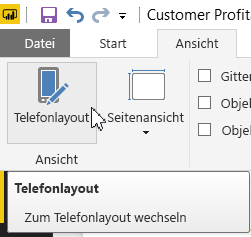
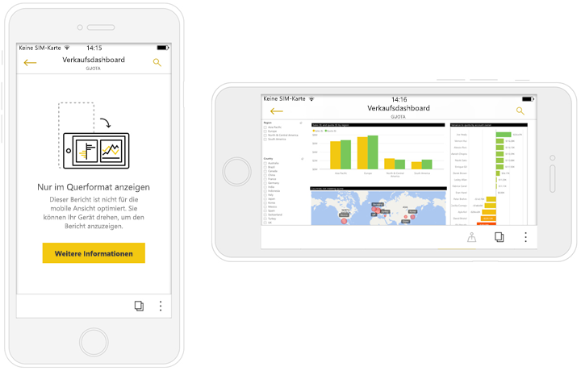

# Berichtsoptimierung für den mobilen Power BI-apps
Sie können die Benutzeroberfläche zum Anzeigen von Berichten in den mobilen apps durch Erstellen eines Layouts Hochformat verbessern. In Power BI Desktop und Power BI-Dienst können Sie neu anordnen und Ändern der Größe berichtsvisuals für eine optimale Leistung im Hochformatmodus ausgeführt.  

Suchen Sie nach Informationen zum Anzeigen von Berichten auf einem mobilen Gerät stattdessen? Versuchen Sie es in dieser schnellstartanleitung [untersuchen Sie Dashboards und Berichte in den mobilen Power BI-apps](consumer/mobile/mobile-apps-quickstart-view-dashboard-report.md).

Außerdem können Sie erstellen [ *reaktionsfähig* Visuals](#optimize-a-visual-for-any-size) und [dynamische Datenschnitte](#enhance-slicers-to-work-well-in-phone-reports) , das Ändern der Größe und eine beliebige Stelle. Wenn Sie dem Bericht Filter hinzufügen, werden sie automatisch in den optimierten Bericht.

## Erstellen des Layouts für die Hochformatversion einer Berichtsseite

Nachdem Sie einen Bericht erstellt haben, können Sie ihn für Smartphones und Tablets optimieren.

1. Wählen Sie in der Berichtsansicht von Power BI Desktop auf der Registerkarte **Ansicht** **Telefonlayout** aus.  
   
    
   
    Wählen Sie im Power BI-Dienst **Bericht bearbeiten** > **Layout auf Mobilgeräten** aus.

    Sie sehen eine leere Canvas mit der Form eines Smartphones. Im Bereich „Visualisierungen“ auf der rechten Seite werden alle visuellen Elemente aufgeführt, die auf der ursprünglichen Berichtsseite vorhanden sind.

3. Um dem Smartphonelayout ein visuelles Element hinzuzufügen, ziehen Sie es aus dem Bereich „Visualisierungen“ in den Smartphonezeichenbereich.
   
    Für Smartphoneberichte wird ein Rasterlayout verwendet. Wenn Sie visuelle Elemente in den Mobilgeräte-Zeichenbereich ziehen, werden sie an diesem Raster ausgerichtet.
   
    
   
    Sie können der Smartphoneberichtsseite einige oder alle visuellen Elemente der Masterberichtsseite hinzufügen. Jedes visuelle Element kann nur einmal hinzugefügt werden. Sie müssen nicht alle visuellen Elemente enthalten.

4. Sie können die Größe der visuellen Elemente im Raster auf die gleiche Weise ändern wie Kacheln in Dashboards und mobilen Dashboards.
   
   Die Größe des Berichtsrasters wird an die Größe des Smartphones angepasst. Daher wird der Bericht auf Smartphones mit kleinem Bildschirm und auf Smartphones mit großem Bildschirm gleichermaßen gut dargestellt.
   
   

## Optimieren eines Visuals für eine beliebige Größe
Sie können die visuellen Elemente in Ihrem Dashboard oder Bericht so einstellen, dass sie *dynamisch* sind. Sie können sich dynamisch ändern, um unabhängig von der Bildschirmgröße eine möglichst große Menge an Daten und Erkenntnissen anzuzeigen. 

Wenn Sie die Größe des visuellen Elements ändern, hat die Datenansicht in Power BI die höchste Priorität. Beispielsweise kann die Auffüllung entfernt und die Legende über das visuelle Element verschoben werden, damit es auch bei einer Verkleinerung relevant bleibt.

Die Dynamik wird für jedes Visual separat festgelegt. Erfahren Sie mehr über das [Optimieren von Visuals](visuals/desktop-create-responsive-visuals.md).

## Überlegungen zum Erstellen von Smartphoneberichtslayouts
* Sie können für Berichte mit mehreren Seiten alle Seiten oder nur einige Seiten optimieren. 
* Wenn Sie eine Hintergrundfarbe für eine Berichtsseite festgelegt haben, hat der Smartphonebericht dieselbe Hintergrundfarbe.
* Es ist nicht möglich, die Formatierungsoptionen speziell für das Smartphone zu ändern. Masterlayouts und Mobilgerätelayouts weisen eine einheitliche Formatierung auf. Beispielsweise sind die Schriftgrade identisch.
* Wenn Sie ein visuelles Element ändern möchten, z. B. seine Formatierung, das Dataset, Filter oder ein beliebiges anderes Attribut, müssen Sie dies im regulären Berichterstellungsmodus durchführen.
* Von Power BI werden Standardtitel und -seitennamen für Smartphoneberichte in der mobilen App bereitgestellt. Wenn Sie visuelle Textelemente für Titel und Seitennamen im Bericht erstellt haben, ist es möglicherweise sinnvoll, sie nicht den Smartphoneberichten hinzuzufügen.     

## Entfernen eines visuellen Elements aus dem Smartphonelayout
* Um ein visuelles Element zu entfernen, klicken Sie auf das X oben rechts im Smartphonezeichenbereich, oder wählen Sie das visuelle Element aus, und klicken Sie auf **Löschen**.
  
   Wenn Sie das Visual hier entfernen, wird es nur aus dem Zeichenbereich für das Telefonlayout entfernt. Dies hat keine Auswirkungen auf das Visual und den ursprünglichen Bericht.
  
   

## Optimieren von Datenschnitten für Smartphoneberichte
Datenschnitte ermöglichen das Filtern von Berichtsdaten im Zeichenbereich. Wenn Sie Datenschnitte im regulären Berichterstellungsmodus entwerfen, können Sie einige Datenschnitteinstellungen ändern, um sie für Smartphoneberichte anzupassen:

* Legen Sie fest, ob Leser des Berichts ein oder mehrere Elemente auswählen können.
* Fügen Sie einen Rahmen um den Datenschnitt hinzu, um den Bericht übersichtlicher zu machen.
* Sie können festlegen, ob Datenschnitte vertikal, horizontal oder *dynamisch* sind. 

Wenn Sie den Datenschnitt als dynamisch konfigurieren, werden beim Ändern der Größe und Form mehr oder weniger Optionen angezeigt. Er kann groß oder klein, breit oder schmal sein. Wenn Sie ihn sehr klein machen, wird er nur als Filtersymbol auf der Berichtsseite angezeigt. 

Weitere Informationen zum [Erstellen von dynamischen Datenschnitten](power-bi-slicer-filter-responsive.md).

## Veröffentlichen eines Smartphoneberichts
* Zum Veröffentlichen der Smartphoneversion eines Berichts [veröffentlichen Sie den Hauptbericht von Power BI Desktop aus im Power BI-Dienst](desktop-upload-desktop-files.md). Gleichzeitig wird die Smartphoneversion veröffentlicht.
  
    Erfahren Sie mehr über [Freigaben und Berechtigungen in Power BI](service-how-to-collaborate-distribute-dashboards-reports.md).

## Anzeigen optimierter und nicht optimierter Berichte auf einem Smartphone oder Tablet
Power BI erkennt in den mobilen Apps auf Smartphones automatisch optimierte und nicht optimierte Smartphoneberichte. Wenn ein für das Smartphone optimierter Bericht vorhanden ist, öffnet die Power BI-Smartphone-App den Bericht automatisch im Smartphoneberichtsmodus.

Wenn kein für das Smartphone optimierter Bericht vorhanden ist, wird der Bericht in der nicht optimierten Querformatansicht geöffnet.  

Durch Ändern der Ausrichtung des Smartphones in das Querformat wird der Bericht in der nicht optimierten Ansicht mit dem ursprünglichen Berichtslayout geöffnet, auch wenn er optimiert ist.

Wenn Sie nur einige Seiten optimieren, wird in der Hochformatansicht eine Meldung angezeigt, die den Lesern mitteilt, dass der Bericht im Querformat verfügbar ist.

Leser des Berichts können die Ausrichtung ihres Smartphones oder Tablets ändern, um den Bericht im Querformat anzuzeigen. Hier erfahren Sie mehr über das [Interagieren mit Power BI-Berichten, die für das Hochformat optimiert sind](consumer/mobile/mobile-apps-view-phone-report.md).

## Nächste Schritte
* [Erstellen einer Telefonansicht eines Dashboards in Power BI](service-create-dashboard-mobile-phone-view.md)
* [Anzeigen von Power BI-Berichten, die für das Smartphone optimiert sind](consumer/mobile/mobile-apps-view-phone-report.md)
* [Erstellen von dynamischen Visuals, die für eine beliebige Größe optimiert sind](visuals/desktop-create-responsive-visuals.md)
* Weitere Fragen? [Stellen Sie Ihre Frage in der Power BI-Community.](http://community.powerbi.com/)

