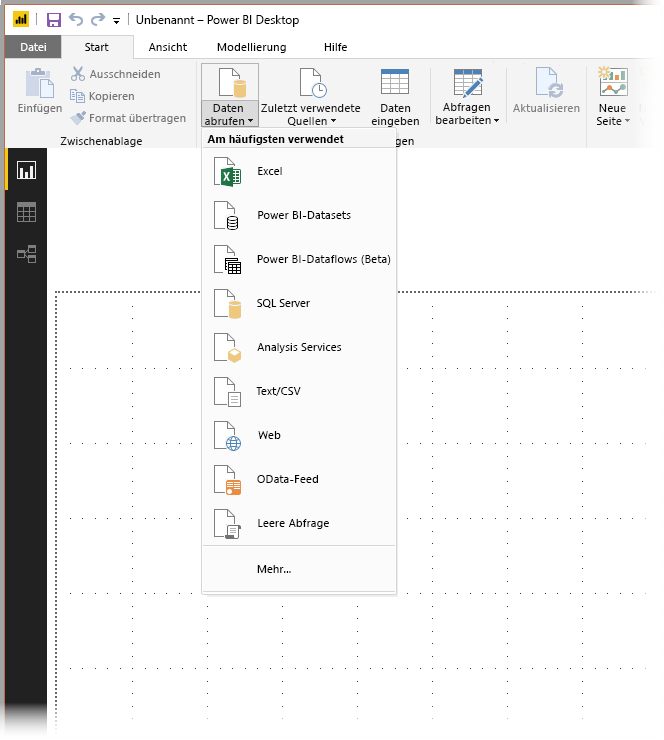
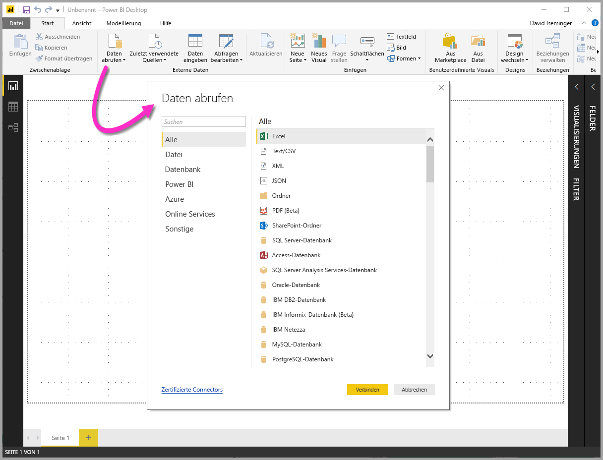
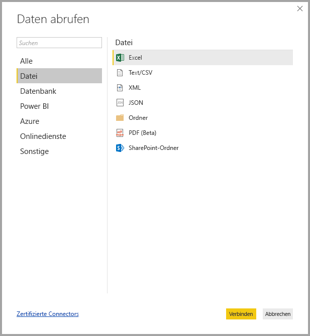
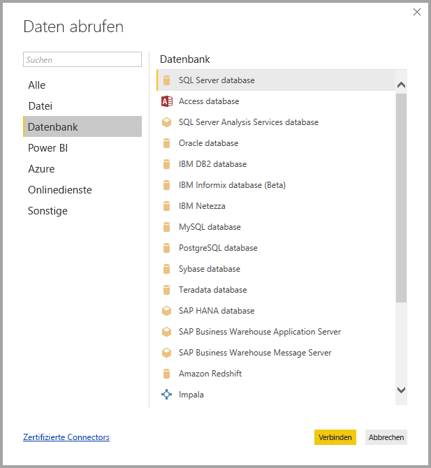
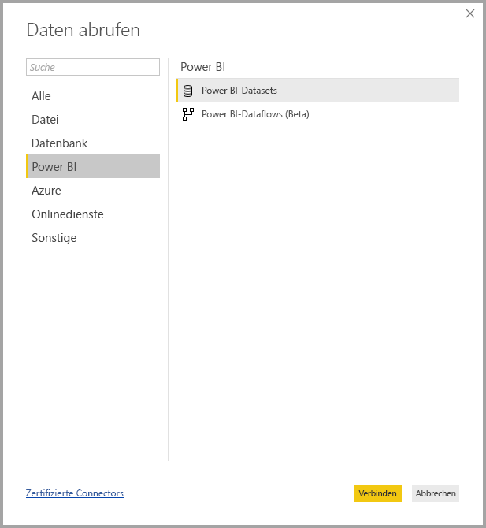
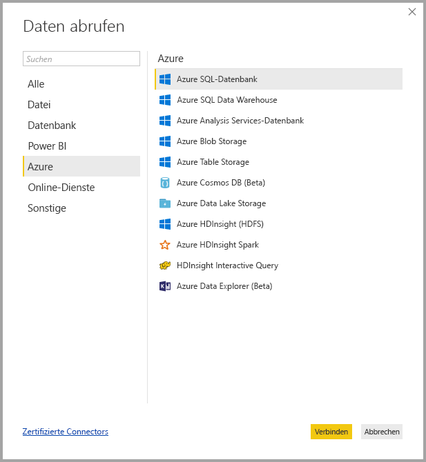
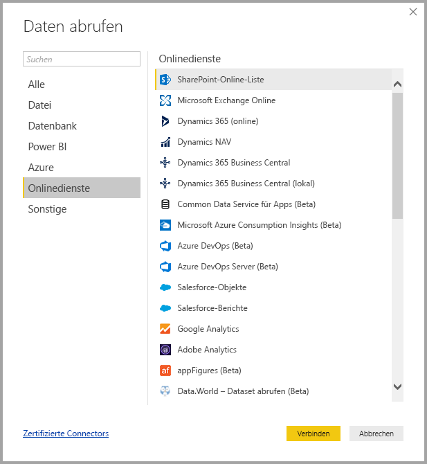

# Datenquellen in Power BI Desktop
Mit Power BI Desktop können Sie Verbindungen mit Daten aus vielen verschiedenen Quellen herstellen. Eine vollständige Liste der verfügbaren Datenquellen wird am unteren Rand dieser Seite angezeigt.

Wählen Sie zum Herstellen einer Verbindung mit Daten im Menüband **Start** den Eintrag **Daten abrufen** aus. Wenn Sie den Pfeil nach unten oder den Text **Daten abrufen** auf der Schaltfläche auswählen, wird das Datentypmenü **Am häufigsten verwendet** angezeigt, das in der folgenden Abbildung veranschaulicht wird:

Wenn Sie die Option **Mehr...** im Menü **Am häufigsten verwendet** auswählen, wird das Fenster **Daten abrufen** angezeigt. Sie können das Fenster **Daten abrufen** auch durch direktes Auswählen der **Symbolschaltfläche** **Daten abrufen** öffnen (und das Menü **Am häufigsten verwendet** umgehen).

> [!NOTE]
> Das Power BI-Team erweitert laufend die Datenquellen, die für **Power BI Desktop** und den **Power BI-Dienst** verfügbar sind. Daher finden Sie häufig Vorabversionen von noch nicht in der Endversion vorliegenden Datenquellen, die als *Beta* oder *Vorschau* gekennzeichnet sind. Für alle als *Beta* oder *Vorschau* markierten Datenquellen stehen nur eingeschränkter Support und weniger Funktionen zur Verfügung, und sie sollten nicht in Produktionsumgebungen verwendet werden.

## Datenquellen
Datentypen werden in die folgenden Kategorien unterteilt:

* Alles
* Datei
* Datenbank
* Power BI
* Azure
* Online-Dienste
* Sonstige

Die Kategorie **Alles** umfasst alle Datenverbindungstypen aus allen Kategorien.

Die Kategorie **Datei** bietet die folgenden Datenverbindungen:

* Excel
* Text/CSV
* XML
* JSON
* Ordner
* PDF
* SharePoint-Ordner

Die folgende Abbildung zeigt das Fenster **Daten abrufen** für **Datei**.

Die Kategorie **Datenbank** bietet die folgenden Datenverbindungen:

* SQL Server-Datenbank
* Access-Datenbank
* SQL Server Analysis Services-Datenbank
* Oracle-Datenbank
* IBM DB2-Datenbank
* IBM Informix-Datenbank (Beta)
* IBM Netezza
* MySQL-Datenbank
* PostgreSQL-Datenbank
* Sybase-Datenbank
* Teradata-Datenbank
* SAP HANA-Datenbank
* SAP Business Warehouse-Anwendungsserver
* SAP Business Warehouse-Nachrichtenserver
* Amazon Redshift
* Impala
* Google BigQuery
* Vertica
* Snowflake
* Essbase
* AtScale-Cubes (Beta)
* BI-Connector
* Dremio
* Exasol
* Indexima (Beta)
* InterSystems IRIS (Beta)
* Jethro (Beta)
* Kyligence Enterprise (Beta)
* MarkLogic (Beta)

> [!NOTE]
> Sie müssen einige Datenbankconnectors aktivieren, indem Sie **Datei > Optionen und Einstellungen > Optionen** und dann **Vorschaufeatures** auswählen und den Connector aktivieren. Wenn einige der oben genannten Connectors nicht angezeigt werden und Sie diese verwenden möchten, überprüfen Sie die Einstellungen von **Vorschaufeatures**. Außerdem stehen für alle als *Beta* oder *Vorschau* markierten Datenquellen nur eingeschränkter Support und weniger Funktionen zur Verfügung, und sie sollten nicht in Produktionsumgebungen verwendet werden.

Die folgende Abbildung zeigt das Fenster **Daten abrufen** für **Datenbank**.

Die Kategorie **Power BI** bietet die folgenden Datenverbindungen:

* Power BI-Datasets
* Power BI-Dataflows

Die folgende Abbildung zeigt das Fenster **Daten abrufen** für **Power BI**.

Die Kategorie **Azure** bietet die folgenden Datenverbindungen:

* Azure SQL-Datenbank
* Azure SQL Data Warehouse
* Azure Analysis Services-Datenbank
* Azure Blob Storage
* Azure Table Storage
* Azure Cosmos DB (Beta)
* Azure Data Lake Storage Gen1
* Azure HDInsight (HDFS)
* Azure HDInsight Spark
* HDInsight Interactive Query
* Azure-Daten-Explorer (Kusto)
* Azure-Kostenverwaltung (Beta)

Die folgende Abbildung zeigt das Fenster **Daten abrufen** für **Azure**.

Die Kategorie **Online Services** bietet die folgenden Datenverbindungen:

* SharePoint-Online-Liste
* Microsoft Exchange Online
* Dynamics 365 (online)
* Dynamics NAV
* Dynamics 365 Business Central
* Dynamics 365 Business Central (lokal)
* Common Data Service für Apps (Beta)
* Microsoft Azure Consumption Insights (Beta)
* Azure DevOps (Beta)
* Azure DevOps Server (Beta)
* Salesforce-Objekte
* Salesforce-Berichte
* Google Analytics
* Adobe Analytics
* appFigures (Beta)
* Data.World – Dataset abrufen (Beta)
* Facebook
* GitHub (Beta)
* MailChimp (Beta)
* Merketo (Beta)
* Mixpanel (Beta)
* Planview Enterprise One – PRM (Beta)
* Planview Projectplace (Beta)
* QuickBooks Online (Beta)
* Smartsheet
* SparkPost (Beta)
* Stripe (Beta)
* SweetIQ (Beta)
* Planview Enterprise One – CMT (Beta)
* Twilio (Beta)
* tyGraph (Beta)
* Webtrends (Beta)
* Zendesk (Beta)
* Emigo Data Source (Beta)
* IndustrialAppStore (Beta)
* Microsoft Graph-Sicherheit (Beta)
* TeamDesk (Beta)

Die folgende Abbildung zeigt das Fenster **Daten abrufen** für **Onlinedienste** an.

Die Kategorie **Sonstige** bietet die folgenden Datenverbindungen:

* Web
* SharePoint-Liste
* OData-Feed
* Active Directory
* Microsoft Exchange
* Hadoop-Datei (HDFS)
* Spark
* R-Skript
* Python-Skript
* ODBC
* OLE DB
* BI360 - budgetbezogene Aspekte & Financial Reporting (Beta)
* Denado
* Informationen-Raster (Beta)
* PREP von Paxata 
* QubolePresto (Beta)
* Quick Base (Beta)
* Roamler (Beta)
* SurveyMonkey (Beta)
* Tenforce (Beta)
* Workforce Dimensions (Beta)
* Leere Abfrage

Die folgende Abbildung zeigt das Fenster **Daten abrufen** für **Sonstige**.

> [!NOTE]
> Zurzeit ist es nicht möglich, eine Verbindung mit benutzerdefinierten Datenquellen herzustellen, die mit Azure Active Directory gesichert wurden.

## Herstellen der Verbindung mit einer Datenquelle
Wenn Sie die Verbindung mit einer Datenquelle herstellen möchten, wählen Sie die Datenquelle im Fenster **Daten abrufen** und dann **Verbinden**aus. In der folgenden Abbildung ist **Web** aus der Datenverbindungskategorie **Sonstige** ausgewählt.

Es wird ein für den Typ der Datenverbindung spezifisches Verbindungsfenster angezeigt. Wenn Anmeldeinformationen erforderlich sind, werden Sie aufgefordert, diese bereitzustellen. Die folgende Abbildung zeigt eine URL, die eingegeben wird, um die Verbindung mit einer Webdatenquelle herzustellen.

Wählen Sie bei der Eingabe der URL oder Ressourcenverbindungsinformationen **OK**aus. Power BI Desktop stellt die Verbindung mit der Datenquelle her und zeigt die verfügbaren Datenquellen im **Navigator**an.

Sie können die Daten entweder durch Auswählen der Schaltfläche **Laden** laden, die sich am unteren Rand des Bereichs **Navigator** befindet, oder Sie bearbeiten die Abfrage vor dem Laden der Daten, indem Sie die Schaltfläche **Bearbeiten** auswählen.

Das ist alles, was zum Herstellen der Verbindung mit Datenquellen im Power BI-Designer erforderlich ist. Sie können eine Verbindung mit Daten aus der wachsenden Liste von Datenquellen herstellen, die wir kontinuierlich erweitern.

## Nächste Schritte
Mit Power BI Desktop können Sie viele Aufgaben ausführen. Weitere Informationen zu den Funktionen und Möglichkeiten finden Sie in den folgenden Ressourcen:

* [Was ist Power BI Desktop?](desktop-what-is-desktop.md)
* [Übersicht zu Abfragen mit Power BI Desktop](desktop-query-overview.md)
* [Datentypen in Power BI Desktop](desktop-data-types.md)
* [Strukturieren und Kombinieren von Daten mit Power BI Desktop](desktop-shape-and-combine-data.md)
* [Allgemeine Abfrageaufgaben in Power BI Desktop](desktop-common-query-tasks.md)    
