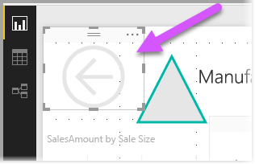
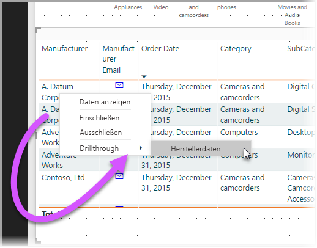
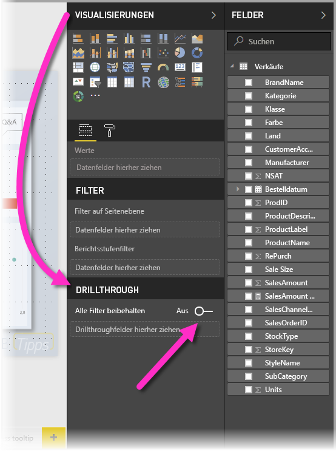
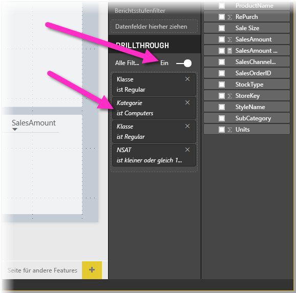
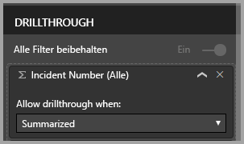

# Verwenden der Drillthroughfunktion in Power BI Desktop
Mithilfe des **Drillthroughs** können Sie in **Power BI Desktop** in Ihrem Bericht eine Seite erstellen, die sich auf eine bestimmte Entität konzentriert, z.B. auf einen Lieferanten, einen Kunden oder einen Hersteller. Wenn eine solche fokussierte Berichtsseite vorhanden ist, können Benutzer mit der rechten Maustaste auf einen Datenpunkt in anderen Berichtsseiten klicken und einen Drillthrough zu der fokussierten Seite ausführen, um Details zu erhalten, die entsprechend diesem Kontext gefiltert sind.

## Verwenden der Drillthroughfunktion
1. Erstellen Sie zum Verwenden der **Drillthroughfunktion** eine Berichtsseite mit Visuals, die für den Entitätstyp angezeigt werden sollen, für die Sie den Drillthrough bereitstellen. 

    Wenn Sie z.B. Drillthrough für Hersteller bereitstellen möchten, können Sie eine Drillthroughseite mit Visuals erstellen, die den Gesamtumsatz, die Summe der versandten Einheiten, den Umsatz nach Kategorie, den Umsatz nach Region usw. anzeigen. Wenn Sie dann einen Drillthrough auf diese Seite ausführen, werden die spezifischen Visuals für den Hersteller angezeigt, den Sie ausgewählt haben.

2. Ziehen Sie dann auf dieser Drillthroughseite im Abschnitt **Felder** des Bereichs **Visualisierungen** das Feld, für das Sie einen Drillthrough ausführen möchten, in den Bereich **Drillthroughfilter**.

    

    Wenn Sie dem Bereich **Drillthroughfilter** ein Feld hinzufügen, wird in **Power BI Desktop** automatisch ein *Zurück*-Schaltflächenvisual erstellt. Dieses Visual wird eine Schaltfläche in veröffentlichten Berichten, mit der Benutzer, die Ihren Bericht im **Power BI-Dienst** verwenden, einfach zu der Berichtsseite zurückkehren können, die Sie zuvor geöffnet hatten (die Seite, auf der sie die Drillthroughfunktion ausgewählt haben).

    

## Verwenden eines eigenen Bildes für die Schaltfläche „Zurück“    
 Da die Schaltfläche „Zurück“ ein Bild ist, können Sie das Bild dieses Visuals durch jedes gewünschte Bild ersetzen, und es erfüllt weiterhin seine Funktion, Benutzer des Berichts zurück zur ursprünglichen Seite zurückzuleiten.

1. Klicken Sie auf der Registerkarte **Home** (Start) auf **Image** (Bilder). Suchen Sie anschließend Ihr Bild, und platzieren Sie es auf der Seite „Drillthrough“.
2. Wählen Sie das neue Bild auf der Seite „Drillthrough“ aus. Ziehen Sie anschließend im Abschnitt „Bild formatieren“ den Schieberegler **Link** auf die Position „Aus“, und legen Sie als **Typ** den Wert **Back** (Zurück) fest. Jetzt funktioniert das Bild als Schaltfläche „Zurück“.

    

    Wenn die **Drillthroughseite** fertiggestellt ist und Benutzer mit der rechten Maustaste auf einen Datenpunkt im Bericht klicken, in dem das Feld verwendet wird, das Sie dem Bereich **Drillthroughfilter** hinzugefügt haben, wird ein Kontextmenü angezeigt, das den Drillthrough auf dieser Seite unterstützt.

    

    Wenn Leser des Berichts einen Drillthrough ausführen, wird die Seite gefiltert, sodass sie Informationen über den Datenpunkt anzeigt, auf den mit der rechten Maustaste geklickt wurde. Wenn sie z.B. mit der rechten Maustaste auf einen Datenpunkt über Contoso (ein Hersteller) geklickt und die Drillthroughfunktion ausgewählt haben, wird die daraufhin angezeigte Drillthroughseite nach Contoso gefiltert.

## Übergeben aller Filter an Drillthrough

Ab der Version Mai 2018 von **Power BI Desktop** können Sie alle angewendeten Filter an das Drillthroughfenster übergeben. Angenommen, Sie haben nur eine bestimmte Produktkategorie ausgewählt, die Visuals nach dieser Kategorie gefiltert und wählen dann Drillthrough. Es interessiert Sie vielleicht, wie dieser Drillthrough mit all diesen angewendeten Filtern aussieht.

Um alle angewendeten Filter beizubehalten, legen Sie im Fenster **Visualisierungen** im Abschnitt **Drillthrough** den Schalter **Alle Filter beibehalten** auf **Ein** fest. 

In Versionen von **Power BI Desktop** vor Mai 2018 entspricht das Verhalten der Festlegung dieses Schalters auf **Aus**.

Beim anschließenden Drillthrough auf ein Visual können Sie sehen, welche Filter angewendet wurden, weil auf das Quellvisual temporäre Filter angewendet wurden. Im Drillthroughfenster werden diese vorübergehenden Filter kursiv dargestellt. 

Beachten Sie, dass Sie dies mit QuickInfo-Seiten erreichen könnten, aber das wäre eine seltsame Erfahrung (da das QuickInfo scheinbar nicht richtig funktioniert). Daher ist es nicht empfehlenswert, mit QuickInfos zu arbeiten.

## Hinzufügen eines Measures zu einem Drillthrough

Sie können alle Filter an das Drillthroughfenster übergeben und zusätzlich ein Measure (oder eine zusammengefasste numerische Spalte) dem Drillthroughbereich hinzufügen. Ziehen Sie einfach das Drillthroughfeld auf die Karte „Drillthrough“, um es anzuwenden. 

Wenn Sie ein Measure (oder eine zusammengefasste numerische Spalte) hinzufügen, können Sie Details auf der Seite anzeigen, wenn das Feld im Bereich *Wert* eines Visuals verwendet wird.

Das ist bereits alles, was Sie über das Verwenden der **Drillthroughfunktion** in Berichten wissen müssen. Sie bietet eine hervorragende Möglichkeit, eine erweiterte Ansicht der Entitätsinformationen zu erhalten, die Sie für den Drillthroughfilter auswählen.

## Nächste Schritte

Folgende Artikel könnten Sie ebenfalls interessieren:

* [Verwenden von Slicern in Power BI Desktop](desktop-slicers.md)

