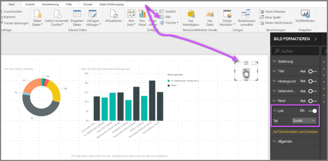

# Verwenden der Drillthroughfunktion in Power BI Desktop
In **Power BI Desktop** können Sie mit **Drillthrough** eine Seite in einem Bericht erstellen, die auf eine bestimmte Entität, z.B. einen Lieferanten, Kunden oder Hersteller, fokussiert ist. Wenn eine solche fokussierte Berichtsseite vorhanden ist, können Benutzer mit der rechten Maustaste auf einen Datenpunkt in anderen Berichtsseiten klicken und einen Drillthrough zu der fokussierten Seite ausführen, um Details zu erhalten, die entsprechend diesem Kontext gefiltert sind.

## Verwenden der Drillthroughfunktion
Erstellen Sie zum Verwenden von **Drillthrough** eine Berichtsseite, die Visuals enthält, die für den Typ der Entität, für den Sie die Drillthroughfunktion bereitstellen, angezeigt werden sollen. Wenn Sie z.B. Drillthrough für Hersteller bereitstellen möchten, können Sie eine Drillthroughseite mit Visuals erstellen, die den Gesamtumsatz, die Summe der versandten Einheiten, den Umsatz nach Kategorie, den Umsatz nach Region usw. anzeigen. Wenn Sie dann einen Drillthrough auf diese Seite ausführen, werden die spezifischen Visuals für den Hersteller angezeigt, auf den Sie geklickt und den Sie für den Drillthrough ausgewählt haben.

Ziehen Sie dann auf dieser Drillthroughseite im Abschnitt **Felder** des Bereichs **Visualisierungen** das Feld, für das Sie einen Drillthrough ausführen möchten, in den Bereich **Drillthroughfilter**.

Wenn Sie dem Bereich **Drillthroughfilter** ein Feld hinzufügen, wird in **Power BI Desktop** automatisch ein *Zurück*-Schaltflächenvisual erstellt. Dieses Visual wird eine Schaltfläche in veröffentlichten Berichten, mit der Benutzer, die Ihren Bericht im **Power BI-Dienst** verwenden, einfach zu der Berichtsseite zurückkehren können, die Sie zuvor geöffnet hatten (die Seite, auf der sie die Drillthroughfunktion ausgewählt haben).

Da die Schaltfläche *Zurück* ein Bild ist, können Sie das Bild dieses Visuals durch jedes gewünschte Bild ersetzen, und es erfüllt weiterhin seine Funktion, Nutzer des Berichts zurück zur ursprünglichen Seite zu leiten. Um für die Schaltfläche „Zurück“ ein eigenes Bild zu verwenden, platzieren Sie einfach ein Bildvisual auf der Drillthroughseite, wählen Sie es aus, und schieben Sie den Schieberegler *Schaltfläche „Zurück“* auf „Ein“. Dadurch fungiert Ihr Bild als *Zurück*-Schaltfläche.

Wenn die **Drillthroughseite** fertiggestellt ist und Benutzer mit der rechten Maustaste auf einen Datenpunkt in dem Bericht klicken, in dem das Feld verwendet wird, das Sie dem Bereich **Drillthroughfilter** auf der Drillthroughseite hinzugefügt haben, wird ein Kontextmenü angezeigt, mit dem die Benutzer einen Drillthrough auf diese Seite ausführen können.

Wenn sie einen Drillthrough ausführen, wird die Seite gefiltert, um Informationen über den Datenpunkt anzuzeigen, auf den sie mit der rechten Maustaste geklickt haben. Wenn sie z.B. mit der rechten Maustaste auf einen Datenpunkt über Contoso (ein Hersteller) geklickt und die Drillthroughfunktion ausgewählt haben, wird die daraufhin angezeigte Drillthroughseite nach Contoso gefiltert.

> [!NOTE]
> An die Drillthroughberichtseite wird nur das Feld übergeben, das sich im Bereich **Drillthroughfilter** befindet. Es werden keine weiteren Kontextinformationen übergeben.
> 
> 

Das ist bereits alles, was Sie über das Verwenden der **Drillthroughfunktion** in Berichten wissen müssen. Sie bietet eine hervorragende Möglichkeit, eine erweiterte Ansicht der Entitätsinformationen zu erhalten, die Sie für den Drillthroughfilter auswählen.

