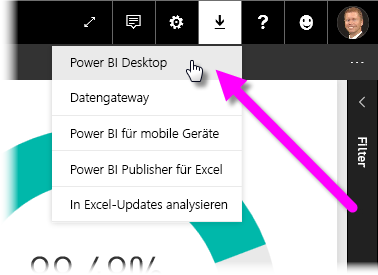
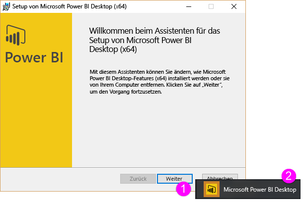
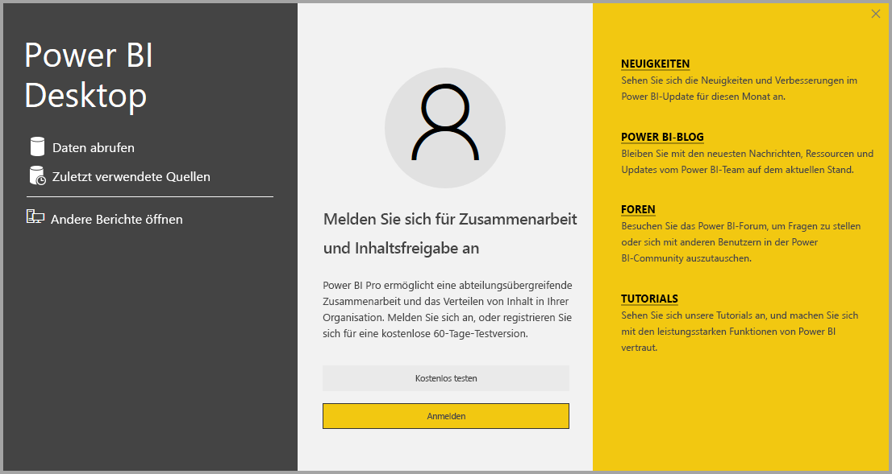

# Abrufen von Power BI Desktop
In **Power BI Desktop** können Sie erweiterte Abfragen, Modelle und Berichte erstellen, die Daten visualisieren. Mit **Power BI Desktop** können Sie Datenmodelle entwerfen, Berichte erstellen und Ihre Arbeit durch die Veröffentlichung im Power BI-Dienst freigeben.  **Power BI Desktop** steht als kostenloser Download zur Verfügung.

Sie können **Power BI Desktop** auf zwei Arten abrufen, von denen jede in den folgenden Abschnitten beschrieben wird:

* Direktes **Herunterladen** (ein MSI-Paket, das Sie herunterladen und auf dem Computer installieren)
* Installation als App aus dem **Microsoft Store**

Mit beiden Methoden erhalten Sie auf Ihrem Computer die neueste Version von **Power BI Desktop**. Es sind jedoch einige Unterschiede zu beachten, die in den folgenden Abschnitten beschrieben werden.

## Herunterladen von Power BI Desktop
Um die neueste Version von **Power BI Desktop** herunterzuladen, können Sie im Power BI-Dienst rechts oben auf das Downloadsymbol klicken und **Power BI Desktop** auswählen.

Sie können die neueste Version von Power BI Desktop auch von dieser Downloadseite herunterladen:

* [**Power BI Desktop-Download** (32-Bit und 64-Bit-Version)](https://powerbi.microsoft.com/desktop).
  
  

Unabhängig von der ausgewählten Downloadoption werden Sie nach dem Download von **Power BI Desktop** zum Ausführen der Installationsdatei aufgefordert:

**Power BI Desktop** wird als Anwendung installiert und auf dem Desktop ausgeführt.

> [!NOTE]
> Das Installieren der heruntergeladenen Version (MSI-Paket) von **Power BI Desktop** und der Version aus dem **Microsoft Store** auf demselben Computer (auch als *parallele Installation* bezeichnet) wird nicht unterstützt.
> 
> 

## Installation als App aus dem Microsoft Store
Sie können **Power BI Desktop** auch über den folgenden Link aus dem Microsoft Store herunterladen:

* [Installation von **Power BI Desktop** über den **Microsoft Store**](http://aka.ms/pbidesktopstore)

Das Installieren von **Power BI Desktop** aus dem Microsoft Store bietet einige Vorteile:

* **Automatische Updates**: Windows lädt automatisch im Hintergrund die aktuelle Version herunter, sobald sie verfügbar ist, sodass Ihre Version immer auf dem neuesten Stand ist.
* **Kleinere Downloads**: Durch den **Microsoft Store** wird sichergestellt, dass in den einzelnen Updates nur geänderte Komponenten auf Ihren Computer heruntergeladen werden, was zu kleineren Downloads für jedes Update führt.
* **Keine Administratorberechtigung erforderlich**: Wenn Sie die MSI-Datei direkt herunterladen und installieren, müssen Sie Administrator sein, damit die Installation erfolgreich abgeschlossen wird. Wenn Sie **Power BI Desktop** aus dem Microsoft Store abrufen, ist *keine* Administratorberechtigung erforderlich.
* **Rollout durch IT möglich**: Die **Microsoft Store**-Version lässt sich leichter für alle Benutzer in der Organisation bereitstellen (per *Rollout*), und **Power BI Desktop** kann über den **Microsoft Store für Unternehmen** verfügbar gemacht werden.
* **Spracherkennung**: Die **Microsoft Store**-Version umfasst alle unterstützten Sprachen und überprüft bei jedem Start, welche Sprachen auf dem Computer verwendet werden. Dies wirkt sich auch auf die Lokalisierung von Modellen aus, die in **Power BI Desktop** erstellt werden. Beispielsweise entsprechen integrierte Datumshierarchien der Sprache, die in **Power BI Desktop** beim Erstellen der PBIX-Datei verwendet wurde.

Für die Installation von **Power BI Desktop** aus dem Microsoft Store gelten einige Einschränkungen und Hinweise, darunter die folgenden:

* Wenn Sie den SAP-Connector verwenden, müssen Sie möglicherweise die SAP-Treiberdateien in den Ordner *Windows\System32* verschieben.
* Beim Installieren von **Power BI Desktop** aus dem Microsoft Store werden keine Benutzereinstellungen aus der MSI-Version kopiert. Sie müssen möglicherweise eine neue Verbindung mit Ihren aktuellen Datenquellen herstellen und die Anmeldeinformationen für Ihre Datenquellen neu eingeben. 

> [!NOTE]
> Das Installieren der heruntergeladenen Version (MSI-Paket) von **Power BI Desktop** und der Version aus dem **Microsoft Store** auf demselben Computer (auch als *parallele Installation* bezeichnet) wird nicht unterstützt. Sie müssen **Power BI Desktop** manuell deinstallieren, bevor Sie den Download aus dem **Microsoft Store** starten.
> 
> [!NOTE]
> Die Power BI-Berichtsserver-Version von **Power BI Desktop** ist eine eigene Installation und unterscheidet sich von den in diesem Artikel behandelten Versionen. Informationen über die Berichtsserver-Version von **Power BI Desktop** finden Sie im Artikel [Schnellstart: Erstellen eines Power BI-Berichts für Power BI-Berichtsserver](report-server/quickstart-create-powerbi-report.md).
> 
> 

## Verwenden von Power BI Desktop
Wenn Sie **Power BI Desktop** starten, wird ein*Willkommensbildschirm* angezeigt.

Wenn Sie **Power BI Desktop** zum ersten Mal verwenden (und die Installation kein Upgrade ist), werden Sie aufgefordert, ein Formular auszufüllen und einige Fragen zu beantworten, oder Sie müssen sich beim **Power BI-Dienst** anmelden, damit Sie fortfahren können.

Von dort aus können Sie damit beginnen, Datenmodelle oder Berichte zu erstellen und diese im Power BI-Dienst mit anderen Personen zu teilen. Über die Link **Weitere Informationen** am Ende dieses Artikels gelangen Sie zu weiteren Artikeln, die Ihnen bei Ihren ersten Schritten mit **Power BI Desktop** Unterstützung bieten.

## Mindestanforderungen
Die folgende Liste zeigt die Mindestanforderungen zur Ausführung von **Power BI Desktop**:

* Windows 7/Windows Server 2008 R2 oder höher
* .NET 4.5
* Internet Explorer 9 oder höher
* **Arbeitsspeicher (RAM):** Mindestens 1 GB freier Arbeitsspeicher, 1,5 GB oder mehr empfohlen.
* **Bildschirm:** Mindestens 1440 × 900 oder 1600 × 900 (16:9) empfohlen. Geringere Auflösungen, z.B. 1024 × 768 oder 1280 × 800, werden nicht empfohlen, da zum Anzeigen bestimmter Steuerelemente (z.B. das Schließen des Startbildschirms) eine höhere Auflösung erforderlich ist.
* **Windows-Anzeigeeinstellungen:** Wenn Ihre Anzeigeeinstellungen so konfiguriert sind, dass die Größe von Text, Apps und anderen Elementen auf mehr als 100 % geändert wird, sind einige Dialogfelder möglicherweise nicht sichtbar, die geschlossen oder bearbeitet werden müssen, damit Sie weiter in **Power BI Desktop** arbeiten können. Wenn dieses Problem auftritt, überprüfen Sie Ihre **Anzeigeeinstellungen**. Wählen Sie dazu in Windows **Einstellungen > System > Anzeige** aus, und setzen Sie die Anzeigeeinstellungen mithilfe des Schiebereglers auf 100% zurück.
* **CPU:** x86- oder x64-Prozessor mit 1 Gigahertz (GHz) oder schneller empfohlen.

## Nächste Schritte
Nachdem Sie **Power BI Desktop** installiert haben, erhalten Sie in den folgenden Artikeln die nötigen Informationen für einen schnellen Einstieg:

* [Erste Schritte mit Power BI Desktop](desktop-getting-started.md)
* [Übersicht zu Abfragen mit Power BI Desktop](desktop-query-overview.md)
* [Datenquellen in Power BI Desktop](desktop-data-sources.md)
* [Verbinden mit Daten in Power BI Desktop](desktop-connect-to-data.md)
* [Strukturieren und Kombinieren von Daten mit Power BI Desktop](desktop-shape-and-combine-data.md)
* [Allgemeine Abfrageaufgaben in Power BI Desktop](desktop-common-query-tasks.md)   

