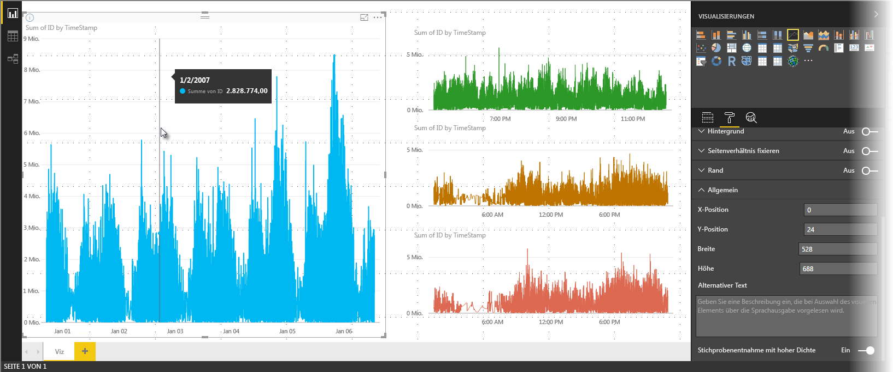
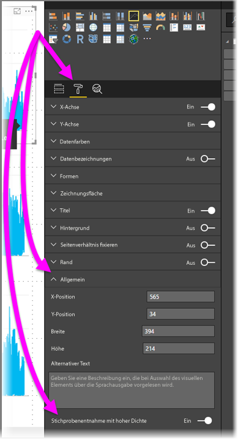

# Stichprobenentnahme für visuelle Linienelemente mit hoher Dichte in Power BI
Ab der im Juni 2017 veröffentlichten Version von **Power BI Desktop** und Updates des **Power BI-Diensts** steht ein neu Stichprobenalgorithmus zur Verfügung, der die visuellen Elemente verbessert, die Daten mit hoher Dichte stichprobenartig entnehmen. Sie können z.B. ein Liniendiagramm aus den Verkaufsergebnissen Ihres Einzelhandelsgeschäfts erstellen, auch wenn jedes Geschäft mehr als zehntausend Verkaufsbelege jährlich verzeichnet. Ein Liniendiagramm mit derartigen Verkaufsinformationen entnimmt stichprobenartig Daten (wählen Sie eine aussagekräftige Darstellung dieser Daten, um zu veranschaulichen, wie die Verkaufszahlen über die Zeit hinweg variieren) aus den Daten jedes Geschäfts und erstellt ein Mehrfachliniendiagramm, das die zugrunde liegenden Daten veranschaulicht. Dies ist bei der Visualisierung von Daten mit hoher Dichte eine häufig genutzte Methode. Die Stichprobenentnahme von Daten mit hoher Dichte von Power BI Desktop wurde verbessert. Dies wird in diesem Artikel ausführlicher beschrieben.

> [!NOTE]
> Der in diesem Artikel beschriebene Algorithmus zur **Stichprobenentnahme mit hoher Dichte** gilt sowohl für **Power BI Desktop** als auch den **Power BI-Dienst** und ist in beiden verfügbar.
> 
> 

## So funktioniert die Strichprobenentnahme für visuelle Linienelemente mit hoher Dichte
Früher hat **Power BI** eine Sammlung von Beispieldatenpunkten im vollständigen Bereich der zugrunde liegenden Daten auf deterministische Weise ausgewählt. Es kann z.B. sein, dass für Daten mit hoher Dichte in einer Visualisierung eines Kalenderjahrs 350 Beispieldatenpunkte angezeigt werden, die jeweils ausgewählt wurden, um sicherzustellen, dass der vollständige Datenbereich im visuellen Element dargestellt wird. Um dies besser zu verstehen, können Sie sich vorstellen, dass wir den Aktienkurs über ein Jahr aufgezeichnet und 365 Datenpunkte ausgewählt haben, um eine Liniendiagrammvisualisierung zu erstellen (also ein Datenpunkt pro Tag).

In diesem Fall gibt es allein am Tag mehrere Werte für den Aktienkurs. Natürlich gibt es ein Tageshoch und -tief, aber diese können zu jedem Zeitpunkt am Tag während der Öffnung des Börsenmarkts auftreten. Für die Strichprobenentnahme für visuelle Linienelemente mit hoher Dichte erhalten Sie eine repräsentative Momentaufnahme der zugrunde liegenden Daten (der Preis um 10:30 Uhr und um 12:00 Uhr), wenn das zugrunde liegenden Datenbeispiel an jedem Tag um 10:30 Uhr und 12:00 Uhr entnommen wurde. Allerdings ist so nicht gewährleistet, dass das tatsächliche Tageshoch und -tief des Aktienkurses (an diesem Tag) für diesen repräsentativen Datenpunkt erfasst wird. In diesem Fall – und in anderen – ist die Stichprobenentnahme repräsentativ für die zugrunde liegenden Daten. Allerdings werden nicht immer die wichtigsten Punkte erfasst (in diesem Fall wären dies das Tageshoch und -tief gewesen).

Definitionsgemäß werden Daten mit hoher Dichte entnommen, um ein schnelles Erstellen von visuellen Elementen und deren Interaktivität zu ermöglichen (wenn sich zu viele Datenpunkte in einem visuellen Element befinden, kann sie dadurch verlangsamt und die Sichtbarkeit von Trends beeinträchtigt werden). Das Erstellen des Algorithmus zur Stichprobenentnahme hängt davon ab, wie viele Daten entnommen werden, um das beste Visualisierungserlebnis zu bieten. Durch den verbesserten Algorithmus in Power BI Desktop werden Reaktionsfähigkeit, Darstellung und die Erhaltung von wichtigen Punkten in jedem Zeitsegment optimal miteinander vereint.

## So funktioniert der neue Algorithmus für die Strichprobenentnahme für visuelle Linienelemente mit hoher Dichte
Der neue Algorithmus für die Strichprobenentnahme für visuelle Linienelemente mit hoher Dichte steht für Visualisierungen mit Liniendiagrammen und Flächendiagrammen mit fortlaufender X-Achse zur Verfügung.

Für ein visuelles Element mit hoher Dichte teilt **Power BI** Ihre Daten auf intelligente Weise in hochauflösende Blöcke ein und wählt anschließend wichtige Punkte für jeden Block aus. Dieses Aufteilen von hochauflösenden Daten wurde so optimiert, dass sich das entstehende Diagramm optisch nicht von einem Diagramm unterscheidet, für das alle zugrunde liegende Datenpunkte geladen wurden – und zudem ist es deutlich schneller und interaktiver.

### Mindest- und Höchstwerte für visuelle Linienlemente mit hoher Dichte
Für jedes visuelle Element gelten die folgenden visuellen Einschränkungen:

* Die maximale Anzahl von Datenpunkten, die in einem visuellen Element *angezeigt* werden können, beträgt **3.500**, unabhängig von der Anzahl der zugrunde liegenden Datenpunkte oder -reihen. Bei 10 Reihen mit jeweils 350 Datenpunkten hat das visuelle Element deshalb die Höchstgrenze an Datenpunkten erreicht. Wenn Sie eine Reihe haben, kann diese bis zu 3.500 Datenpunkte haben, wenn der neue Algorithmus dies für die beste Stichprobenentnahme für die zugrunde liegenden Daten hält.
* Jedes visuelle Element kann maximal **60 Reihen** enthalten. Wenn Sie mehr als 60 Reihen haben, teilen Sie die Daten auf, und erstellen Sie mehrere visuelle Elemente mit jeweils höchstens 60 Reihen. Es wird empfohlen, einen **Datenschnitt** zu verwenden, um nur Segmente der Daten anzuzeigen (nur bestimmte Reihen). Wenn Sie z.B. alle Unterkategorien in der Legende anzeigen, können Sie einen Datenschnitt verwenden, um nach der übergeordneten Kategorie auf der gleichen Berichtseite zu filtern.

Diese Parameter stellen sicher, dass die visuellen Elemente in Power BI Desktop sehr schnell gerendert werden und weiter auf Interaktion von Benutzern reagieren können. Zudem wird sichergestellt, dass diese keinen unnötigen Rechenmehraufwand auf dem Computer verursachen, der das visuelle Element rendert.

### Auswerten von repräsentativen Datenpunkte für visuelle Linienelemente mit hoher Dichte
Wenn die Anzahl von zugrunde liegenden Datenpunkten die der Datenpunkte übersteigt, die im visuelle Element dargestellt werden können (über 3.500), wird der sogenannte *Gruppierungsprozess* gestartet. Dabei werden Blöcke der zugrunde liegenden Daten in sogenannte *Gruppen* aufgeteilt, die dann interaktiv optimiert werden.

Der Algorithmus erstellt so viele Gruppen wie möglich, um dem visuellen Element die höchstmögliche Granularität zu bieten. Innerhalb jeder Gruppierung sucht der Algorithmus den Mindest- und Höchstdatenwert, um sicherzustellen, dass relevante und aussagekräftige Werte (z.B. Ausreißer) erfasst und im visuellen Element angezeigt werden. Auf Grundlage der Ergebnisse der Gruppierung und der anschließenden Auswertung der Daten durch Power BI wird die Mindestauflösung der X-Achse für das visuelle Element bestimmt, um die höchstmögliche Granularität für das visuelle Element zu gewährleisten.

Wie bereits erwähnt, liegt die Mindestgranularität für jede Reihe bei 350 Punkten, und die höchste beträgt 3.500.

Jede Gruppierung wird durch zwei Datenpunkte dargestellt, die im visuellen Element die repräsentativen Datenpunkte der Gruppierung werden. Die Datenpunkte sind einfach nur die Höchst- und Tiefwerte für diese Gruppe. Wenn Sie Höchst- oder Tiefwerte auswählen, stellt der Gruppierungsprozess sicher, dass jeder relevante Höchstwert oder aussagekräftige Tiefwert im visuellen Element erfasst und gerendert wird.

Dies scheint auf den ersten Blick ein sehr hoher Analyseaufwand zu sein, um sicherzustellen, dass vereinzelte Ausreißer erfasst und ordnungsgemäß im visuellen Element dargestellt werden – und genau deshalb gibt es jetzt den neuen Algorithmus und Gruppierungsprozess.

## QuickInfos und Stichprobenentnahme für visuelle Linienelemente
Beachten Sie, dass der Gruppierungsprozess, der die Mindest- und Höchstwerte in einer gegebenen Gruppierung erfasst und in einem visuellen Element darstellt, sich darauf auswirken kann, wie QuickInfos Daten anzeigen, wenn Sie mit der Maus auf Datenpunkte zeigen. Um zu erläutern, wie und warum dies passiert, schauen wir uns erneut unser Beispiel zu Aktienkursen von weiter oben an.

Angenommen, Sie erstellen ein visuelles Element auf der Grundlage von Aktienkursen und Sie vergleichen zwei unterschiedliche Aktien miteinander, die beide **die Stichprobenentnahme mit hoher Dichte** verwenden. Die zugrunde liegenden Daten für jede Reihe haben viele Datenpunkte (möglicherweise erfassen Sie den Aktienkurs für jede Sekunde am Tag). Der Algorithmus für die Stichprobenentnahme für visuelle Linienelemente mit hoher Dichte führt die Gruppierung für jede Reihe einzeln durch.

Nehmen wir weiterhin an, dass der Preis der ersten Aktie um 12:02 steigt und 10 Sekunden später wieder schnell absinkt – das ist ein wichtiger Datenpunkt. Wenn die Gruppierung für diese Aktie durchgeführt wird, ist das Tageshoch um 12:02 Uhr der repräsentative Datenpunkt für diese Gruppe.

Für die zweite Aktie war um 12:02 Uhr weder das Tageshoch noch -tief der Gruppe, die diese Zeit enthalten hat – vielleicht war das Tageshoch der Gruppe, die 12:02 Uhr enthält, drei Minuten später. Wenn Sie in dieser Situation beim Erstellen den Liniendiagramms auf 12:02 zeigen, sehen Sie einen Wert in QuickInfos für die erste Aktie (weil er um 12:02 gestiegen ist und dieser Wert als der höchste Datenpunkt der Gruppe ausgewählt wurde). Allerdings sehen Sie um 12:02 Uhr *keine* Werte in QuickInfos für die zweite Aktie. Dies liegt daran, dass die zweite Aktie weder ein Tageshoch noch -tief für die Gruppe hatte, die 12:02 Uhr enthalten hat. Deshalb können für die zweite Aktie für 12:02 Uhr keine Daten angezeigt werden, und deshalb werden auch keine QickInfos-Daten angezeigt.

Dies tritt mit QuickInfos häufig auf. Möglicherweise stimmen die Höchst- und Tiefwerte einer Gruppe nicht genau mit den gleichmäßig skalierten Wertpunkten der X-Achse überein, und deshalb wird der Wert nicht von QuickInfos angezeigt.  

## So können Sie die Strichprobenentnahme für visuelle Linienelemente mit hoher Dichte aktivieren
Standardmäßig ist der neue Algorithmus **eingeschaltet**. Um diese Einstellung zu ändern, wechseln Sie in den Bereich **Formatierung** auf der Karte **Allgemein**. Am unteren Rand sehen Sie einen Schieberegler mit dem Namen **Stichprobenentnahme mit hoher Dichte**. Um den Algorithmus zu deaktivieren, schieben Sie ihn auf **off** (aus).

## Überlegungen und Einschränkungen
Der neue Algorithmus für die Stichprobenentnahme für visuelle Linienelemente mit hoher Dichte ist eine wichtige Verbesserung in Power BI. Es gibt jedoch einige Aspekte, die Sie berücksichtigen sollten, wenn Sie mit Werten und Daten mit hoher Dichte arbeiten.

* Aufgrund der erhöhten Granularität und des erweiterten Gruppierungsprozesses, zeigt **QuickInfos** möglicherweise nur dann einen Wert an, wenn repräsentative Daten nach dem Cursor übereinstimmen. Weitere Informationen finden Sie im Artikel zu **QuickInfos**.
* Wenn die Größe einer allgemeinen Datenquelle zu groß ist, eliminiert der neue Algorithmus Reihen (Legendenelemente), um sie an das Maximum an importieren Daten anzupassen.
  
  * In diesem Fall ordnet der Algorithmus Legendenreihen alphabetisch und durchläuft die Liste von Legendenelementen von oben nach unten in alphabetischer Reihenfolge, bis das Maximum an importierten Daten erreicht ist. Danach werden keine weiteren Reihen mehr importiert.
* Wenn ein zugrunde liegendes Dataset mehr als 60 Reihe hat (die Höchstzahl an Reihen, wie zuvor beschrieben), ordnet der neue Algorithmus die Reihen alphabetisch und löscht Reihen, die nach der 60. alphabetischen Reihe stehen.
* Wenn die Werte in den Daten nicht vom Typ *numeric* oder *date/time* sind, verwendet Power BI den neuen Algorithmus nicht, sondern verwendet stattdessen den vorherigen Algorithmus (Stichprobenentnahme ohne hohe Dichte).
* Die Einstellung **Show Items with no data** (Elemente ohne Daten anzeigen) wird vom neuen Algorithmus nicht unterstützt.
* Der neue Algorithmus wird nicht unterstützt, wenn Sie die Liveverbindung zu einem Modell verwenden, das in SQL Server Analysis Services (Version 2016 oder früher) gehostet wird. Er wird aber in Modellen unterstützt, die in **Power BI** oder Azure Analysis Services gehostet werden.

## Nächste Schritte
Informationen über die Stichprobenentnahme mit hoher Dichte in Punktdiagrammen finden Sie im folgenden Artikel.

* [Stichprobenentnahme mit hoher Dichte in Power BI-Punktdiagrammen](desktop-high-density-scatter-charts.md)

