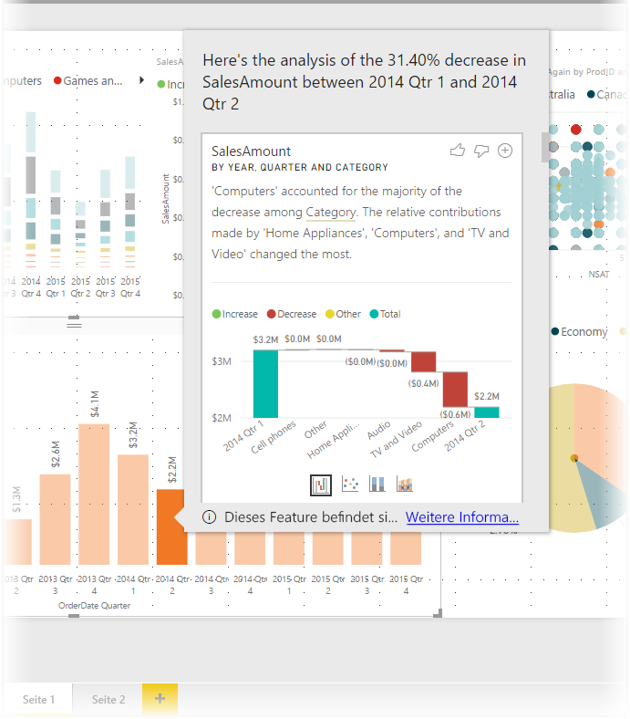
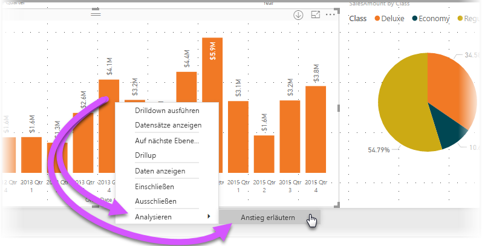
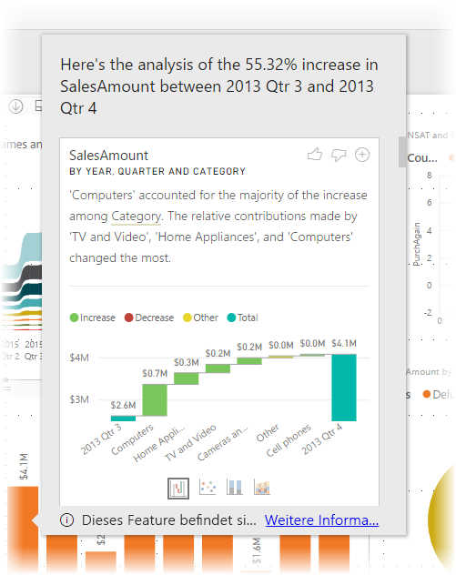
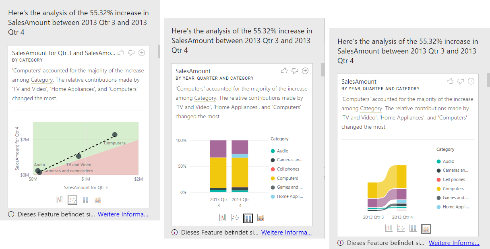

# Verwenden von Einblicken in Power BI Desktop (Vorschau)
Sie können sich in **Power BI Desktop** Rückgänge oder Anstiege in Diagrammen erläutern lassen und schnell automatische aussagekräftige Analysen der Daten erhalten. Klicken Sie einfach mit der rechten Maustaste auf einen Datenpunkt, und wählen Sie **Analysieren > Erläutern Sie den Rückgang** (oder „Erläutern Sie den Anstieg“, wenn der vorherige Balken niedriger war) aus. Daraufhin bietet Ihnen ein benutzerfreundliches Fenster entsprechenden Einblick.

Die Einblicke sind kontextabhängig und basieren auf dem unmittelbar vorherigen Datenpunkt, z.B. dem vorherigen Balken oder der vorherigen Spalte.

> [!NOTE]
> Dieses Feature ist eine Vorschauversion und unterliegt Änderungen. Einblicke sind ab der im September 2017 veröffentlichten Version von **Power BI Desktop** standardmäßig aktiviert (Sie müssen nicht das Kontrollkästchen „Vorschau“ markieren, um sie zu aktivieren).
> 
> 

## Verwenden von Einblicken
Um Einblicke zu verwenden, klicken Sie einfach mit der rechten Maustaste auf einen Datenpunkt in einem Balken- oder Linienvisual, und wählen Sie **Analysieren > Erläutern Sie den Anstieg** (oder *Erläutern Sie den Rückgang*) aus, da alle Einblicke auf der Änderung ab dem vorherigen Datenpunkt basieren.

**Power BI Desktop** führt dann seine Machine Learning-Algorithmen für die Daten aus und füllt ein Fenster mit einem Visual und einer Beschreibung der Kategorien, die sich am stärksten auf den Anstieg oder den Rückgang ausgewirkt haben. Einblicke werden standardmäßig als *Wasserfallvisual* bereitgestellt, wie in der folgenden Abbildung gezeigt.

Sie können mithilfe der kleinen Symbole am unteren Rand des Wasserfallvisuals auswählen, ob Einblicke als Punktdiagramm, gestapeltes Säulendiagramm oder Menübanddiagramm angezeigt werden sollen.

Mit den Symbolen *Daumen hoch* und *Daumen runter* am oberen Rand der Seite können Sie Feedback über das Visual und das Feature geben.

Insbesondere können Sie mit der Schaltfläche **+** am oberen Rand des Visuals das ausgewählte Visual dem Bericht hinzufügen, so als ob Sie es manuell erstellt hätten. Anschließend können Sie das hinzugefügte Visual wie jedes andere Visual im Bericht formatieren oder auf andere Weise anpassen. Sie können ein ausgewähltes Visual für Einblicke nur hinzufügen, wenn Sie einen Bericht in **Power BI Desktop** bearbeiten.

Sie können Einblicke verwenden, wenn sich der Bericht im Lese- oder Bearbeitungsmodus befindet. Dies bietet Ihnen die Flexibilität, sowohl Daten zu analysieren als auch Visuals zu erstellen, die Sie den Berichten einfach hinzufügen können.

## Überlegungen und Einschränkungen
Da Einblicke auf Änderungen gegenüber dem vorherigen Datenpunkt basieren, sind sie nicht verfügbar, wenn Sie den ersten Datenpunkt in einem Visual auswählen. 

In der folgenden Liste sind die Szenarien aufgeführt, die derzeit für **Einblicke** nicht unterstützt werden:

* TopN-Filter
* Filter einschließen/ausschließen
* Kennzahlenfilter
* Nicht additive Measures und Aggregate
* Werte anzeigen als
* Gefilterte Measures (die neue Funktion, die für Punktdiagramme in Einblicken verwendet wird)
* Kategoriespalten auf der X-Achse, sofern keine skalare Sortierung nach Spalte definiert wird. Wenn eine Hierarchie verwendet wird, muss jede Spalte in der aktiven Hierarchie diese Bedingung erfüllen.
* Nicht numerische Measures

Außerdem werden die folgenden Modelltypen und Datenquellen für Einblicke derzeit nicht unterstützt:

* DirectQuery
* Live Connect
* Lokale Reporting Services
* Einbetten

## Nächste Schritte
Weitere Informationen zu **Power BI Desktop** und den ersten Schritten finden Sie in den folgenden Artikeln.

* [Erste Schritte mit Power BI Desktop](desktop-getting-started.md)
* [Übersicht zu Abfragen mit Power BI Desktop](desktop-query-overview.md)
* [Datenquellen in Power BI Desktop](desktop-data-sources.md)
* [Verbinden mit Daten in Power BI Desktop](desktop-connect-to-data.md)
* [Strukturieren und Kombinieren von Daten mit Power BI Desktop](desktop-shape-and-combine-data.md)
* [Allgemeine Abfrageaufgaben in Power BI Desktop](desktop-common-query-tasks.md)   

