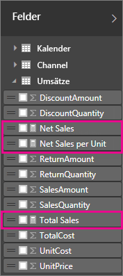
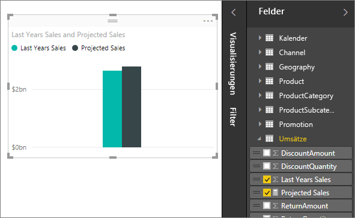

# Measures in Power BI Desktop
**Power BI Desktop** hilft Ihnen, Einblicke in Ihre Daten mit nur ein paar Mausklicks zu gewinnen. Manchmal enthalten diese Daten aber einfach nicht alles, was Sie für die Antwort auf Ihre drängendsten Fragen benötigen. Measures können Ihnen in dieser Situation weiterhelfen.

Measures kommen in einigen der gängigsten Datenanalysen zum Einsatz; z. B. bei Summen, Mittelwerten, Minimal- oder Maximalwerten, Anzahlen oder komplexeren Berechnungen, die Sie selbst mithilfe einer DAX-Formel erstellen. Die berechneten Ergebnisse von Measures ändern sich ständig in Reaktion auf Ihre Interaktion mit Berichten und ermöglichen so eine schnelle und dynamische Untersuchung von Daten ohne Vorlauf. Sehen wir uns das einmal näher an.

## Grundlegendes zu Measures
In **Power BI Desktop** werden Measures in der **Berichtsansicht** oder in der **Datenansicht** verwendet. Von Ihnen selbst erstellte Measures werden in der Feldliste mit einem Rechnersymbol angezeigt. Sie können Measures nach Belieben benennen und sie einer neuen oder vorhandenen Visualisierung ganz wie jedes andere Feld hinzufügen.

> [!NOTE]
> Vielleicht sind auch **Quickmeasures** für Sie interessant. Hierbei handelt es sich um vordefinierte Measures, die in Dialogfeldern ausgewählt werden können. Sie bieten eine ideale Möglichkeit, schnell Measures zu erstellen. Zudem empfehlen sie sich, um die DAX-Syntax kennenzulernen, indem Sie sich die automatisch erstellten DAX-Formeln einmal näher ansehen. Lesen Sie den folgenden Artikel: [Quickmeasures](desktop-quick-measures.md).
> 
> 

## Data Analysis Expressions
Measures berechnen ein Ergebnis mithilfe einer Ausdrucksformel. Zum Erstellen eigener Measures verwenden Sie die [DAX-Formelsprache](https://msdn.microsoft.com/library/gg413422.aspx) (Data Analysis Expressions). DAX beinhaltet eine Bibliothek aus über 200 Funktionen, Operatoren und Konstrukten, die eine immense Flexibilität beim Erstellen von Measures zum Berechnen von Ergebnissen für so ungefähr jede benötigte Datenanalyse verfügbar macht.

DAX-Formeln sind Excel-Formeln ziemlich ähnlich. DAX weist sogar viele der gleichen Funktionen auf, wie DATUM, SUMME und LINKS. Aber die DAX-Funktionen sind für relationale Daten ausgelegt, wie wir sie in Power BI Desktop verwenden.

## Betrachten wir dazu ein Beispiel.
Lea ist Vertriebsmanagerin bei Contoso. Sie wird gebeten, Umsatzprognosen für Handelspartner für das nächste Geschäftsjahr zu erstellen. Sie entscheidet sich, Ihren Schätzungen die Umsatzbeträge des letzten Jahres zugrunde zu legen, mit einer jährlichen Steigerung von 6 Prozent, die sich aus verschiedenen Werbeaktionen ergeben, die für das nächste halbe Jahr geplant sind.

Um die Schätzungen zu melden, importiert sie die Umsatzdaten des letzten Jahres mithilfe des Abfragemoduls in Power BI Desktop. Sie sucht das Feld „Umsatzbetrag“ in der Tabelle „Umsätze von Handelspartnern“. Da die von ihr importierten Daten nur die Umsätze des letzten Jahres enthalten, benennt sie das Feld „Umsatzbetrag“ in „Umsätze letztes Jahr“ um. Anschließend zieht sie „Umsätze letztes Jahr“ auf die Berichtszeichenfläche. Das Feld wird im visualisierten Diagramm als Einzelwert dargestellt, bei dem es sich um die Summe aller Umsätze von Handelspartnern aus dem letzten Jahr handelt.

Ihr fällt auf, dass eine Berechnung automatisch durchgeführt wurde, obwohl sie ihrerseits keine Berechnung angegeben hat. Power BI Desktop hat ein eigenes Measure erstellt, indem er alle Werte aus „Umsätze letztes Jahr“ addiert hat. 

Lea benötigt jedoch ein Measure zum Berechnen der Prognosen für das nächste Jahr, das auf den Umsätzen des letzten Jahres basiert, multipliziert mit 1,06, um dem erwarteten Wachstum der Geschäftsaktivitäten von 6 Prozent Rechnung zu tragen. Für diese Berechnung erstellt sie ein eigenes Measure. Mithilfe des Features „Neues Measure“ erstellt sie ein neues Measure und gibt dann die folgende DAX-Formel ein: 

    Projected Sales = SUM('Sales'[Last Years Sales])*1.06

Lea zieht dann ihr neues Measure „Projizierte Umsätze“ auf das Diagramm.

Sehr schnell und mit minimalem Aufwand hat Lea nun ein Measure zum Berechnen der projizierten Umsätze erstellt. Sie kann ihre Projektion genauer analysieren, indem sie nach bestimmten Handelspartnern filtert oder dem Bericht andere Felder hinzufügt.

## Weitere Informationen
Wir haben Ihnen hier nur eine kurze Einführung in Measures vorgestellt, aber es gibt noch viel mehr, das Ihnen hilft, das Erstellen eigener Measures zu lernen. Sehen Sie sich unbedingt das [Tutorial: Erstellen eigener Measures in Power BI Desktop](desktop-tutorial-create-measures.md) an, für das Sie eine Beispieldatei herunterladen und schrittweise Lektionen zum Erstellen weiterer Measures abrufen können.  

Wenn Sie sich eingehender mit DAX befassen möchten, lesen Sie [DAX-Grundlagen in Power BI Desktop](desktop-quickstart-learn-dax-basics.md). Die [DAX-Referenz](https://msdn.microsoft.com/library/gg413422.aspx) stellt detaillierte Artikel zu den einzelnen Funktionen, zu Syntax, Operatoren und Benennungskonventionen zur Verfügung. DAX ist schon seit mehreren Jahren in Power Pivot in Excel und SQL Server Analysis Services verfügbar, daher ist noch eine große Menge weiterer Ressourcen verfügbar. Sehen Sie sich unbedingt das [DAX-Ressourcencenter-Wiki](http://social.technet.microsoft.com/wiki/contents/articles/1088.dax-resource-center.aspx) an, in dem kompetente Mitglieder der BI-Community ihre DAX-Kenntnisse mit anderen teilen.

