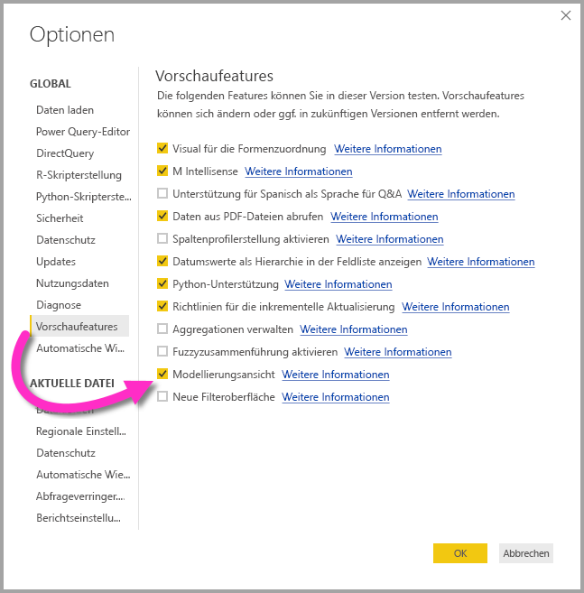
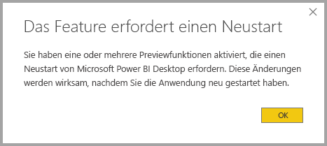
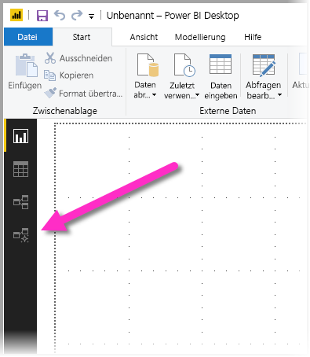
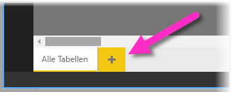
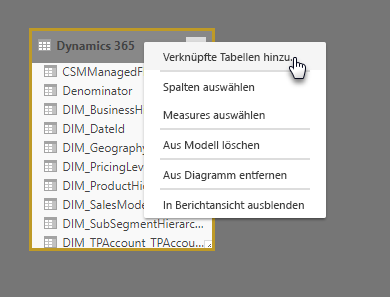
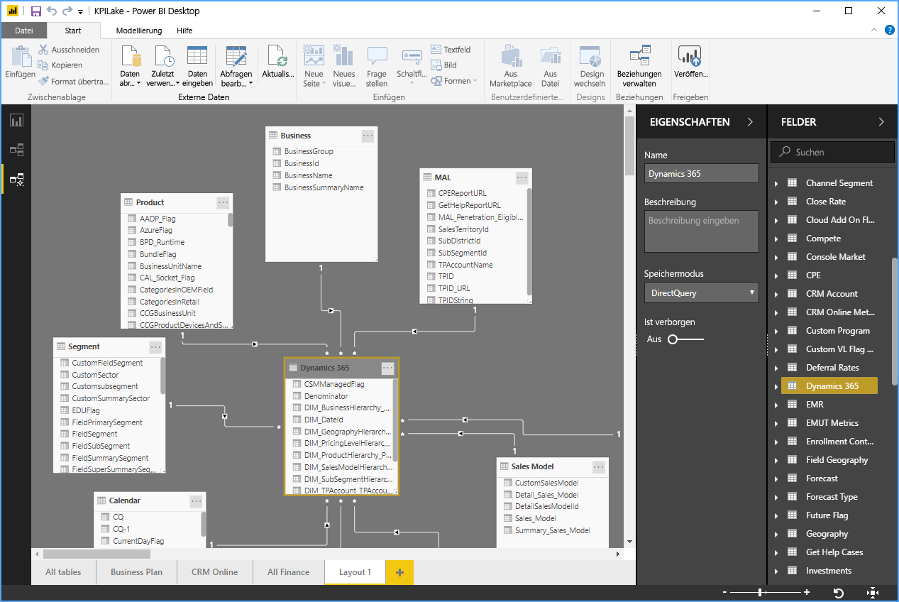

# Modellierungsansicht in Power BI Desktop (Vorschau)

Die **Modellierungsansicht** in **Power BI Desktop** erlaubt es Ihnen, komplexe Datasets mit vielen Tabellen anzuzeigen und mit diesen zu arbeiten. Die Modellierungsansicht ermöglicht Folgendes:

## Aktivieren des Vorschaufeatures „Modellierungsansicht“

Die Modellierungsansicht befindet sich in der Vorschau und muss in **Power BI Desktop** aktiviert werden. Um die Modellierungsansicht zu aktivieren, wählen Sie **Datei > Optionen und Einstellungen > Optionen > Vorschaufeatures** und aktivieren dann das Kontrollkästchen **Modellierungsansicht** wie im folgenden Screenshot gezeigt wird.

Sie werden aufgefordert, **Power BI Desktop** neu zu starten, damit das Vorschaufeature aktiviert wird. 

## Verwenden der Modellierungsansicht

Um auf die Modellierungsansicht zuzugreifen, wählen Sie das Symbol „Modellierungsansicht“ aus, das im linken Bereich von **Power BI Desktop** angezeigt wird, siehe nachstehende Abbildung.

## Erstellen separater Diagramme

Mit der Modellierungsansicht können Sie Diagramme Ihres Modells erstellen, die nur eine Teilmenge der Tabellen in Ihrem Modell umfassen. So erhalten Sie einen klareren Überblick über die Tabellen, mit denen Sie arbeiten möchten, und es kann die Arbeit mit komplexen Datasets erleichtern. Um ein neues Diagramm zu erstellen, das nur einen Teil der Tabellen enthält, klicken Sie auf das **+**-Zeichen neben der Registerkarte **Alle Tabellen** im unteren Bereich des Power BI Desktop-Fensters.

Sie können anschließend eine Tabelle aus der Liste **Felder** auf die Diagrammoberfläche ziehen. Klicken Sie mit der rechten Maustaste auf die Tabelle, und wählen Sie anschließend im angezeigten Menü die Option **Verknüpfte Tabellen hinzufügen** aus.

Hierdurch werden alle mit der ursprünglichen Tabelle verknüpften Tabellen im neuen Diagramm angezeigt. Die folgende Abbildung zeigt, wie verknüpfte Tabellen angezeigt werden, nachdem die Menüoption **Verknüpfte Tabellen hinzufügen** ausgewählt wurde.

## Festlegen allgemeiner Eigenschaften

Sie können in der Modellierungsansicht einem Arbeitsschritt mehrere Objekte auswählen, indem Sie die **STRG**-Taste gedrückt halten und auf mehrere Tabellen klicken. Wenn Sie mehrere Tabellen auswählen, werden diese in der Modellierungsansicht hervorgehoben dargestellt. Nach der Auswahl mehrerer Tabellen werden Änderungen, die im Bereich **Eigenschaften** durchgeführt werden, auf alle ausgewählten Tabellen angewendet.

Sie können beispielsweise den [Speichermodus](desktop-storage-mode.md) für mehrere Tabellen in Ihrer Diagrammansicht ändern, indem Sie die **STRG**-Taste gedrückt halten, mehrere Tabellen auswählen und dann die Einstellung für den Speichermodus im Bereich **Eigenschaften** ändern.

## Nächste Schritte

Die folgenden Artikeln enthalten weitere Informationen über Datenmodelle sowie Details zu DirectQuery.

* [Aggregationen in Power BI Desktop (Vorschau)](desktop-aggregations.md)
* [Zusammengesetzte Modelle in Power BI Desktop (Vorschau)](desktop-composite-models.md)
* [Speichermodus in Power BI Desktop (Vorschau)](desktop-storage-mode.md)
* [m:n-Beziehungen in Power BI Desktop (Vorschau)](desktop-many-to-many-relationships.md)

Artikel zu DirectQuery:

* [Verwendung von DirectQuery in Power BI](desktop-directquery-about.md)
* [Von DirectQuery in Power BI unterstützte Datenquellen](desktop-directquery-data-sources.md)
