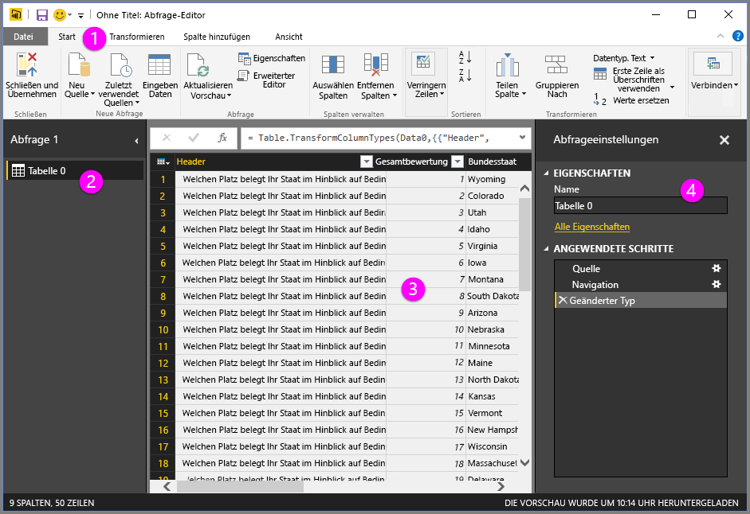
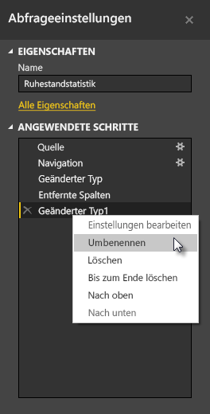
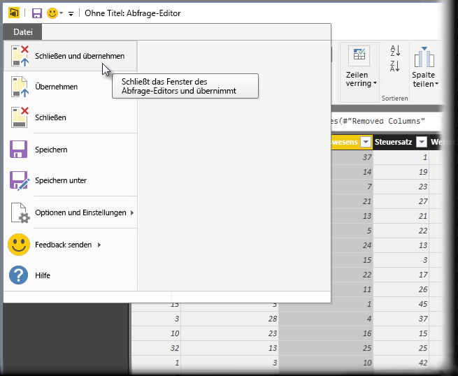

# Abfrageübersicht in Power BI Desktop
Mit **Power BI Desktop** stellen Sie eine Verbindung zur Welt der Daten her, erstellen überzeugende und fundierte Berichte und teilen Ihre Ergebnisse mit anderen Personen, die dann auf Ihrer Arbeit aufbauen und so ihr Business Intelligence-Potenzial erweitern können.

Power BI Desktop verfügt über drei Ansichten:

* Ansicht **Bericht**: Hier verwenden Sie von Ihnen erstellte Abfragen, um ansprechende Visualisierungen zu erstellen. Sie können diese wie gewünscht anordnen und mehrere Seiten verwenden, die Sie für andere Benutzer freigeben können.
* Ansicht **Daten**: Hier können Sie die Daten Ihres Berichts im Datenmodellformat anzeigen und Measures hinzufügen, neue Spalten erstellen und Beziehungen verwalten.
* Ansicht **Beziehungen**: Hier können Sie eine grafische Darstellung der Beziehungen abrufen, die in Ihrem Datenmodell eingerichtet wurden, und diese je nach Bedarf verwalten oder ändern.

Sie greifen auf diese Ansichten zu, indem Sie eines der drei Symbole links in Power BI Desktop auswählen. In der folgenden Abbildung ist die Ansicht „Bericht“ ausgewählt, was durch den gelben Streifen neben dem Symbol angezeigt wird.  

Power BI Desktop enthält auch einen **Abfrage-Editor**, mit dem Sie eine Verbindung mit einer oder mehreren Datenquellen herstellen, die Daten gemäß Ihren Anforderungen strukturieren und transformieren und das Modell dann in Power BI Desktop laden können.

Dieses Dokument enthält eine Übersicht über die Arbeit mit Daten im **Abfrage-Editor**. Es gibt noch mehr zu lernen. Am Ende dieses Dokuments finden Sie Links, über die Sie ausführliche Anleitungen zu unterstützten Datentypen, zum Herstellen einer Verbindung zu Daten, zum Strukturieren von Daten und zum Erstellen von Beziehungen aufrufen können und erfahren, wie Sie mit der Arbeit beginnen.

Zuerst machen wir uns aber mit dem **Abfrage-Editor**vertraut.

## Abfrage-Editor
Sie greifen auf den **Abfrage-Editor** zu, indem Sie in Power BI Desktop auf der Registerkarte **Start** die Option **Abfragen bearbeiten** auswählen.  

Solange noch keine Datenverbindungen hergestellt wurden, ist der **Abfrage-Editor** ein leerer Bereich, der auf Daten wartet.  

Sobald eine Abfrage geladen wurde, werden im **Abfrage-Editor** weitere Informationen angezeigt. Wenn Sie eine Verbindung mit der folgenden Webdatenquelle herstellen, lädt der **Abfrage-Editor** Informationen zu den Daten, mit deren Strukturierung Sie anschließend beginnen können.

[*http://www.bankrate.com/finance/retirement/best-places-retire-how-state-ranks.aspx*](http://www.bankrate.com/finance/retirement/best-places-retire-how-state-ranks.aspx)

Hier ist dargestellt, wie der **Abfrage-Editor** nach dem Herstellen der Datenverbindung aussieht:

1. Im Menüband sind jetzt viele Schaltflächen aktiv, über die Sie die Daten in der Abfrage interaktiv bearbeiten können.
2. Im linken Bereich sind die Abfragen aufgelistet und stehen zur Auswahl, Ansicht und Strukturierung bereit.
3. Im mittleren Bereich werden die Daten der ausgewählten Abfrage angezeigt und können strukturiert werden.
4. Das Fenster **Abfrageeinstellungen** wird angezeigt, in dem die Eigenschaften der Abfrage und die angewendeten Schritte aufgelistet sind.  
   
   

In den folgenden Abschnitten sehen wir uns alle vier Bereiche an – das Menüband, den Abfragebereich, die Datenansicht und der Bereich "Abfrageeinstellungen".

## Menüband der Ansicht „Abfrage“
Das Menüband im **Abfrage-Editor** enthält vier Registerkarten: **Start**, **Transformieren**, **Spalte hinzufügen** und **Ansicht**.

Die Registerkarte **Start** enthält allgemeine Abfrageaufgaben sowie die Option **Daten abrufen** (der erste Schritt bei jeder Abfrage). In der folgenden Abbildung ist das Menüband mit der Registerkarte **Start** dargestellt.  

Um eine Verbindung zu Daten herzustellen und mit dem Erstellen der Abfrage zu beginnen, wählen Sie die Schaltfläche **Daten abrufen** aus. Ein Menü mit den am häufigsten verwendeten Datenquellen wird angezeigt.  

Weitere Informationen zu verfügbaren Datenquellen finden Sie unter **Datenquellen**. Informationen zum Verbinden mit Daten sowie entsprechende Beispiele und Schritte finden Sie unter **Verbinden mit Daten**.

Auf der Registerkarte **Transformieren** haben Sie Zugriff auf allgemeine Aufgaben zum Transformieren der Daten, z. B. Hinzufügen oder Entfernen von Spalten, Ändern des Datentyps, Teilen von Spalten oder andere datenbezogene Aufgaben. In der folgenden Abbildung ist die Registerkarte **Transformieren** dargestellt.  

Weitere Informationen zum Transformieren von Daten sowie Beispiele hierzu finden Sie unter **Kombinieren und Strukturieren von Daten**.

Die Registerkarte **Spalte hinzufügen** enthält weitere Aufgaben im Zusammenhang mit dem Hinzufügen einer Spalte, dem Formatieren von Spaltendaten und dem Hinzufügen benutzerdefinierter Spalten. In der folgenden Abbildung ist die Registerkarte **Spalte hinzufügen** dargestellt.  

Die Registerkarte **Ansicht** im Menüband wird zum Umschalten der Anzeige bestimmter Bereiche oder Fenster verwendet. Sie dient auch zum Anzeigen von "Erweiterter Editor". In der folgenden Abbildung ist die Registerkarte **Ansicht** dargestellt.  

Es ist hilfreich zu wissen, dass viele der im Menüband verfügbaren Aufgaben auch über das Kontextmenü (Rechtsklick auf eine Spalte oder andere Daten im mittleren Bereich) aufgerufen werden können.

## Linker Bereich
Im linken Bereich werden die Anzahl der aktiven Abfragen sowie der Name der Abfrage angezeigt. Wenn Sie im linken Bereich eine Abfrage auswählen, werden die entsprechenden Daten im mittleren Bereich angezeigt, in dem Sie die Daten nach Ihren Anforderungen strukturieren und transformieren können. Die folgende Abbildung zeigt den linken Bereich mit mehreren Abfragen.  

## Mittlerer Bereich (Datenbereich)
Im mittleren Bereich bzw. Datenbereich werden die Daten der ausgewählten Abfrage angezeigt und können strukturiert werden. Hier werden die meisten Aufgaben der Ansicht „Abfrage“ ausgeführt.

In der folgenden Abbildung wird die bereits früher erstellte Webdatenverbindung angezeigt. Die Spalte **Gesamtpunktzahl** ist ausgewählt, und durch Rechtsklick auf die Überschrift werden die im Kontextmenü verfügbaren Elemente angezeigt. Beachten Sie, dass viele Kontextmenüelemente auch als Schaltflächen auf den Registerkarten im Menüband verfügbar sind.  

Bei Auswahl eines Kontextmenüelements (oder einer Schaltfläche im Menüband) wendet die Abfrage den Schritt auf die Daten an und speichert ihn als Teil der Abfrage. Die Schritte werden im Bereich **Abfrageeinstellungen** in der entsprechenden Reihenfolge aufgezeichnet, wie im nächsten Abschnitt beschrieben.  

## Bereich „Abfrageeinstellungen“
Im Bereich **Abfrageeinstellungen** werden alle Schritte angezeigt, die mit einer Abfrage verbunden sind. Im folgenden Bild geht aus dem Bereich **Abfrageeinstellungen** unter **Angewendete Schritte** beispielsweise hervor, dass wir gerade den Typ der Spalte **Gesamtpunktzahl** geändert haben.

Beim Anwenden weiterer Strukturierungsschritte auf die Abfrage werden auch diese im Bereich **Angewendete Schritte** erfasst.

Es ist wichtig zu wissen, dass die zugrunde liegenden Daten *nicht* geändert werden. Die Abfrage passt nur die Ansicht und Struktur der Daten an. Jegliche Interaktion mit den Basisdaten erfolgt in der von der Abfrage strukturierten und modifizierten Ansicht dieser Daten.

Im Bereich **Abfrageeinstellungen** können Sie Schritte nach Bedarf umbenennen, löschen oder neu anordnen. Klicken Sie dazu mit der rechten Maustaste in den Bereich **Angewendete Schritte** , und nehmen Sie im Kontextmenü die gewünschte Auswahl vor. Alle Abfrageschritte werden in der Reihenfolge ausgeführt, in der sie im Bereich **Angewendete Schritte** aufgeführt sind.

## Erweiterter Editor
Wenn Sie den Code anzeigen möchten, den der Abfrage-Editor bei jedem Schritt erzeugt, oder wenn Sie Ihren eigenen Strukturierungscode erstellen möchten, können Sie das im Fenster **Erweiterter Editor**tun. Zum Starten des erweiterten Editors wählen Sie **Ansicht** im Menüband und dann **Erweiterter Editor**aus. Ein Fenster wird geöffnet, in dem der Code der vorhandenen Abfrage angezeigt wird.  

Im Fenster **Erweiterter Editor** können Sie den Code direkt bearbeiten. Zum Schließen des Fensters wählen Sie die Schaltfläche **Fertig** oder **Abbrechen** aus.  

## Speichern der Arbeit
Wenn sich Ihre Abfrage an der gewünschten Position befindet, können Sie den Abfrage-Editor die Änderungen am Datenmodell in Power BI Desktop anwenden lassen und den Abfrage-Editor dann schließen. Wählen Sie hierzu im Abfrage-Editor im Menü **Datei** die Option **Schließen und übernehmen** aus.  

Während des weiteren Verlaufs stellt Power BI Desktop ein Dialogfeld zum Anzeigen des Status bereit.  

Nachdem Sie die Abfrage in der gewünschten Weise erstellt haben oder wenn Sie einfach nur sichergehen möchten, dass Ihre Arbeit gespeichert ist, kann Power BI Desktop Ihre Arbeit in Form einer PBIX-Datei speichern.

Wählen Sie zum Speichern Ihrer Arbeit **Datei \> Speichern** (oder **Datei \> Speichern unter**) aus, wie in der folgenden Abbildung gezeigt.  

## Nächste Schritte
Mit Power BI Desktop können Sie viele Aufgaben ausführen. Weitere Informationen zu den Funktionen und Möglichkeiten finden Sie in folgenden Ressourcen:

* [Erste Schritte mit Power BI Desktop](desktop-getting-started.md)
* [Datenquellen in Power BI Desktop](desktop-data-sources.md)
* [Verbinden mit Daten in Power BI Desktop](desktop-connect-to-data.md)
* [Strukturieren und Kombinieren von Daten mit Power BI Desktop](desktop-shape-and-combine-data.md)
* [Allgemeine Abfrageaufgaben in Power BI Desktop](desktop-common-query-tasks.md)   

