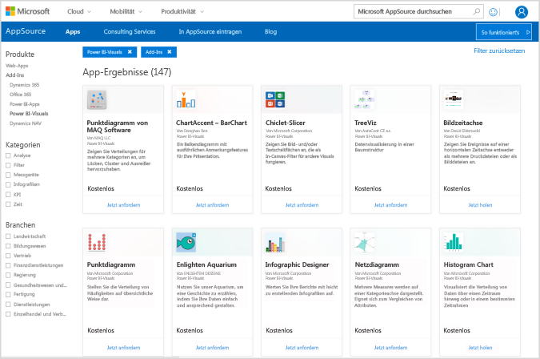
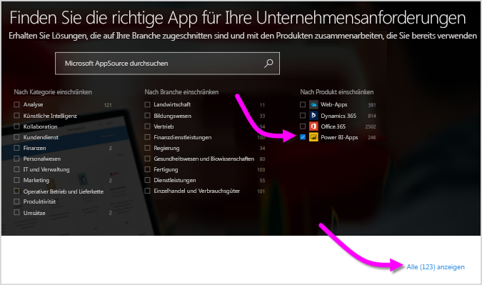
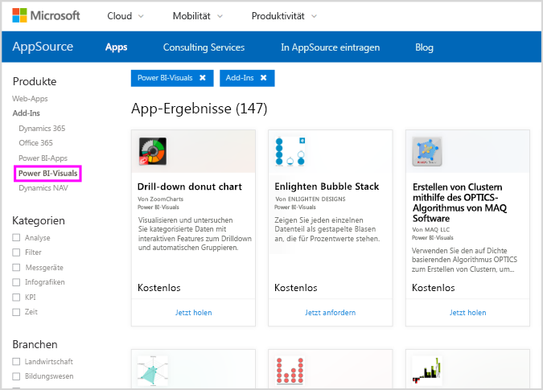
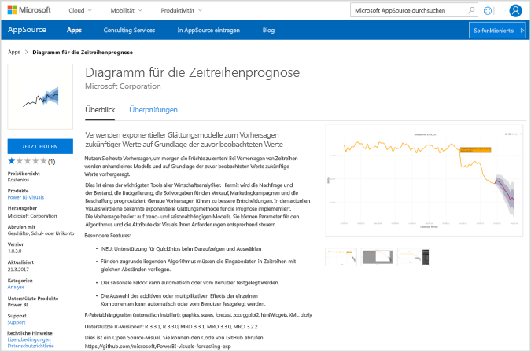
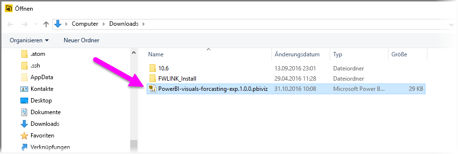
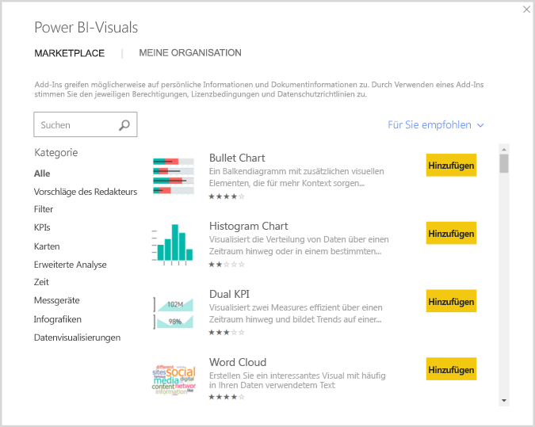

# Verwenden von R-gestützten, benutzerdefinierten Visualisierungen in Power BI
In **Power BI Desktop** und im **Power BI-Dienst** können Sie R-gestützte benutzerdefinierte Visuals erstellen, ganz ohne Kenntnisse von R und ohne Skripts in R zu verfassen. Dadurch können Sie die analytischen Möglichkeiten von R-Visualisierungen und R-Skripten nutzen, ohne R erlernen oder in R programmieren zu müssen.

Um R-gestützte benutzerdefinierte Visuals zu verwenden, wählen Sie das gewünschte benutzerdefinierte R-Visual im [**AppSource**](https://appsource.microsoft.com/marketplace/apps?product=power-bi-visuals&page=1)-Katalog der **benutzerdefinierten Visuals** für Power BI aus, und laden Sie es herunter.

In den folgenden Abschnitten wird beschrieben, wie Sie R-gestützte Visualisierungen in **Power BI Desktop** auswählen, laden und verwenden können.

## Verwenden benutzerdefinierter R-Visuals
Um R-gestützte, benutzerdefinierte Visuals zu verwenden, laden Sie die einzelnen Visuals aus der Bibliothek **Custom visuals** (Benutzerdefinierte Visuals) herunter. Dann können Sie die diese wie jedes andere Visual in **Power BI Desktop** verwenden. Es gibt zwei Möglichkeiten, benutzerdefinierte Visuals zu erhalten: Sie können sie von der **AppSource**-Website herunterladen, oder Sie können sie in **Power BI Desktop** suchen und importieren. 

### Herunterladen benutzerdefinierter Visuals aus AppSource

Befolgen Sie die folgenden Schritte, um benutzerdefinierte Visuals auf der **AppSource**-Website zu suchen und auszuwählen:

1. Navigieren Sie in [https://appsource.microsoft.com](https://appsource.microsoft.com/) zum Power BI-Visualkatalog. Aktivieren Sie unter *Suche einschränken (Produkt)* das Kontrollkästchen *Power BI-Apps*, und wählen Sie dann den Link **Alle anzeigen** aus.
   
   

2. Wählen Sie auf der Bibliotheksseite der [Power BI-Visuals](https://appsource.microsoft.com/marketplace/apps?product=power-bi-visuals&page=1) in der Liste der Add-Ins im linken Bereich **Power BI-Visuals** aus.

   

3. Wählen Sie im Katalog das **Visual** aus, das Sie verwenden möchten. Anschließend wird eine Seite mit einer Beschreibung des Visuals geöffnet. Klicken Sie auf die Schaltfläche **Jetzt holen**, um das Visual herunterzuladen.
   
   > [!NOTE]
    > Für die Erstellung in **Power BI Desktop** muss R auf Ihrem lokalen Rechner installiert sein. Wenn ein Benutzer ein R-gestütztes Visual im **Power BI-Dienst** betrachten möchte, ist allerdings keine lokale Installation von R erforderlich.
   > 
   > 
   
   
   
   Um R-gestützte, benutzerdefinierte Visualisierungen im **Power BI-Dienst** zu verwenden, brauchen Sie R nicht zu installieren. Wenn Sie R-gestützte, benutzerdefinierte Visualisierungen hingegen in **Power BI Desktop** verwenden möchten, *müssen* Sie R auf dem lokalen Computer installieren. Hier können Sie R herunterladen:
   
   * [CRAN](https://cran.r-project.org/)
   * [MRO](https://mran.microsoft.com/)

4. Sobald das Visual (wie jede andere Datei über den Browser) heruntergeladen wurde, wechseln Sie zu **Power BI Desktop**, klicken Sie im Bereich **Visuals** auf die Auslassungspunkte (...), und wählen Sie **Aus Datei importieren** aus.
   
   
5. Sie erhalten eine Warnmeldung zum Importieren benutzerdefinierter Visualisierungen hingewiesen wie in der folgenden Abbildung:
   
   
6. Navigieren Sie zum Speicherort der Visualisierungsdatei, und wählen Sie diese aus. In **Power BI Desktop** verfügen benutzerdefinierte Visualisierungen über die Dateierweiterung „.pbiviz“.
   
   
7. Wenn Sie zu Power BI Desktop zurückkehren, sehen Sie den neuen Visualtyp im Bereich **Visualisierungen**.
   
   
8. Wenn Sie die neue Visualisierung importieren (oder einen Bericht mit einer R-gestützten, benutzerdefinierten Visualisierung öffnen), werden die erforderlichen R-Pakete von **Power BI Desktop** automatisch installiert.
   
   

9. Danach können Sie dieser wie jeder anderen Visualisierung in **Power BI Desktop** Daten hinzufügen. Nach Abschluss des Vorgangs sehen Sie die fertige Visualisierung auf der Zeichenfläche. In der folgenden Visualisierung wurde die R-gestützte Visualisierung **Forecasting** mit Daten aus den UN-Prognosen zur Geburtenrate (linke Visualisierung) verwendet.

    

    Wie jede andere Visualisierung in **Power BI Desktop** können Sie diesen R-gestützten visualisierten Bericht im **Power BI-Dienst** veröffentlichen und für andere freigeben.

    Es lohnt sich, die Bibliothek häufiger zu besuchen, da regelmäßig neue Visuals hinzugefügt werden.

### Importieren benutzerdefinierter Visuals in **Power BI Desktop** 

1. Sie können benutzerdefinierte Visuals auch in **Power BI Desktop** importieren. Klicken Sie in **Power BI Desktop** auf die Auslassungspunkte (...) im Bereich **Visuals**, und wählen Sie **Aus Marketplace importieren** aus.
   
   

2. Anschließend wird das Dialogfeld **Power BI-Visuals** angezeigt, in dem Sie durch die verfügbaren benutzerdefinierten Visuals scrollen und das gewünschte Visual auswählen können. Sie können anhand des Namens suchen, eine Kategorie auswählen oder einfach durch die verfügbaren Visuals scrollen. Wenn Sie Ihre Auswahl getroffen haben, wählen Sie einfach **Hinzufügen** aus, um das benutzerdefinierte Visual zu **Power BI Desktop** hinzuzufügen.

   

## Beisteuern R-gestützter benutzerdefinierter Visuals
Wenn Sie für Ihre Berichte eigene R-Visualisierungen erstellen, können Sie diese für Benutzer auf der ganzen Welt über den **Katalog mit benutzerdefinierten Visualisierungen** freigeben. Beiträge werden über GitHub eingereicht. Dieser Vorgang wird hier beschrieben:

* [Contributing to the R-powered custom visuals gallery (in englischer Sprache)](https://github.com/Microsoft/PowerBI-visuals#building-r-powered-custom-visual-corrplot)

## Problembehandlung für R-gestützte benutzerdefinierte Visuals
R-gestützte benutzerdefinierte Visualisierungen weisen bestimmte Abhängigkeiten auf, die berücksichtigt werden müssen, damit die Visualisierungen ordnungsgemäß ausgeführt werden. Wenn R-gestützte benutzerdefinierte Visualisierungen nicht ordnungsgemäß ausgeführt oder geladen werden, hat das Problem in der Regel eine der folgenden Ursachen:

* Die R-Engine fehlt.
* Fehler im R-Skript, auf dem die Visualisierung basiert.
* R-Pakete fehlen oder sind veraltet.

Im folgenden Abschnitt werden die Schritte beschrieben, mit denen Sie ggf. auftretende Probleme beheben können.

### Fehlende oder veraltete R-Pakete
Beim Installieren einer R-gestützten benutzerdefinierten Visualisierung können Fehler auftreten, wenn R-Pakete fehlen oder veraltet sind. Dies hat i. d. R. eine der folgenden Ursachen:

* Die R-Installation ist mit dem R-Paket nicht kompatibel.
* Die Firewall, Antivirensoftware oder Proxyeinstellungen verhindern die Verbindung von R mit dem Internet.
* Die Internetverbindung ist langsam, oder es besteht ein Problem bei der Internetverbindung.

Das Power BI-Team arbeitet daran, diese Probleme zu beheben, bevor sie bei Ihnen auftreten, und die nächste Version von Power BI Desktop enthält Updates zum Beheben dieser Probleme. Bis dahin können Sie einen oder mehrere der folgenden Schritte ausführen, um die Probleme zu entschärfen:

1. Entfernen Sie die benutzerdefinierte Visualisierung, und installieren Sie sie dann erneut. Hierdurch wird eine erneute Installation der R-Pakete initiiert.
2. Wenn die Installation von R nicht aktuell ist, führen Sie ein Upgrade der R-Installation durch. Entfernen Sie dann das benutzerdefinierte Visual, und installieren Sie es erneut, wie im vorherigen Schritt beschrieben.
   
   In der Beschreibung jeder R-gestützten benutzerdefinierten Visualisierung werden die unterstützten R-Versionen aufgeführt, wie in der folgenden Abbildung dargestellt.
   
     
     > [!NOTE]
    > Sie können die ursprüngliche R-Installation beibehalten und Power BI Desktop lediglich der aktuellen Version zuordnen, die Sie installieren. Wählen Sie **„Datei“ > „Optionen und Einstellungen“ -> „Optionen“ > „R-Skripterstellung“** aus.
    >
    >
3. Installieren Sie R-Pakete mit einer beliebigen R-Konsole manuell. Die Schritte dieser Vorgehensweise lauten wie folgt:
   
   a.  Laden Sie das Installationsskript für das R-gestützte Visual herunter, und speichern Sie die Datei auf einem lokalen Laufwerk.
   
   b.  Führen Sie in der R-Konsole den folgenden Befehl aus:
   
       > source(“C:/Users/david/Downloads/ScriptInstallPackagesForForecastWithWorkarounds.R”)    
   
   Typische Standardinstallationspfade lauten wie folgt:
   
       c:\Program Files\R\R-3.3.x\bin\x64\Rterm.exe (for CRAN-R)
       c:\Program Files\R\R-3.3.x\bin\x64\Rgui.exe (for CRAN-R)
       c:\Program Files\R\R-3.3.x\bin\R.exe (for CRAN-R)
       c:\Program Files\Microsoft\MRO-3.3.x\bin\R.exe (for MRO)
       c:\Program Files\Microsoft\MRO-3.3.x\bin\x64\Rgui.exe (for MRO)
       c:\Program Files\RStudio\bin\rstudio.exe (for RStudio)
4. Wenn das Problem durch die vorherigen Schritte nicht behoben wird, versuchen Sie Folgendes:
   
   a. Verwenden Sie **R Studio**, und führen Sie den oben in 3.b. beschriebenen Schritt aus (die Skriptzeile in der R-Konsole ausführen).
   
   b. Wenn das Problem durch den vorherigen Schritt nicht behoben wird, wählen Sie in **R Studio** die Option **Tools > Global Options > Packages** (Extras > Globale Optionen > Pakete) aus, aktivieren Sie das Kontrollkästchen **Use Internet Explorer library/proxy for HTTP** (Internet Explorer-Bibliothek/-Proxy für HTTP verwenden), und wiederholen Sie dann Schritt 3.b. aus den oben genannten Schritten.

## Nächste Schritte
Betrachten Sie die folgenden zusätzlichen Informationen über R in Power BI.

* [Power BI-Katalog mit benutzerdefinierten Visualisierungen](https://app.powerbi.com/visuals/)
* [Ausführen von R-Skripts in Power BI Desktop](desktop-r-scripts.md)
* [Erstellen von visuellen R-Elementen in Power BI Desktop](desktop-r-visuals.md)
* [Verwenden einer externen R-IDE mit Power BI](desktop-r-ide.md)

