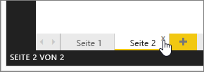
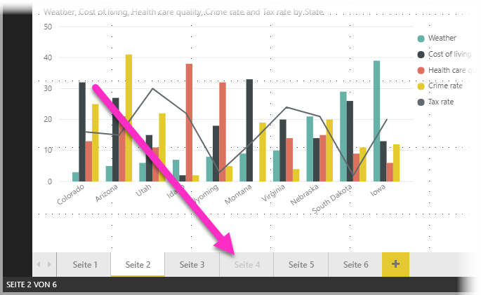

# Berichtsansicht in Power BI Desktop
Wenn Sie bereits mit Power BI gearbeitet haben, wissen Sie, wie einfach Berichte erstellt werden können, die dynamische Perspektiven und Einblicke in Ihre Daten bereitstellen. Power BI verfügt in Power BI Desktop zudem über weitere komplexe Funktionen. Mit Power BI Desktop können Sie komplexe Abfragen erstellen, Daten aus mehreren Quellen kombinieren, Beziehungen zwischen Tabellen erstellen usw.

Power BI Desktop enthält die **Berichtsansicht**, in der sich beliebig viele Berichtseiten mit Visualisierungen erstellen lassen. Die Berichtsansicht bietet größtenteils dieselbe Benutzererfahrung wie die Bearbeitungsansicht für Berichte im Power BI-Dienst. Sie können Visualisierungen verschieben, kopieren, einfügen, zusammenführen usw.

Der Unterschied besteht darin, dass Sie in Power BI Desktop mit Ihren Abfragen und Ihrem Modell arbeiten können, sodass Ihre Daten optimale Einblicke in Ihre Berichte ermöglichen. Sie können die Power BI Desktop-Datei dann jederzeit entweder auf dem lokalen Laufwerk oder in der Cloud speichern.

## Schauen wir uns das mal an!
Wenn Sie zum ersten Mal Daten in Power BI Desktop laden, wird die **Berichtsansicht** mit einem leeren Zeichenbereich angezeigt.

Sie können zwischen der **Berichtsansicht**, der **Datenansicht** und der **Beziehungsansicht** wechseln, indem Sie auf die Symbole auf der linken Navigationsleiste klicken:

Nachdem Sie einige Daten hinzugefügt haben, können Sie Felder zu einer neuen Visualisierung im Zeichenbereich hinzufügen.

Wenn Sie den Typ der Visualisierung ändern möchten, können Sie ihn auf dem Menüband über die Gruppe **Visualisierung** auswählen, oder Sie klicken mit der rechten Maustaste und wählen einen anderen Typ über das Symbol **Visualisierungstyp ändern** aus.

> [!TIP]
> Experimentieren Sie mit den verschiedenen Visualisierungstypen, um einen Eindruck zu erhalten. Es ist wichtig, dass die Visualisierungen die in Ihren Daten enthaltenen Informationen verständlich zum Ausdruck bringen.
> 
> 

Ein Bericht verfügt zu Beginn über mindestens eine leere Seite. Die Seiten werden im Navigationsbereich direkt links neben dem Zeichenbereich angezeigt. Sie können einer Seite beliebige Arten von Visualisierungen hinzufügen, aber es ist wichtig, dies nicht zu übertreiben. Zu viele Visualisierungen auf einer Seite wirken überladen und unübersichtlich, sodass entsprechende Informationen schwer zu finden sind. Klicken Sie auf dem Menüband einfach auf **Neue Seite** , um neue Seiten zum Bericht hinzuzufügen.

Klicken Sie auf das **X** auf der Registerkarte der Seite am unteren Rand der Berichtsansicht, um eine Seite zu löschen.

> [!NOTE]
> Berichte und Visualisierungen können nicht an ein Dashboard aus Power BI Desktop angeheftet werden. Dazu müssen Sie eine [Veröffentlichung aus Power BI Desktop](desktop-upload-desktop-files.md) auf Ihre Power BI-Website durchführen.

## Ausblenden von Berichtsseiten

Wenn Sie einen Bericht erstellen, können Sie Seiten aus diesem verbergen. Dies kann nützlich sein, wenn Sie zugrunde liegende Daten oder Visuals in einem Bericht erstellen müssen, diese Seiten jedoch nicht für Dritte sichtbar sein sollen, also wenn Sie z.B. Tabellen oder unterstützende Visuals erstellen, die auf anderen Berichtsseiten verwendet werden. Es gibt viele weitere kreative Gründe dafür, eine Berichtsseite zunächst zu erstellen und dann aus einem Bericht auszublenden, den Sie veröffentlichen möchten. 

Das Ausblenden einer Berichtsseite ist einfach. Klicken Sie einfach mit der rechten Maustaste auf die Registerkarte „Berichtsseite“, und klicken Sie im angezeigten Menü auf **Ausblenden**.

Sie sollten Folgendes bedenken, wenn Sie eine Berichtsseite ausblenden:

* Eine ausgeblendete Berichtsansicht wird in **Power BI Desktop** weiterhin angezeigt. Der Titel der Seite ist allerdings abgeblendet. In der folgenden Abbildung ist Seite 4 ausgeblendet.

    

* Eine ausgeblendete Berichtsseite wird Ihnen *nicht* angezeigt, wenn Sie den Bericht im **Power BI-Dienst** anzeigen.

* Beim Ausblenden einer Berichtsseite handelt es sich *nicht* um eine Sicherheitsmaßnahme. Benutzer können weiterhin auf die Seite zugreifen, und Inhalt ist weiterhin über Drillthroughs und andere Methoden verfügbar.

* Wenn eine Seite im Ansichtsmodus ausgeblendet ist, werden keine Navigationspfeile für den Ansichtsmodus angezeigt.

