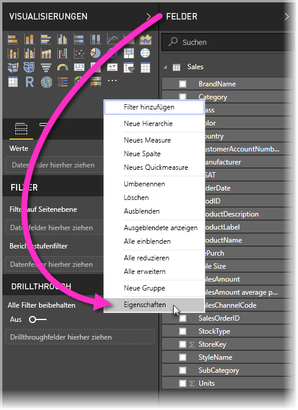
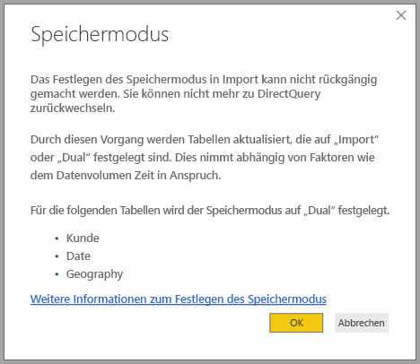

# Speichermodus in Power BI Desktop (Vorschauversion)

In **Power BI Desktop** können Sie für Tabellen den **Speichermodus** festlegen, wodurch gesteuert wird, ob Tabellendaten für Berichte im In-Memory-Cache zwischengespeichert werden sollen. 

Das Festlegen des **Speichermodus** bietet viele Vorteile. Sie können für jede einzelne Tabelle in Ihrem Modell den **Speichermodus** festlegen, wodurch sich für ein einzelnes Dataset mindestens einer der folgenden Vorteile ergibt:

* **Abfrageleistung**: Bei der Interaktion der Benutzer mit Visuals in Power BI-Berichten werden DAX-Abfragen an das Dataset gesendet. Durch die Zwischenspeicherung von Daten im Speicher (mit ordnungsgemäßer Angabe des **Speichermodus**) können die Abfrageleistung und die Interaktivität Ihrer Berichte erhöht werden.
* **Große Datasets**: Tabellen, die nicht zwischengespeichert werden, belegen keinen Speicher für die Zwischenspeicherung. Sie können interaktive Analysen für große Datasets aktivieren, bei denen eine vollständige Zwischenspeicherung im Speicher zu umfangreich oder zu kostspielig wäre. Sie können die Tabellen auswählen, bei denen eine Zwischenspeicherung sinnvoll ist, und solche, bei denen dies nicht der Fall ist.
* **Optimierung der Datenaktualisierung**: Tabellen, die nicht zwischengespeichert werden, müssen nicht aktualisiert werden. Sie können die Aktualisierungszeiten verkürzen, indem Sie nur die Zwischenspeicherung der Daten veranlassen, die erforderlich sind, um Ihre Vereinbarungen zum Servicelevel und Ihre geschäftlichen Anforderungen zu erfüllen.
* **Anforderungen hinsichtlich einer Ausführung nahezu in Echtzeit**: Bei Tabellen, die nahezu in Echtzeit ausführbar sein sollen, ist ein Verzicht auf eine Zwischenspeicherung möglicherweise sinnvoll, um Datenlatenzen zu verringern.
* **Rückschreiben**: Durch das Rückschreiben können Geschäftsbenutzer Was-wäre-wenn-Szenarien durch Änderung von Zellenwerte untersuchen. Benutzerdefinierte Anwendungen können Änderungen an der Datenquelle anwenden. Tabellen, die nicht zwischengespeichert, können Änderungen sofort darstellen, wodurch eine sofortige Analyse der Auswirkungen möglich ist.

Die Einstellung **Speichermodus** in **Power BI Desktop** ist eines von drei in Beziehung stehenden Features:

* **Zusammengesetzte Modelle**: Hierbei kann ein Bericht mehrere Datenverbindungen beinhalten, einschließlich DirectQuery-Verbindungen oder Importe in beliebiger Kombination.
* **m:n Beziehungen**: Mit dem Feature **Zusammengesetzte Modelle** können Sie **m:n-Beziehungen** zwischen Tabellen erstellen, wodurch die Notwendigkeit für eindeutige Werte in Tabellen und frühere Problemumgehungen wie die Einführung neuer Tabellen nur für die Erstellung von Beziehungen entfallen. 
* **Speichermodus**: Ab sofort können Sie angeben, welche Visuals eine Abfrage an Back-End-Datenquellen erfordern, und festlegen, dass Visuals, die keine erfordern, importiert werden, auch wenn diese auf DirectQuery basieren. Hierdurch wird die Leistung verbessert und die Auslastung des Back-Ends verringert. Vorher initiierten sogar einfache Visuals wie Slicer Abfragen, die an Back-End-Quellen gesendet wurden. 

Diese Sammlung aus drei in Beziehung stehenden Features für das Feature **Zusammengesetzte Modelle** werden jeweils in separaten Artikeln beschrieben:

* **Zusammengesetzte Modelle** werden in einem separaten Artikel, [Zusammengesetzte Modelle in Power BI Desktop (Vorschauversion)](desktop-composite-models.md), ausführlich beschrieben.
* **m:n-Beziehungen** werden in einem eigenen Artikel beschrieben, nämlich unter [m:n Beziehungen in Power BI Desktop (Vorschauversion)](desktop-many-to-many-relationships.md).
* Im vorliegenden Artikel wird der **Speichermodus** ausführlich erläutert.

## Aktivieren des Vorschaufeatures „Speichermodus“

Das Feature **Speichermodus** ist in der Vorschauversion verfügbar und muss in **Power BI Desktop** aktiviert werden. Um den **Speichermodus** zu aktivieren, wählen Sie **Datei > Optionen und Einstellungen > Optionen > Vorschaufeatures** aus, und aktivieren Sie anschließend das Kontrollkästchen **Zusammengesetzte Modelle**. 

Sie müssen **Power BI Desktop** neu starten, damit das Feature aktiviert wird.

## Verwenden der Speichermoduseigenschaft

Der **Speichermodus** ist eine Eigenschaft, die Sie für jede Tabelle in Ihrem Modell festlegen können. Markieren Sie zum Festlegen des **Speichermodus** die Tabelle im Bereich **Felder**, und klicken Sie dann mit der rechten Maustaste darauf, um das Kontextmenü aufzurufen. Wählen Sie im Kontextmenü **Eigenschaften** aus.

Die **Speichermodus**-Auswahl wird im Bereich **Feldeigenschaften** der Tabelle angezeigt. Dort können Sie den aktuellen **Speichermodus** anzeigen oder ändern.

Es gibt drei Werte für den **Speichermodus**:

* **Import**: Wenn der Modus auf **Import** festgelegt ist, werden importierte Tabellen zwischengespeichert. Abfragen, die an das Power BI-Dataset gesendet werden, die Daten aus Import-Tabellen zurückgeben, können nur von zwischengespeicherten Daten erfüllt werden.
* **DirectQuery**: Bei dieser Einstellung werden keine DirectQuery-Tabellen zwischengespeichert. Abfragen, die an das Power BI-Dataset (z.B. DAX-Abfragen) gesendet werden, die Daten von DirectQuery-Tabellen zurückgeben, können nur durch Ausführung von bedarfsgesteuerten Abfragen an die Datenquelle erfüllt werden. Die an die Datenquelle gesendeten Abfragen verwenden die Abfragesprache dieser Datenquelle (z.B. SQL).
* **Dual**: Dual-Tabellen können entweder auf zwischengespeichert oder nicht zwischengespeichert werden, abhängig vom Kontext der an das Power BI-Dataset gesendeten Abfrage. In einigen Fällen werden Abfragen von zwischengespeicherten Daten erfüllt, während diese in anderen Fällen durch Ausführung einer bedarfsgesteuerten Abfrage an die Datenquelle geschieht.

Die Änderung einer Tabelle in „Import“ ist ein *nicht rückgängig zu machender* Vorgang, und sie kann nicht wieder in „DirectQuery“ oder „Dual“ geändert werden.

## Einschränkungen für DirectQuery- und Dual-Tabellen

Für Dual-Tabellen gelten dieselben Einschränkungen wie für DirectQuery Tabellen. Hierzu zählen beschränkte M-Transformationen und eingeschränkte DAX-Funktionen in berechneten Spalten. Weitere Informationen finden Sie unter [Auswirkungen der Verwendung von DirectQuery](desktop-directquery-about.md#implications-of-using-directquery).

## Beziehungsregeln für Tabellen mit anderen Speichermodi

Beziehungen müssen auf Grundlage des **Speichermodus** der verknüpften Tabellen Regeln erfüllen. Dieser Abschnitt enthält Beispiele für gültige Kombinationen. Ausführliche Informationen finden Sie unter [m:n-Beziehungen in Power BI Desktop (Vorschauversion)](desktop-many-to-many-relationships.md).

Für ein Dataset mit einer einzelnen Datenquelle gelten die folgenden **1: n**-Beziehungskombinationen:

| Tabelle auf der **n**-Seite | Tabelle auf der **1**-Seite |
| ------------- |----------------------| 
| Dual          | Dual                 | 
| Importieren        | Import oder Dual       | 
| DirectQuery   | DirectQuery oder Dual  | 

## Weitergabe von Dual
Betrachten wir dazu ein Beispiel. Sehen Sie sich das folgende einfache Modell an, bei dem alle Tabellen von einer einzelnen Quelle stammen, die Import und DirectQuery unterstützt.

Nehmen wir an, dass es sich bei allen Tabellen in diesem Modell um DirectQuery-Tabellen handelt. Wenn der **Speichermodus** der *SurveyResponse*-Tabelle in „Import“ geändert wird, wird die folgende Aufforderung angezeigt:

Die Dimensionstabellen (*Customer*, *Date* und *Geography*) müssen auf **Dual** festgelegt werden, damit die zuvor beschriebenen Beziehungsregeln erfüllt werden. Anstatt zu erzwingen, dass diese Tabellen auf **Dual** festgelegt werden müssen, können diese auf einen einzigen Vorgang festgelegt werden.

Die Weitergabelogik ist dafür konzipiert, Modelle mit vielen Tabellen zu unterstützen. Angenommen, Sie haben ein Modell mit 50 Tabellen, und nur bestimmte (transaktionale) Faktentabellen müssen zwischengespeichert werden. Die Logik in **Power BI Desktop** ermittelt die minimale Gruppe von Dimensionstabellen, die auf **Dual** festgelegt werden müssen. Diese Aufgabe fällt damit für Sie weg.

Die Weitergabelogik durchläuft nur eine Seite der **1:n**-Beziehungen.

* Eine Änderung der Tabelle *Customer* in **Import** (statt in *SurveyResponse*) ist aufgrund ihrer Beziehungen zu den DirectQuery-Tabellen *Sales* und *SurveyResponse* nicht zulässig.
* Eine Änderung der Tabelle *Customer* in **Dual** (statt in *SurveyResponse*) ist dagegen zulässig. Die Weitergabelogik legt die Tabelle *Geography* ebenfalls auf **Dual** fest.

## Beispiel für die Verwendung des Speichermodus
Lassen Sie uns mit dem Beispiel aus dem vorherigen Abschnitt fortfahren, und stellen Sie sich vor, die folgenden **Speichermodus**-Eigenschafteneinstellungen würden angewendet werden:

| Tabelle                   | Speichermodus         |
| ----------------------- |----------------------| 
| *Sales*                 | DirectQuery          | 
| *SurveyResponse*        | Importieren               | 
| *Date*                  | Dual                 | 
| *Customer*              | Dual                 | 
| *Geography*             | Dual                 | 

Die Festlegung dieser Eigenschafteneinstellungen für den Speichermodus führt zu folgenden Verhaltensweisen, vorausgesetzt die Tabelle *Sales* weist ein erhebliches Datenvolumen auf.
* Dimensionstabellen (*Date*, *Customer* und *Geography*) werden zwischengespeichert, sodass die anfänglichen Berichtsladezeiten beim Abrufen der anzuzeigenden Slicerwerte kurz bleiben sollten.
* Wird die Tabelle *Sales* nicht zwischengespeichert, führt dies zu folgenden Ergebnissen:
    * Die Datenaktualisierungszeiten werden verbessert und die Speichernutzung wird reduziert.
    * Berichtsabfragen, die auf der Tabelle *Sales* basieren, werden im DirectQuery-Modus ausgeführt. Dies dauert zwar möglicherweise länger, die Ausführung erfolgt jedoch näher in Echtzeit, da keine Zwischenspeicherungslatenzen eingeführt werden.

* Berichtsabfragen, die auf der Tabelle *SurveyResponse* basieren, werden vom In-Memory-Cache zurückgegeben und sollten daher relativ schnell ausgeführt werden.

## Abfragen, die vom Cache ausgeführt oder nicht vom Cache ausgeführt werden

Indem Sie eine Verbindung zwischen dem **SQL Server Profiler** und dem Diagnoseport für **Power BI Desktop** herstellen, können Sie durch Ausführung einer Ablaufverfolgung anhand der folgenden Ereignisse sehen, welche Abfragen vom In-Memory-Cache ausgeführt werden und welche nicht ausgeführt werden:

* Queries Events\Query Begin
* Query Processing\Vertipaq SE Query Begin
* Query Processing\DirectQuery Begin

Überprüfen Sie für jedes *Query Begin*-Ereignis die anderen Ereignisse mit der gleichen *ActivityID*. Angenommen, es gibt kein *DirectQuery Begin*-Ereignis, aber ein *Vertipaq SE Query Begin*-Ereignis, dann wurde die Abfrage vom Cache beantwortet.

Abfragen, die auf Tabellen im **Dual**-Modus verweisen, geben wenn möglich Daten aus dem Cache zurück. Andernfalls werden sie auf DirectQuery zurückgesetzt.

Im Anschluss an das vorherige Beispiel verweist die folgende Abfrage nur auf eine Spalte aus der Tabelle *Date*, die sich im **Dual**-Modus befindet. Aus diesem Grund sollte diese vom Cache ausgeführt werden.

Die folgende Abfrage verweist nur auf eine Spalte aus der Tabelle *Sales*, die sich im **DirectQuery**-Modus befindet. Aus diesem Grund sollte diese *nicht* vom Cache ausgeführt werden.

Die folgende Abfrage ist interessant, da sie beide Spalten kombiniert. Diese Abfrage wird nicht vom Cache ausgeführt. Möglicherweise erwarten Sie zunächst, dass *CalendarYear*-Werte vom Cache und *SalesAmount*-Werte von der Quelle abgerufen werden und kombinieren dann die Ergebnisse, dies wäre jedoch weniger effizient, als den SUM/GROUP BY-Vorgang an das Quellsystem zu übermitteln. Wenn der Vorgang an die Quelle weitergegeben wird, fällt die Anzahl der zurückgegebenen Zeilen wahrscheinlich weitaus geringer aus. 

> [!NOTE]
> Dieses Verhalten unterscheidet sich von [m:n Beziehungen in Power BI Desktop (Vorschauversion)](desktop-many-to-many-relationships.md), wenn zwischengespeicherte und nicht zwischengespeicherte Tabellen kombiniert werden.

## Bedeutung der Synchronisierung von Caches

Die im vorherigen Abschnitt angezeigten Abfragen zeigen, dass **Dual**-Tabellen manchmal vom Cache und manchmal nicht vom Cache ausgeführt werden. Aus diesem Grund können unterschiedliche Werte zurückgegeben werden, wenn der Cache veraltet ist. Bei der Abfrageausführung wird nicht versucht, Datenprobleme, zu maskieren, indem z.B. DirectQuery-Ergebnisse entsprechend den zwischengespeicherten Werten gefiltert werden. Sie müssen bestens mit Ihren Datenflüssen vertraut sein und den Entwurf entsprechend darauf ausrichten. Bei Bedarf können Sie auf etablierte Verfahren zum Umgang mit derartigen Fällen an der Quelle zurückgreifen.

Der Speichermodus **Dual** trägt zur Leistungsoptimierung bei. Er sollte nur auf eine Weise verwendet werden, die nicht die Möglichkeit zur Erfüllung geschäftlicher Anforderungen beeinträchtigt. Ziehen Sie bei anderen Verhaltensweisen ggf. die Verwendung der Methoden in Erwägung, die im Artikel [m:n-Beziehungen in Power BI Desktop (Vorschauversion)](desktop-many-to-many-relationships.md) beschrieben werden.

## Datenansicht
Ist für mindestens eine Tabelle im Dataset der **Speichermodus** auf „Import“ oder „Dual“ festgelegt, wird die Registerkarte **Datenansicht** angezeigt.

Wenn**Dual**- und **Import**-Tabellen in der Datenansicht ausgewählt sind, zeigen diese zwischengespeicherte Daten an. DirectQuery-Tabellen zeigen keine Daten an, und es wird eine Meldung angezeigt, die besagt, dass keine DirectQuery-Tabellen angezeigt werden können.

## Einschränkungen und Überlegungen

Es gibt einige Einschränkungen für dieses Release des **Speichermodus** und deren Korrelation mit **zusammengesetzten Modellen**.

Die folgenden mehrdimensionalen Quellen können nicht mit **zusammengesetzten Modellen** verwendet werden:

* SAP HANA
* SAP Business Warehouse
* SQL Server Analysis Services
* Power BI-Datasets

Wenn mithilfe von DirectQuery eine Verbindung mit diesen mehrdimensionalen Quellen hergestellt wird, können Sie weder eine Verbindung mit einer anderen DirectQuery-Quelle herstellen noch importierte Daten kombinieren.

Die bestehenden Einschränkungen für die Verwendung von DirectQuery gelten nach wie vor für die Verwendung des Features **Zusammengesetzte Modelle**. Viele dieser Einschränkungen gelten jetzt abhängig vom **Speichermodus** der Tabelle für eine einzelne Tabelle. Beispielsweise kann eine berechnete Spalte in einer importierten Tabelle auf andere Tabellen verweisen, wohingegen eine berechnete Spalte in einer DirectQuery-Tabelle nach wie vor nur auf Spalten in derselben Tabelle verweisen kann. Es gelten weitere Einschränkungen für das Modell als Ganzes, wenn eine der Tabellen im Modell DirectQuery enthält. Die Features **QuickInsights** und **Q&A** sind nicht für Modelle verfügbar, wenn eine der Tabellen den **Speichermodus** von DirectQuery aufweist. 

## Nächste Schritte

Die folgenden Artikeln enthalten weitere Informationen über zusammengesetzte Modelle sowie Details zu DirectQuery.

* [Zusammengesetzte Modelle in Power BI Desktop (Vorschauversion)](desktop-composite-models.md)
* [m:n-Beziehungen in Power BI Desktop (Vorschauversion)](desktop-many-to-many-relationships.md)

Artikel zu DirectQuery:

* [Verwendung von DirectQuery in Power BI](desktop-directquery-about.md)
* [Von DirectQuery in Power BI unterstützte Datenquellen](desktop-directquery-data-sources.md)

