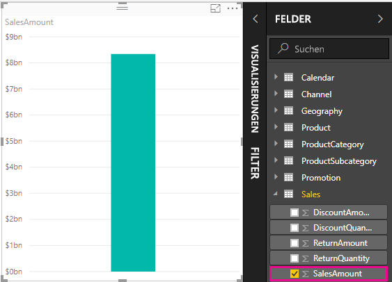
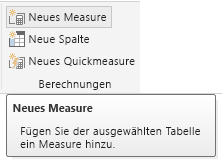
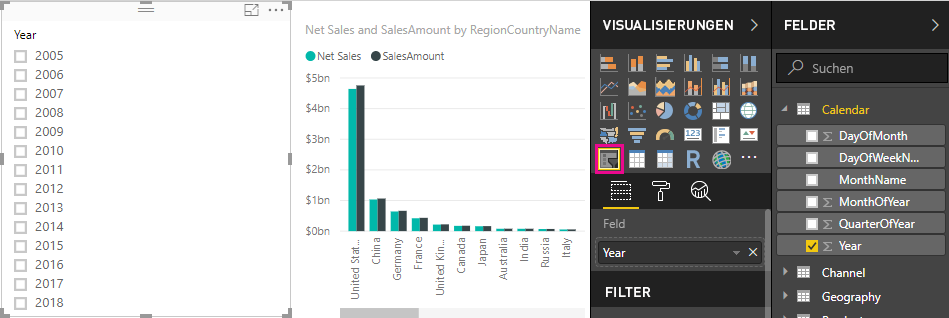

# Tutorial: Erstellen eigener Measures in Power BI Desktop
Einige der leistungsstärksten Data Analysis-Lösungen in Power BI Desktop können mithilfe von Measures erstellt werden. Measures unterstützen uns, indem sie Berechnungen mit unseren Daten durchführen, während wir mit unseren Berichten interagieren. Dieses Tutorial führt Sie durch die Grundlagen hin zum Erstellen einiger eigener einfacher Measures in Power BI Desktop.

Dieses Artikel richtet sich an Power BI-Benutzer, die mit der Verwendung von Power BI Desktop zum Erstellen etwas fortgeschrittener Modelle bereits vertraut sind. Sie sollten bereits mit der Verwendung von „Daten abrufen“ und des Abfrage-Editors zum Importieren von Daten, dem Arbeiten mit mehreren aufeinander bezogenen Tabellen und dem Hinzufügen von Feldern zur Berichtszeichenfläche vertraut sein. Wenn Sie noch nicht mit Power BI Desktop vertraut sind, sollten Sie [Erste Schritte mit Power BI Desktop](desktop-getting-started.md) lesen.

Um die Schritte in diesem Tutorial ausführen zu können, müssen Sie die Datei [Contoso Sales for Power BI Desktop](http://download.microsoft.com/download/4/6/A/46AB5E74-50F6-4761-8EDB-5AE077FD603C/Contoso%20Sales%20Sample%20for%20Power%20BI%20Desktop.zip) herunterladen. Sie enthält bereits Onlinevertriebsdaten des fiktiven Unternehmens Contoso, Inc. Da die Daten in der Datei aus einer Datenbank importiert wurden, können Sie keine Verbindungen mit der Datenquelle herstellen oder sie im Abfrage-Editor anzeigen. Wenn Sie die Datei auf dem lokalen Computer gespeichert haben, öffnen Sie sie in Power BI Desktop.

## Worum geht es bei Measures überhaupt?
Measures werden in den meisten Fällen automatisch für uns erstellt, etwa wenn wir das Kontrollkästchen neben dem Feld **SalesAmount** (Umsatzbetrag) in der Tabelle **Sales** (Umsatz) in der Feldliste aktivieren oder **SalesAmount** auf die Berichtszeichenfläche ziehen.

Eine neue Diagrammvisualisierung wird angezeigt, wie diese:

Was wir erhalten, ist ein Säulendiagramm, das eine Gesamtsumme der Umsatzwerte aus dem Feld „SalesAmount“ darstellt.  Unser Feld „SalesAmount“ ist einfach nur eine Spalte mit dem Namen „SalesAmount“ in der Tabelle „Sales“, die wir bereits importiert haben.

Die Spalte „SalesAmount“ enthält über zwei Millionen Zeilen mit Umsatzwerten. Sie fragen sich vielleicht, warum Sie keine Tabelle mit Zeilen mit all diesen Werten sehen. Nun, Power BI Desktop weiß, dass alle diese Werte in „SalesAmount“ einen numerischen Datentyp aufweisen und Sie sie vermutlich in irgendeiner Weise zusammenfassen möchten, sei es durch Addition, Mittelwertbildung, Zählung usw.

Immer, wenn Sie in der Liste „Felder“ ein Feld mit einem Sigmasymbol  sehen, bedeutet dies, dass das Feld numerisch ist und seine Werte aggregiert werden können. Wenn wir „SalesAmount“ auswählen, erstellt Power BI Desktop in diesem Fall ein eigenes Measure, und die Summe aller Umsatzbeträge wird berechnet und in unserem Diagramm angezeigt.

Summe ist die Standardaggregation, wenn ein Feld mit einem numerischen Datentyp ausgewählt wird, wir können jedoch recht einfach zu einer anderen Aggregationsart wechseln.

Wenn wir im Bereich **Werte** auf den Abwärtspfeil neben **SalesAmount**klicken, können wir anschließend **Mittelwert**auswählen.

Die Visualisierung ändert sich in einen Mittelwert aller Umsatzwerte im Feld „SalesAmount“.

Wir können die Aggregationsart je nach dem gewünschten Ergebnis ändern, aber nicht alle Aggregationsarten gelten für alle numerischen Datentypen. Für unser Feld „SalesAmount“ z. B. sind „Sum“ (Summe) und „Average“ (Mittelwert) sinnvoll. „Minimum“ und „Maximum“ haben hier auch ihre Berechtigung. „Anzahl“ ist für unser Feld „SalesAmount“ hingegen nicht wirklich sinnvoll, denn seine Werte sind zwar numerisch, aber eigentlich stellen sie eine Währung dar.

Das Konzept von Aggregation ist für das Verständnis von Measures von grundlegender Wichtigkeit, da jedes Measure irgendeine Form von Aggregation durchführt. Wir sehen später noch Beispiele zur Verwendung einer Summenaggregation, wenn Sie ein paar eigene Measures erstellen.

Aus Measures berechnete Werte ändern sich immer in Reaktion auf unsere Interaktionen mit unserem Bericht. Wenn wir z.B. das Feld **RegionCountryName** aus der Tabelle **Geography** auf unser Diagramm ziehen, wird für die Umsatzbeträge für jedes Land der Mittelwert gebildet und dargestellt.

Wenn sich das Ergebnis eines Measures aufgrund einer Interaktion mit unserem Bericht ändert, nehmen wir Einfluss auf den *Kontext* unseres Measures. Bei jeder Interaktion mit Ihrem Bericht ändern Sie den Kontext, in dem ein Measure seine Ergebnisse berechnet und anzeigt.

In den meisten Fällen wird das von Power BI erledigt, und Power BI gibt Werte entsprechend den Feldern, die wir hinzugefügt, und den Aggregationsarten zurück, die wir ausgewählt haben. Aber in anderen Fällen müssen Sie ggf. eigene Measures erstellen, um komplexere, einzigartige Berechnungen durchzuführen.

Mit Power BI Desktop erstellen Sie Ihre eigenen Measures mit der DAX-Formelsprache (Data Analysis Expressions). DAX-Formeln sind Excel-Formeln sehr ähnlich. Tatsächlich verwendet DAX häufig die gleichen Funktionen, Operatoren und die gleiche Syntax wie Excel-Formeln. Allerdings sind die DAX-Funktionen für die Arbeit mit relationalen Daten und zur Durchführung dynamischerer Berechnungen während unserer Interaktion mit Berichten ausgelegt.

Es gibt mehr als 200 DAX-Funktionen, die alles von einfachen Aggregationen wie Summe und Mittelwert bis hinzu komplexeren Statistik- und Filterfunktionen ausführen. Wir gehen an dieser Stelle nicht zu sehr ins Detail, was die DAX-Sprache betrifft, aber es gibt eine Vielzahl von Ressourcen, die Sie beim weiteren Lernen unterstützen. Nachdem Sie dieses Tutorial durchgearbeitet haben, werfen Sie unbedingt einen Blick auf [DAX-Grundlagen in Power BI Desktop](desktop-quickstart-learn-dax-basics.md).

Wenn wir eigene Measures erstellen, werden diese der Liste „Felder“ für die von uns gewünschte Tabelle hinzugefügt. Dies wird als *Modellmeasure* bezeichnet und bleibt als Feld in unserer Tabelle. Einer der großen Vorzüge von Modellmeasures besteht darin, dass wir sie nach Belieben benennen können, was ihre Identifikation erleichtert. Wir können sie außerdem als Argument in anderen DAX-Ausdrücken verwenden, und wir können Measures erstellen, die sehr schnell komplexe Berechnungen ausführen.

## Erstellen wir unser eigenes Measure
Angenommen, wir möchten unseren Nettoumsatz analysieren. Wenn wir unsere Tabelle „Sales“ in der Feldliste betrachten, wird ersichtlich, dass es kein Feld mit dem Namen „NetSales“ (Nettoumsatz) gibt. Wir haben aber die Bausteine, um unser eigenes Measure zum Berechnen des Nettoumsatzes zu erstellen.

Wir benötigen ein Measure, um Rabatte und Vergütungen von den Umsatzbeträgen zu subtrahieren. Da unser Measure ein Ergebnis für jeden beliebigen Kontext in unserer Visualisierung berechnen soll, müssen wir effektiv die Summe von „DiscountAmount“ (Rabattbetrag) und „ReturnAmount“ (Vergütungsbetrag) von der Summe von „SalesAmount“ subtrahieren. Dies mag im Moment etwas verwirrend erscheinen; keine Sorge, es wird noch klarer.

### Nettoumsatz
**1.**  Klicken Sie in der Liste „Felder“ mit der rechten Maustaste auf die Tabelle **Sales**, oder klicken Sie auf den Abwärtspfeil neben der Tabelle, und klicken Sie dann auf **Neues Measure**. Dies stellt sicher, dass unser neues Measure in der Tabelle „Sales“ gespeichert wird, wo es leicht zu finden ist.

> [!TIP]
> Sie können ein neues Measure auch durch Klicken auf die Schaltfläche „Neues Measure“ im Menüband auf der Registerkarte „Start“ von Power BI Desktop erstellen.
> 
> 
> 
> Wenn Sie ein Measure vom Menüband aus erstellen, kann das Measure in irgendeiner der Tabellen erstellt werden. Zwar muss ein Measure nicht zu einer bestimmten Tabelle gehören, es ist aber leichter zu finden, wenn Sie es in einer Tabelle erstellen, in der es Ihnen logisch erscheint. Wenn Sie das Measure in einer bestimmten Tabelle erstellen möchten, klicken Sie zuerst auf die Tabelle, um sie aktiv zu machen. Klicken Sie dann auf „Neues Measure“. In unseren Fall erstellen wir unser erstes Measure in der Tabelle „Sales“.
> 
> 

Die Bearbeitungsleiste wird entlang der Oberkante der Berichtszeichenfläche angezeigt. Das ist der Ort, an dem wir das Measure umbenennen und eine DAX-Formel eingeben können.

Geben wir unseren Measure einen neuen Namen. Standardmäßig heißt ein neues Measure einfach nur „Measure“. Wenn wir es nicht umbenennen, heißt das nächste erstellte Measure „Measure 2“, dann „Measure 3“ usw. Wir möchten aber schon, dass unser Measure leichter zu erkennen ist, also nennen wir es „Net Sales“.

**2.** Markieren Sie **Measure** in der Bearbeitungsleiste, und geben Sie dann **Net Sales** ein.

Jetzt können wir mit dem Eingeben unserer Formel beginnen.

**3.**  Geben Sie hinter dem Gleichheitszeichen ein **S** ein. Jetzt wird eine Dropdownliste mit Vorschlägen angezeigt, die alle DAX-Funktionen enthält, die mit dem Buchstaben „S“ beginnen. Je mehr wir eingeben, desto stärker verengt sich die Vorschlagsliste auf die benötigte Funktion. Wählen Sie durch Scrollen nach unten **SUM** aus, und drücken Sie dann die EINGABETASTE.

Nach dem Drücken der EINGABETASTE wird eine Klammer zusammen mit einer weiteren Vorschlagsliste mit allen verfügbaren Spalten angezeigt, die wir der Funktion SUM übergeben können.

Ein Ausdruck tritt immer zwischen einer öffnenden und einer schließenden Klammer auf. In diesem Fall soll unser Ausdruck ein einzelnes Argument enthalten, das der Funktion SUM übergeben wird; eine zu summierende Spalte. Wir können unsere Spaltenliste einengen, indem wir die ersten Buchstaben der gewünschten Spalte eingeben. In diesem Fall möchten wir die Spalte „SalesAmount“, wenn wir also mit der Eingabe bei „salesam“ angekommen sind, besteht unsere Liste nur noch aus zwei Einträgen, unter denen wir wählen können. Und die bezeichnen auch noch die gleiche Spalte. Eine zeigt nur „[SalesAmount]“ an, da wir unser Measure in der gleichen Tabelle erstellen, in der sich die Spalte „SalesAmount“ befindet. Als anderen Eintrag sehen wir den Spaltennamen mit vorangestelltem Tabellennamen.

Im Allgemeinen empfiehlt es sich, den vollqualifizierten Namen einer Spalte einzugeben. Dadurch wird die Lesbarkeit der Formeln verbessert.

**4.** Wählen Sie **Sales[SalesAmount]** aus, und geben Sie dann eine schließende Klammer ein.

> [!TIP]
> Syntaxfehler werden meistens durch eine fehlende oder falsch platzierte schließende Klammer verursacht.
> 
> 

Jetzt möchten wir unsere zwei Spalten subtrahieren.

**5.**  Geben Sie nach der schließenden Klammer für unseren ersten Ausdruck ein Leerzeichen und dann einen Minusoperator (**-**) gefolgt von einem weiteren Leerzeichen ein. Geben Sie dann noch eine SUM-Funktion mit der Spalte **Sales[DiscountAmount]** als Argument ein.

Langsam geht uns der Platz für unsere Formel aus. Kein Problem.

**6.**  Klicken Sie in der Bearbeitungsleiste auf den nach unten gerichteten Winkel.

Jetzt haben wir mehr Platz. Wir können unserer Formel in einer neuen Zeile neue Teile hinzufügen, indem wir ALT+EINGABE drücken. Wir können Dinge auch mithilfe der Tabulatortaste verschieben.

Jetzt können wir den Schlussteil unserer Formel hinzufügen.

**7.**  Geben Sie einen weiteren Minusoperator, gefolgt von einer weiteren SUM-Funktion mit der Spalte **Sales[ReturnAmount]** als Argument ein.

Jetzt sieht unsere Formel fertig aus.

**8.**  Drücken Sie die Eingabetaste, oder klicken Sie in der Bearbeitungsleiste auf das Kontrollkästchen, um die Bearbeitung abzuschließen. Die Formel wird überprüft und der Feldliste in der Tabelle „Sales“ hinzugefügt.

### Fügen wir unser neues Measure einem Bericht hinzu
Jetzt können wir unser Measure „Net Sales“ zur Berichtszeichenfläche hinzufügen, und der Nettoumsatz wird für alle anderen Felder, die wir dem Bericht außerdem hinzufügen, berechnet. Sehen wir uns den Nettoumsatz nach Ländern an.

**1.**  Ziehen Sie das Measure **Net Sales** von der Tabelle **Sales** auf die Berichtszeichenfläche.

**2.** Ziehen Sie jetzt das Feld **RegionCountryName** aus der Tabelle **Geography** auf das Diagramm.

Fügen wir noch ein paar mehr Daten hinzu.

**3.**  Ziehen Sie das Feld **SalesAmount** auf das Diagramm, um den Unterschied zwischen Nettoumsatz und Umsatzbetrag darzustellen.

Wir haben jetzt tatsächlich zwei Measures im Diagramm. „SalesAmount“, das automatisch aufsummiert wurde, und das von uns erstellte Measure „Net Sales“. In jedem Fall wurden die Ergebnisse im Kontext eines anderen Felds berechnet, das wir im Diagramm haben, der Länder in „RegionCountryName“.

Fügen wir einen Datenschnitt hinzu, damit wir unsere Nettoumsätze und Umsatzbeträge nach Kalenderjahren aufschlüsseln können.

**4.**  Klicken Sie auf einen leeren Bereich neben dem Diagramm, und klicken Sie dann in **Visualisierungen** auf die Visualisierung „Tabelle“.

Dadurch wird im Berichtszeichenbereich eine leere Tabellenvisualisierung erstellt.

**5.**  Ziehen Sie das Feld **Year** von der Tabelle **Calendar** in die neue leere Tabelle.

Da es sich bei „Year“ um ein numerisches Feld handelt, hat Power BI Desktop dessen Werte addiert und ein Diagramm für uns erstellt. Das hilft uns aber als Datenschnitt nicht weiter.

**6.** Klicken Sie in **Werte** auf den Abwärtspfeil neben **Year**, und klicken Sie dann auf **Nicht zusammenfassen**.

Wir können jetzt das Feld „Year“ in der Tabellenvisualisierung in einen Datenschnitt umwandeln.

**7.**  Klicken Sie in **Visualisierungen** auf die Visualisierung **Datenschnitt**.

Jetzt haben wir „Year“ als Datenschnitt. Wir können jedes einzelne Jahr oder jede Gruppe von Jahren auswählen, und die Visualisierungen unseres Berichts werden entsprechend aufgeteilt.

**8.** Klicken Sie nun auf **2013**. Sie sehen, wie sich das Diagramm ändert. Unsere Measures „Net Sales“ und „SalesAmount“ werden neu berechnet und zeigen jetzt neue Ergebnisse an, nur für 2013. Auch hier haben wir wieder den Kontext geändert, in dem unsere Measures Ergebnisse berechnen und anzeigen.

## Erstellen wir noch ein Measure
Da Sie jetzt wissen, wie Sie eigene Measures erstellen können, wollen wir noch eins erstellen.

### Nettoumsatz pro Artikel
Wie gehen wir vor, wenn wir herausfinden möchten, welche Produkte die stärksten Umsätze pro verkauftem Artikel aufweisen?

Nun ja, wir können noch ein Measure erstellen. In diesem Fall möchten wir den Nettoumsatz durch die Menge der verkauften Einheiten dividieren. Effektiv möchten wir das Ergebnis unseres Measures „Net Sales“ durch die Summe von „Sales[SalesQuantity]“ dividieren.

**1.**  Erstellen Sie ein neues Measure namens **Net Sales per Unit** entweder in der Tabelle „Sales“ oder in „Products“.

In diesem Measure verwenden wir das Measure „Net Sales“, das wir vorher erstellt haben. Mit DAX können wir in unserer Formel auf andere Measures verweisen. 

**2.**  Beginnen Sie, **Net Sales** einzugeben. Die Vorschlagsliste zeigt an, was wir hinzufügen können. Wählen Sie **[Net Sales]**aus.

Sie können außerdem auf ein anderes Measure verweisen, indem Sie einfach eine öffnende eckige Klammer eingeben(**[**). Die Vorschlagsliste zeigt nur die Measures an, die der Formel hinzugefügt werden können.

**3.**  Geben Sie direkt hinter **[Net Sales]** ein Leerzeichen, anschließend einen Divisionsoperator (**/**), dann eine SUM-Funktion und schließlich **Quantity** ein. Die Vorschlagsliste zeigt alle Spalten an, deren Name „Quantity“ enthält. Wählen Sie **Sales[SalesQuantity]**aus. Die Formel sollte nun so aussehen:

> **Net Sales per Unit = [Net Sales] / SUM(Sales[SalesQuantity])**
> 
> 

Ziemlich cool, nicht? Das Eingeben von DAX-Formeln ist wirklich ziemlich einfach, wenn wir die Such- und Vorschlagsfunktionen des DAX-Editors verwenden. Sehen wir, was wir mit unserem neuen Measure „Net Sales per Unit“ erhalten.

**4.** Ziehen Sie das Measure **Net Sales per Unit** in einen leeren Bereich im Berichtszeichenbereich.

Das ist nicht besonders interessant, oder? Keine Sorge.

**5.**  Ändern Sie den Visualisierungstyp des Diagramms in **Treemap**.

**6.** Ziehen Sie jetzt das Feld **ProductCategory** aus der Tabelle **ProductCategory** nach unten in den Bereich **Gruppe**.

Das sind ziemlich gute Informationen, aber was, wenn wir uns die Nettoumsätze nach Produkten ansehen möchten?

**7.** Entfernen Sie das Feld **ProductCategory**, und ziehen Sie dann stattdessen das Feld **ProductName** aus der Tabelle **Product** nach unten in den Bereich **Gruppe**. 

OK, wir haben nun einfach herumgespielt, aber Sie geben vermutlich zu, dass dies echt cool ist. Natürlich können wir diese Treemap auf viele Arten filtern, aber das sprengt den Rahmen dieses Tutorials.

## Was wir gelernt haben
Measures geben uns große Möglichkeiten zum Erlangen der Einsichten, die wir aus unseren Daten gewinnen möchten. Wir haben jetzt gelernt, wie Measures mithilfe der Bearbeitungsleiste erstellt werden können. Wir können Measures ganz nach Belieben benennen, und die Vorschlagsliste macht uns die Auswahl der richtigen Elemente für unsere Formeln leicht. Wir haben außerdem eine Einführung in Kontext erhalten, wodurch sich das Ergebnis von Berechnungen nach Maßgabe anderer Felder oder anderer Ausdrücke in unserer Measureformel ändert.

## Weitere Ressourcen
Wenn Sie tiefer in DAX-Formeln einsteigen möchten und weitere fortgeschrittene Measures erstellen möchten, lesen Sie [DAX-Grundlagen in Power BI Desktop](desktop-quickstart-learn-dax-basics.md). Dieser Artikel konzentriert sich auf grundlegende Konzepte in DAX, wie etwa Syntax, Funktionen und ein tiefer gehendes Verständnis von Kontext.

Denken Sie daran, die [DAX-Referenz (Data Analysis Expressions)](https://msdn.microsoft.com/library/gg413422.aspx) zu Ihren Favoriten hinzuzufügen. Das ist der Ort, an dem Sie detaillierte Informationen zur DAX-Syntax, Operatoren und den über 200 DAX-Funktionen finden.

