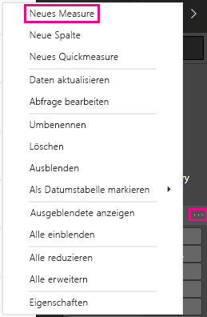
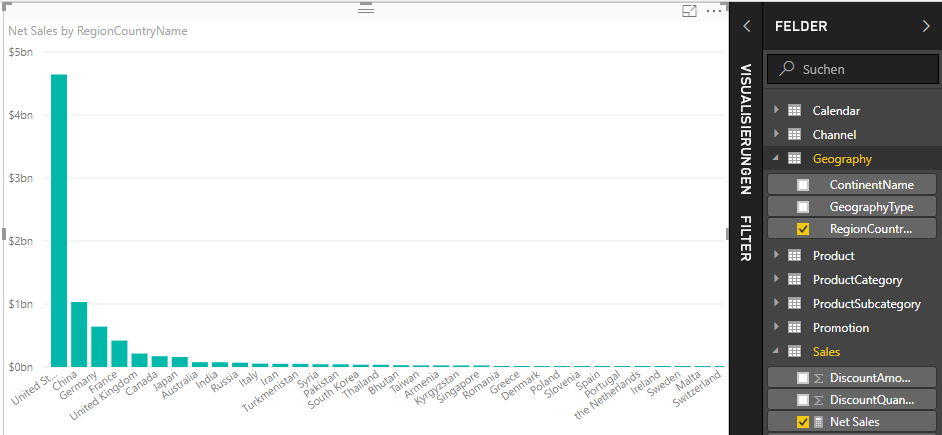
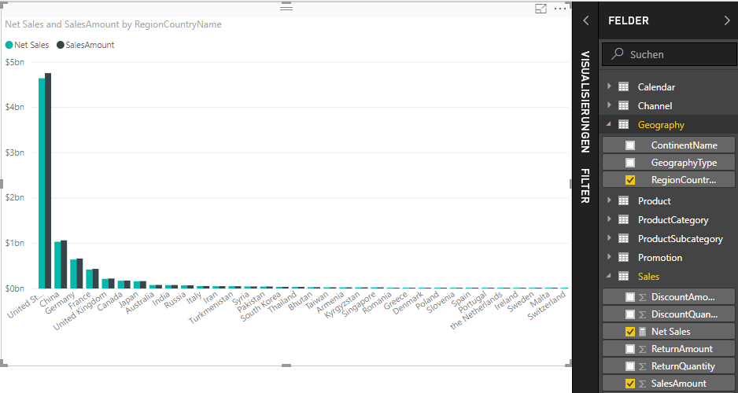
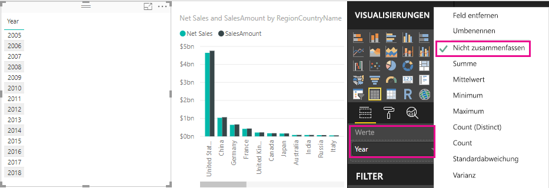
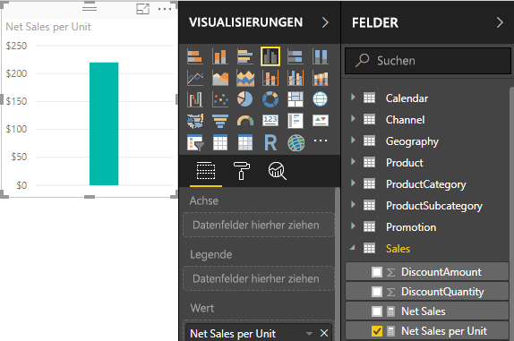
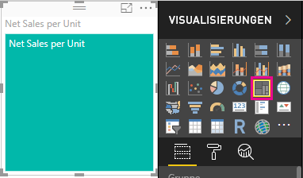
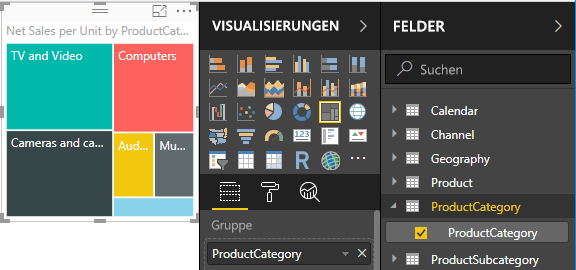
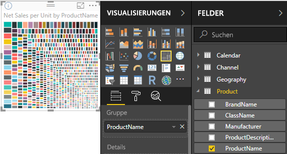

# Tutorial: Erstellen eigener Measures in Power BI Desktop
Sie können einige der leistungsstärksten Data Analysis-Lösungen in Power BI Desktop können mithilfe von Measures erstellen. Measures unterstützen uns, indem sie Berechnungen mit Ihren Daten durchführen, während Sie mit Ihren Berichten interagieren. Dieses Tutorial führt Sie durch die Grundlagen von Measures hin zum Erstellen eigener einfacher Measures in Power BI Desktop.

### Voraussetzungen
- Dieses Tutorial richtet sich an Power BI-Benutzer, die mit der Verwendung von Power BI Desktop zum Erstellen etwas fortgeschrittener Modelle bereits vertraut sind. Sie sollten bereits mit der Verwendung von „Daten abrufen“ und des Abfrage-Editors zum Importieren von Daten, dem Arbeiten mit mehreren aufeinander bezogenen Tabellen und dem Hinzufügen von Feldern zur Berichtszeichenfläche vertraut sein. Wenn Sie noch nicht mit Power BI Desktop vertraut sind, sollten Sie [Erste Schritte mit Power BI Desktop](desktop-getting-started.md) lesen.
  
- Laden Sie die Datei [Contoso Sales Sample for Power BI Desktop](http://download.microsoft.com/download/4/6/A/46AB5E74-50F6-4761-8EDB-5AE077FD603C/Contoso%20Sales%20Sample%20for%20Power%20BI%20Desktop.zip) herunter, die bereits Onlinevertriebsdaten des fiktiven Unternehmens Contoso, Inc. enthält. Da die Daten in der Datei aus einer Datenbank importiert wurden, können Sie keine Verbindungen mit der Datenquelle herstellen oder sie im Abfrage-Editor anzeigen. Entpacken Sie die Datei auf dem lokalen Computer, und öffnen Sie sie dann in Power BI Desktop.

## Grundlagen von Measures

Measures werden meistens automatisch für Sie erstellt. In der Datei „Contoso Sales Sample“ aktivieren Sie in der Tabelle **Sales** (Umsatz) in der Feldliste das Kontrollkästchen neben dem Feld **SalesAmount** (Umsatzbetrag), oder ziehen Sie **SalesAmount** in den Berichtszeichenbereich. Es erscheint eine neue Säulendiagrammvisualisierung, die die Summe aller Werte in der Spalte „SalesAmount“ der Tabelle „Sales“ anzeigt.

Jedes Feld, das im Bereich „Felder“ mit einem Sigmasymbol  angezeigt wird, ist numerisch, und seine Werte können aggregiert werden. Anstatt eine Tabelle mit allen zwei Millionen Zeilen von SalesAmount-Werten anzuzeigen, erkannte Power BI Desktop einen numerischen Datentyp und erstellte und berechnete automatisch ein Measure zur Aggregation der Daten. Eine Summe ist die Standardaggregation für einen numerischen Datentyp, aber Sie können auch problemlos verschiedene Aggregationen wie Mittelwert oder Anzahl anwenden. Das Konzept von Aggregation ist für das Verständnis von Measures von grundlegender Wichtigkeit, da jedes Measure irgendeine Form von Aggregation durchführt. 

Um die Diagrammaggregation auf Mittelwert zu ändern, klicken Sie im Bereich „Visualisierungen“ im Abschnitt **Wert** auf den Abwärtspfeil neben **SalesAmount** und wählen Sie **Mittelwert**. Die Visualisierung zeigt dann einen Mittelwert aller Vertriebswerte im Feld „SalesAmount“.

Sie können die Aggregationsart je nach dem gewünschten Ergebnis ändern, aber nicht alle Aggregationsarten gelten für alle numerischen Datentypen. Für das Feld „SalesAmount“ z.B. sind „Summe“ und „Mittelwert“ sinnvoll. „Minimum“ und „Maximum“ haben hier auch ihre Berechtigung. „Anzahl“ ist für das Feld „SalesAmount“ hingegen nicht wirklich sinnvoll, denn seine Werte sind zwar numerisch, aber eigentlich stellen sie eine Währung dar.

Aus Measures berechnete Werte ändern sich als Reaktion auf Ihre Interaktionen mit Ihrem Bericht. Wenn Sie z.B. das Feld **RegionCountryName** (Name von Region/Land) aus der Tabelle **Geography** (Geografie) auf Ihr Diagramm ziehen, werden die durchschnittlichen Umsatzbeträge für jedes Land gezeigt.

Wenn sich das Ergebnis eines Measures aufgrund einer Interaktion mit unserem Bericht ändert, nehmen Sie Einfluss auf den *Kontext* Ihres Measures. Bei jeder Interaktion mit Ihren Berichtvisualisierungen ändern Sie den Kontext, in dem ein Measure seine Ergebnisse berechnet und anzeigt.

## Erstellen und Verwenden eines eigenen Measures

In den meisten Fällen berechnet und liefert Power BI automatisch Werte entsprechend den von Ihnen gewählten Feld- und Aggregationstypen, aber in einigen Fällen können Sie auch eigene Measures erstellen, um komplexere und eindeutigere Berechnungen durchzuführen. Mit Power BI Desktop können Sie Ihre eigenen Measures mit der DAX-Formelsprache (Data Analysis Expressions) erstellen. 

DAX-Formeln verwenden häufig die gleichen Funktionen, Operatoren und die gleiche Syntax wie Excel-Formeln. Allerdings sind die DAX-Funktionen für die Arbeit mit relationalen Daten und zur Durchführung dynamischerer Berechnungen während Ihrer Interaktion mit Berichten ausgelegt. Es gibt mehr als 200 DAX-Funktionen, die alles von einfachen Aggregationen wie Summe und Mittelwert bis hin zu komplexeren Statistik- und Filterfunktionen ausführen. Es gibt zahlreiche Ressourcen, die Sie nutzen können, um mehr über DAX zu erfahren. Nachdem Sie dieses Tutorial abgeschlossen haben, werfen Sie unbedingt einen Blick auf [DAX-Grundlagen in Power BI Desktop](desktop-quickstart-learn-dax-basics.md).

Wenn Sie ein eigenes Measure erstellen, wird es zur Liste „Felder“ für die von Ihnen ausgewählte Tabelle hinzugefügt und als *Modell*-Measure bezeichnet. Modellmeasures bieten z.B. folgende Vorteile: Sie können für sie beliebige, aussagekräftige Namen vergeben, Sie können sie als Argumente in anderen DAX-Ausdrücken verwenden, und Sie können sie sehr schnell komplexe Berechnungen durchführen lassen.

>[!TIP]
>Ab der Power BI Desktop-Version von Februar 2018 stehen Ihnen viele gängige Berechnungen als **Quickmeasures** zur Verfügung, die die DAX-Formeln basierend auf Ihren Eingaben in ein Dialogfeld schreiben. Diese schnellen, leistungsstarken Berechnungen eignen sich auch hervorragend, um DAX-Formeln zu erlernen oder eigene maßgeschneiderte Measures einzusetzen. Um Quickmeasures zu erstellen oder zu erkunden, wählen Sie die Option **Neues Quickmeasure** in der Liste **Weitere Optionen** einer Tabelle oder auf der Registerkarte „Start“ des Menübands unter **Berechnungen**. Weitere Informationen zum Erstellen und Verwenden von Quickmeasures finden Sie unter [Verwenden von Quickmeasures](desktop-quick-measures.md).

### Erstellen eines Measures

Sie möchten Ihren Nettoumsatz analysieren, indem Sie Rabatte und Retouren von den Gesamtumsätzen abziehen. Für jeden Kontext in Ihrer Visualisierung benötigen Sie ein Measure, das die Summe aus „DiscountAmount“ (Rabattbetrag) und „ReturnAmount“ (Retourenbetrag) von der Summe aus „SalesAmount“ subtrahiert. In der Liste „Felder“ gibt kein Feld für Nettoumsatz, aber Sie haben die Bausteine, um Ihr eigenes Measure zur Berechnung des Nettoumsatzes zu erstellen. 

1.  Klicken Sie in der Liste „Felder“ mit der rechten Maustaste auf die Tabelle **Sales**, oder zeigen Sie auf die Tabelle, und wählen Sie die Auslassungspunkte (....) für **Weitere Optionen**. Wählen Sie dann **Neues Measure**. Dies speichert Ihr neues Measure in der Tabelle „Sales“, wo es leicht zu finden ist.
    
    
    
    Sie können auch ein neues Measure erstellen, indem Sie auf der Registerkarte „Start“ des Power BI Desktop-Menübands in der Gruppe „Berechnungen“ die Option **Neues Measure** wählen.
    
    
    
    >[!TIP]
    >Wenn Sie ein Measure über das Menüband erstellen, kann es in jeder beliebigen Tabelle erstellt werden, aber es ist einfacher zu finden, wenn Sie es direkt am späteren Verwendungsort erstellen. Wählen Sie in diesem Fall zuerst die Tabelle „Sales“, um sie zu aktivieren, und wählen Sie dann **Neues Measure**. 
    
    Die Bearbeitungsleiste erscheint oben im Berichtszeichenbereich, wo Sie Ihr Measure umbenennen und eine DAX-Formel eingeben können.
    
    
    
2.  Standardmäßig heißt ein neues Measure einfach nur „Measure“. Wenn Sie es nicht umbenennen, werden weitere neue Measures „Measure 2“, „Measure 3“ usw. benannt. Damit Sie Ihre Measures besser identifizieren können, markieren Sie **Measure** in der Bearbeitungsleiste, und geben Sie dann **Net Sales** (Nettoumsatz) ein.
    
3.  Jetzt können Sie mit dem Eingeben Ihrer Formel beginnen. Geben Sie nach dem Gleichzeichen **Sum** (Summe) ein. Während der Eingabe wird eine Dropdownliste mit Vorschlägen angezeigt, die alle DAX-Funktionen enthält, die mit den eingegebenen Buchstaben beginnen. Führen Sie ggf. einen Bildlauf nach unten aus, um in der Liste **SUM** auszuwählen, und drücken Sie dann die EINGABETASTE.
    
    
    
    Es wird eine Klammer zusammen mit einer weiteren Dropdownliste mit Vorschlägen für alle verfügbaren Spalten angezeigt, die Sie der Funktion SUM übergeben können.
    
    
    
    Ausdrücke treten immer zwischen einer öffnenden und einer schließenden Klammer auf. Der Ausdruck enthält ein einzelnes Argument, das an die SUM-Funktion übergeben werden muss: die SalesAmount-Spalte. Beginnen Sie mit der Eingabe von „SalesAmount“, bis in der Liste nur noch ein Wert angezeigt wird: „Sales(SalesAmount)“. Der Spaltenname, dem der Tabellenname vorangestellt ist, wird als *vollqualifizierter Name* der Spalte bezeichnet. Vollqualifizierte Spaltennamen verbessern die Lesbarkeit Ihrer Formeln. 
    
    
    
4. Wählen Sie **Sales[SalesAmount]** aus, und geben Sie dann eine schließende Klammer ein.
    
    > [!TIP]
    > Syntaxfehler werden meistens durch eine fehlende oder falsch platzierte schließende Klammer verursacht.
    
    
    
5.  So subtrahieren Sie die anderen beiden Spalten
    1. Geben Sie nach der schließenden Klammer für den ersten Ausdruck ein Leerzeichen, einen Minusoperator (**-**) und ein weiteres Leerzeichen ein. 
    2. Geben Sie eine weitere SUM-Funktion ein, und beginnen Sie mit der Eingabe von „DiscountAmount“, bis Sie die Spalte **Sales[DiscountAmount]** als Argument auswählen können. Fügen Sie eine schließende Klammer hinzu. 
    3. Geben Sie ein Leerzeichen, einen weiteren Minusoperator, ein Leerzeichen, eine weitere SUM-Funktion mit **Sales[ReturnAmount]** als Argument und eine schließende Klammer ein.
    
    
    
6.  Drücken Sie die Eingabetaste, oder klicken Sie in der Bearbeitungsleiste auf das Kontrollkästchen, um die Bearbeitung abzuschließen und zu validieren. Das validierte Measure kann jetzt in der Liste „Felder“ für die Tabelle „Sales“ verwendet werden. 
    
    
    
Wenn nicht mehr genügend Platz für die Eingabe einer Formel vorhanden ist, oder Sie möchten, dass sie in separaten Zeilen steht, wählen Sie das nach unten weisende Chevron auf der rechten Seite der Bearbeitungsleiste, um mehr Platz zu schaffen.

Sie können Teile Ihrer Formel auf verschiedenen Zeilen aufteilen, indem Sie **Alt-Eingabetaste** drücken, oder Teile mit der **Tabulatortaste** verschieben.

### Verwenden Ihres Measures im Bericht
Jetzt können Sie das Measure „Net Sales“ zum Berichtszeichenbereich hinzufügen, und den Nettoumsatz für alle anderen Felder berechnen, die Sie dem Bericht außerdem hinzufügen. Sehen Sie sich den Nettoumsatz nach Ländern an:

1. Wählen Sie das Measure **Net Sales** aus der Tabelle **Sales**, und ziehen Sie es in den Berichtszeichenbereich.
    
2. Wählen Sie jetzt das Feld **RegionCountryName** aus der Tabelle **Geography**, und ziehen Sie es in das Diagramm.
    
    
    
Um den Unterschied zwischen Nettoumsatz und Umsatzbetrag nach Land darzustellen, wählen Sie das Feld **SalesAmount** und ziehen es in das Diagramm. 

Das Diagramm verwendet nun zwei Measures: „SalesAmount“, das automatisch summiert wurde, und das von Ihnen erstellte Measure „Net Sales“. Jedes Measure wurde im Kontext eines anderen Feldes, „RegionCountryName“, berechnet.
    
### Verwenden Ihres Measures mit einem Datenschnitt

Sie können einen Datenschnitt hinzufügen, um die Nettoumsätze und Umsatzbeträge nach Kalenderjahren weiter zu filtern.
    
1.  Klicken Sie auf einen leeren Bereich neben dem Diagramm, und wählen Sie dann in **Visualisierungen** die Visualisierung **Tabelle**. Dadurch wird im Berichtszeichenbereich eine leere Tabellenvisualisierung erstellt.
    
    
    
2.  Ziehen Sie das Feld **Jahr** aus der Tabelle **Kalender** in die neue leere Tabellenvisualisierung. Da „Jahr“ ein numerisches Feld ist, fasst Power BI Desktop seine Werte zusammen, aber als Aggregation ergibt dies nicht viel Sinn. 
    
    
    
3.  Wählen Sie im Bereich „Visualisierungen“ im Abschnitt **Werte** den Abwärtspfeil neben **Jahr**, und wählen Sie dann **Nicht zusammenfassen**. In der Tabelle werden jetzt einzelne Jahre aufgeführt.
    
    
    
4.  Wählen Sie im Bereich „Visualisierungen“ das Symbol **Datenschnitt**, um die Tabelle in einen Datenschnitt zu konvertieren.

    
    
5.  Wählen Sie einen beliebigen Wert im Datenschnitt **Jahr**, um das Diagramm für **Nettoumsätze und Umsatzbeträge nach Ländern** entsprechend zu filtern. Die Measures „Net Sales“ und „SalesAmount“ berechnen die Ergebnisse neu und zeigen sie im Kontext des ausgewählten Feldes „Jahr“ an. 
    
    

### Verwenden Ihres Measures in einem anderen Measure

Sie möchten herausfinden, welche Produkte den höchsten Nettoumsatz pro verkaufter Einheit haben. Daher benötigen Sie ein Measure, das den Nettoumsatz durch die Menge der verkauften Einheiten dividiert. Sie können ein neues Measure erstellen, das das Ergebnis Ihres Measures „Net Sales“ durch die Summe aus „Sales[SalesQuantity]“ dividiert.

1.  Erstellen Sie in der Tabelle „Sales“ ein neues Measure namens **Net Sales per Unit** (Nettoumsatz pro Einheit).
    
2.  Beginnen Sie in der Bearbeitungsleiste mit der Eingabe von **Net Sales**. Die Vorschlagsliste zeigt an, was Sie hinzufügen können. Wählen Sie **[Net Sales]** aus.
    
    
    
    Sie können außerdem auf Measures verweisen, indem Sie einfach eine öffnende eckige Klammer eingeben (**[**). In der Vorschlagsliste werden nur für Ihre Formel geeignete Measures angezeigt.
    
    
    
3.  Geben Sie ein Leerzeichen, einen Divisionsoperator (**/**), ein anderes Leerzeichen, eine SUM-Funktion und dann **Quantity** ein. Die Vorschlagsliste zeigt alle Spalten an, deren Name „Quantity“ enthält. Wählen Sie **Sales[SalesQuantity]**, geben Sie die schließende Klammer ein, und drücken Sie die EINGABETASTE, oder wählen Sie das Häkchen, um Ihre Formel zu bestätigen. Die Formel sollte nun so aussehen:
    
    `Net Sales per Unit = [Net Sales] / SUM(Sales[SalesQuantity])`
    
4. Wählen Sie in der Tabelle „Sales“ das Measure **Net Sales per Unit**, und ziehen Sie es an eine leere Stelle im Berichtszeichenbereich. Die Grafik zeigt den Nettoumsatz pro Einheit für alle verkauften Produkte, was wenig aussagekräftig ist. 
    
    
    
5. Für ein anderes Erscheinungsbild ändern Sie den Visualisierungstyp des Diagramms in **Treemap**.
    
    
    
6. Wählen Sie das Feld **Produktkategorie**, oder ziehen Sie es in die Treemap oder im Bereich „Visualisierungen“ in das Feld „Gruppe“. Jetzt haben Sie verwertbare Informationen.
    
    
    
7. Entfernen Sie das Feld **ProductCategory**, und ziehen Sie stattdessen das Feld **ProductName** in das Diagramm. 
    
    
    
OK, Sie haben jetzt etwas herumgespielt, aber Sie müssen zugeben, dass es Spaß gemacht hat. Experimentieren Sie mit anderen Möglichkeiten, die Visualisierung zu filtern und zu formatieren.

## Was Sie gelernt haben
Measures sind leistungsstarke Hilfsmittel, wenn es darum geht, aus Ihren Daten die gewünschten Erkenntnisse zu gewinnen. Sie haben gelernt, wie Sie mithilfe der Bearbeitungsleiste Measures erstellen, diese sinnvoll benennen und anhand der DAX-Vorschlagslisten die richtigen Formelelemente finden und auswählen. Sie haben außerdem eine Einführung in Kontext erhalten, wodurch sich das Ergebnis von Berechnungen entsprechend anderer Felder oder anderer Ausdrücke in Ihrer Formel ändert.

## Nächste Schritte
- Weitere Informationen zu Quickmeasures von Power BI Desktop, die Ihnen viele gängige Measureberechnungen bieten, finden Sie unter [Verwenden von Quickmeasures zur einfachen Nutzung gängiger und leistungsstarker Berechnungsfunktionen](desktop-quick-measures.md).
  
- Wenn Sie tiefer in DAX-Formeln einsteigen und fortgeschrittenere Measures erstellen möchten, lesen Sie [DAX-Grundlagen in Power BI Desktop](desktop-quickstart-learn-dax-basics.md). Dieser Artikel konzentriert sich auf grundlegende Konzepte in DAX, wie etwa Syntax, Funktionen und ein tiefer gehendes Verständnis von Kontext.
  
- Denken Sie daran, die [DAX-Referenz (Data Analysis Expressions)](https://msdn.microsoft.com/library/gg413422.aspx) zu Ihren Favoriten hinzuzufügen. Das ist der Ort, an dem Sie detaillierte Informationen zur DAX-Syntax, Operatoren und den über 200 DAX-Funktionen finden.

