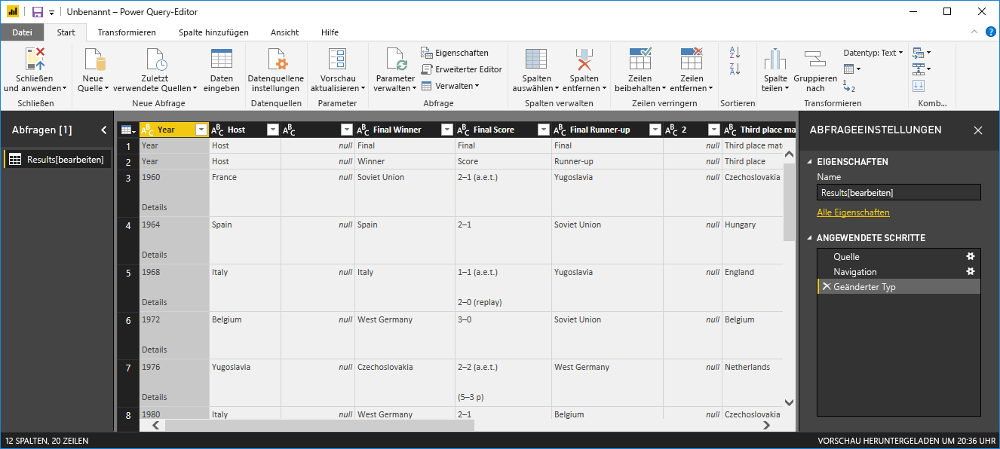
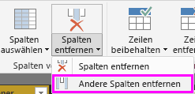
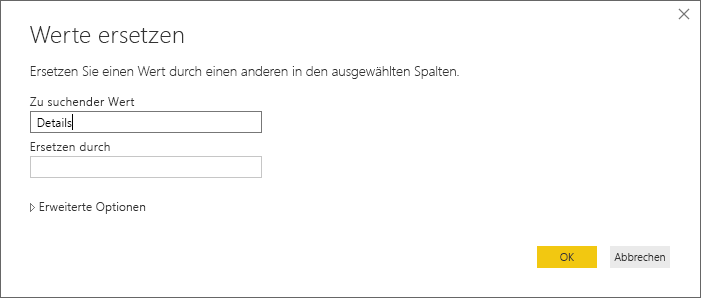
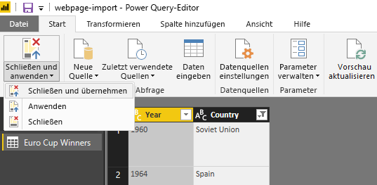

# Analysieren von Webseitendaten mit Power BI Desktop (Lernprogramm)
In diesem Tutorial erfahren Sie, wie Sie eine Tabelle mit Daten von einer Webseite importieren und zur Visualisierung dieser Daten einen Bericht erstellen. Im Rahmen dieses Prozesses navigieren Sie durch die auf einer Webseite verfügbaren Tabellen und wenden Datentransformierungsschritte an, um die Tabelle neu zu strukturieren.

 Inhalt dieses Artikels:

* **Aufgabe 1:** Herstellen einer Verbindung mit einer Webdatenquelle
* **Aufgabe 2:** Strukturieren von Daten in der Abfrageansicht
  * Schritt 1: Entfernen sonstiger Spalten zur ausschließlichen Anzeige relevanter Spalten
  * Schritt 2: Ersetzen von Werten zum Bereinigen von Werten in einer ausgewählten Spalte
  * Schritt 3: Filtern von Werten in einer Spalte
  * Schritt 4: Umbenennen einer Spalte
  * Schritt 5: Filtern von NULL-Werten in einer Spalte
  * Schritt 6: Umbenennen einer Abfrage
  * Erstellte Abfrageschritte
* **Aufgabe 3:** Erstellen von Visualisierungen mithilfe der Berichtsansicht
  * Schritt 1: Laden der Abfrage in Ihren Bericht
  * Schritt 2: Erstellen einer Kartenvisualisierung

## Aufgabe 1: Herstellen einer Verbindung mit einer Webdatenquelle
 In Aufgabe 1 importieren Sie eine Tabelle zu einer Turnierübersicht von der Wikipedia-Seite zur UEFA-Fußball-Europameisterschaft unter http://en.wikipedia.org/wiki/UEFA\_European\_Football\_Championship.

### Hinzufügen einer Wikipedia-Seite als Datenquelle
1. Wählen Sie im Dialogfeld **Erste Schritte** oder auf der Registerkarte des Menübands **Start** die Option **Daten abrufen** aus.
2. Dadurch wird das Dialogfeld **Daten abrufen** geöffnet, in dem Sie aus einer Vielzahl von Datenquellen auswählen können, um Daten in Power BI Desktop zu importieren. Wählen Sie die Option **Web** aus, die unter der Gruppe **Alle** oder **Sonstige** verfügbar ist.
3. Fügen Sie im Dialogfeld **Webinhalt** im Textfeld **URL** die Wikipedia-URL ein (http://en.wikipedia.org/wiki/UEFA\_European\_Football\_Championship).
4. Klicken Sie auf **OK**.

Nachdem die Verbindung mit der Webseite hergestellt wurde, sehen Sie eine Liste der auf dieser Wikipedia-Seite verfügbaren Tabellen im Dialogfeld **Navigator** . Sie können auf jede dieser Tabellen klicken, um eine Vorschau der Daten anzuzeigen.

Wählen Sie im linken Bereich von **Navigator** die Tabelle **Ergebnisse [Bearbeiten]** aus, um die Ergebnisse der Turnierübersicht anzuzeigen, oder wählen Sie die Tabelle **Ergebnisse [Bearbeiten]** aus, und wählen Sie dann **Bearbeiten**aus. Auf diese Weise kann diese Tabelle umstrukturiert werden, bevor sie in den Bericht geladen wird, da die Daten nicht die für die Analyse erforderliche Struktur aufweisen.

Dadurch wird eine Vorschau der Tabelle in der Abfrageansicht angezeigt, in der eine Reihe von Transformationsschritten angewendet werden können, um die Daten zu bereinigen.

## Aufgabe 2: Strukturieren von Daten in der Betrefftabelle
Nachdem Sie die Betrefftabelle für Ihre Datenabfrage ausgewählt haben, erfahren Sie, wie die verschiedenen Schritte zum Strukturieren und Bereinigen der Daten ausgeführt werden.

**Schritt 1:** Entfernen sonstiger Spalten zur ausschließlichen Anzeige relevanter Spalten

In diesem Schritt entfernen Sie alle Spalten außer **Year** und **Final Winners**.

1. Wählen Sie im Raster **Abfragevorschau** die Spalten **Year** und **Final Winners** aus (verwenden Sie dazu **STRG** + **Klicken**).
2. Klicken Sie mit der rechten Maustaste auf eine Spaltenüberschrift im Raster **Abfragevorschau** , und klicken Sie dann auf **Andere Spalten entfernen** , um die nicht ausgewählten Spalten zu entfernen. Dieser Vorgang ist auch über die Registerkarte des Menübands **Start** in der Gruppe **Spalten verwalten** verfügbar.

**Schritt 2:** Ersetzen von Werten zum Bereinigen der Werte in einer ausgewählten Spalte

In diesem Schritt ersetzen Sie das Suffix „Details“ in der Spalte **Year** . Beachten Sie, dass sich dieses Suffix in einer neuen Zeile befindet, sodass es in der Tabellenvorschau nicht angezeigt wird. Wenn Sie jedoch in eine der Zellen mit einem numerischen Wert in der Spalte „Year“ klicken, wird der vollständige Wert in der Detailansicht angezeigt.

1. Wählen Sie die Spalte **Year** aus.
2. Klicken Sie auf dem Menüband **Abfrageansicht** auf der Registerkarte **Start** auf **Werte ersetzen** , oder klicken Sie mit der rechten Maustaste auf die Spalte **Year** , und klicken Sie dann auf **Werte ersetzen** , um die Details durch leeren Text zu ersetzen.
3. Geben Sie im Dialogfeld **Werte ersetzen** die Details im Textfeld **Zu suchender Wert** ein, und lassen Sie das Textfeld **Ersetzen durch** leer.
4. Klicken Sie auf **OK**.

 **Schritt 3:** Filtern von Werten in einer Spalte

In diesem Schritt filtern Sie die Spalte **Year** , um Zeilen anzuzeigen, die nicht „Year“ enthalten.

1. Klicken Sie auf den Dropdownpfeil des Filters der Spalte **Year** .
2. Deaktivieren Sie in der Dropdownliste **Filter** die Option **Year** .
3. Klicken Sie auf **OK**.

**Schritt 4:** Umbenennen einer Spalte

Nachdem die Daten in der Spalte **Year** bereinigt wurden, befassen wir uns mit der Spalte **Final Winner** .

Da wir nur die Liste der Gewinner betrachten, können wir diese Spalte in **Country**umbenennen.

1. Wählen Sie die Spalte **Final Winner** in der Abfragevorschau aus.
2. Auf dem Menüband **Abfrageansicht** unter der Registerkarte **Transformieren** und der Gruppe **Beliebige Spalte** finden Sie die Option **Umbenennen**.
3. Dadurch kann der Name der Spalte bearbeitet werden. Diese Spalte wird in **Country**umbenannt.

**Schritt 5:** Filtern von Nullwerten in einer Spalte

In der Spalte **Country** müssen die Nullwerte ebenfalls herausgefiltert werden. Zu diesem Zweck könnten wir das in Schritt 3 veranschaulichte Filtermenü verwenden. Alternativ bietet sich auch die folgende Option:

1. Klicken Sie mit der rechten Maustaste auf eine der Zelle in der Spalte **Country** , die einen NULL-Wert enthält.
2. Wählen Sie im Kontextmenü die Option **Textfilter -\> Ist nicht gleich** aus.
3. Dadurch wird ein neuer Filterschritt erstellt, um Zeilen mit NULL-Werten in der Spalte **Country** zu entfernen.

**Schritt 6:** Benennen einer Abfrage

In diesem Schritt weisen Sie der letzten Abfrage die Bezeichnung **Euro Cup Winners**zu.

1. Geben Sie im Bereich **Abfrageeinstellungen** im Feld **Name** die Zeichenfolge **Euro Cup Winners**ein.
   
   

## Aufgabe 3: Erstellen von Visualisierungen mithilfe der Berichtsansicht
Nachdem die Daten in die für die Analyse erforderliche Struktur konvertiert wurden, können wir die sich ergebende Tabelle in unseren Bericht laden und einige Visualisierungen erstellen.

**Schritt 1:** Laden der Abfrage in Ihren Bericht

Um die Abfrageergebnisse in Power BI Desktop zu laden und einen Bericht zu erstellen, wählen Sie auf dem Menüband **Start** den Befehl **Schließen & laden** aus.

Dadurch werden die Auswertung der Abfrage und das Laden der Tabellenausgabe in den Bericht ausgelöst. Wählen Sie in Power BI Desktop das Symbol **Bericht** aus, um Power BI Desktop in der Berichtsansicht darzustellen.

Die sich ergebenden Tabellenfelder werden im Bereich **Felder** angezeigt, der sich rechts neben der **Berichtsansicht**befindet.

**Schritt 2:** Erstellen einer Kartenvisualisierung

Sie können Felder aus der **Feldliste** ziehen und diese im **Berichtszeichenbereich**ablegen, um eine Visualisierung zu erstellen.

1. Ziehen Sie das Feld **Country** , und legen Sie es im **Berichtszeichenbereich**ab. Dadurch wird im **Berichtszeichenbereich**eine neue Visualisierung erstellt. Da in diesem Fall eine Liste von Ländern vorliegt, wird eine **Kartenvisualisierung**erstellt.
   
   
2. Wir können die Art der Visualisierung einfach ändern, in dem wir im Bereich **Visualisierung** ein anderes Symbol auswählen.
   
   
3. Wir bleiben für die Abbildung beim Visualisierungstyp **Karte**. Die Größe der Visualisierung kann auch durch Ziehen an einer der Ecken der Visualisierung auf das gewünschte Format angepasst werden.
   
   
4. Beachten Sie, dass alle Punkte in der Karte zurzeit dieselbe Größe aufweisen. Dies soll geändert werden, damit Länder, die mehr Europameisterschaften gewonnen haben, auf der Karte durch einen größeren Punkt dargestellt werden. Dazu kann das Feld **Year** aus der **Feldliste** in der unteren Hälfte des **Feldbereichs** auf das Feld **Werte**gezogen werden.
   
   

Wie Sie sehen können, ist es sehr einfach, Visualisierungen im Bericht anzupassen, um die Daten auf die gewünschte Weise zu präsentieren. Power BI Desktop bietet ein nahtloses End-to-End-Erlebnis, das vom Abrufen der Daten aus einer Vielzahl von Datenquellen über die Strukturierung der Daten für Analysezwecke bis zur Visualisierung dieser Daten auf umfassende und interaktive Weise reicht. Nachdem Ihr Bericht fertig ist, können Sie ihn [in Power BI hochladen](desktop-upload-desktop-files.md) und auf seiner Grundlage Dashboards erstellen, die Sie für andere Power BI-Benutzer freigeben können.

Damit ist das Tutorial **Importieren von Daten aus dem Web** abgeschlossen. Sie können die vollständige Power BI Desktop-Datei [hier](http://download.microsoft.com/download/1/4/E/14EDED28-6C58-4055-A65C-23B4DA81C4DE/Analyzing_Data_From_The_Web.pbix) herunterladen.

## Wo erhalte ich weitere Informationen?
* [Weitere Tutorials zu Power BI Desktop lesen](http://go.microsoft.com/fwlink/?LinkID=521937)
* [Videos zu Power BI Desktop ansehen](http://go.microsoft.com/fwlink/?LinkID=519322)
* [Power BI-Forum besuchen](http://go.microsoft.com/fwlink/?LinkID=519326)
* [Power BI-Blog lesen](http://go.microsoft.com/fwlink/?LinkID=519327)

