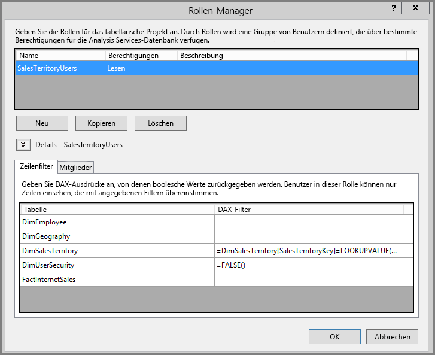
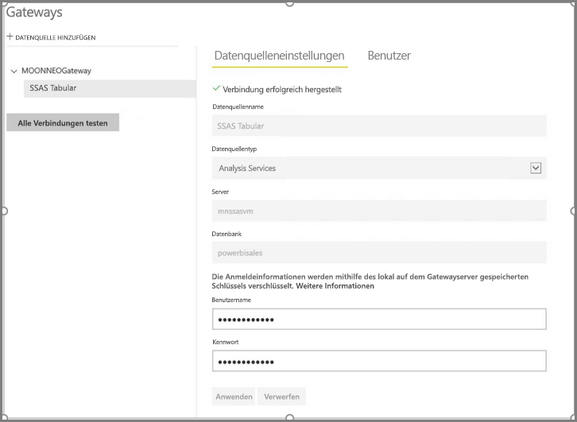
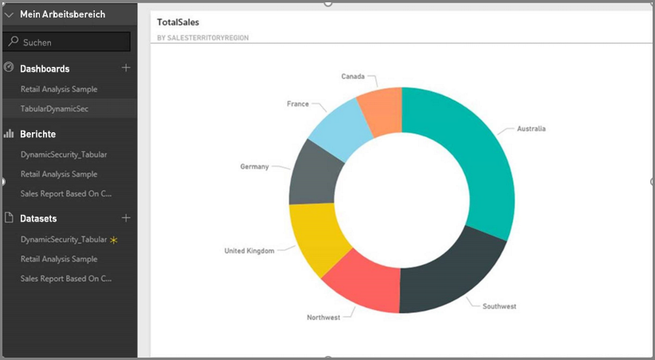
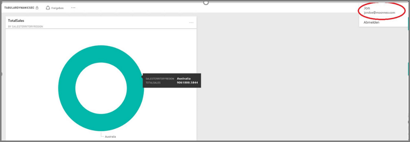

# <a name="tutorial-dynamic-row-level-security-with-analysis-services-tabular-model"></a>Tutorial: Dynamische Sicherheit auf Zeilenebene mit dem tabellarischen Modell von Analysis Services
Dieses Tutorial zeigt die notwendigen Schritte für die Implementierung der **Sicherheit auf Zeilenebene** in Ihrem **tabellarischen Modell von Analysis Services** und wie sie in einem Power BI-Bericht verwendet wird. Die Schritte in diesem Tutorial sind darauf ausgerichtet, dass Sie sie leicht nachvollziehen und anhand eine Beispiel-Datasets die notwendigen Schritte erlernen können.

In diesem Tutorial werden die folgenden Schritte ausführlich beschrieben, was Ihnen dabei hilft, zu verstehen, wie Sie die dynamischen Sicherheit auf Zeilenebene mit dem tabellarischen Modell von Analysis Services implementieren müssen:

* Erstellen einer neuen Sicherheitstabelle in der **AdventureworksDW2012**-Datenbank
* Erstellen des tabellarischen Modells mit erforderlichen Fakten- und Dimensionstabellen
* Definieren der Rollen und Berechtigungen für die Benutzer
* Bereitstellen des Modells auf einer **Analysis Services-Tabelleninstanz**
* Verwenden von Power BI Desktop zum Erstellen eines Berichts, der die Daten anzeigt, die dem Benutzer entsprechen, die auf den Bericht zugreifen
* Bereitstellen des Berichts im **Power BI-Dienst**
* Erstellen eines neuen Dashboards basierend auf dem Report, und schließlich:
* Freigeben des Dashboards an Ihre Kollegen

Sie benötigen die **AdventureworksDW2012**-Datenbank, die Sie **[hier](http://msftdbprodsamples.codeplex.com/releases/view/55330)** herunterladen können, um die Schritte in diesem Tutorial zu befolgen.

## <a name="task-1-create-the-user-security-table-and-define-data-relationship"></a>Aufgabe 1: Erstellen einer Benutzersicherheitstabelle und Definieren der Datenbeziehung
In vielen veröffentlichten Artikeln wird beschrieben, wie die dynamische Sicherheit auf Zeilenebene mit dem **tabellarischen Modell von SQL Server Analysis Services (SSAS)** definiert wird. [Für unser Beispiel befolgen wir die Anweisungen in diesem Artikel.](https://msdn.microsoft.com/library/hh479759.aspx) Die folgenden Schritte führen Sie durch die erste Aufgabe in diesem Tutorial.

1. In diesem Beispiel verwenden wir die rationale Datenbank von **AdventureworksDW2012**. Erstellen Sie in der Datenbank die **DimUserSecurity**-Tabelle, wie in der folgenden Abbildung dargestellt. In diesem Beispiel verwenden wir SQL Server Management Studio (SSMS) zum Erstellen der Tabelle.
   
   
2. Nachdem die Tabelle erstellt und gespeichert wurde, müssen wir die Beziehung zwischen der **SalesTerritoryID**-Spalte der **DimUserSecurity**-Tabelle und der **SalesTerritoryKey**-Spalte der **DimSalesTerritory**-Tabelle erstellen, so wie in der folgenden Abbildung gezeigt. Dies können Sie über **SSMS** vornehmen, indem Sie einen Rechtsklick auf die **DimUserSecurity**-Tabelle ausführen und auf **Bearbeiten** klicken.
   
   
3. Speichern Sie die Tabelle und fügen Sie anschließend ein paar Zeilen mit Benutzerinformationen in die Tabelle ein, indem Sie erneut einen Rechtsklick auf die **DimUserSecurity**-Tabelle ausführen und anschließend **Oberste 200 Zeilen bearbeiten** auswählen. Nachdem Sie diese Benutzer hinzugefügt haben, sehen die Zeilen der **DimUserSecurity**-Tabelle wie in der folgenden Abbildung aus:
   
   
   
   Wir werden in den nächsten Aufgaben zu diesen Benutzern zurückkehren.
4. Als Nächstes führen wir einen *inneren Join* mit der **DimSalesTerritory**-Tabelle durch, die die Region anzeigt, die dem Benutzer zugeordnet ist. Der folgende Code führt den *inneren Join* aus, und das Bild unten zeigt, wie die Tabelle angezeigt wird, wenn der *innere Join* erfolgreich ist.
   
       **select b.SalesTerritoryCountry, b.SalesTerritoryRegion, a.EmployeeKey, a.FirstName, a.LastName, a.UserName from [dbo].[DimUserSecurity] as a join  [dbo].[DimSalesTerritory] as b on a.[SalesTerritoryKey] = b.[SalesTerritoryKey]**
   
   
5. Beachten Sie, dass die Abbildung oben Informationen darstellt, wie z.B. den für eine Region zuständigen Benutzer. Diese Daten werden aufgrund der Beziehung angezeigt, die wir in **Schritt 2** erstellt haben. Beachten Sie außerdem, dass der Benutzer **Jon Doe Teil der australischen Verkaufsregion** ist. Wir werden in den nächsten Schritten und Aufgaben auf Jon Doe zurückkommen.

## <a name="task-2-create-the-tabular-model-with-facts-and-dimension-tables"></a>Aufgabe 2: Erstellen des tabellarischen Modells mit Fakten- und Dimensionstabellen
1. Sobald Ihr relationales Data Warehouse vorhanden ist, ist es Zeit, das tabellarische Modell zu definieren. Das Modell kann mit **SQL Server Data Tools (SSDT)** erstellt werden. Bitte lesen Sie [diesen Artikel](https://msdn.microsoft.com/library/hh231689.aspx), um weitere Informationen zum Definieren eines tabellarischen Modells zu erhalten.
2. Importieren Sie alle erforderlichen Tabellen in das Modell, so wie unten dargestellt.
   
    
3. Nachdem Sie die erforderlichen Tabellen importiert haben, müssen Sie eine Rolle namens **SalesTerritoryUsers** mit **Leseberechtigung** definieren. Klicken Sie dafür auf das Menü **Modell** in SQL Server Data Tools, und klicken Sie anschließend auf **Rollen**. Klicken Sie im Dialogfeld **Rollen-Manager** auf **Neu**.
4. Fügen Sie auf der Registerkarte **Mitglieder** im **Rollen-Manager** die Benutzer hinzu, die wir in der **DimUserSecurity**-Tabelle in **Aufgabe 1 – Schritt 3** definiert haben.
   
    
5. Fügen Sie anschließend die korrekten Funktionen für die Tabellen **DimSalesTerritory** und **DimUserSecurity** hinzu, wie unten unter der Registerkarte **Zeilenfilter** gezeigt.
   
    
6. In diesem Schritt verwenden wir die **LOOKUPVALUE**-Funktion zum Zurückgeben von Werten für eine Spalte, in der der Windows-Benutzername dem von der Funktion **USERNAME** zurückgegebenen Benutzernamen entspricht. Abfragen können dann eingeschränkt werden, wenn die Werte, die von **LOOKUPVALUE** zurückgegeben wurden, mit Werten in der gleichen Tabelle oder einer verwandten Tabelle übereinstimmen. Geben Sie in der Spalte **DAX Filter** die folgende Formel ein:
   
       =DimSalesTerritory[SalesTerritoryKey]=LOOKUPVALUE(DimUserSecurity[SalesTerritoryID], DimUserSecurity[UserName], USERNAME(), DimUserSecurity[SalesTerritoryID], DimSalesTerritory[SalesTerritoryKey])
7. In dieser Formel gibt die **LOOKUPVALUE**-Funktion alle Werte für die Spalte **DimUserSecurity[SalesTerritoryID]**zurück, wobei **DimUserSecurity[UserName]** dem Namen des gegenwärtig eingeloggten Windowsbenutzers und **DimUserSecurity[SalesTerritoryID]** **DimSalesTerritory[SalesTerritoryKey]** entspricht.
   
   Der Satz von SalesTerritoryKey, der von **LOOKUPVALUE** zurückgegeben wird, wird verwendet, um die Zeilen, die in **DimSalesTerritory** angezeigt werden, zu beschränken. Es werden nur Zeilen angezeigt. in denen sich **SalesTerritoryKey** für die Zeile im Satz von IDs befindet, die von der **LOOKUPVALUE**-Funktion zurückgegeben werden.
8. Geben Sie für die **DimUserSecurity**-Tabelle in der **DAX Filter**-Spalte die folgende Formel ein.
   
       =FALSE()
9. Diese Formel gibt an, dass alle Spalten mit der falschen booleschen Bedingung aufgelöst werden. Deshalb können keine Spalten für die **DimUserSecurity**-Spalte abgefragt werden.
10. Nun müssen wir das Modell verarbeiten und bereitstellen. Erhalten Sie [in diesem Artikel](https://msdn.microsoft.com/library/hh231693.aspx) Hilfe bei der Bereitstellung des Modells.

## <a name="task-3-adding-data-sources-within-your-on-premises-data-gateway"></a>Aufgabe 3: Hinzufügen von Datenquellen im lokalen Datengateway
1. Sobald das tabellarische Modell bereitgestellt und für die Verwendung bereit ist, müssen Sie eine Datenquellenverbindung auf Ihrem lokalen tabellarischen Analysis Services-Server mit Ihrem Power BI-Portal hinzufügen.
2. Sie müssen ein **lokales Datengateway** in Ihrer Umgebung installiert und konfiguriert haben, damit der **[Power BI-Dienst](service-gateway-onprem.md)** auf lokale Analysis Services zugreifen kann.
3. Wenn das Gateway ordnungsgemäß konfiguriert wurde, müssen Sie eine Datenquellenverbindung für die **Analysis Services**-Tabelleninstanz erstellen. Dieser Artikel hilft Ihnen dabei, [Datenquellen im Power BI-Portal hinzuzufügen](service-gateway-enterprise-manage-ssas.md).
   
   
4. Wenn der vorherige Schritt abgeschlossen wurde, ist das Gateway konfiguriert und kann mit der lokalen **Analysis Services**-Datenquelle interagieren.

## <a name="task-4-creating-report-based-on-analysis-services-tabular-model-using-power-bi-desktop"></a>Aufgabe 4: Erstellen eines Berichts basierend auf dem tabellarischen Modell von Analysis Services mit Power BI Desktop
1. Starten Sie **Power BI Desktop** , und wählen Sie **Daten abrufen > Database** aus.
2. Wählen Sie aus der Liste der Datenquellen die **SQL Server Analysis Services-Datenbank**, und wählen Sie **Verbinden**.
   
   
3. Geben Sie Ihre Details zur **Analysis Services**-Tabelleninstanz ein, und wählen Sie **Live verbinden** aus. Wählen Sie „OK“ aus. Mit **Power BI** funktioniert die dynamische Sicherheit nur mit einer **Liveverbindung**.
   
   
4. Sie sehen, dass das Modell in der **Analysis Services**-Instanz bereitgestellt wurde. Wählen Sie das jeweilige Modell, und wählen Sie **OK** aus.
   
   
5. **Power BI Desktop** zeigt nun alle verfügbaren Felder rechts neben dem Zeichenbereich im Bereich **Felder** an.
6. Im Bereich **Felder** auf der rechten Seite wählen Sie das **SalesAmount**-Measure aus der **FactInternetSales**-Tabelle aus und die **SalesTerritoryRegion**-Dimension aus der **SalesTerritory**-Tabelle.
7. Wir wollen diesen Bericht einfach halten, also fügen wir jetzt keine weiteren Spalten hinzu. Wir ändern die Visualisierung zu einem **Ringdiagramm**, um die Darstellung sinnvoller zu gestalten.
   
   
8. Wenn Ihr Bericht fertig ist, können Sie ihn direkt im Power BI-Portal veröffentlichen. Wählen Sie auf dem Menüband **Start** in **Power BI Desktop** **Veröffentlichen** aus.

## <a name="task-5-creating-and-sharing-a-dashboard"></a>Aufgabe 5: Erstellen und Freigeben eines Dashboards
1. Sie haben den Bericht erstellt und in **Power BI Desktop** auf **Veröffentlichen** geklickt, also wurde der Bericht im **Power BI**-Dienst veröffentlicht. Nun, da sich der Bericht im Dienst befindet, können wir unser Beispielszenario zum Thema Sicherheit veranschaulichen, indem wir das Beispiel verwenden, dass wir in den vorherigen Schritten erstellt haben.
   
   In dieser Rolle kann **Vertriebsleiter - Sumit** Daten von allen verschiedenen Verkaufsregionen anzeigen. Er erstellt also diesen Bericht (der Bericht, der in den vorherigen Schritten erstellt wurde) und veröffentlicht ihn im Power BI-Dienst.
   
   Wenn er den Bericht veröffentlicht hat, erstellt er basierend auf diesem Bericht ein Dashboard im Power BI-Dienst namens **TabularDynamicSec**. Beachten Sie in der folgenden Abbildung, dass der Vertriebsleiter (Sumit) die Daten anzeigen kann, die allen Verkaufsregionen entsprechen.
   
   
2. Sumit teilt jetzt das Dashboard mit seinem Kollegen Jon Doe, der für den Vertrieb in der Region Australien zuständig ist.
   
   
   
   
3. Wenn Jon Doe sich im **Power BI**-Dienst anmeldet und das freigegebene Dashboard anzeigt, dass Sumit erstellt hat, sollte John Doe **nur** den Vertrieb für seine Region sehen, für die er verantwortlich ist. Jon Doe meldet sich also an und greift auf das Dashboard zu, dass Sumit für ihn freigegeben hat, und Jon Doe sieht **nur** den Vertrieb der Region Australien.
   
   
4. Herzlichen Glückwunsch! Die dynamische Sicherheit auf Zeilenebene, die im lokalen **Analysis Services**-Tabellenmodell definiert wurde, wurde erfolgreich im **Power BI**-Dienst dargestellt. Power BI verwendet die Eigenschaft **EffectiveUserName**, um die aktuellen Power BI-Benutzeranmeldeinformationen zum Ausführen der Abfragen an die lokale Datenquelle zu senden.

## <a name="task-6-understanding-what-happens-behind-the-scenes"></a>Aufgabe 6: Verstehen, was hinter den Kulissen geschieht
1. Bei dieser Ausgabe wird davon ausgegangen, dass Sie sich mit SQL Profiler auskennen, da Sie eine SQL Server Profiler-Ablaufverfolgung auf Ihrer lokalen SSAS-Tabelleninstanz erfassen müssen.
2. Sobald der Benutzer (in diesem Fall Jon Doe) auf das Dashboard im Power BI-Dienst zugreift, wird die Sitzung initialisiert. Wie Sie sehen, nimmt die **SalesTerritoryUsers**-Rolle unmittelbar den effektiven Benutzernamen **<EffectiveUserName>jondoe@moonneo.com</EffectiveUserName>** an.
   
       <PropertyList><Catalog>DefinedSalesTabular</Catalog><Timeout>600</Timeout><Content>SchemaData</Content><Format>Tabular</Format><AxisFormat>TupleFormat</AxisFormat><BeginRange>-1</BeginRange><EndRange>-1</EndRange><ShowHiddenCubes>false</ShowHiddenCubes><VisualMode>0</VisualMode><DbpropMsmdFlattened2>true</DbpropMsmdFlattened2><SspropInitAppName>PowerBI</SspropInitAppName><SecuredCellValue>0</SecuredCellValue><ImpactAnalysis>false</ImpactAnalysis><SQLQueryMode>Calculated</SQLQueryMode><ClientProcessID>6408</ClientProcessID><Cube>Model</Cube><ReturnCellProperties>true</ReturnCellProperties><CommitTimeout>0</CommitTimeout><ForceCommitTimeout>0</ForceCommitTimeout><ExecutionMode>Execute</ExecutionMode><RealTimeOlap>false</RealTimeOlap><MdxMissingMemberMode>Default</MdxMissingMemberMode><DisablePrefetchFacts>false</DisablePrefetchFacts><UpdateIsolationLevel>2</UpdateIsolationLevel><DbpropMsmdOptimizeResponse>0</DbpropMsmdOptimizeResponse><ResponseEncoding>Default</ResponseEncoding><DirectQueryMode>Default</DirectQueryMode><DbpropMsmdActivityID>4ea2a372-dd2f-4edd-a8ca-1b909b4165b5</DbpropMsmdActivityID><DbpropMsmdRequestID>2313cf77-b881-015d-e6da-eda9846d42db</DbpropMsmdRequestID><LocaleIdentifier>1033</LocaleIdentifier><EffectiveUserName>jondoe@moonneo.com</EffectiveUserName></PropertyList>
3. Basierend auf den Anforderungen des effektiven Benutzernamens, konvertiert Analysis Services die Anforderung in den tatsächlichen Benutzernamen moonneo\jondoe, nachdem das lokale Active Directory abgefragt wurde. Nachdem **Analysis Services** den tatsächlichen Benutzernamen von Active Directory abgerufen hat, besitzt der Benutzer basierend auf dem Zugriff die Berechtigungen für die Daten und **Analysis Services** gibt nur die Daten zurück, auf die der Benutzer laut seiner Berechtigung Zugriff hat.
4. Wenn im Dashboard weitere Aktivitäten auftreten, z.B. falls Jon Doe vom Dashboard auf den zugrundeliegenden Report zugreift, können Sie mit SQL Profiler eine spezifische Abfrage anzeigen, die als DAX-Abfrage wieder zum Analysis Services-Tabellenmodell zurückkehrt.
   
   
5. Sie können unten auch die DAX-Abfrage sehen, die ausgeführt wird, um die Daten für den Bericht aufzufüllen.
   
   ```
   EVALUATE
     ROW(
       "SumEmployeeKey", CALCULATE(SUM(Employee[EmployeeKey]))
     )
   
   <PropertyList xmlns="urn:schemas-microsoft-com:xml-analysis">``
             <Catalog>DefinedSalesTabular</Catalog>
             <Cube>Model</Cube>
             <SspropInitAppName>PowerBI</SspropInitAppName>
             <EffectiveUserName>jondoe@moonneo.com</EffectiveUserName>
             <LocaleIdentifier>1033</LocaleIdentifier>
             <ClientProcessID>6408</ClientProcessID>
             <Format>Tabular</Format>
             <Content>SchemaData</Content>
             <Timeout>600</Timeout>
             <DbpropMsmdRequestID>8510d758-f07b-a025-8fb3-a0540189ff79</DbpropMsmdRequestID>
             <DbPropMsmdActivityID>f2dbe8a3-ef51-4d70-a879-5f02a502b2c3</DbPropMsmdActivityID>
             <ReturnCellProperties>true</ReturnCellProperties>
             <DbpropMsmdFlattened2>true</DbpropMsmdFlattened2>
             <DbpropMsmdActivityID>f2dbe8a3-ef51-4d70-a879-5f02a502b2c3</DbpropMsmdActivityID>
           </PropertyList>
   ```

## <a name="considerations"></a>Überlegungen
Bei der Arbeit mit der Sicherheit auf Zeilenebene, SSAS und Power BI sollten Sie folgende Aspekte beachten.

1. Die lokale Sicherheit auf Zeilenebene mit Power BI ist nur mit einer Liveverbindung verfügbar.
2. Alle Änderungen an Daten, die nach der Modellverarbeitung vorgenommen werden, stehen allen Benutzern unmittelbar zur Verfügung, die die **Liveverbindung** des Power BI-Diensts verwenden.

