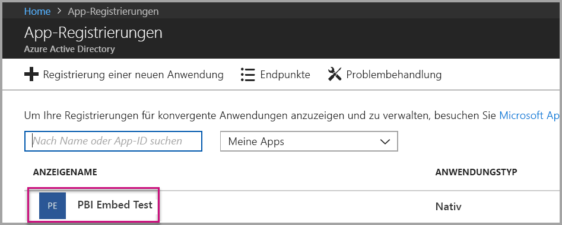
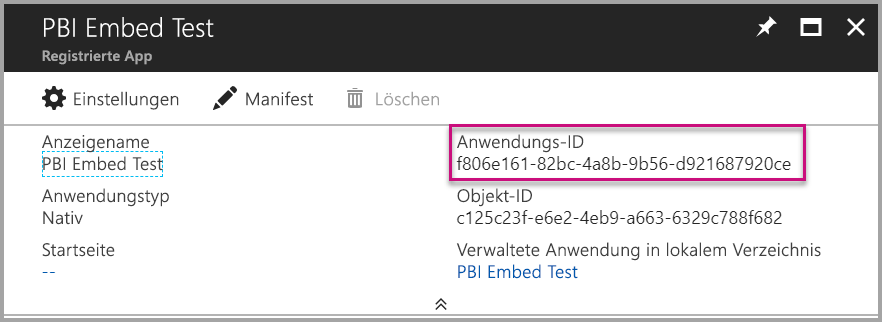
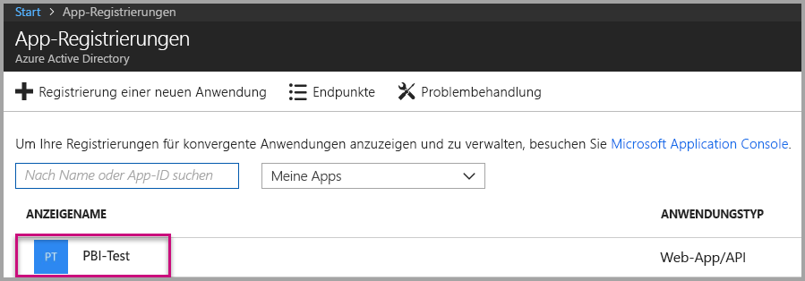
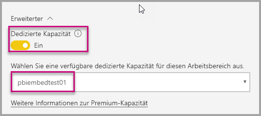

# <a name="tutorial-embed-power-bi-content-into-an-application-for-your-customers"></a>Tutorial: Einbetten von Power BI-Inhalten in eine Anwendung für Ihre Kunden

Mit **Power BI Embedded in Azure** können Sie mit App Owns Data (App ist Besitzer der Daten) Berichte, Dashboards oder Kacheln in eine Anwendung einbetten. Bei **App Owns Data** verwendet eine Anwendung Power BI als eingebettete Analyseplattform. **Unabhängige Softwarehersteller und -entwickler** können Power BI-Inhalt erstellen, der vollständig integrierte und interaktive Berichte, Dashboards oder Kacheln in einer Anwendung anzeigt, ohne dass die Benutzer über eine Power BI-Lizenz verfügen müssen. In diesem Tutorial wird veranschaulicht, wie Sie in **Power BI Embedded in Azure** einen Bericht für Ihre Kunden in eine Anwendung integrieren, indem Sie das Power BI .NET SDK mit der Power BI-JavaScript-API verwenden.


In diesem Tutorial erhalten Sie Informationen zu den folgenden Vorgängen:
> [!div class="checklist"]
> * Registrieren einer Anwendung in Azure
> * Einbetten eines Power BI-Berichts in eine App

## <a name="prerequisites"></a>Voraussetzungen

Sie benötigen Folgendes, um direkt mit dem Tutorial loslegen zu können:

* Ein [Power BI Pro-Konto](../service-self-service-signup-for-power-bi.md) (ein Hauptkonto, d.h. ein Benutzername und ein Kennwort zur Anmeldung in Ihrem Power BI Pro-Konto) oder einen [Dienstprinzipal (Token nur für Anwendungen)](embed-service-principal.md)
* Ein [Microsoft Azure](https://azure.microsoft.com/)-Abonnement
* Einen individuell eingerichteten [Azure Active Directory-Mandanten](create-an-azure-active-directory-tenant.md)

Wenn Sie noch nicht bei **Power BI Pro** registriert sind, [registrieren Sie sich für eine kostenlose Testversion](https://powerbi.microsoft.com/pricing/), bevor Sie beginnen.

Wenn Sie kein Azure-Abonnement besitzen, erstellen Sie ein [kostenloses Konto](https://azure.microsoft.com/free/?WT.mc_id=A261C142F), bevor Sie beginnen.

## <a name="set-up-your-embedded-analytics-development-environment"></a>Einrichten der Entwicklungsumgebung für eingebettete Analysen

Bevor Sie mit dem Einbetten von Dashboards, Berichten und Kacheln in Ihre Anwendung beginnen, müssen Sie sicherstellen, dass Ihre Umgebung Einbettungen mit Power BI zulässt.

Sie können sich mit dem [Setuptool für die Einbettung](https://aka.ms/embedsetup/AppOwnsData) vertraut machen, damit Sie schnell beginnen und eine Beispielanwendung herunterladen können. In dieser wird schrittweise erläutert, wie Sie eine Umgebung erstellen und einen Bericht einbetten können.

Wenn Sie jedoch die Umgebung manuell einrichten möchten, können Sie weiter unten fortfahren.

### <a name="register-an-application-in-azure-active-directory-azure-ad"></a>Registrieren einer Anwendung in Azure Active Directory (Azure AD)

[Registrieren Sie Ihre Anwendung](register-app.md) in Azure Active Directory, damit die Anwendung auf die [Power BI-REST-APIs](https://docs.microsoft.com/rest/api/power-bi/) zugreifen kann. Durch das Registrieren Ihrer Anwendung können Sie eine Identität für Ihre Anwendung erstellen und Berechtigungen für Power BI-REST-Ressourcen angeben. Je nachdem, ob Sie ein Hauptkonto oder einen [Dienstprinzipal](embed-service-principal.md) verwenden möchten, gibt es Unterschiede bei der Registrierung einer Anwendung.

Die Methode, für die Sie sich entscheiden, beeinflusst die Art der Anwendung, die Sie in Azure registrieren.

Wenn Sie mit einem Hauptkonto fortfahren, registrieren Sie eine **native** Anwendung. Eine native Anwendung wird verwendet, wenn Sie mit einer nicht interaktiven Anmeldung arbeiten.

Wenn Sie jedoch mit einem Dienstprinzipal fortfahren, müssen Sie eine **serverseitige Webanwendung** registrieren. Eine serverseitige Webanwendung wird registriert, wenn Sie ein Anwendungsgeheimnis erstellen möchten.

## <a name="set-up-your-power-bi-environment"></a>Einrichten der Power BI-Umgebung

### <a name="create-an-app-workspace"></a>Erstellen eines App-Arbeitsbereichs

Wenn Sie Berichte, Dashboards oder Kacheln für Ihre Kunden einbetten, müssen Sie Ihre Inhalte in einem App-Arbeitsbereich platzieren. Zur Einrichtung stehen verschiedene Arten von Arbeitsbereichen zur Auswahl: der [traditionelle Arbeitsbereich](../service-create-workspaces.md) oder [neue Arbeitsbereiche](../service-create-the-new-workspaces.md). Wenn Sie ein *Hauptkonto* verwenden, spielt es keine Rolle, welche Art von Arbeitsbereich Sie verwenden. Wenn Sie jedoch einen *[Dienstprinzipal](embed-service-principal.md)* verwenden, um sich in der Anwendung anzumelden, müssen Sie neue Arbeitsbereiche verwenden. In beiden Szenarios müssen das *Hauptkonto* und der *Dienstprinzipal* Administratorkonten für die Arbeitsbereiche Ihrer Anwendung sein.

### <a name="create-and-publish-your-reports"></a>Erstellen und Veröffentlichen von Berichten

Sie können Ihre Berichte und Datasets mit Power BI Desktop erstellen und diese Berichte dann in einem App-Arbeitsbereich veröffentlichen. Es gibt zwei Möglichkeiten, dies zu erreichen: Als Endbenutzer können Sie Berichte über ein Hauptkonto mit einer Lizenz für Power BI Pro in einem traditionellen Anwendungsarbeitsbereich veröffentlichen. Wenn Sie einen Dienstprinzipal verwenden, können Sie Berichte über die [Power BI-REST-APIs](https://docs.microsoft.com/rest/api/power-bi/imports/postimportingroup) in neuen Arbeitsbereichen veröffentlichen.

Unten finden Sie eine ausführliche Anleitung, wie Sie Ihren PBIX-Bericht in Ihrem Power BI-Arbeitsbereich veröffentlichen.

1. Laden Sie das Beispiel von GitHub herunter: [Blog-Demo](https://github.com/Microsoft/powerbi-desktop-samples).

    

2. Öffnen Sie den PBIX-Beispielbericht in **Power BI Desktop**.

   

3. Veröffentlichen Sie den Bericht in **App-Arbeitsbereiche**. Dieser Vorgang unterscheidet sich, je nachdem, ob Sie ein Hauptkonto mit einer Lizenz für Power BI Pro oder einen Dienstprinzipal verwenden. Wenn Sie ein Hauptkonto verwenden, können Sie Ihren Bericht über Power BI Desktop veröffentlichen.  Wenn Sie einen Dienstprinzipal verwenden, müssen Sie die Power BI-REST-APIs verwenden.

## <a name="embed-content-using-the-sample-application"></a>Einbetten von Inhalt mit der Beispielanwendung

Dieses Beispiel ist zur besseren Anschaulichkeit bewusst einfach gestaltet. Sie oder Ihre Entwickler sind selbst dafür verantwortlich, das Anwendungsgeheimnis bzw. die Anmeldeinformationen für das Hauptkonto zu schützen.

Führen Sie die folgenden Schritte durch, um Ihren Inhalt in eine Beispielanwendung zu implementieren:

1. Installieren Sie [Visual Studio](https://www.visualstudio.com/) (Version 2013 oder höher). Laden Sie das neueste [NuGet-Paket](https://www.nuget.org/profiles/powerbi) herunter.

2. Laden Sie das [App Owns Data](https://github.com/Microsoft/PowerBI-Developer-Samples)-Beispiel aus GitHub herunter, um zu beginnen.

    

3. Öffnen Sie die Datei **Web.config** in der Beispielanwendung. Damit die Anwendung ausgeführt werden kann, müssen Sie verschiedene Felder ausfüllen. Für **AuthenticationType** können Sie **MasterUser** oder **ServicePrincipal** auswählen. Je nachdem, für welche Authentifizierungsmethode Sie sich entscheiden, müssen unterschiedliche Felder ausgefüllt werden.

    > [!Note]
    > Der Standardwert für **AuthenticationType** in diesem Beispiel ist „MasterUser“.

    <center>

    | **MasterUser** <br> (Power BI Pro-Lizenzen) | **ServicePrincipal** <br> (Token nur für Anwendungen)|
    |---------------|-------------------|
    | [applicationId](#application-id) | [applicationId](#application-id) |
    | [workspaceId](#workspace-id) | [workspaceId](#workspace-id) |
    | [reportId](#report-id) | [reportId](#report-id) |
    | [pbiUsername](#power-bi-username-and-password) |  |
    | [pbiPassword](#power-bi-username-and-password) |  |
    |  | [applicationsecret](#application-secret) |
    |  | [tenant](#tenant) |

   </center>

    

### <a name="application-id"></a>Anwendungs-ID

Dieses Attribut wird für beide Authentifizierungstypen benötigt (Hauptkonto und [Dienstprinzipal](embed-service-principal.md)).

Geben Sie für **applicationId** die **Anwendungs-ID** aus **Azure** an. Die Anwendung identifiziert sich mithilfe der **applicationId** bei den Benutzern, von denen Sie Berechtigungen anfordern.

Führen Sie die folgenden Schritte aus, um **applicationId** abzurufen:

1. Melden Sie sich beim [Azure-Portal](https://portal.azure.com) an.

2. Klicken Sie im Navigationsbereich auf der linken Seite auf **Alle Dienste** > **App-Registrierungen**.

    

3. Wählen Sie die Anwendung aus, für die **applicationID** benötigt wird.

    

4. Es gibt eine **Anwendungs-ID**, die als GUID aufgeführt ist. Verwenden Sie diese **Anwendungs-ID** als **applicationId** für die Anwendung.

    

### <a name="workspace-id"></a>Arbeitsbereichs-ID

Dieses Attribut wird für beide Authentifizierungstypen benötigt (Hauptkonto und [Dienstprinzipal](embed-service-principal.md)).

Geben Sie für **workspaceId** die Anwendungsarbeitsbereichs-GUID (Gruppen-GUID) aus Power BI an. Die benötigten Informationen erhalten Sie entweder aus der URL, wenn Sie im Power BI-Dienst angemeldet sind, oder über PowerShell.

URL <br>


PowerShell <br>

```powershell
Get-PowerBIworkspace -name "App Owns Embed Test"
```

   

### <a name="report-id"></a>Berichts-ID

Dieses Attribut wird für beide Authentifizierungstypen benötigt (Hauptkonto und [Dienstprinzipal](embed-service-principal.md)).

Geben Sie als **reportId** die Berichts-GUID aus Power BI an. Die benötigten Informationen erhalten Sie entweder aus der URL, wenn Sie im Power BI-Dienst angemeldet sind, oder über PowerShell.

URL<br>


PowerShell <br>

```powershell
Get-PowerBIworkspace -name "App Owns Embed Test" | Get-PowerBIReport
```


### <a name="power-bi-username-and-password"></a>Benutzername und Kennwort für Power BI

Diese Attribute werden nur benötigt, wenn Sie als Authentifizierungmethode ein Hauptkonto verwenden möchten.

Wenn Sie für die Authentifizierung einen [Dienstprinzipal](embed-service-principal.md) verwenden, müssen Sie die Attribute „Benutzername“ und „Kennwort“ nicht ausfüllen.

* Geben Sie als **pbiUsername** das Power BI-Hauptkonto an.
* Geben Sie als **pbiPassword** das Kennwort für das Power BI-Hauptkonto an.

### <a name="application-secret"></a>Anwendungsgeheimnis

Dieses Attribut wird nur für den Authentifizierungstyp [Dienstprinzipal](embed-service-principal.md) benötigt.

Geben Sie für **ApplicationSecret** die Informationen aus dem Abschnitt **Schlüssel** Ihres Abschnitts für **App-Registrierungen** in **Azure** ein.  Dieses Attribut ist geeignet, wenn ein [Dienstprinzipal](embed-service-principal.md) verwendet wird.

Führen Sie die folgenden Schritte aus, um **ApplicationSecret** abzurufen:

1. Melden Sie sich beim [Azure-Portal](https://portal.azure.com) an.

2. Klicken Sie im Navigationsbereich auf der linken Seite auf **Alle Dienste** und dann auf **App-Registrierungen**.

    

3. Wählen Sie die Anwendung aus, die **ApplicationSecret** verwenden muss.

    

4. Wählen Sie **Einstellungen**aus.

    

5. Klicken Sie auf **Schlüssel**.

    

6. Geben Sie in das Feld **Beschreibung** einen Namen ein, und wählen Sie eine Dauer aus. Klicken Sie anschließend auf **Speichern**, um den **Wert** für Ihre Anwendung abzurufen. Wenn Sie den Bereich **Schlüssel** nach dem Speichern des Schlüsselwerts schließen, wird das Wertfeld nur als ausgeblendet angezeigt. An diesem Punkt können Sie den Schlüsselwert nicht abrufen. Wenn Sie den Schlüsselwert verlieren, müssen Sie im Azure-Portal einen neuen erstellen.

    

### <a name="tenant"></a>Mandant

Dieses Attribut wird nur für den Authentifizierungstyp [Dienstprinzipal](embed-service-principal.md) benötigt.

Geben Sie für **tenant** die ID Ihres Azure-Mandanten an. Die benötigten Informationen erhalten Sie entweder aus dem [Azure AD-Admin Center](/onedrive/find-your-office-365-tenant-id), wenn Sie im Power BI-Dienst angemeldet sind, oder über PowerShell.

### <a name="run-the-application"></a>Ausführen der Anwendung

1. Wählen Sie in **Visual Studio** die Option **Ausführen** aus.

    

2. Wählen Sie dann **Bericht einbetten** aus. Wählen Sie die gewünschte Option in der Anwendung aus, je nachdem, mit welchem Inhalt Sie testen möchten: Berichte, Dashboards oder Kacheln.

    

3. Jetzt können Sie den Bericht in der Beispielanwendung anzeigen.

    

## <a name="embed-content-within-your-application"></a>Einbetten von Inhalt in Ihre Anwendung

Es ist zwar auch möglich, die Schritte zum Einbetten des Inhalts mit den [Power BI-REST-APIs](https://docs.microsoft.com/rest/api/power-bi/) durchzuführen, die in diesem Artikel beschriebenen Beispielcodes werden jedoch mit dem **.NET SDK** erstellt.

Damit Kunden Einbettungen in der Anwendung vornehmen können, benötigen Sie ein **Zugriffstoken** für Ihr Hauptkonto oder Ihren **Dienstprinzipal** von [Azure AD](embed-service-principal.md). Sie benötigen ein [Azure AD-Zugriffstoken](get-azuread-access-token.md#access-token-for-non-power-bi-users-app-owns-data) für Ihre Power BI-Anwendung, bevor Sie Aufrufe an die [Power BI-REST-APIs](https://docs.microsoft.com/rest/api/power-bi/) durchführen können.

Sie sollten ein Power BI-Clientobjekt erstellen, durch das Sie mit den [Power BI-REST-APIs](https://docs.microsoft.com/rest/api/power-bi/) interagieren zu können, um den Power BI-Client mit Ihrem **Zugriffstoken** zu erstellen. Sie erstellen das Power BI-Clientobjekt durch Einschließen des **Zugriffstokens** in ein ***Microsoft.Rest.TokenCredentials***-Objekt.

```csharp
using Microsoft.IdentityModel.Clients.ActiveDirectory;
using Microsoft.Rest;
using Microsoft.PowerBI.Api.V2;

var tokenCredentials = new TokenCredentials(authenticationResult.AccessToken, "Bearer");

// Create a Power BI Client object. it's used to call Power BI APIs.
using (var client = new PowerBIClient(new Uri(ApiUrl), tokenCredentials))
{
    // Your code to embed items.
}
```

### <a name="get-the-content-item-you-want-to-embed"></a>Abrufen des einzubettenden Inhaltselements

Sie können mit dem Power BI-Clientobjekt einen Verweis auf das Element abrufen, das eingebettet werden soll.

Im folgenden Codebeispiel wird veranschaulicht, wie Sie den ersten Bericht aus einem bestimmten Arbeitsbereich abrufen.

*In der Datei „Services\EmbedService.cs“ in der [Beispielanwendung](https://github.com/Microsoft/PowerBI-Developer-Samples) finden Sie ein Beispiel zum Abrufen eines Inhaltselements (Bericht, Dashboard oder Kachel), das Sie einbetten möchten.*

```csharp
using Microsoft.PowerBI.Api.V2;
using Microsoft.PowerBI.Api.V2.Models;

// You need to provide the workspaceId where the dashboard resides.
ODataResponseListReport reports = await client.Reports.GetReportsInGroupAsync(workspaceId);

// Get the first report in the group.
Report report = reports.Value.FirstOrDefault();
```

### <a name="create-the-embed-token"></a>Erstellen des Einbettungstokens

Es wurde ein Einbettungstoken generiert, das aus der JavaScript-API verwendet werden kann. Das Einbettungstoken ist spezifisch für das Element, das Sie einbetten. Das heißt, dass Sie bei jedem Einbetten eines Power BI-Inhaltselements dafür ein neues Einbettungstoken erstellen müssen. Weitere Informationen hierzu, u.a. zum erforderlichen **accessLevel**, finden Sie unter [GenerateToken-API](https://msdn.microsoft.com/library/mt784614.aspx).

*In der Datei „Services\EmbedService.cs“ in der [Beispielanwendung](https://github.com/Microsoft/PowerBI-Developer-Samples) finden Sie ein Beispiel zum Erstellen eines Einbettungstokens (Bericht, Dashboard oder Kachel).*

```csharp
using Microsoft.PowerBI.Api.V2;
using Microsoft.PowerBI.Api.V2.Models;

// Generate Embed Token.
var generateTokenRequestParameters = new GenerateTokenRequest(accessLevel: "view");
EmbedToken tokenResponse = client.Reports.GenerateTokenInGroup(workspaceId, report.Id, generateTokenRequestParameters);

// Generate Embed Configuration.
var embedConfig = new EmbedConfig()
{
    EmbedToken = tokenResponse,
    EmbedUrl = report.EmbedUrl,
    Id = report.Id
};
```

Eine Klasse wird für **EmbedConfig** und **TileEmbedConfig** erstellt. Ein Beispiel ist in der Datei **Models\EmbedConfig.cs** und der Datei **Models\TileEmbedConfig.cs** verfügbar.

### <a name="load-an-item-using-javascript"></a>Laden eines Elements mit JavaScript

Sie können mithilfe von JavaScript einen Bericht in ein div-Element auf Ihrer Webseite laden.

Ein komplettes Beispiel für die Verwendung der JavaScript-API ist im [Playground-Tool](https://microsoft.github.io/PowerBI-JavaScript/demo) verfügbar. Das Playground-Tool ist eine Möglichkeit, schnell verschiedene Arten von Power BI Embedded-Beispielen auszuprobieren. Weitere Informationen zur JavaScript-API finden Sie auch auf der [Power BI-JavaScript-Wikiseite](https://github.com/Microsoft/powerbi-javascript/wiki).

Im Beispiel wird ein Modell **EmbedConfig** und ein Modell **TileEmbedConfig** mit Ansichten für einen Bericht verwendet.

*In den Dateien „Views\Home\EmbedReport.cshtml“, „Views\Home\EmbedDashboard.cshtml“ oder „Views\Home\Embedtile.cshtml“ in der [Beispielanwendung](#embed-content-using-the-sample-application) finden Sie ein Beispiel für das Hinzufügen einer Ansicht zu einem Bericht, Dashboard oder einer Kachel.*

```javascript
<script src="~/scripts/powerbi.js"></script>
<div id="reportContainer"></div>
<script>
    // Read embed application token from Model
    var accessToken = "@Model.EmbedToken.Token";

    // Read embed URL from Model
    var embedUrl = "@Html.Raw(Model.EmbedUrl)";

    // Read report Id from Model
    var embedReportId = "@Model.Id";

    // Get models. models contains enums that can be used.
    var models = window['powerbi-client'].models;

    // Embed configuration used to describe what and how to embed.
    // This object is used when calling powerbi.embed.
    // This also includes settings and options such as filters.
    // You can find more information at https://github.com/Microsoft/PowerBI-JavaScript/wiki/Embed-Configuration-Details.
    var config = {
        type: 'report',
        tokenType: models.TokenType.Embed,
        accessToken: accessToken,
        embedUrl: embedUrl,
        id: embedReportId,
        permissions: models.Permissions.All,
        settings: {
            filterPaneEnabled: true,
            navContentPaneEnabled: true
        }
    };

    // Get a reference to the embedded report HTML element
    var reportContainer = $('#reportContainer')[0];

    // Embed the report and display it within the div container.
    var report = powerbi.embed(reportContainer, config);
</script>
```

## <a name="move-to-production"></a>In die Produktionsphase wechseln

Wenn Sie mit dem Entwickeln Ihrer Anwendung fertig sind, sollten Sie Ihren App-Arbeitsbereich durch eine dedizierte Kapazität absichern. 

> [!Important]
> Dedizierte Kapazität ist erforderlich, um in die Produktionsphase wechseln zu können.

### <a name="create-a-dedicated-capacity"></a>Erstellen einer dedizierten Kapazität

Wenn Sie eine dedizierte Kapazität erstellen, können Sie Ihrem Kunden eine dedizierte Ressource zuweisen. Sie können eine dedizierte Kapazität im [Microsoft Azure-Portal](https://portal.azure.com) erwerben. Weitere Informationen zum Erstellen einer Power BI Embedded-Kapazität finden Sie unter [Erstellen einer Power BI Embedded-Kapazität im Azure-Portal](azure-pbie-create-capacity.md).

Verwenden Sie die folgende Tabelle, um herauszufinden, welche Power BI Embedded-Kapazität am besten zu Ihren Anforderungen passt.

| Kapazitätsknoten | Gesamtzahl der Kerne<br/>*(Back-End + Front-End)* | Back-End-Kerne | Front-End-Kerne | Grenzwerte für DirectQuery/Liveverbindung|
| --- | --- | --- | --- | --- | --- |
| A1 |1 V-Kern |0,5 Kerne, 3 GB RAM |0,5 Kerne |0 5 pro Sekunde |
| A2 |2 V-Kerne |1 Kern, 5 GB RAM |1 Kern | 10 pro Sekunde |
| A3 |4 V-Kerne |2 Kerne, 10 GB RAM |2 Kerne | 15 pro Sekunde |
| A4 |8 V-Kerne |4 Kerne, 25 GB RAM |4 Kerne |30 pro Sekunde |
| A5 |16 V-Kerne |8 Kerne, 50 GB RAM |8 Kerne |60 pro Sekunde |
| A6 |32 V-Kerne |16 Kerne, 100 GB RAM |16 Kerne |120 pro Sekunde |

**_Mit A-SKUs können Sie mit einer KOSTENLOSEN Power BI-Lizenz nicht auf Power BI-Inhalte zugreifen._**

Da Einbettungstokens mit Pro-Lizenzen für Entwicklungstests vorgesehen sind, ist die Anzahl von Einbettungstokens limitiert, die ein Power BI-Hauptkonto oder einen -Dienstprinzipal generieren kann. Für eine dedizierte Kapazität ist eine Einbettung in eine Produktionsumgebung erforderlich. Sie können mit einer dedizierten Kapazität so viele eingebettete Token generieren, wie Sie möchten. Verwenden Sie die Vorgänge zum Abrufen [verfügbarer Features](https://docs.microsoft.com/rest/api/power-bi/availablefeatures/getavailablefeatures), um den Auslastungswert zu überprüfen, der die derzeit eingebettete Auslastung in Prozent angibt. Der Verbrauchsbetrag errechnet sich pro Hauptkonto.

Weitere Informationen finden Sie im [Embedded analytics capacity planning whitepaper (Whitepaper zur Kapazitätsplanung von Embedded Analytics)](https://aka.ms/pbiewhitepaper).

### <a name="assign-an-app-workspace-to-a-dedicated-capacity"></a>Zuweisen eines App-Arbeitsbereichs zu einer dedizierten Kapazität

Wenn Sie eine dedizierte Kapazität erstellt haben, können Sie ihr Ihren App-Arbeitsbereich zuweisen.

Mithilfe der [Power BI-REST-API](https://docs.microsoft.com/rest/api/power-bi/capacities/groups_assigntocapacity) können Sie einem Arbeitsbereich über einen [Dienstprinzipal](embed-service-principal.md) eine dedizierte Kapazität zuzuweisen. Wenn Sie die Power BI-REST-APIs einsetzen, müssen Sie die [Dienstprinzipalobjekt-ID](embed-service-principal.md#how-to-get-the-service-principal-object-id) verwenden.

Entlang der folgenden Schritte können Sie einem Arbeitsbereich über ein **Hauptkonto** eine dedizierte Kapazität zuordnen.

1. Erweitern Sie im **Power BI-Dienst** Arbeitsbereiche, und klicken Sie auf die Auslassungspunkte neben dem Arbeitsbereich, den Sie zur Einbettung von Inhalt verwenden. Klicken Sie dann auf **Arbeitsbereich bearbeiten**.

    

2. Erweitern Sie **Erweitert**, aktivieren Sie **Dedizierte Kapazität**, und wählen Sie die dedizierte Kapazität aus, die Sie erstellt haben. Klicken Sie auf **Speichern**.

    

3. Nachdem Sie auf **Speichern** geklickt haben, sollte neben dem Namen des App-Arbeitsbereichs eine **Raute** angezeigt werden.

    

## <a name="next-steps"></a>Nächste Schritte

In diesem Tutorial haben Sie gelernt, wie Sie Power BI-Inhalte für Ihre Kunden in eine Anwendung einbetten. Sie können auch versuchen, Power BI-Inhalte für Ihre Organisation einzubetten.

> [!div class="nextstepaction"]
>[Embed for your organization (Einbetten für Ihre Organisation)](embed-sample-for-your-organization.md)

Weitere Fragen? [Stellen Sie Ihre Frage in der Power BI-Community.](http://community.powerbi.com/)
