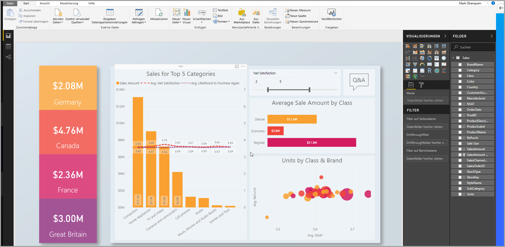
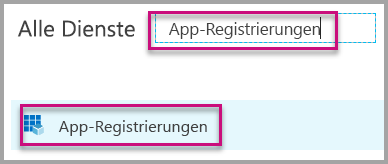
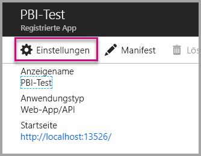
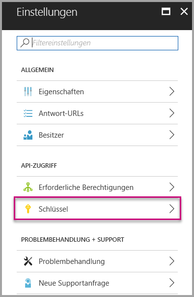
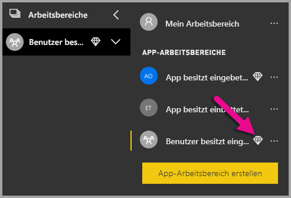

# <a name="tutorial-embed-power-bi-content-into-an-application-for-your-organization"></a>Tutorial: Einbetten von Power BI-Inhalten in eine Anwendung für Ihre Organisation

In **Power BI** können Sie mit User Owns Data (Benutzer ist Besitzer der Daten) Berichte, Dashboards oder Kacheln in eine Anwendung einbetten. Mit **User Owns Data** (Benutzer ist Besitzer der Daten) kann Ihre Anwendung den Power BI-Dienst erweitern, um Embedded Analytics zu nutzen. Dieses Tutorial veranschaulicht die Vorgehensweise beim Integrieren eines Berichts in eine Anwendung. Verwenden Sie das Power BI .NET SDK mit der Power BI-JavaScript-API, um Power BI für Ihre Organisation in eine Anwendung einzubetten.


In diesem Tutorial lernen Sie Folgendes:
> [!div class="checklist"]
> * Registrieren einer Anwendung in Azure
> * Einbetten eines Power BI-Berichts in eine Anwendung mithilfe Ihres Power BI-Mandanten

## <a name="prerequisites"></a>Voraussetzungen

Sie benötigen Folgendes, um direkt mit dem Tutorial loslegen zu können:

* Ein [Power BI Pro-Konto](../service-self-service-signup-for-power-bi.md)
* Ein [Microsoft Azure](https://azure.microsoft.com/)-Abonnement
* Einen individuell eingerichteten [Azure Active Directory-Mandanten](create-an-azure-active-directory-tenant.md)

Wenn Sie noch nicht bei **Power BI Pro** registriert sind, [registrieren Sie sich für eine kostenlose Testversion](https://powerbi.microsoft.com/pricing/), bevor Sie beginnen.

Wenn Sie kein Azure-Abonnement besitzen, erstellen Sie ein [kostenloses Konto](https://azure.microsoft.com/free/?WT.mc_id=A261C142F), bevor Sie beginnen.

## <a name="set-up-your-embedded-analytics-development-environment"></a>Einrichten der Entwicklungsumgebung für eingebettete Analysen

Bevor Sie mit dem Einbetten von Dashboards, Berichten und Kacheln in Ihre Anwendung beginnen, müssen Sie sicherstellen, dass Ihre Umgebung Einbettungen mit Power BI zulässt.

Sie können sich mit dem [Setuptool für die Einbettung](https://aka.ms/embedsetup/UserOwnsData) vertraut machen, damit Sie schnell beginnen und eine Beispielanwendung herunterladen können. In dieser wird schrittweise erläutert, wie Sie eine Umgebung erstellen und einen Bericht einbetten können.

Wenn Sie jedoch die Umgebung manuell einrichten möchten, können Sie weiter unten fortfahren.

### <a name="register-an-application-in-azure-active-directory"></a>Registrieren einer Anwendung in Azure Active Directory

[Registrieren Sie Ihre Anwendung](register-app.md) in Azure Active Directory, damit die Anwendung auf die [Power BI-REST-APIs](https://docs.microsoft.com/rest/api/power-bi/) zugreifen kann. Durch das Registrieren Ihrer Anwendung können Sie eine Identität für Ihre Anwendung erstellen und Berechtigungen für Power BI-REST-Ressourcen angeben.

Um fortzufahren, ist die Registrierung einer **serverseitigen Webanwendung** erforderlich. Eine serverseitige Webanwendung wird registriert, wenn Sie ein Anwendungsgeheimnis erstellen möchten.

## <a name="set-up-your-power-bi-environment"></a>Einrichten der Power BI-Umgebung

### <a name="create-an-app-workspace"></a>Erstellen eines App-Arbeitsbereichs

Wenn Sie Berichte, Dashboards oder Kacheln für Ihre Kunden einbetten, müssen Sie Ihre Inhalte in einem App-Arbeitsbereich platzieren. Zur Einrichtung stehen verschiedene Arten von Arbeitsbereichen zur Auswahl: der [traditionelle Arbeitsbereich](../service-create-workspaces.md) oder [neue Arbeitsbereiche](../service-create-the-new-workspaces.md).

### <a name="create-and-publish-your-reports"></a>Erstellen und Veröffentlichen von Berichten

Sie können Ihre Berichte und Datasets mit Power BI Desktop erstellen. Anschließend können Sie diese Berichte in einem App-Arbeitsbereich veröffentlichen. Der Benutzer, der die Berichte veröffentlicht, muss über eine Power BI Pro-Lizenz verfügen, damit er einen App-Arbeitsbereich veröffentlichen kann.

1. Laden Sie das [Demo](https://github.com/Microsoft/powerbi-desktop-samples)-Beispiel von GitHub herunter.

    

2. Öffnen Sie in Power BI Desktop den PBIX-Beispielbericht.

   

3. Veröffentlichen Sie den Bericht im App-Arbeitsbereich.

   

    Jetzt können Sie den Bericht online im Power BI-Dienst anzeigen.

   

## <a name="embed-your-content-by-using-the-sample-application"></a>Einbetten von Inhalt mit der Beispielanwendung

Dieses Beispiel ist zur besseren Anschaulichkeit bewusst einfach gestaltet.

Führen Sie die folgenden Schritte durch, um Ihren Inhalt in eine Beispielanwendung zu implementieren:

1. Installieren Sie [Visual Studio](https://www.visualstudio.com/) (Version 2013 oder höher). Laden Sie das neueste [NuGet-Paket](https://www.nuget.org/profiles/powerbi) herunter.

2. Laden Sie das [User Owns Data](https://github.com/Microsoft/PowerBI-Developer-Samples)-Beispiel aus GitHub herunter, um zu beginnen.

    

3. Öffnen Sie in der Beispielanwendung die Datei **Cloud.config**.

    Damit die Anwendung ausgeführt werden kann, müssen Sie verschiedene Felder ausfüllen.

    | Feld |
    |--------------------|
    | **[Anwendungs-ID](#application-id)** |
    | **[Anwendungsgeheimnis](#application-secret)** |
    | **[Arbeitsbereichs-ID](#workspace-id)** |
    | **[Berichts-ID](#report-id)** |
    | **[AADAuthorityUrl](#aadauthorityurl)** |

    

### <a name="application-id"></a>Anwendungs-ID

Geben Sie für **applicationId** die **Anwendungs-ID** aus **Azure** an. Die Anwendung identifiziert sich mithilfe der **applicationId** bei den Benutzern, von denen Sie Berechtigungen anfordern.

Führen Sie die folgenden Schritte aus, um **applicationId** abzurufen:

1. Melden Sie sich beim [Azure-Portal](https://portal.azure.com) an.

2. Klicken Sie im Navigationsbereich auf der linken Seite auf **Alle Dienste** > **App-Registrierungen**.

    

3. Wählen Sie die Anwendung aus, für die **applicationID** benötigt wird.

    

4. Es gibt eine **Anwendungs-ID**, die als GUID aufgeführt ist. Verwenden Sie diese **Anwendungs-ID** als **applicationId** für die Anwendung.

    

### <a name="application-secret"></a>Anwendungsgeheimnis

Geben Sie für **ApplicationSecret** die Informationen aus dem Abschnitt **Schlüssel** Ihres Abschnitts für **App-Registrierungen** in **Azure** ein.  Dieses Attribut ist geeignet, wenn ein [Dienstprinzipal](embed-service-principal.md) verwendet wird.

Führen Sie die folgenden Schritte aus, um **ApplicationSecret** abzurufen:

1. Melden Sie sich beim [Azure-Portal](https://portal.azure.com) an.

2. Klicken Sie im Navigationsbereich auf der linken Seite auf **Alle Dienste** und dann auf **App-Registrierungen**.

    

3. Wählen Sie die Anwendung aus, die **ApplicationSecret** verwenden muss.

    

4. Wählen Sie **Einstellungen**aus.

    

5. Klicken Sie auf **Schlüssel**.

    

6. Geben Sie in das Feld **Beschreibung** einen Namen ein, und wählen Sie eine Dauer aus. Klicken Sie anschließend auf **Speichern**, um den **Wert** für Ihre Anwendung abzurufen. Wenn Sie den Bereich **Schlüssel** nach dem Speichern des Schlüsselwerts schließen, wird das Wertfeld nur als ausgeblendet angezeigt. An diesem Punkt können Sie den Schlüsselwert nicht abrufen. Wenn Sie den Schlüsselwert verlieren, müssen Sie im Azure-Portal einen neuen erstellen.

    

### <a name="workspace-id"></a>Arbeitsbereichs-ID

Geben Sie für **workspaceId** die Anwendungsarbeitsbereichs-GUID (Gruppen-GUID) aus Power BI an. Die benötigten Informationen erhalten Sie entweder aus der URL, wenn Sie im Power BI-Dienst angemeldet sind, oder über PowerShell.

URL <br>


PowerShell <br>

```powershell
Get-PowerBIworkspace -name "User Owns Embed Test"
```

   

### <a name="report-id"></a>Berichts-ID

Geben Sie als **reportId** die Berichts-GUID aus Power BI an. Die benötigten Informationen erhalten Sie entweder aus der URL, wenn Sie im Power BI-Dienst angemeldet sind, oder über PowerShell.

URL <br>


PowerShell <br>

```powershell
Get-PowerBIworkspace -name "User Owns Embed Test" | Get-PowerBIReport
```


### <a name="aadauthorityurl"></a>AADAuthorityUrl

Geben Sie die **AADAuthorityUrl**-Informationen mit der URL an, die Ihnen entweder das Einbetten in Ihrem Organisationsmandanten oder mit einem Gastbenutzer erlaubt.

Zum Einbetten mit Ihrem Organisationsmandanten verwenden Sie die folgende URL: *https://login.microsoftonline.com/common/oauth2/authorize*.

Zum Einbetten mit einem Gastbenutzer verwenden Sie die folgende URL: *https://login.microsoftonline.com/report-owner-tenant-id*. Fügen Sie auf dieser Seite die Mandanten-ID des Besitzers des Berichts hinzu, welche *report-owner-tenant-id* (Mandanten-ID des Berichtsbesitzers) ersetzt.

### <a name="run-the-application"></a>Ausführen der Anwendung

1. Wählen Sie in **Visual Studio** die Option **Ausführen** aus.

    

2. Wählen Sie dann **Bericht einbetten** aus. Wählen Sie die gewünschte Option in der Anwendung aus, je nachdem, mit welchem Inhalt Sie testen möchten: Berichte, Dashboards oder Kacheln.

    

3. Jetzt können Sie den Bericht in der Beispielanwendung anzeigen.

    

## <a name="embed-your-content-within-your-application"></a>Einbetten von Inhalt in Ihre Anwendung

Auch wenn die Schritte zum Einbetten des Inhalts mit den [Power BI-REST-APIs](https://docs.microsoft.com/rest/api/power-bi/) durchgeführt werden können, werden die in diesem Artikel beschriebenen Beispielcodes mit dem .NET SDK erstellt.

Wenn Sie einen Bericht in eine Web-App integrieren möchten, müssen Sie die Power BI-REST-API oder das Power BI C# SDK verwenden. Zum Abrufen eines Berichts verwenden Sie zudem ein Azure Active-Zugriffstoken für die Autorisierung. Anschließend laden Sie den Bericht mithilfe desselben Zugriffstokens. Die Power BI-REST-API bietet programmgesteuerten Zugriff auf bestimmte Power BI-Ressourcen. Weitere Informationen finden Sie unter [Power BI-REST-API](https://docs.microsoft.com/rest/api/power-bi/) und [Power BI-JavaScript-API](https://github.com/Microsoft/PowerBI-JavaScript).

### <a name="get-an-access-token-from-azure-ad"></a>Abrufen eines Zugriffstokens aus Azure AD

In der Anwendung müssen Sie ein Zugriffstoken aus Azure AD abrufen, bevor Sie die Power BI-REST-API aufrufen können. Weitere Informationen finden Sie unter [Authentifizieren von Benutzern und Abrufen eines Azure AD-Zugriffstokens für die Power BI-App](get-azuread-access-token.md).

### <a name="get-a-report"></a>Abrufen eines Berichts

Zum Abrufen eines Power BI-Berichts müssen Sie den Vorgang [Berichte abrufen](https://docs.microsoft.com/rest/api/power-bi/reports/getreports) verwenden, um eine Liste der Power BI-Berichte abzurufen. Aus der Liste der Berichte können Sie eine Berichts-ID abrufen.

### <a name="get-reports-by-using-an-access-token"></a>Abrufen von Berichten mithilfe eines Zugriffstokens

Der Vorgang [Get Reports](https://docs.microsoft.com/rest/api/power-bi/reports/getreports) (Berichte abrufen) gibt eine Liste der Berichte zurück. Anhand der Liste der Berichte können Sie einen einzelnen Bericht abrufen.

Zum Ausführen des REST-API-Aufrufs müssen Sie einen *Autorisierungsheader* im Format *Träger {Zugriffstoken}* einschließen.

#### <a name="get-reports-with-the-rest-api"></a>Abrufen von Berichten mit der REST-API

Im Folgenden finden Sie ein Codebeispiel zum Abrufen von Berichten mit der REST-API:

> [!Note]
> In der Datei „Default.aspx.cs“ in der [Beispielanwendung](https://github.com/Microsoft/PowerBI-Developer-Samples) ist ein Beispiel zum Abrufen eines Inhaltselements verfügbar, das eingebettet werden soll. Als Beispiele wird ein Bericht, ein Dashboard oder eine Kachel aufgeführt.

```csharp
using Newtonsoft.Json;

//Get a Report. In this sample, you get the first Report.
protected void GetReport(int index)
{
    //Configure Reports request
    System.Net.WebRequest request = System.Net.WebRequest.Create(
        String.Format("{0}/Reports",
        baseUri)) as System.Net.HttpWebRequest;

    request.Method = "GET";
    request.ContentLength = 0;
    request.Headers.Add("Authorization", String.Format("Bearer {0}", accessToken.Value));

    //Get Reports response from request.GetResponse()
    using (var response = request.GetResponse() as System.Net.HttpWebResponse)
    {
        //Get reader from response stream
        using (var reader = new System.IO.StreamReader(response.GetResponseStream()))
        {
            //Deserialize JSON string
            PBIReports Reports = JsonConvert.DeserializeObject<PBIReports>(reader.ReadToEnd());

            //Sample assumes at least one Report.
            //You could write an app that lists all Reports
            if (Reports.value.Length > 0)
            {
                var report = Reports.value[index];

                txtEmbedUrl.Text = report.embedUrl;
                txtReportId.Text = report.id;
                txtReportName.Text = report.name;
            }
        }
    }
}

//Power BI Reports used to deserialize the Get Reports response.
public class PBIReports
{
    public PBIReport[] value { get; set; }
}
public class PBIReport
{
    public string id { get; set; }
    public string name { get; set; }
    public string webUrl { get; set; }
    public string embedUrl { get; set; }
}
```

#### <a name="get-reports-by-using-the-net-sdk"></a>Abrufen von Berichten mit dem .NET SDK

Mithilfe des .NET-SDK können Sie eine Liste der Berichte abrufen und müssen die REST-API nicht direkt aufrufen. Im folgenden Codebeispiel wird gezeigt, wie Sie Berichte auflisten können:

```csharp
using Microsoft.IdentityModel.Clients.ActiveDirectory;
using Microsoft.PowerBI.Api.V2;
using Microsoft.PowerBI.Api.V2.Models;

var tokenCredentials = new TokenCredentials(<ACCESS TOKEN>, "Bearer");

// Create a Power BI Client object. It is used to call Power BI APIs.
using (var client = new PowerBIClient(new Uri(ApiUrl), tokenCredentials))
{
    // Get the first report all reports in that workspace
    ODataResponseListReport reports = client.Reports.GetReports();

    Report report = reports.Value.FirstOrDefault();

    var embedUrl = report.EmbedUrl;
}
```

### <a name="load-a-report-by-using-javascript"></a>Laden eines Berichts mit JavaScript

Sie können mithilfe von JavaScript einen Bericht in ein div-Element auf Ihrer Webseite laden. Im folgenden Codebeispiel wird gezeigt, wie ein Bericht aus einem bestimmten Arbeitsbereich abgerufen wird:

> [!NOTE]  
> In der Datei **Default.aspx** in der [Beispielanwendung](https://github.com/Microsoft/PowerBI-Developer-Samples) ist ein Beispiel zum Laden eines Inhaltselements verfügbar, das eingebettet werden soll.

```javascript
<!-- Embed Report-->
<div> 
    <asp:Panel ID="PanelEmbed" runat="server" Visible="true">
        <div>
            <div><b class="step">Step 3</b>: Embed a report</div>

            <div>Enter an embed url for a report from Step 2 (starts with https://):</div>
            <input type="text" id="tb_EmbedURL" style="width: 1024px;" />
            <br />
            <input type="button" id="bEmbedReportAction" value="Embed Report" />
        </div>

        <div id="reportContainer"></div>
    </asp:Panel>
</div>
```

#### <a name="sitemaster"></a>Site.master

```javascript
window.onload = function () {
    // client side click to embed a selected report.
    var el = document.getElementById("bEmbedReportAction");
    if (el.addEventListener) {
        el.addEventListener("click", updateEmbedReport, false);
    } else {
        el.attachEvent('onclick', updateEmbedReport);
    }

    // handle server side post backs, optimize for reload scenarios
    // show embedded report if all fields were filled in.
    var accessTokenElement = document.getElementById('MainContent_accessTokenTextbox');
    if (accessTokenElement !== null) {
        var accessToken = accessTokenElement.value;
        if (accessToken !== "")
            updateEmbedReport();
    }
};

// update embed report
function updateEmbedReport() {

    // check if the embed url was selected
    var embedUrl = document.getElementById('tb_EmbedURL').value;
    if (embedUrl === "")
        return;

    // get the access token.
    accessToken = document.getElementById('MainContent_accessTokenTextbox').value;

    // Embed configuration used to describe the what and how to embed.
    // This object is used when calling powerbi.embed.
    // You can find more information at https://github.com/Microsoft/PowerBI-JavaScript/wiki/Embed-Configuration-Details.
    var config = {
        type: 'report',
        accessToken: accessToken,
        embedUrl: embedUrl
    };

    // Grab the reference to the div HTML element that will host the report.
    var reportContainer = document.getElementById('reportContainer');

    // Embed the report and display it within the div container.
    var report = powerbi.embed(reportContainer, config);

    // report.on will add an event handler which prints to Log window.
    report.on("error", function (event) {
        var logView = document.getElementById('logView');
        logView.innerHTML = logView.innerHTML + "Error<br/>";
        logView.innerHTML = logView.innerHTML + JSON.stringify(event.detail, null, "  ") + "<br/>";
        logView.innerHTML = logView.innerHTML + "---------<br/>";
    }
  );
}
```

## <a name="using-a-power-bi-premium-dedicated-capacity"></a>Verwenden einer dedizierten Power BI Premium-Kapazität

Wenn Sie mit dem Entwickeln Ihrer Anwendung fertig sind, sollten Sie Ihren App-Arbeitsbereich durch eine dedizierte Kapazität absichern.

### <a name="create-a-dedicated-capacity"></a>Erstellen einer dedizierten Kapazität

Indem Sie eine dedizierte Kapazität erstellen, können Sie die dazugehörigen Vorteile für den Inhalt in Ihrem App-Arbeitsbereich verwenden. Sie können mit [Power BI Premium](../service-premium.md) eine dedizierte Kapazität erstellen.

In der folgenden Tabelle werden die verfügbaren Power BI Premium-SKUs in [Microsoft Office 365](../service-admin-premium-purchase.md) aufgelistet:

| Kapazitätsknoten | Gesamtanzahl virtueller Kerne<br/>(Back-End + Front-End) | virtuelle Back-End-Kerne | virtuelle Front-End-Kerne | Grenzwerte für DirectQuery/Liveverbindung |
| --- | --- | --- | --- | --- | --- |
| EM1 |1 virtueller Kern |0,5 virtuelle Kerne, 10 GB RAM |0,5 virtuelle Kerne |3,75 pro Sekunde |
| EM2 |2 virtuelle Kerne |1 virtueller Kern, 10 GB RAM |1 virtueller Kern |7,5 pro Sekunde |
| EM3 |4 virtuelle Kerne |2 virtuelle Kerne, 10 GB RAM |2 virtuelle Kerne |15 pro Sekunde |
| P1 |8 virtuelle Kerne |4 virtuelle Kerne, 25 GB RAM |4 virtuelle Kerne |30 pro Sekunde |
| P2 |16 virtuelle Kerne |8 virtuelle Kerne, 50 GB RAM |8 virtuelle Kerne |60 pro Sekunde |
| P3 |32 virtuelle Kerne |16 virtuelle Kerne, 100 GB RAM |16 virtuelle Kerne |120 pro Sekunde |
| P4 |64 virtuelle Kerne |32 virtuelle Kerne, 200 GB RAM |32 virtuelle Kerne |240 pro Sekunde |
| P5 |128 virtuelle Kerne |64 virtuelle Kerne, 400 GB RAM |64 virtuelle Kerne |480 pro Sekunde |

> [!NOTE]
> - Wenn Sie versuchen, Inhalte in Microsoft Office-Apps einzubetten, können Sie mithilfe von EM-SKUs mit einer kostenlosen Power BI-Lizenz auf diese Inhalte zugreifen. Wenn Sie Powerbi.com oder Power BI Mobile verwenden, können Sie jedoch nicht mit einer kostenlosen Power BI-Lizenz auf Inhalte zugreifen.
> - Wenn Sie versuchen, Inhalte mit Powerbi.com oder Power BI Mobile in Microsoft Office-Apps einzubetten, können Sie mit einer kostenlosen Power BI-Lizenz auf diese Inhalte zugreifen.

### <a name="assign-an-app-workspace-to-a-dedicated-capacity"></a>Zuweisen eines App-Arbeitsbereichs zu einer dedizierten Kapazität

Nachdem Sie eine dedizierte Kapazität erstellt haben, können Sie dieser Ihren App-Arbeitsbereich zuweisen. Führen Sie die folgenden Schritte durch, um diesen Vorgang abzuschließen:

1. Erweitern Sie im Power BI-Dienst Arbeitsbereiche, und klicken Sie auf die Auslassungspunkte neben dem Arbeitsbereich, den Sie zur Einbettung von Inhalten verwenden. Klicken Sie dann auf **Arbeitsbereich bearbeiten**.

    

2. Erweitern Sie **Erweitert**, und aktivieren Sie **Dedizierte Kapazität**. Wählen Sie die dedizierte Kapazität aus, die Sie erstellt haben. Klicken Sie auf **Speichern**.

    

3. Nachdem Sie auf **Speichern** geklickt haben, sollte neben dem Namen des App-Arbeitsbereichs eine Raute angezeigt werden.

    

## <a name="admin-settings"></a>Administratoreinstellungen

Globale Administratoren oder Power BI-Dienstadministratoren können die Möglichkeit der Verwendung der REST-APIs für einen Mandanten aktivieren oder deaktivieren. Power BI-Administratoren können diese Einstellung für die gesamte Organisation oder für einzelne Sicherheitsgruppen festlegen. In der Standardeinstellung ist sie für die gesamte Organisation aktiviert. Sie können diese Änderungen im [Power BI-Verwaltungsportal](../service-admin-portal.md) vornehmen.

## <a name="next-steps"></a>Nächste Schritte

In diesem Tutorial haben Sie gelernt, wie Sie Power BI-Inhalte mithilfe Ihres Power BI-Organisationskontos in eine Anwendung einbetten. Sie können jetzt versuchen, Power BI-Inhalte mithilfe von Apps in eine Anwendung einzubetten. Sie können auch versuchen, Power BI-Inhalte für Ihre Kunden einzubetten:

> [!div class="nextstepaction"]
> [Embed from apps (Einbetten aus Apps)](embed-from-apps.md)

> [!div class="nextstepaction"]
>[Inhalte für Ihre Kunden einbetten](embed-sample-for-customers.md)

Wenn Sie weitere Fragen haben, [stellen Sie diese in der Power BI-Community](http://community.powerbi.com/).
