# <a name="tutorial-embed-a-power-bi-report-dashboard-or-tile-into-an-application-for-your-organization"></a>Tutorial: Einbetten von Power BI-Berichten, -Dashboards oder -Kacheln in eine Anwendung für Ihre Organisation
In diesem Tutorial wird veranschaulicht, wie Sie einen Bericht in eine Anwendung integrieren, indem Sie das **Power BI .NET SDK** mit der **Power BI-JavaScript-API** verwenden, wenn Sie **Power BI** für Ihre Organisation in eine Anwendung einbetten. Mit **Power BI** können Sie mit **user owns data** (Benutzer ist Besitzer der Daten) Berichte, Dashboards oder Kacheln in eine Anwendung einbetten. Mit **user owns data** (Benutzer ist Besitzer der Daten) kann Ihre Anwendung den Power BI-Dienst erweitern.


In diesem Tutorial erhalten Sie Informationen zu den folgenden Vorgängen:
>[!div class="checklist"]
>* Registrieren einer Anwendung in Azure
>* Einbetten eines Power BI-Berichts in eine App

## <a name="prerequisites"></a>Voraussetzungen
Sie benötigen ein **Power BI Pro**-Konto und ein **Microsoft Azure**-Abonnement.

* Wenn Sie noch nicht bei **Power BI Pro** registriert sind, [registrieren Sie sich für eine kostenlose Testversion](https://powerbi.microsoft.com/en-us/pricing/), bevor Sie beginnen.
* Wenn Sie kein Azure-Abonnement besitzen, erstellen Sie ein [kostenloses Konto](https://azure.microsoft.com/free/?WT.mc_id=A261C142F), bevor Sie beginnen.
* Sie müssen einen eigenen [Azure Active Directory-Mandanten](create-an-azure-active-directory-tenant.md) eingerichtet haben.
* [Visual Studio](https://www.visualstudio.com/) muss installiert sein (Version 2013 oder höher).

## <a name="setup-your-embedded-analytics-development-environment"></a>Einrichten der Entwicklungsumgebung für eingebettete Analysen

Bevor Sie mit dem Einbetten von Dashboards, Berichten und Kacheln in Ihre Anwendung beginnen, müssen Sie sicherstellen, dass Ihre Umgebung für Einbettungsvorgänge eingerichtet ist. Im Rahmen der Einrichtung müssen Sie folgende Aktionen ausführen.

Sie können sich mit dem [Tool mit Onboardingfunktionen zur Einbettung](https://aka.ms/embedsetup/UserOwnsData) vertraut machen, damit Sie schnell beginnen und eine Beispielanwendung herunterladen können, die Ihnen beim Erstellen einer Umgebung und beim Einbetten eines Berichts helfen kann.

Wenn Sie jedoch die Umgebung manuell einrichten möchten, können Sie weiter unten fortfahren.
### <a name="register-an-application-in-azure-active-directory-azure-ad"></a>Registrieren einer Anwendung in Azure Active Directory (Azure AD)

Sie registrieren Ihre Anwendung in Azure Active Directory, damit die Anwendung auf die Power BI-REST-APIs zugreifen kann. Auf diese Weise können Sie eine Identität für Ihre Anwendung erstellen und Berechtigungen für Power BI-REST-Ressourcen angeben.

1. Akzeptieren Sie die [Nutzungsbedingungen für die Microsoft Power BI-API](https://powerbi.microsoft.com/api-terms).

2. Melden Sie sich beim [Azure-Portal](https://portal.azure.com) an.

    

3. Wählen Sie im Navigationsbereich auf der linken Seite **Alle Dienste**, dann **App-Registrierungen** und schließlich **Neue Anwendungsregistrierung** aus.

    </br>
    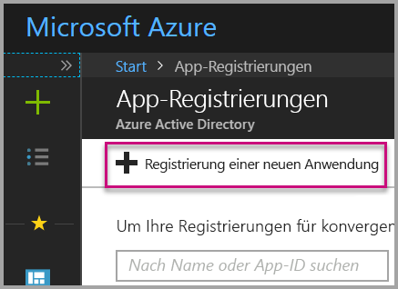

4. Folgen Sie den Anweisungen, und erstellen Sie eine neue Anwendung . Für **user owns data** (Benutzer ist Besitzer der Daten) müssen Sie den Anwendungstyp **Web-App/API** verwenden. Sie müssen auch eine **Anmelde-URL** angeben, den **Azure AD** zur Rückgabe von Tokenantworten verwendet. Geben Sie einen für Ihre Anwendung spezifischen Wert ein, z. B. http://localhost:13526/).

    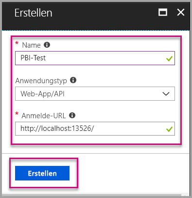

### <a name="apply-permissions-to-your-application-within-azure-active-directory"></a>Anwenden von Berechtigungen auf die Anwendung in Azure Active Directory

Sie müssen neben den Einstellungen auf der App-Registrierungsseite zusätzliche Berechtigungen für die Anwendung aktivieren. Sie müssen mit einem *globalen Administratorkonto* angemeldet sein, um Berechtigungen zu aktivieren.

### <a name="use-the-azure-active-directory-portal"></a>Verwenden des Azure Active Directory-Portals

1. Navigieren Sie zu [App-Registrierungen](https://portal.azure.com/#blade/Microsoft_AAD_IAM/ApplicationsListBlade) im Azure-Portal, und wählen Sie die App aus, die Sie für die Einbettung verwenden.

    

2. Wählen Sie **Einstellungen** und danach unter **API-Zugriff** die Option **Erforderliche Berechtigungen** aus.

    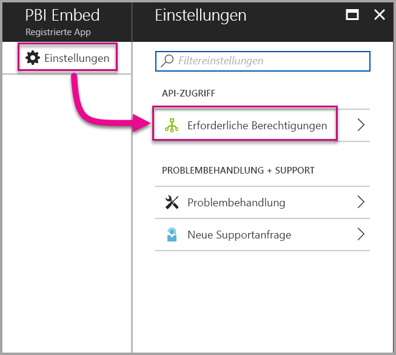

3. Wählen Sie **Windows Azure Active Directory** aus, und stellen Sie sicher, dass **Hiermit greifen Sie als angemeldeter Benutzer auf das Verzeichnis zu** ausgewählt ist. Wählen Sie **Speichern**.

    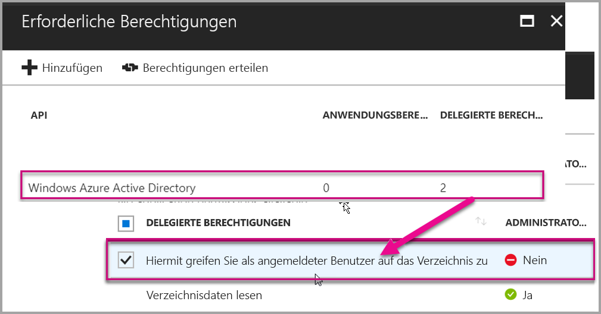

4. Wählen Sie **Hinzufügen**.

    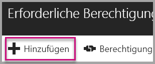

5. Klicken Sie auf **API auswählen**.

    

6. Klicken Sie auf **Power BI-Dienst** und dann auf **Auswählen**.

    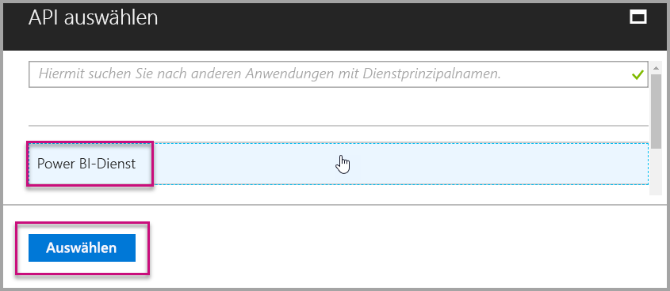

7. Wählen Sie alle Berechtigungen unter **Delegierte Berechtigungen** aus. Sie müssen sie einzeln auswählen, um die Auswahl zu speichern. Wählen Sie **Speichern** aus, wenn Sie fertig sind.

    

## <a name="setup-your-power-bi-environment"></a>Einrichten Ihrer Power BI-Umgebung

### <a name="create-an-app-workspace"></a>Erstellen eines App-Arbeitsbereichs

Wenn Sie Berichte, Dashboards oder Kacheln für Ihre Kunden einbetten, müssen Sie Ihre Inhalte in einem App-Arbeitsbereich platzieren.

1. Erstellen Sie zunächst den Arbeitsbereich. Wählen Sie **Arbeitsbereiche** > **App-Arbeitsbereich erstellen** aus. Hier legen Sie die Inhalte ab, auf die Ihre Anwendung zugreifen muss.

    

2. Benennen Sie den Arbeitsbereich. Wenn die entsprechende **Arbeitsbereichs-ID** nicht verfügbar ist, geben Sie eine eindeutige ID ein. Diese muss der Name der App sein.

    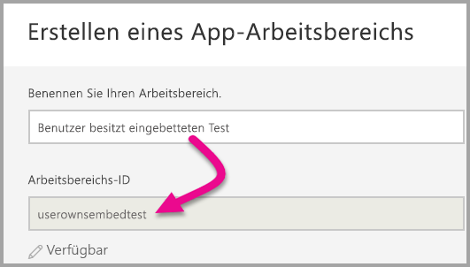

3. Sie können einige Optionen festlegen. Wenn Sie **Öffentlich** auswählen, können die Inhalte des Arbeitsbereichs von jedem Benutzer in der Organisation angezeigt werden. **Privat** bedeutet hingegen, dass die Inhalte des Arbeitsbereichs nur von dessen Mitgliedern angezeigt werden können.

    

    Sie können die Einstellung „Öffentlich“ bzw. „Privat“ einer Gruppe nach deren Erstellung nicht mehr ändern.

4. Sie können auch auswählen, ob Mitglieder Inhalte **bearbeiten** können oder **schreibgeschützten** Zugriff haben.

    

5. Fügen Sie E-Mail-Adressen von Personen hinzu, die Zugriff auf den Arbeitsbereich haben sollen, und wählen Sie **Hinzufügen** aus. Sie können keine Gruppenaliase, sondern nur einzelne Personen hinzufügen.

6. Legen Sie für jede Person fest, ob sie Mitglied oder Administrator ist. Administratoren können den Arbeitsbereich selbst bearbeiten und weitere Mitglieder hinzufügen. Mitglieder können den Inhalt des Arbeitsbereichs bearbeiten, es sei denn, sie haben schreibgeschützten Zugriff. Sowohl Administratoren als auch Mitglieder können die App veröffentlichen.

    Jetzt können Sie den neuen Arbeitsbereich anzeigen. Der Arbeitsbereich wird in Power BI erstellt und geöffnet. Er wird in der Liste der Arbeitsbereiche angezeigt, deren Mitglied Sie sind. Da Sie Administrator sind, können Sie die Auslassungspunkte (...) auswählen, um zurückzukehren, und Änderungen vornehmen, neue Mitglieder hinzufügen oder deren Berechtigungen ändern.

    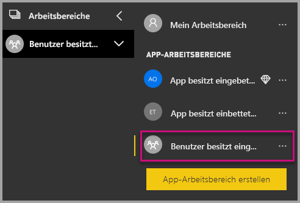

### <a name="create-and-publish-your-reports"></a>Erstellen und Veröffentlichen von Berichten

Sie können Ihre Berichte und Datasets mit Power BI Desktop erstellen und diese Berichte dann in einem App-Arbeitsbereich veröffentlichen. Der Benutzer, der die Berichte veröffentlicht, muss über eine Power BI Pro-Lizenz verfügen, damit er einen App-Arbeitsbereich veröffentlichen kann.

1. Laden Sie das Beispiel von GitHub herunter: [Blog-Demo](https://github.com/Microsoft/powerbi-desktop-samples).

    

2. Öffnen Sie den PBIX-Beispielbericht in **Power BI Desktop**.

   

3. Veröffentlichen Sie den Bericht im **App-Arbeitsbereich**.

   

    Jetzt können Sie den Bericht online im Power BI-Dienst anzeigen.

   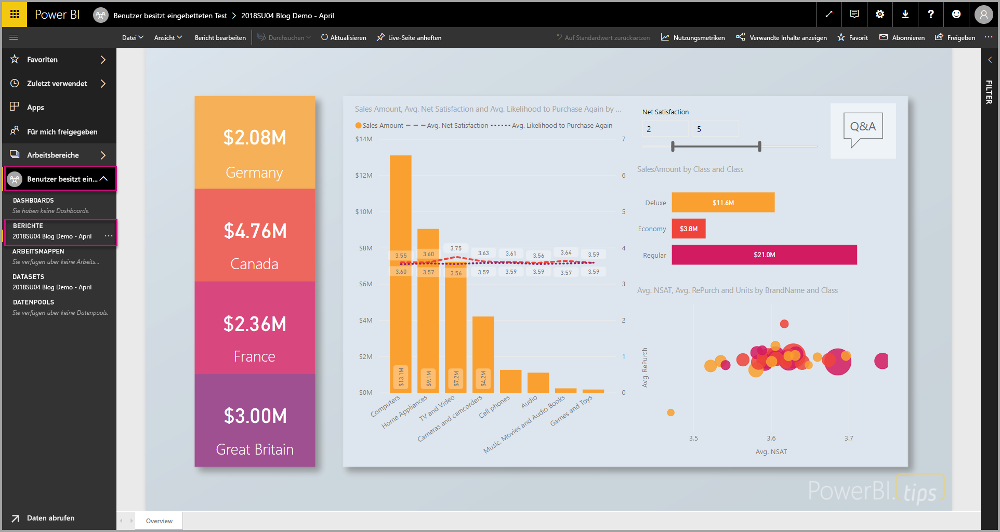

## <a name="embed-your-content-using-the-sample-application"></a>Einbetten von Inhalt mit der Beispielanwendung

Führen Sie die folgenden Schritte durch, um Ihren Inhalt in eine Beispielanwendung zu implementieren.

1. Laden Sie das [User Owns Data](https://github.com/Microsoft/PowerBI-Developer-Samples)-Beispiel aus GitHub herunter, um zu beginnen.  Es gibt drei verschiedene Beispielanwendungen, eine für [Berichte](https://github.com/Microsoft/PowerBI-Developer-Samples/tree/master/User%20Owns%20Data/integrate-report-web-app), eine für [Dashboards](https://github.com/Microsoft/PowerBI-Developer-Samples/tree/master/User%20Owns%20Data/integrate-dashboard-web-app) und eine für [Kacheln](https://github.com/Microsoft/PowerBI-Developer-Samples/tree/master/User%20Owns%20Data/integrate-tile-web-app).  Dieser Artikel bezieht sich wie unten beschrieben auf die Anwendung von **Berichten**.

    

2. Öffnen Sie die Datei „Cloud.config“ in der Beispielanwendung. Damit die Anwendung erfolgreich ausgeführt werden kann, müssen Sie einige Felder auffüllen. Die Felder **ClientID** und **ClientSecret**.

    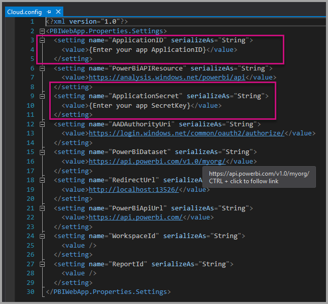

    Geben Sie für **ClientID** die **Anwendungs-ID** aus **Azure** an. Die Anwendung identifiziert sich mithilfe der **ClientID** bei den Benutzern, von denen Sie Berechtigungen anfordern.

    Führen Sie die folgenden Schritte aus, um die **ClientID** abzurufen:

    Melden Sie sich beim [Azure-Portal](https://portal.azure.com) an.

    

    Wählen Sie im Navigationsbereich auf der linken Seite **Alle Dienste** und dann **App-Registrierungen** aus.

    

    Wählen Sie die Anwendung aus, die die **ClientID** verwenden muss.

    

    Sie sollten eine **Anwendungs-ID** sehen, die als GUID aufgeführt ist. Verwenden Sie diese **Anwendungs-ID** als **ClientID** für die Anwendung.

    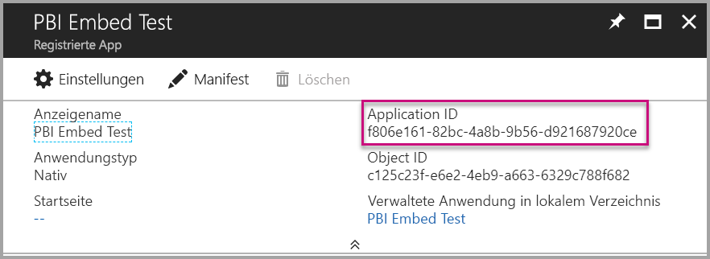

    Geben Sie für **ClientSecret** die Informationen aus dem Abschnitt **Schlüssel** Ihres Abschnitts für **App-Registrierungen** in **Azure** ein.

    Führen Sie die folgenden Schritte aus, um **ClientSecret** abzurufen:

    Melden Sie sich beim [Azure-Portal](https://portal.azure.com) an.

    

    Wählen Sie im Navigationsbereich auf der linken Seite **Alle Dienste** und dann **App-Registrierungen** aus.

    

    Wählen Sie die Anwendung aus, die **ClientSecret** verwenden muss.

    

    Wählen Sie **Einstellungen**aus.

    

    Klicken Sie auf **Schlüssel**.

    

    Geben Sie unter **Beschreibung** einen Namen ein, und wählen Sie eine **Dauer** aus, klicken Sie dann auf **Speichern**, um den **Wert** für Ihre Anwendung zu erhalten. Wenn Sie das Blatt **Schlüssel** schließen, nachdem Sie den **Schlüsselwert** gespeichert haben, wird das Feld für den Wert nur als **_Ausgeblendet_** angezeigt. Zu diesem Zeitpunkt können Sie den **Schlüsselwert** nicht abrufen. Wenn Sie den **Schlüsselwert** verlieren, müssen Sie im **Azure-Portal** einen neuen erstellen.

    

     Geben Sie als **groupId** die **App-Arbeitsbereichs-GUID** aus Power BI an.

    

    Geben Sie als **reportId** die **Berichts-GUID** aus Power BI an.

    

3. Führen Sie die Anwendung aus!

    Wählen Sie zunächst in **Visual Studio** die Option **Ausführen** aus.

    

    Klicken Sie dann auf **Bericht abrufen**.

    

    Jetzt können Sie den Bericht in der Beispielanwendung anzeigen.

    

## <a name="embed-your-content-within-your-application"></a>Einbetten von Inhalt in Ihre Anwendung
Auch wenn die Schritte zum Einbetten des Inhalts mit den [Power BI-REST-APIs](https://docs.microsoft.com/rest/api/power-bi/) durchgeführt werden können, werden die in diesem Artikel beschriebenen Beispielcodes mit dem **.NET SDK** erstellt.

Verwenden Sie zum Integrieren eines Berichts in eine Web-App die **Power BI-REST-API** oder das **Power BI-C# SDK** sowie ein **Zugriffstoken** für die AD-Autorisierung (Azure Active Directory), um einen Bericht abzurufen. Dann laden Sie den Bericht mithilfe desselben **Zugriffstokens**. Die **Power BI-REST-API** bietet programmgesteuerten Zugriff auf bestimmte **Power BI**-Ressourcen. Weitere Informationen finden Sie in den Artikeln zur [Power BI-REST-API](https://docs.microsoft.com/rest/api/power-bi/) und der [Power BI-JavaScript-API](https://github.com/Microsoft/PowerBI-JavaScript).

### <a name="get-an-access-token-from-azure-ad"></a>Abrufen eines Zugriffstokens aus Azure AD
In der Anwendung müssen Sie zunächst ein **Zugriffstoken** aus Azure AD abrufen, ehe Sie die Power BI-REST-API aufrufen können. Weitere Informationen finden Sie unter [Authentifizieren von Benutzern und Abrufen eines Azure AD-Zugriffstokens für die Power BI-App](get-azuread-access-token.md).

### <a name="get-a-report"></a>Abrufen eines Berichts
Zum Abrufen eines **Power BI**-Berichts verwenden Sie den Vorgang [Berichte abrufen](https://docs.microsoft.com/rest/api/power-bi/reports/getreports), um eine Liste der **Power BI**-Berichte abzurufen. Aus der Liste der Berichte können Sie eine Berichts-ID abrufen.

### <a name="get-reports-using-an-access-token"></a>Abrufen von Berichten mithilfe eines Zugriffstokens
Der Vorgang [Get Reports](https://docs.microsoft.com/rest/api/power-bi/reports/getreports) (Berichte abrufen) gibt eine Liste der Berichte zurück. Anhand der Liste der Berichte können Sie einen einzelnen Bericht abrufen.

Zum Ausführen des REST-API-Aufrufs müssen Sie einen *Autorisierungsheader* im Format *Träger {Zugriffstoken}* einschließen.

#### <a name="get-reports-with-the-rest-api"></a>Abrufen von Berichten mit der REST-API

Es folgt ein Codebeispiel zum Abrufen von Berichten mit der **REST-API**.

*Ein Beispiel zum Abrufen eines Inhaltselements, das eingebettet werden soll (in Berichten, Dashboards oder Kacheln), finden Sie in der Datei **_Default.aspx.cs_** in der [Beispielanwendung](#embed-your-content-using-the-sample-application).*

```csharp
using Newtonsoft.Json;

//Get a Report. In this sample, you get the first Report.
protected void GetReport(int index)
{
    //Configure Reports request
    System.Net.WebRequest request = System.Net.WebRequest.Create(
        String.Format("{0}/Reports",
        baseUri)) as System.Net.HttpWebRequest;

    request.Method = "GET";
    request.ContentLength = 0;
    request.Headers.Add("Authorization", String.Format("Bearer {0}", accessToken.Value));

    //Get Reports response from request.GetResponse()
    using (var response = request.GetResponse() as System.Net.HttpWebResponse)
    {
        //Get reader from response stream
        using (var reader = new System.IO.StreamReader(response.GetResponseStream()))
        {
            //Deserialize JSON string
            PBIReports Reports = JsonConvert.DeserializeObject<PBIReports>(reader.ReadToEnd());

            //Sample assumes at least one Report.
            //You could write an app that lists all Reports
            if (Reports.value.Length > 0)
            {
                var report = Reports.value[index];

                txtEmbedUrl.Text = report.embedUrl;
                txtReportId.Text = report.id;
                txtReportName.Text = report.name;
            }
        }
    }
}

//Power BI Reports used to deserialize the Get Reports response.
public class PBIReports
{
    public PBIReport[] value { get; set; }
}
public class PBIReport
{
    public string id { get; set; }
    public string name { get; set; }
    public string webUrl { get; set; }
    public string embedUrl { get; set; }
}
```

#### <a name="get-reports-using-the-net-sdk"></a>Abrufen von Berichten mit dem .NET-SDK
Mithilfe des .NET-SDK können Sie eine Liste der Berichte abrufen und müssen die REST-API nicht direkt aufrufen. Es folgt ein Codebeispiel zum Auflisten von Berichten.

```csharp
using Microsoft.IdentityModel.Clients.ActiveDirectory;
using Microsoft.PowerBI.Api.V2;
using Microsoft.PowerBI.Api.V2.Models;

var tokenCredentials = new TokenCredentials(<ACCESS TOKEN>, "Bearer");

// Create a Power BI Client object. It is used to call Power BI APIs.
using (var client = new PowerBIClient(new Uri(ApiUrl), tokenCredentials))
{
    // Get the first report all reports in that workspace
    ODataResponseListReport reports = client.Reports.GetReports();

    Report report = reports.Value.FirstOrDefault();

    var embedUrl = report.EmbedUrl;
}
```

### <a name="load-a-report-using-javascript"></a>Laden eines Berichts mit JavaScript
Sie können mithilfe von JavaScript einen Bericht in ein div-Element auf Ihrer Webseite laden.

Es folgt ein Codebeispiel zum Abrufen eines Berichts aus einem bestimmten Arbeitsbereich.

*Ein Beispiel zum Laden eines Inhaltselements, unabhängig davon, ob Sie in einen Bericht, ein Dashboard oder eine Kachel einbetten möchten, finden Sie in der Datei **_Default.aspx_** in der [Beispielanwendung](#embed-your-content-using-the-sample-application).*

```javascript
<!-- Embed Report-->
<div> 
    <asp:Panel ID="PanelEmbed" runat="server" Visible="true">
        <div>
            <div><b class="step">Step 3</b>: Embed a report</div>

            <div>Enter an embed url for a report from Step 2 (starts with https://):</div>
            <input type="text" id="tb_EmbedURL" style="width: 1024px;" />
            <br />
            <input type="button" id="bEmbedReportAction" value="Embed Report" />
        </div>

        <div id="reportContainer"></div>
    </asp:Panel>
</div>
```

**Site.master**

```javascript
window.onload = function () {
    // client side click to embed a selected report.
    var el = document.getElementById("bEmbedReportAction");
    if (el.addEventListener) {
        el.addEventListener("click", updateEmbedReporte, false);
    } else {
        el.attachEvent('onclick', updateEmbedReport);
    }

    // handle server side post backs, optimize for reload scenarios
    // show embedded report if all fields were filled in.
    var accessTokenElement = document.getElementById('MainContent_accessTokenTextbox');
    if (accessTokenElement !== null) {
        var accessToken = accessTokenElement.value;
        if (accessToken !== "")
            updateEmbedReport();
    }
};

// update embed report
function updateEmbedReport() {

    // check if the embed url was selected
    var embedUrl = document.getElementById('tb_EmbedURL').value;
    if (embedUrl === "")
        return;

    // get the access token.
    accessToken = document.getElementById('MainContent_accessTokenTextbox').value;

    // Embed configuration used to describe the what and how to embed.
    // This object is used when calling powerbi.embed.
    // You can find more information at https://github.com/Microsoft/PowerBI-JavaScript/wiki/Embed-Configuration-Details.
    var config = {
        type: 'report',
        accessToken: accessToken,
        embedUrl: embedUrl
    };

    // Grab the reference to the div HTML element that will host the report.
    var reportContainer = document.getElementById('reportContainer');

    // Embed the report and display it within the div container.
    var report = powerbi.embed(reportContainer, config);

    // report.on will add an event handler which prints to Log window.
    report.on("error", function (event) {
        var logView = document.getElementById('logView');
        logView.innerHTML = logView.innerHTML + "Error<br/>";
        logView.innerHTML = logView.innerHTML + JSON.stringify(event.detail, null, "  ") + "<br/>";
        logView.innerHTML = logView.innerHTML + "---------<br/>";
    }
  );
}
```

## <a name="using-a-power-bi-premium-dedicated-capacity"></a>Verwenden einer dedizierten Power BI Premium-Kapazität

Wenn Sie mit dem Entwickeln Ihrer Anwendung fertig sind, sollten Sie Ihren App-Arbeitsbereich durch dedizierte Kapazität absichern.

### <a name="create-a-dedicated-capacity"></a>Erstellen einer dedizierten Kapazität
Indem Sie eine dedizierte Kapazität erstellen, können Sie die dazugehörigen Vorteile für den Inhalt in Ihrem App-Arbeitsbereich verwenden. Wenn ein Arbeitsbereich keiner dedizierten Kapazität zugewiesen wird, wird sie als gemeinsam genutzte Kapazität betrachtet. Sie können eine dedizierte Kapazität mit [Power BI Premium](../service-admin-premium-purchase.md) erstellen.

### <a name="assign-an-app-workspace-to-a-dedicated-capacity"></a>Zuweisen eines App-Arbeitsbereichs zu einer dedizierten Kapazität

Sobald eine dedizierte Kapazität erstellt wurde, können Sie ihr Ihren App-Arbeitsbereich zuweisen. Führen Sie die folgenden Schritte durch, um den Vorgang abzuschließen.

1. Erweitern Sie im **Power BI-Dienst** Arbeitsbereiche, und klicken Sie auf die Auslassungspunkte neben dem Arbeitsbereich, den Sie zur Einbettung von Inhalt verwenden. Klicken Sie dann auf **Arbeitsbereich bearbeiten**.

    

2. Erweitern Sie **Erweitert**, aktivieren Sie **Dedizierte Kapazität**, und wählen Sie die dedizierte Kapazität aus, die Sie erstellt haben. Klicken Sie auf **Speichern**.

    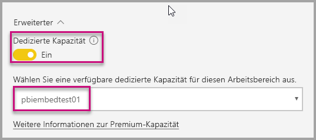

3. Nachdem Sie auf **Speichern** geklickt haben, sollte neben dem Namen des App-Arbeitsbereichs eine **Raute** angezeigt werden.

    

## <a name="next-steps"></a>Nächste Schritte
In diesem Tutorial haben Sie gelernt, wie Sie Power BI-Inhalte mithilfe Ihres **Power BI-Organisationskontos** in eine Anwendung einbetten. Sie können jetzt versuchen, Power BI-Inhalte mithilfe von Apps in eine Anwendung einzubetten.  Sie können auch versuchen, Power BI-Inhalte für Drittanbieterkunden einzubetten.

> [!div class="nextstepaction"]
> [Embed from apps (Einbetten aus Apps)](embed-from-apps.md)

> [!div class="nextstepaction"]
>[Einbetten für Drittanbieterkunden](embed-sample-for-customers.md)

Weitere Fragen? [Stellen Sie Ihre Frage in der Power BI-Community.](http://community.powerbi.com/)
