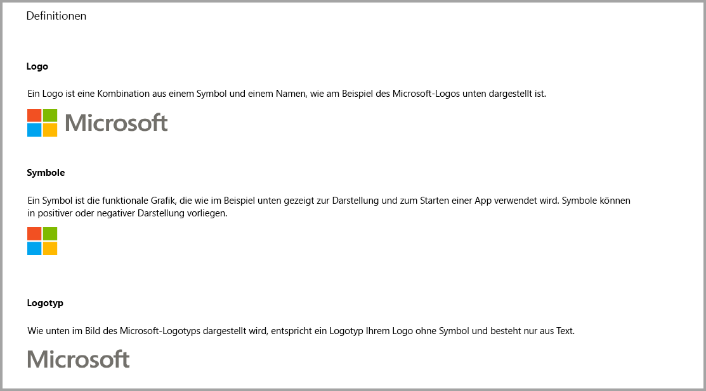
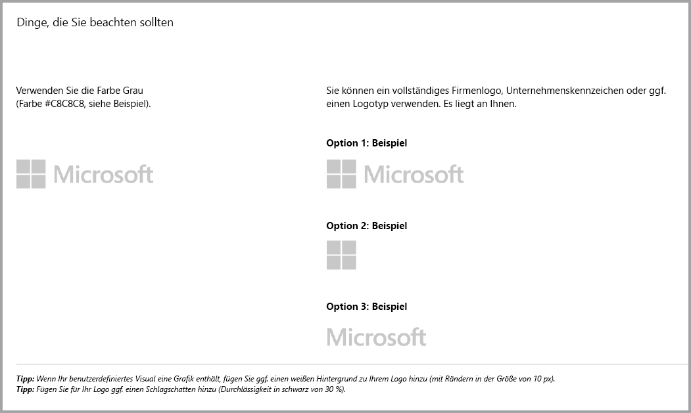
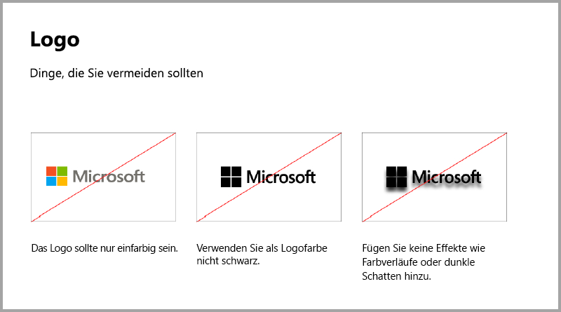
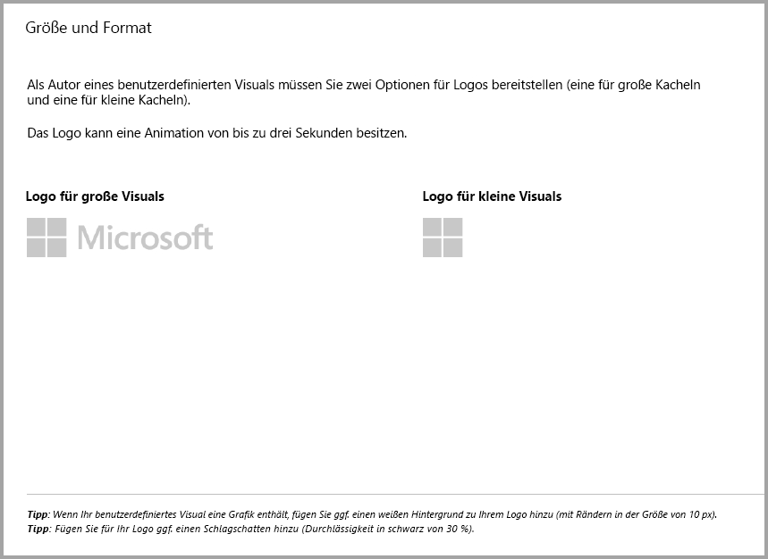
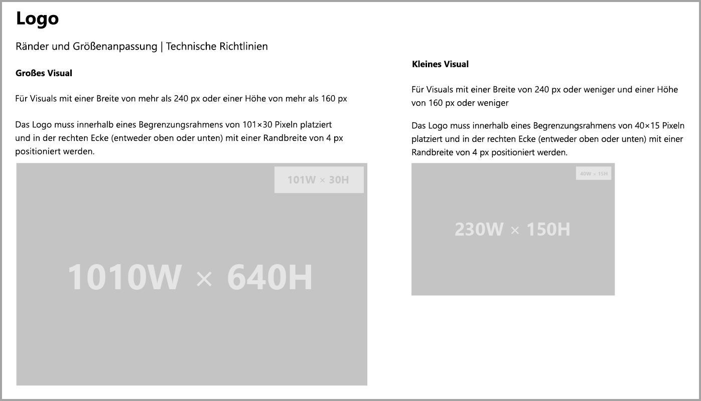

# Richtlinien für Power BI-Visuals

## Richtlinien für Power BI-Visuals mit zusätzlichen Käufen

Bis vor Kurzem wurden im Marketplace (AppSource) nur kostenlose Power BI-Visuals akzeptiert. Diese Vorgabe wurde geändert (Dezember 2018). Sie können also auch Visuals in AppSource anbieten, für die möglicherweise weitere Komponenten erworben werden müssen. 

Visuals, für die möglicherweise weitere Komponenten erworben werden müssen, ähneln den Add-Ins im Office Store, die per In-App-Kauf (IAP, In-App-Purchase) erworben werden. Entwickler können diese Visuals zudem zur Zertifizierung übermitteln, nachdem das AppSource-Team diese genehmigt hat und nachdem sichergestellt wurde, dass diese den Zertifizierungsanforderungen entsprechen. Weitere Informationen zu den Anforderungen finden Sie unter [Zertifizierte benutzerdefinierte Visuals](../power-bi-custom-visuals-certified.md).

> [!NOTE]
> Damit ein Visual zertifiziert werden kann, darf es nicht auf externe Dienste oder Ressourcen zugreifen.

>[!IMPORTANT]  
> Wenn Sie Ihr Visual von „Kostenlos“ zu „Möglicherweise sind zusätzliche Käufe erforderlich.“ aktualisieren, müssen den Benutzern im gleichen Umfang kostenlose Funktionen zur Verfügung stehen wie vor der Aktualisierung. Sie können zusätzlich zu den vorhandenen kostenlosen Features optionale erweiterte Features hinzufügen, die kostenpflichtig sind. Es wird empfohlen, die IAP-Visuals mit den erweiterten Features als neue Visuals zu veröffentlichen, anstatt die vorhandenen kostenlosen Features zu aktualisieren.

## Was hat sich am Übermittlungsprozess geändert?

Entwickler laden ihre Visuals, die In-App-Käufe enthalten, genau wie kostenlose Visuals über das Seller-Dashboard in AppSource hoch. Um deutlich zu machen, dass das übermittelte Visual In-App-Käufe enthält, sollten Entwickler im Seller-Dashboard den Hinweis „Visual mit In-App-Käufen“ hinzufügen. Entwickler müssen außerdem einen Lizenzschlüssel oder ein Token angeben, damit das entsprechende Team die In-App-Käufe überprüfen kann. Sobald das Visual überprüft und genehmigt wurde, zeigt das AppSource-Listing für das Visual den Hinweis „Möglicherweise müssen weitere Komponenten erworben werden“ in den Preisoptionen an.

## Was ist ein Power BI-Visual mit In-App-Käufen?

Ein IAP-Visual ist ein **kostenloses** Visual, das **kostenlose Features** bietet. Ein solches Visual verfügt auch über einige erweiterte Features, für deren Nutzung zusätzliche Gebühren anfallen können. Entwickler müssen die Benutzer in der Beschreibung des Visuals über die Features informieren, für deren Funktionsweise möglicherweise zusätzliche Komponenten erworben werden müssen. Derzeit bietet Microsoft keine nativen APIs an, den Erwerb von Apps und Add-Ins unterstützen.

Entwickler müssen ein Zahlungssystem von einem Drittanbieter für diese Käufe verwenden. Weitere Informationen finden Sie in [den Richtlinien für unseren Store](https://docs.microsoft.com/office/dev/store/validation-policies#2-apps-or-add-ins-can-display-certain-ads).

> [!NOTE]
> Wasserzeichen sind in kostenlosen Features oder kostenlosen Visuals nicht zulässig. Wasserzeichen können nur in kostenpflichtigen Features verwendet werden, die ohne gültige Lizenz verwendet werden. Wenn die erweiterten kostenpflichtigen Features ohne gültige Lizenz verwendet werden, wird empfohlen, ein Popupfenster anzuzeigen, das alle Informationen zur Lizenz enthält.  

## Richtlinien für Logos

In diesem Abschnitt werden die Spezifikationen für das Hinzufügen von Logos und Logotypen in Visuals erläutert.

> [!IMPORTANT]
> Logos sind **nur im Bearbeitungsmodus** zulässig. Logos können im Anzeigemodus **nicht** dargestellt werden.

## Bewährte Methoden

### Startseite für Visuals

Verwenden Sie die Startseite, um den Benutzern zu verdeutlichen, wie sie Visuals verwenden und wo Lizenzen erworben werden können. Fügen Sie keine Videos ein, die automatisch abgespielt werden. Fügen Sie nur Inhalte hinzu, die das Benutzererlebnis verbessern, z.B. Informationen oder Links zu den Details für den Erwerb von Lizenzen und zum Einsatz von In-App-Features.

### Lizenzschlüssel und Token

Fügen Sie Felder für Lizenzschlüssel oder Token im oberen Teil des Formatierungsbereichs hinzu, sodass Benutzer diese leicht finden können.

## HÄUFIG GESTELLTE FRAGEN

Weitere Informationen und finden Sie in den [häufig gestellten Fragen zu Visuals mit zusätzlichen Käufen](https://docs.microsoft.com/power-bi/power-bi-custom-visuals-faq#visuals-with-additional-purchases).

## Nächste Schritte

Erfahren Sie, wie Sie ein benutzerdefiniertes Visual in [AppSource](office-store.md) veröffentlichen, damit es von anderen gefunden und verwendet werden kann.
