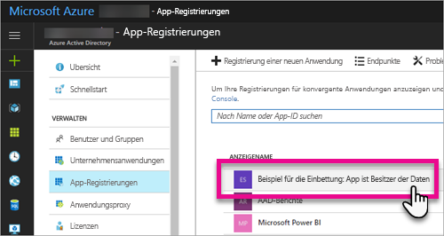
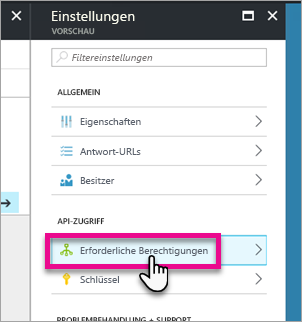
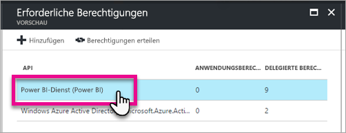
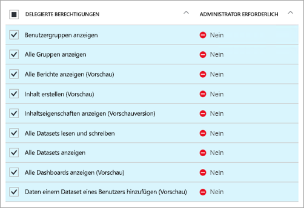

# <a name="register-an-azure-ad-app-to-embed-power-bi-content"></a>Registrieren einer Azure AD-App zum Einbetten von Power BI-Inhalten
Erfahren Sie, wie Sie eine Anwendung zum Einbetten von Power BI-Inhalten in Azure Active Directory (Azure AD) registrieren können.

Sie registrieren Ihre Anwendung bei Azure AD, um der Anwendung den Zugriff auf die Power BI-REST-APIs zu ermöglichen. Auf diese Weise können Sie eine Identität für Ihre Anwendung erstellen und Berechtigungen für Power BI-REST-Ressourcen angeben.

> [!IMPORTANT]
> Um eine Power BI-App zu registrieren, benötigen Sie einen [Azure Active Directory-Mandanten und einen Organisationsbenutzer](create-an-azure-active-directory-tenant.md). Wenn Sie sich nicht bei einem Benutzer in Ihrem Mandanten für Power BI registriert haben, wird die Registrierung der App nicht ordnungsgemäß abgeschlossen.
> 
> 

Die Registrierung Ihrer Anwendung kann auf zweierlei Weise erfolgen. Erstens mithilfe des [Power BI-App-Registrierungstools](https://dev.powerbi.com/apps/), zweitens direkt im Azure-Portal. Das Power BI-App-Registrierungstool ist die einfachste Option, da nur wenige Felder ausgefüllt werden müssen. Wenn Sie Änderungen an der App vornehmen möchten, verwenden Sie das Azure-Portal.

## <a name="register-with-the-power-bi-app-registration-tool"></a>Registrieren mithilfe des Power BI-App-Registrierungs-Tools
Sie müssen Ihre Anwendung in **Azure Active Directory** registrieren, um eine Identität für Ihre Anwendung einzurichten und Berechtigungen für Power BI-REST-Ressourcen festzulegen. Wenn Sie eine Anwendung registrieren, etwa eine Konsolenanwendung oder eine Website, erhalten Sie eine ID, die von der Anwendung verwendet wird, um sich gegenüber den Benutzern zu identifizieren, bei denen sie Berechtigungen anfordert.

So registrieren Sie Ihre Anwendung mit dem Power BI-App-Registrierungs-Tool:

1. Öffnen Sie die Seite [dev.powerbi.com/apps](https://dev.powerbi.com/apps).
2. Wählen Sie **Mit vorhandenem Konto anmelden** aus.
3. Geben Sie einen **App-Namen** an.
4. Die Auswahl des App-Typs hängt vom Typ der verwendeten Anwendung ab.
   
   * Verwenden Sie **Serverseitige Web-App** für Web-Apps oder Web-APIs.
   * Verwenden Sie **Native App** für Apps, die auf Clientgeräten ausgeführt werden. ***Sie müssen **Native App** auch auswählen, wenn Sie Inhalte für Ihre Kunden einbetten, unabhängig von der tatsächlich verwendeten Anwendung, selbst für Webanwendungen.***
5. Geben Sie einen Wert für **Umleitungs-URL** und **URL der Startseite** ein. Jede gültige URL ist zulässig.
   
    **URL der Startseite** steht nur zur Verfügung, wenn Sie als Anwendungstyp **Serverseitige Web-App** ausgewählt haben.
   
    Für die Beispiele zum *Einbetten für Ihre Kunden* und zum *Integrieren eines Dashboards in eine Web-App – integrate-dashboard-web-app* lautet die Umleitungs-URL `http://localhost:13526/redirect`. Für das Beispiel zu Berichten und Kacheln lautet die Umleitungs-URL `http://localhost:13526/`.
6. Wählen Sie die APIs aus, auf die diese Anwendung Zugriff haben soll. Weitere Informationen zu Power BI-Zugriffsberechtigungen finden Sie unter [Power BI-Berechtigungen](power-bi-permissions.md).
   
    
7. Wählen Sie **App registrieren** aus.
   
    Sie erhalten dann eine **Client-ID**. Wenn Sie **Serverseitige Web-App** ausgewählt haben, erhalten Sie außerdem einen **geheimen Clientschlüssel**. Die **Client-ID** kann bei Bedarf später aus dem Azure-Portal abgerufen werden. Wenn Sie das **Clientgeheimnis** verlieren, müssen Sie im Azure-Portal ein neues erstellen.

8. Sie müssen zu Azure navigieren, um **Berechtigungen erteilen** auszuwählen.
> [!Note]
    > Diese Aufgabe kann nur von einem globalen Administrator im Azure-Mandanten ausgeführt werden.
>

* Wechseln Sie zu Azure.
* Suchen Sie die **App Registrierungen**, und wählen Sie sie aus.
* Wählen Sie Ihre App aus.
* Wählen Sie **Einstellungen**aus.
* Wählen Sie **Erforderliche Berechtigungen** aus.
* Wählen Sie **Power BI-Dienst** aus, um die Berechtigungen zu überprüfen, die Sie auf der App-Registrierungswebsite ausgewählt haben.
* Wählen Sie **Berechtigungen erteilen** aus.

Jetzt können Sie die registrierte Anwendung als Teil Ihrer benutzerdefinierten Anwendung verwenden, um die Interaktion mit dem Power BI-Dienst zu implementieren.

> [!IMPORTANT]
> Wenn Sie Inhalte für Ihre Kunden einbetten, müssen Sie im Azure-Portal zusätzliche Berechtigungen konfigurieren. Weitere Informationen finden Sie unter [Anwenden von Berechtigungen für die Anwendung](#apply-permissions-to-your-application).
> 
> 

## <a name="register-with-the-azure-portal"></a>Registrieren beim Azure-Portal
Die andere Möglichkeit zum Registrieren Ihrer Anwendung besteht direkt im Azure-Portal. Führen Sie die folgenden Schritte aus, um Ihre Anwendung zu registrieren.

1. Akzeptieren Sie die [Nutzungsbedingungen für die Microsoft Power BI-API](https://powerbi.microsoft.com/api-terms).
2. Melden Sie sich beim [Azure-Portal](https://portal.azure.com) an.
3. Wählen Sie Ihren Azure AD-Mandanten aus, indem Sie Ihr Konto in der oberen rechten Ecke der Seite auswählen.
4. Wählen Sie im Navigationsbereich auf der linken Seite **Weitere Dienste**, dann **App-Registrierungen** unter **Sicherheit und Identität** und schließlich **Neue Anwendungsregistrierung aus**.
   
    
5. Folgen Sie den Anweisungen, und erstellen Sie eine neue Anwendung .
   
   * Geben Sie für Webanwendungen die Anmelde-URL an. Dabei handelt es sich um die Basis-URL Ihrer App, bei der sich die Benutzer anmelden können, z.B. „http://localhost:13526“.
   * Geben Sie für native Anwendungen einen Umleitungs-URI an, den Azure AD zur Rückgabe von Tokenantworten verwendet. Geben Sie einen für Ihre Anwendung spezifischen Wert ein, z.B. „http://myapplication/redirect“.

Weitere Informationen zum Registrieren von Anwendungen in Azure Active Directory finden Sie unter [Integrieren von Anwendungen in Azure Active Directory](https://docs.microsoft.com/azure/active-directory/develop/active-directory-integrating-applications)

## <a name="how-to-get-the-client-id"></a>Abrufen der Client-ID
Beim Registrieren einer Anwendung erhalten Sie eine **Client-ID**.  Die Anwendung identifiziert sich mithilfe der **Client-ID** bei den Benutzern, von denen sie Berechtigungen anfordert.

So rufen Sie eine Client-ID ab:

1. Melden Sie sich beim [Azure-Portal](https://portal.azure.com) an.
2. Wählen Sie Ihren Azure AD-Mandanten aus, indem Sie Ihr Konto in der oberen rechten Ecke der Seite auswählen.
3. Wählen Sie im Navigationsbereich auf der linken Seite **Weitere Dienste** und dann **App-Registrierungen** aus.
4. Wählen Sie die Anwendung aus, für die Sie die Client-ID abrufen möchten.
5. Sie sehen die **Anwendungs-ID** als GUID aufgelistet. Dies ist die Client-ID der Anwendung.
   
    

## <a name="apply-permissions-to-your-application-within-azure-ad"></a>Anwenden von Berechtigungen für die Anwendung in Azure AD
> [!IMPORTANT]
> Dieser Abschnitt gilt nur für Anwendungen, die **Inhalte für Ihre Organisation einbetten**.
> 
> 

Sie müssen neben den Einstellungen auf der App-Registrierungsseite zusätzliche Berechtigungen für die Anwendung aktivieren. Dies ist über das Azure AD-Portal oder programmgesteuert möglich.

Sie können sich entweder mit dem *Hauptkonto* zum Einbetten oder dem Konto eines globalen Administrators anmelden.

### <a name="using-the-azure-ad-portal"></a>Über das Azure AD-Portal
1. Navigieren Sie zu [App-Registrierungen](https://portal.azure.com/#blade/Microsoft_AAD_IAM/ApplicationsListBlade) im Azure-Portal, und wählen Sie die App aus, die Sie für die Einbettung verwenden.
   
    
2. Wählen Sie unter **API-Zugriff** die Option **Erforderliche Berechtigungen** aus.
   
    
3. Wählen Sie **Windows Azure Active Directory** aus, und stellen Sie sicher, dass **Hiermit greifen Sie als angemeldeter Benutzer auf das Verzeichnis zu** ausgewählt ist. Wählen Sie **Speichern**.
   
    
4. Wählen Sie unter **Erforderliche Berechtigungen** die Option **Power BI-Dienst (Power BI)** aus.
   
    
   
   > [!NOTE]
   > Wenn Sie die App direkt im Azure AD-Portal erstellt haben, ist der **Power BI-Dienst (Power BI)** möglicherweise nicht vorhanden. Wenn dies der Fall ist, wählen Sie **+ Add** (+ Hinzufügen) und dann **1 Select an API** (API auswählen). Klicken Sie auf **Power BI Service** (Power BI-Dienst) in der API-Liste, und klicken Sie dann auf **Select** (Auswählen).  Wenn **Power BI Service (Power BI)** (Power BI-Dienst (Power BI)) in **+ Add** (+ Hinzufügen) nicht verfügbar ist, registrieren Sie sich mit mindestens einem Benutzer bei Power BI.
   > 
   > 
5. Wählen Sie alle Berechtigungen unter **Delegierte Berechtigungen** aus. Sie müssen sie einzeln auswählen, um die Auswahl zu speichern. Wählen Sie **Speichern** aus, wenn Sie fertig sind.
   
    
6. Wählen Sie unter **Erforderliche Berechtigungen** die Option **Berechtigungen erteilen** aus.
   
    Die Aktion **Berechtigungen erteilen** wird für das *Hauptkonto* benötigt, damit keine Zustimmung von Azure AD abgefragt wird. Wenn es sich beim Konto, das diese Aktion ausführt, um das Konto eines globalen Administrators handelt, gewähren Sie allen Benutzern in der Organisation Berechtigungen für diese Anwendung. Wenn das Konto, unter dem diese Aktion ausgeführt ist, das *Hauptkonto* und nicht das Konto des globalen Administrators ist, gewähren Sie für diese Anwendung lediglich dem *Hauptkonto* Berechtigungen.
   
    

### <a name="applying-permissions-programmatically"></a>Programmgesteuertes Anwenden von Berechtigungen
1. Sie müssen die vorhandenen Dienstprinzipale (Benutzer) in Ihrem Mandanten abrufen. Informationen hierzu finden Sie im [Artikel zu Get servicePrincipal](https://developer.microsoft.com/en-us/graph/docs/api-reference/beta/api/serviceprincipal_get).
   
    Sie können die API *Get servicePrincipal* ohne {id} aufrufen. So werden alle Dienstprinzipale innerhalb des Mandanten abgerufen.
2. Suchen Sie nach einem Dienstprinzipal mit Ihrer App-Client-ID als **appId**-Eigenschaft.
3. Erstellen Sie einen neuen Serviceplan, wenn für Ihre App keiner vorhanden ist.
   
    ```
    Post https://graph.microsoft.com/beta/servicePrincipals
    Authorization: Bearer ey..qw
    Content-Type: application/json
    {
    "accountEnabled" : true,
    "appId" : "{App_Client_ID}",
    "displayName" : "{App_DisplayName}"
    }
    ```
4. Weisen Sie der PowerBI-API App-Berechtigungen zu.
   
    ```
    Post https://graph.microsoft.com/beta/OAuth2PermissionGrants
    Authorization: Bearer ey..qw
    Content-Type: application/json
    { 
    "clientId":"{Service_Plan_ID}",
    "consentType":"AllPrincipals",
    "resourceId":"c78b2585-1df6-41de-95f7-dc5aeb7dc98e",
    "scope":"Dataset.ReadWrite.All Dashboard.Read.All Report.Read.All Group.Read Group.Read.All Content.Create Metadata.View_Any Dataset.Read.All Data.Alter_Any",
    "expiryTime":"2018-03-29T14:35:32.4943409+03:00",
    "startTime":"2017-03-29T14:35:32.4933413+03:00"
    }
    ```
5. Weisen Sie AAD App-Berechtigungen zu.
   
    Der Wert für **consentType** hängt von dem Benutzer ab, der die Anforderung ausführt. Sie können entweder **AllPrincipals** oder **Principal** angeben. **AllPrincipals** kann nur von einem Administrator verwendet werden, der damit allen Benutzern Berechtigungen gewährt. Mit **Principal** werden Berechtigungen für einen bestimmten Benutzer gewährt. 
   
    Für das *Hauptkonto* müssen Berechtigungen gewährt werden, damit keine Zustimmung von Azure AD abgefragt wird. 
   
    Wenn Sie einen vorhandenen Mandanten verwenden und nicht allen Mandantenbenutzern Berechtigungen erteilen möchten, können Sie einem bestimmten Benutzer Berechtigungen gewähren, indem Sie den Wert von **consentType** durch **Principal** ersetzen.
   
    ```
    Post https://graph.microsoft.com/beta/OAuth2PermissionGrants
    Authorization: Bearer ey..qw
    Content-Type: application/json
    { 
    "clientId":"{Service_Plan_ID}",
    "consentType":"AllPrincipals",
    "resourceId":"61e57743-d5cf-41ba-bd1a-2b381390a3f1",
    "scope":"User.Read Directory.AccessAsUser.All",
    "expiryTime":"2018-03-29T14:35:32.4943409+03:00",
    "startTime":"2017-03-29T14:35:32.4933413+03:00"
    }
    ```

## <a name="next-steps"></a>Nächste Schritte
Sie haben Ihre Anwendung in Azure AD registriert und müssen jetzt Benutzer in der Anwendung authentifizieren. Weitere Informationen hierzu finden Sie unter [Authentifizieren von Benutzern und Abrufen eines Azure AD-Zugriffstokens für Ihre Power BI-App](get-azuread-access-token.md).

Weitere Fragen? [Stellen Sie Ihre Frage in der Power BI-Community.](http://community.powerbi.com/)


