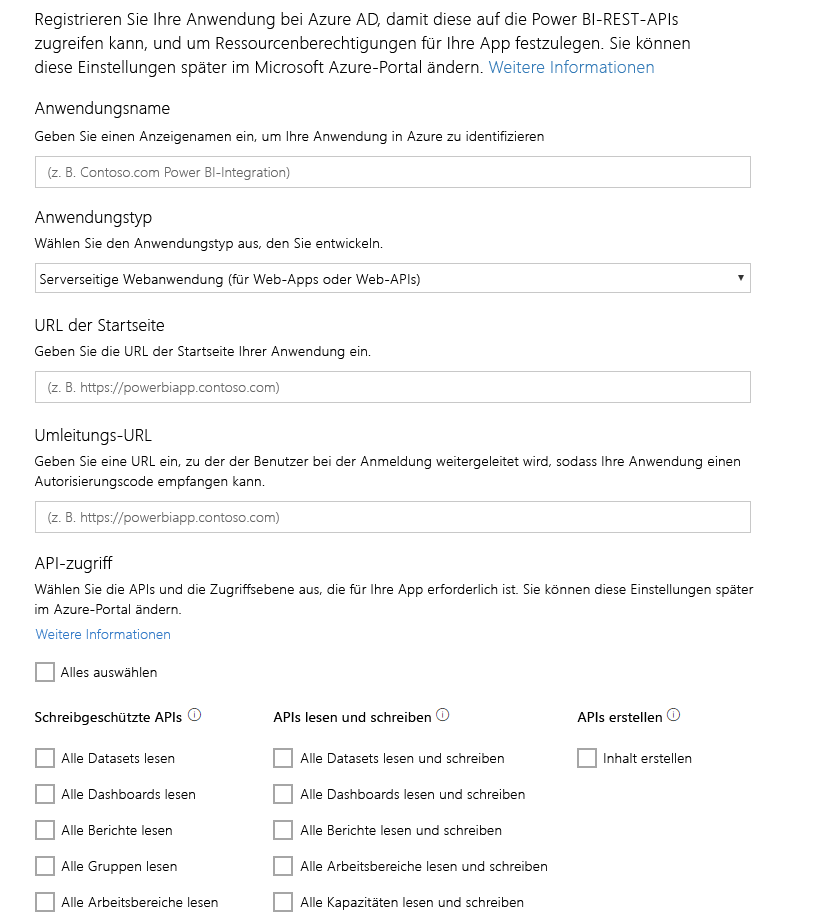

# Schritt 1: Registrieren einer App in Azure AD
Dieser Artikel ist Teil einer Anleitung zum [Übertragen von Daten in ein Dataset per Push](walkthrough-push-data.md).

Der erste Schritt zum Übertragen von Daten in ein Power BI-Dataset per Push ist das Registrieren Ihrer App in Azure AD. Dies muss zuerst erfolgen, damit Sie über eine **Client-ID** verfügen, die Ihre App in Azure AD identifiziert. Ohne **Client-ID**kann Azure AD Ihre App nicht authentifizieren.

> **HINWEIS**: Vor dem Registrieren einer App für Power BI müssen Sie die [Registrierung bei Power BI](create-an-azure-active-directory-tenant.md) durchführen.
> 
> 

Es folgen die Schritte zum Registrieren einer App in Azure AD.

## Registrieren einer App in Azure AD
1. Öffnen Sie die Seite „dev.powerbi.com/apps“.
2. Klicken Sie auf **Mit Ihrem vorhandenen Konto anmelden**, und melden Sie sich bei Ihrem Power BI-Konto an.
3. Geben Sie einen **App-Namen** wie „Beispiel-App für Push von Daten“ ein.
4. Wählen Sie **Native App**als **App-Typ**aus.
5. Geben Sie eine **Umleitungs-URL** ein, z.B. **https://login.live.com/oauth20_desktop.srf**. In Bezug auf eine **native Client-App**bietet ein Umleitungs-URI **Azure AD** ausführlichere Informationen über die zu authentifizierende Anwendung. Der Standard-URI für eine Client-App ist https://login.live.com/oauth20_desktop.srf.
6. Wählen Sie für **APIs für Zugriff auswählen**die Option **Alle Datasets lesen und schreiben**aus. Informationen zu allen Berechtigungen für Power BI-Apps finden Sie unter [Power BI-Berechtigungen](power-bi-permissions.md).
7. Klicken Sie auf **App registrieren**, und speichern Sie die **Client-ID** , die generiert wurde. Eine **Client-ID** identifiziert die App in Azure AD.

Ihre Seite **Eine Anwendung für Power BI registrieren** sollte so aussehen:

Im nächsten Schritt wird das [Abrufen eines Authentifizierungszugriffstokens](walkthrough-push-data-get-token.md) erläutert.

[Nächster Schritt >](walkthrough-push-data-get-token.md)

## Nächste Schritte
[Registrieren bei Power BI](create-an-azure-active-directory-tenant.md)  
[Abrufen eines Authentifizierungszugriffstokens](walkthrough-push-data-get-token.md)  
[Exemplarische Vorgehensweise – Übertragung von Daten in ein Dataset per Push](walkthrough-push-data.md)  
[Registrieren einer Anwendung](register-app.md)  
[Übersicht über Power BI-REST-API](overview-of-power-bi-rest-api.md)  

Weitere Fragen? [Stellen Sie Ihre Frage in der Power BI-Community.](http://community.powerbi.com/)

