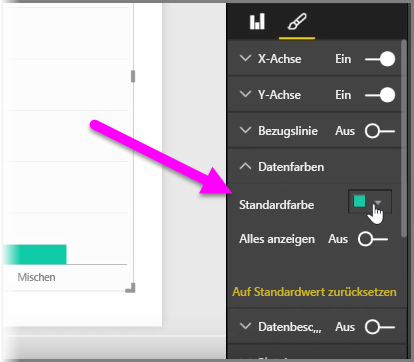
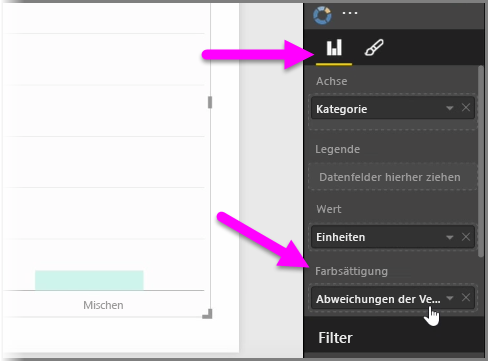
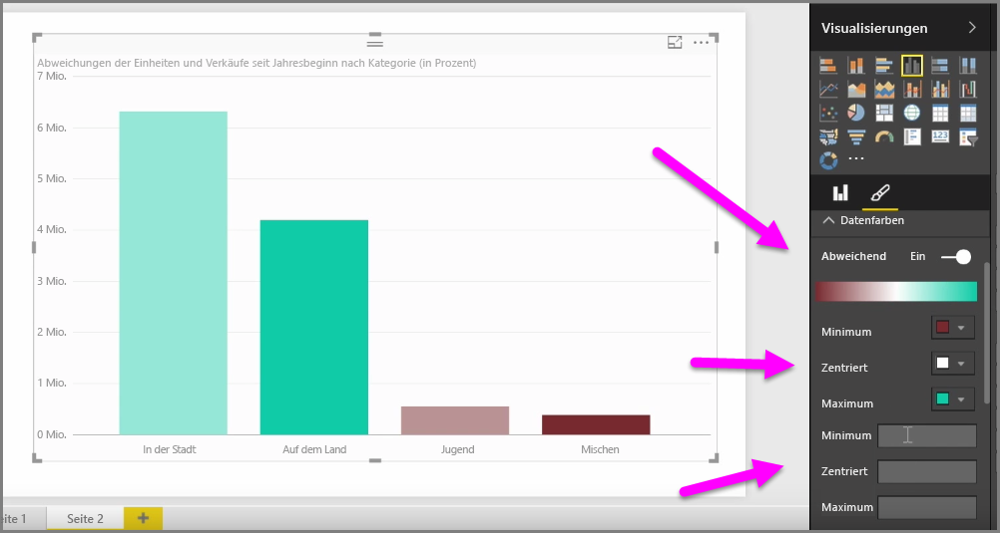
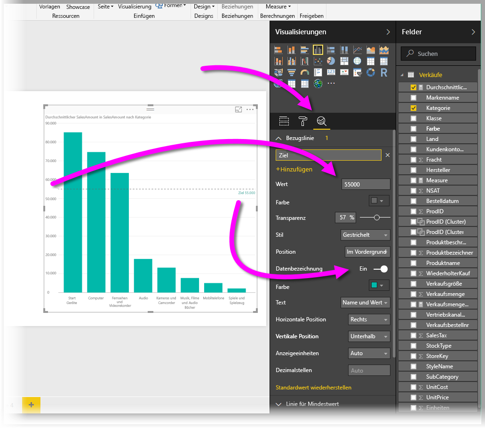

Es kann häufig der Fall eintreten, dass Sie die Farben in Diagrammen oder visuellen Elementen ändern möchten. Mit Power BI können Sie auf vielfältige Art steuern, wie Farben angezeigt werden. Wählen Sie zunächst im Bereich **Visualisierungen** ein visuelles Element aus, und klicken Sie dann auf das **Pinselsymbol**.

Es gibt viele Optionen zum Ändern der Farben oder zur Formatierung des visuellen Elements. Sie können die Farbe aller Balken eines visuellen Elements ändern, indem Sie auf die Farbauswahl neben **Standardfarbe** klicken und dann eine Farbe Ihrer Wahl auswählen.

Sie können auch die Farbe der einzelnen Balken ändern (oder der anderen Elemente, abhängig vom Typ des ausgewählten visuellen Elements), indem Sie den Schieberegler auf **Alles anzeigen** festlegen. In diesem Fall wird für jedes Element eine Farbauswahl angezeigt.

Sie können die Farbe auch basierend auf einen Wert oder Measure ändern. Dazu ziehen Sie ein Feld in den Bucket **Farbsättigung** im Bereich „Visualisierungen“ (beachten Sie, dass diese Option im Abschnitt **Feldquelle** und nicht im Abschnitt **Pinsel** verfügbar ist).

Darüber hinaus können Sie die Skalierung und die Farben ändern, die verwendet werden, wenn Datenelementfarben gefüllt werden. Sie können auch eine abweichende Skalierung auswählen, indem Sie den Schieberegler für „Abweichend“ auf „Ein“ bewegen. Damit legen Sie die Farbskalierung zwischen drei Farben fest. Außerdem können Sie die Werte *Minimum*, *Mitte* und *Maximum* festlegen, die im Diagramm angezeigt werden.

Sie können diese Werte auch verwenden, um Regeln zu erstellen, zum Beispiel, um Werte über und unter 0 (null) auf eine jeweils andere Farbe festzulegen.

Ein weiteres nützliches Hilfsmittel für die Verwendung von Farben ist das Festlegen einer *Bezugslinie**.* Sie können den Wert der Bezugslinie und ihre Farbe festlegen und der Bezugslinie sogar eine Beschriftung zuweisen. Wählen Sie zum Erstellen einer Bezugslinie (und anderer relevanter Linien) den **Analysebereich** (mit einem Lupensymbol dargestellt) aus, und erweitern Sie dann den Abschnitt **Bezugslinie**.

Sie können für ein Visual viele weitere Linien erstellen, die sich auch im **Analysebereich befinden**, z.B. Linien für „Min“, „Max“, „Mittelwert“, „Median“ und „Perzentil“.

Schließlich können Sie einen Rahmen um eine einzelne Visualisierung erstellen und wie bei anderen Steuerelementen auch die Farbe dieses Rahmens angeben.

