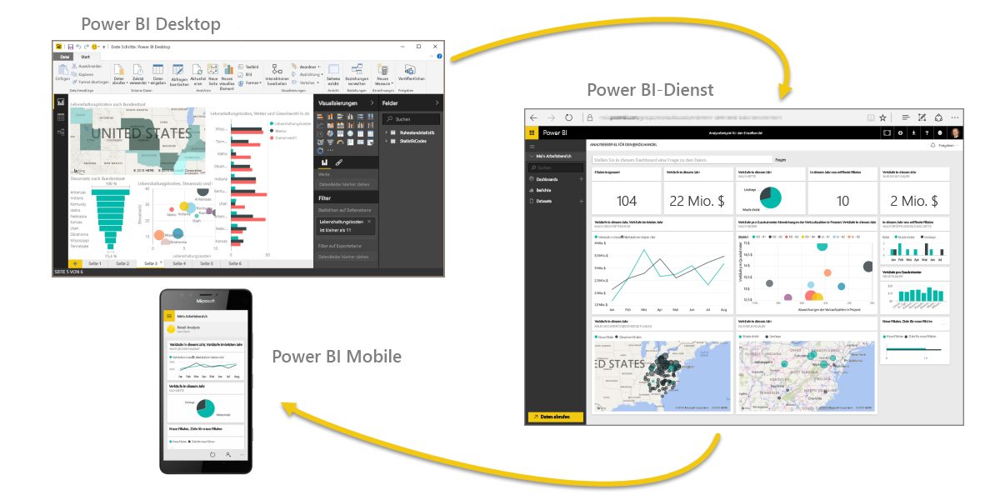
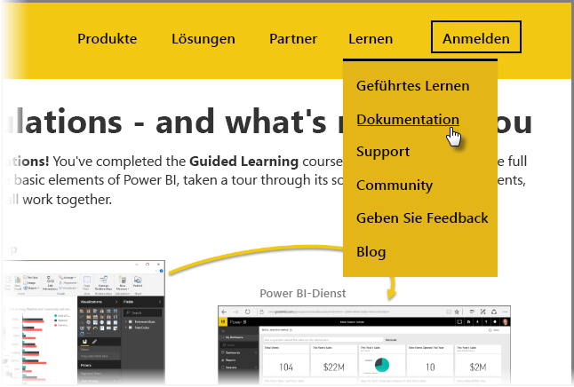

Sie haben‘s geschafft! **Herzlichen Glückwunsch!** Sie haben den Kurs **Geführtes Lernen** für Power BI abgeschlossen. Sie haben die grundlegenden Konzepte von Power BI kennengelernt, eine Tour durch die Funktionen und Elemente der Software gemacht und erfahren, wie alles miteinander zusammenhängt.

Dies ist der letzte Abschnitt (und das letzte Thema,) in diesem Kurs (es sei denn, Sie möchten DAX lernen), wenn Sie also alle Abschnitte der Reihe nach bearbeitet haben, können Sie sich jetzt selbst auf die Schulter klopfen. Gut gemacht! Sie sind jetzt mit allen diesen **wichtigen Konzepten** vertraut:

* Was ist [Power BI](../gettingstarted.yml?tutorial-step=1)?
* [Grundkomponenten](../gettingstarted.yml?tutorial-step=3) von Power BI
* [Abrufen](../gettingdata.yml?tutorial-step=3) und [Modellieren](../modeling.yml?tutorial-step=1) von Daten
* [Visualisierungen](../visualizations.yml?tutorial-step=1)
* [Untersuchen](../exploringdata.yml?tutorial-step=1) von Daten im Power BI-Dienst
* Gemeinsames Verwenden von [Excel und Power BI](../powerbiandexcel.yml?tutorial-step=1)
* Und [Veröffentlichen und Freigeben](../publishingandsharing.yml?tutorial-step=1) Ihrer Arbeit

Das sind viele Informationen, die Sie jetzt im Kopf haben und die Sie jetzt einsetzen können! Hier sind einige **Links zu Downloads** und zum **Herstellen einer Verbindung mit dem Power BI-Dienst im Browser**:

* Sie können immer [die aktuelle Version von Power BI Desktop herunterladen](https://powerbi.microsoft.com/desktop).
* Den [Power BI-Dienst](https://powerbi.microsoft.com/) finden Sie ganz schnell.
* Mit einem Tippen erhalten Sie [mobile Apps für Power BI](https://powerbi.microsoft.com/mobile/).

Außerdem gibt es noch mehr **Hilfe und Verweise**. Wählen Sie einfach oben auf dieser Seite **Lernen > Dokumentation** aus, um die umfassenden Referenzmaterialien zu Power BI anzuzeigen.

Wir hoffen, dass Ihnen die Erfahrung mit dem **geführten Lernen für Power BI** gefallen hat. Wir wünschen Ihnen alles Gute und dass Ihre Power BI-Visualisierungen immer faszinierend und überzeugend sind.

## Ein weiterer Abschnitt für DAX-Benutzer
Möchten Sie noch mehr? Sind Sie daran interessiert, **DAX (Data Analysis Expressions)** zu verwenden, um benutzerdefinierte Spalten und benutzerdefinierte Tabellen in Power BI zu erstellen, filtern oder zu verwenden? Es gibt einen weiteren Abschnitt, der sich an die Personen richtet, die in Power BI mit Code arbeiten möchten. Er heißt **Introduction to DAX** (Einführung in DAX). Wenn Sie interessiert sind, sehen Sie es sich an. Darin wird mit derselben benutzerfreundlichen Herangehensweise gearbeitet wie bei den anderen Beispielen von Geführtes Lernen.

