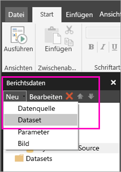
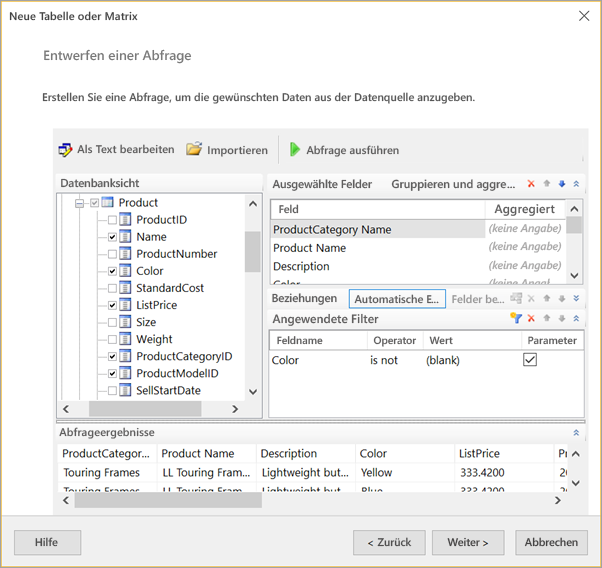
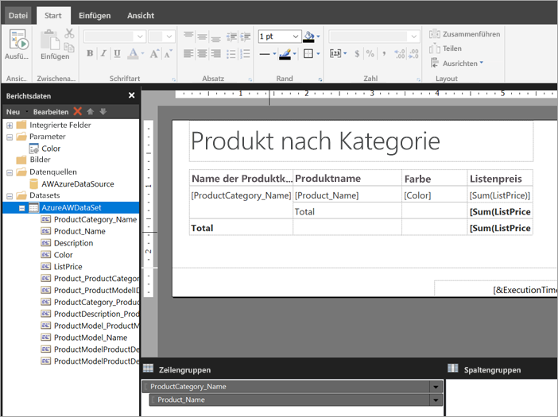

# Erstellen eines eingebetteten Datasets für einen paginierten Bericht im Power BI-Dienst (Vorschau)
In diesem Artikel erfahren Sie, wie Sie ein eingebettetes Dataset basierend auf einer einbetten Datenquelle für einen paginierten Bericht im Power BI-Dienst erstellen. Eingebettete Datasets sind in einem einzigen, paginierten Bericht enthalten, zur Verwendung in diesem Bericht. Derzeit sind für paginierte Berichte, die im Power BI-Dienst veröffentlicht werden, eingebettete Datasets und eingebettete Datenquellen erforderlich. Sie erstellen die eingebettete Datenquelle und das eingebettete Dataset im Berichts-Generator beim Generieren Ihres Berichts. 

Bevor Sie das Dataset erstellen können, müssen Sie eine Datenquelle erstellen. Die genaue Vorgehensweise im Power BI-Dienst finden Sie unter [Eingebettete Datenquellen für paginierte Berichte](paginated-reports-embedded-data-source.md).
  
## Erstellen eines eingebetteten Datasets
  
1. Wählen Sie im Berichts-Generator im Bereich „Berichtsdaten“ **Neu** > **Dataset** aus.

1. Benennen Sie das Dataset im Dialogfeld **Dataseteigenschaften** auf der Registerkarte **Abfrage**. Die eingebettete Datenquelle befindet sich bereits im Feld **Datenquelle**. Sie können auch **Neu** auswählen, um eine andere eingebettete Datenquelle zu erstellen.
 
     

3. Wählen Sie unter **Abfragetyp** den Typ des Befehls oder der Abfrage aus, die für das Dataset verwendet werden soll. 
    - **Text** führt eine Abfrage aus, um Daten aus der Datenbank abzurufen. Dies ist die Standardeinstellung und wird für die meisten Abfragen verwendet. Geben Sie eine Abfrage ein, oder importieren Sie eine bereits vorhandene Abfrage, indem Sie **Importieren** auswählen. Um die Abfrage grafisch erstellen, wählen Sie **Abfrage-Designer** aus. Wenn Sie mit dem Abfrage-Designer eine Abfrage erstellen, wird der Abfragetext in diesem Feld angezeigt. Wählen Sie die Schaltfläche **Ausdruck** (**fx**) aus, um einen Ausdruck zum dynamischen Erzeugen der Abfrage zu verwenden. 
    - **Tabelle** wählt alle Felder in einer Tabelle aus. Geben Sie den Namen der Tabelle ein, die Sie als Dataset verwenden möchten.
    - **Gespeicherte Prozedur** führt eine gespeicherte Prozedur nach Namen aus.

4. Im Abfrage-Designer können Sie die Tabellen und Felder im Dataset anzeigen und mit ihnen interagieren, eine Abfrage importieren oder als Text bearbeiten. Hier lassen sich auch Filter und Parameter hinzufügen. 

    

5. Wählen Sie im Abfrage-Designer **Abfrage ausführen** aus, um diese zu testen, und wählen Sie dann **OK** aus.

1. Geben Sie im Dialogfeld „Dataseteigenschaften“ im Feld **Timeout (in Sekunden)** die Anzahl von Sekunden ein, bis die Abfrage abläuft. Der Standardwert sind 30 Sekunden. Der Wert für **Timeout** muss leer oder größer als Null (0) sein. Wenn er leer ist, tritt für die Abfrage kein Timeout ein.

7.  Auf den anderen Registerkarten können Sie weitere Eigenschaften für das Dataset festlegen:
    - Erstellen berechneter Felder auf der Registerkarte **Felder**
    - Festlegen erweiterter Optionen auf der Registerkarte **Optionen**
    - Hinzufügen und Aktualisieren von Filtern und Parametern auf der Registerkarte **Filter** bzw. **Parameter**

8. Wählen Sie **OK** aus
 
   Der Bericht wird in der Entwurfsansicht geöffnet. Die Datenquelle, das Dataset und die Datasetfeldauflistung werden im Bereich „Berichtsdaten“ angezeigt, und Sie können Ihren paginierten Bericht weiter gestalten.  

     
 
## Nächste Schritte 

- [Was sind paginierte Berichte in Power BI Premium (Vorschau)](paginated-reports-report-builder-power-bi.md)  
- [Tutorial: Erstellen eines paginierten Berichts und Hochladen in den Power BI-Dienst](paginated-reports-quickstart-aw.md)
- [Veröffentlichen eines paginierten Berichts im Power BI-Dienst](paginated-reports-save-to-power-bi-service.md)

