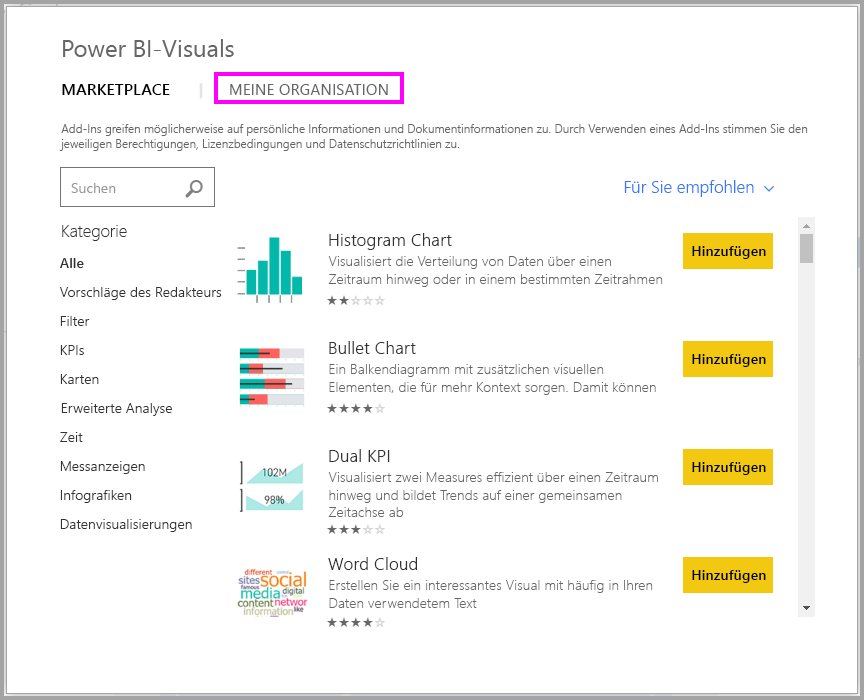
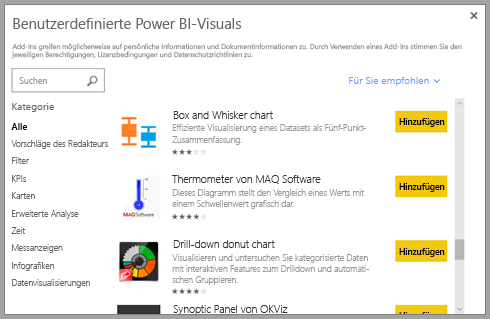
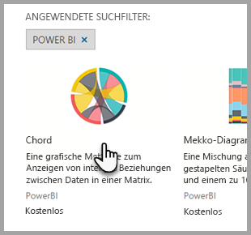

# Benutzerdefinierte Visualisierungen in Power BI

Beim Erstellen oder Bearbeiten von Power BI-Berichten, können Sie viele verschiedene Arten von Visualisierungen verwenden. Die Symbole für diese visuellen Elemente angezeigt werden, der **Visualisierungen** Bereich. Diese visuellen Elemente gibt es bereits beim Herunterladen von [Power BI Desktop](https://powerbi.microsoft.com/desktop/) oder öffnen Sie die [Power BI-Dienst](https://app.powerbi.com).

Allerdings sind Sie nicht auf diesen Satz von Visuals beschränkt. Wenn Sie die Auslassungspunkte (...) am unteren Rand auswählen, wird eine andere Quelle von berichtsvisuals verfügbar –*benutzerdefinierte Visuals*.

Entwickler Erstellen benutzerdefinierter Visualisierungen, die mit dem SDK für benutzerdefinierte Visuals. Diese Visuals können Geschäftskunden ihre Daten auf eine Weise finden, dass am besten zu ihren Unternehmen passt. Berichtsautoren können Sie dann die benutzerdefinierten visualdateien in ihre Berichte importieren und diese genauso wie bei anderen Power BI-Visuals. Benutzerdefinierte Visuals sind Bürger erster Klasse in Power BI und können gefiltert werden, hervorgehoben, bearbeitet, freigegebene und so weiter.

Benutzerdefinierte visuelle Elemente werden auf drei verschiedene Arten bereitgestellt:

* Benutzerdefinierte Visualdateien
* Visuals für Organisationen
* Visuals im Marketplace

## Benutzerdefinierte Visualdateien

Benutzerdefinierte Visuals werden Pakete, die enthalten Code zum Rendern der Daten, die für sie bereitgestellt. Jeder kann eine benutzerdefinierte Visualisierung zu erstellen und Verpacken Sie sie als einzelne `.pbiviz` Datei, die dann in einen Power BI-Bericht importiert werden kann.

> [!WARNING]
> Ein benutzerdefiniertes Visual kann Code mit Sicherheits- oder Datenschutzrisiken enthalten. Stellen Sie sicher, dass Sie dem Autor und der Quellcode für die benutzerdefinierte Visualisierung vertrauen, bevor sie zu einem Bericht importieren.

## Visuals für Organisationen

Power BI-Administratoren genehmigen und Bereitstellen von benutzerdefinierten Visuals in ihren Unternehmen, die Berichtsautoren ganz einfach ermitteln, aktualisieren und verwenden können. Administratoren können ganz einfach verwalten (z. B. Version aktualisieren, aktivieren/deaktivieren) diese visuellen Elemente.

 [Erfahren Sie mehr über Power BI-Verwaltungsportal](power-bi-custom-visuals-organization.md).

## Visuals im Marketplace

Mitglieder der Community und Microsoft haben benutzerdefinierte Visuals für Öffentliche Vorteil erstellt und diese die [AppSource](https://appsource.microsoft.com/marketplace/apps?product=power-bi-visuals) Marketplace. Sie können diese visuellen Elemente auf Ihre Power BI-Berichte hinzufügen. Microsoft hat getestet und genehmigt diese benutzerdefinierten Visuals auf Funktionalität und Qualität.

Was ist [AppSource](developer/office-store.md)? Es ist die Möglichkeit, die Sie apps, Add-Ins und Erweiterungen für Microsoft-Software finden. [AppSource](https://appsource.microsoft.com/) Millionen von Benutzern Produkte wie Office 365, Azure, Dynamics 365, Cortana und Power BI, um Lösungen, mit denen sie Arbeit effizient, Einblicke, und reibungslose als je zuvor.

### Zertifizierte Visuals

Zertifizierten Powerbi-Visuals handelt es sich Marketplace-Visuals, die zusätzlichen strengen Qualität Testen übergeben wurden, und werden in weiteren Szenarien, z. B. unterstützt [e-Mail-Abonnements](https://docs.microsoft.com/power-bi/service-report-subscribe), und [export nach PowerPoint](https://docs.microsoft.com/power-bi/service-publish-to-powerpoint).
Die Liste der zertifizierten benutzerdefinierten visuellen Elemente sowie eine Anleitung zum Einreichen eigener benutzerdefinierter visueller Elemente finden Sie unter [Zertifizierte benutzerdefinierte visuelle Elemente](https://docs.microsoft.com/power-bi/power-bi-custom-visuals-certified).

Sind Sie Webentwickler und möchten eigene Visualisierungen erstellen und zu AppSource hinzufügen? Finden Sie unter [Entwickeln einer benutzerdefinierten Visualisierung mit Power BI](developer/custom-visual-develop-tutorial.md) und erfahren Sie, wie Sie [veröffentlichen benutzerdefinierter Visuals in AppSource](https://docs.microsoft.com/power-bi/developer/office-store).

### Importieren eines benutzerdefinierten Visuals aus einer Datei

1. Wählen Sie die Auslassungspunkte zwischen dem unteren Rand der **Visualisierungen** Bereich.

    

2. Wählen Sie in der Dropdownliste **Aus Datei importieren** aus.

    

3. Wählen Sie im Menü Datei öffnen die `.pbiviz` -Datei, die Sie importieren möchten und wählen Sie dann **öffnen**. Symbol für die benutzerdefinierte Visualisierung wurde an das Ende Ihrer **Visualisierungen** Bereich ist jetzt für die Verwendung in Ihrem Bericht verfügbar.

    

### Importieren von Visuals für Organisationen

1. Wählen Sie die Auslassungspunkte zwischen dem unteren Rand der **Visualisierungen** Bereich.

    

2. Wählen Sie in der Dropdownliste **Aus Marketplace importieren** aus.

    

3. Klicken Sie auf dem Menü der oberen Registerkarte auf **MEINE ORGANISATION**.

    

4. Scrollen Sie in der Liste, um das Visual zu suchen, das Sie importieren möchten.

    

5. Wählen Sie **hinzufügen** zum Importieren der benutzerdefinierten Visualisierung. Das entsprechende Symbol wird am unteren Rand hinzugefügt Ihre **Visualisierungen** Bereich ist jetzt für die Verwendung in Ihrem Bericht verfügbar.

    

## Herunterladen oder Importieren benutzerdefinierter Visuals von Microsoft AppSource

Sie haben zwei Optionen für das Herunterladen und Importieren benutzerdefinierter Visuals: aus in Power BI und über die [AppSource-Website](https://appsource.microsoft.com/).

### Importieren benutzerdefinierter Visuals in Power BI

1. Wählen Sie die Auslassungspunkte zwischen dem unteren Rand der **Visualisierungen** Bereich.

    

2. Wählen Sie in der Dropdownliste **Aus Marketplace importieren** aus.

    

3. Scrollen Sie in der Liste, um das Visual zu suchen, das Sie importieren möchten.

    

4. Wenn Sie zu einem der Visuals weitere Informationen erhalten möchten, markieren Sie es, und wählen Sie es aus.

    

5. Auf der Detailseite können Sie Screenshots, Videos, ausführliche Beschreibungen und weitere Elemente anzeigen.

    

6. Scrollen Sie nach unten, um Bewertungen anzuzeigen.

    

7. Wählen Sie **hinzufügen** zum Importieren der benutzerdefinierten Visualisierung. Das entsprechende Symbol wird am unteren Rand hinzugefügt Ihre **Visualisierungen** Bereich ist jetzt für die Verwendung in Ihrem Bericht verfügbar.

    

### Herunterladen und Importieren benutzerdefinierter Visuals von Microsoft AppSource

1. Wählen Sie in [Microsoft AppSource](https://appsource.microsoft.com) die Registerkarte für **Apps** aus.

    

2. Wechseln Sie zur Seite [App-Ergebnisse](https://appsource.microsoft.com/marketplace/apps), auf der Sie die beliebtesten Apps in den einzelnen Kategorien, einschließlich *Power BI-Apps*, anzeigen können. Wir suchen nach benutzerdefinierten Visualisierungen, die wir wählen **Power BI-Visualisierungen** aus der Liste linken Navigationsbereich, um die Ergebnisse einzugrenzen.

    

3. In AppSource wird für jedes benutzerdefinierte Visual eine Kachel angezeigt.  Jede Kachel verfügt über eine benutzerdefinierte visuelle Momentaufnahme mit einer kurzen Beschreibung und einen Link zum Herunterladen. Wählen Sie die Kachel aus, um weitere Details anzuzeigen.

    

4. Auf der Detailseite können Sie Screenshots, Videos, ausführliche Beschreibungen und weitere Elemente anzeigen. Wählen Sie **jetzt** der benutzerdefinierten Visualisierung herunterladen, und klicken Sie dann die Nutzungsbedingungen akzeptieren.

    

5. Wählen Sie den Link aus, um das benutzerdefinierte Visual herunterzuladen.

    

    Die Download-Seite enthält auch Anweisungen zum Importieren der benutzerdefinierten Visualisierung in Power BI Desktop und Power BI-Dienst.

    Sie können auch einen Beispielbericht herunterladen, der das benutzerdefinierte Visual enthält und dessen Funktionen veranschaulicht.

    

6. Speichern Sie die `.pbiviz` , und klicken Sie dann öffnen Sie Power BI.

7. Importieren der `.pbiviz` -Datei in Ihrem Bericht. (Siehe obigen Abschnitt [Importieren eines benutzerdefinierten Visuals aus einer Datei](#import-a-custom-visual-from-a-file).)

## Überlegungen und Einschränkungen

* Beim Importieren wird eine benutzerdefinierte Visualisierungen einem bestimmten Bericht hinzugefügt. Wenn Sie die Visualisierung in einem anderen Bericht verwenden möchten, müssen Sie sie in diesen Bericht ebenfalls importieren. Wenn ein Bericht mit einer benutzerdefinierten Visualisierung mit der Option **Speichern unter** gespeichert wird, wird eine Kopie der benutzerdefinierten Visualisierung mit dem neuen Bericht gespeichert.

* Wenn Sie nicht angezeigt wird eine **Visualisierungen** Bereich, das bedeutet, Sie haben keine Berechtigungen bearbeiten Bericht.  Sie können benutzerdefinierte Visuals nur Berichten hinzufügen, die Sie bearbeiten können, und keinen Berichten, die für Sie freigegeben wurden.

## Problembehandlung

Zur Problembehandlung finden Sie unter [Problembehandlung Ihrer benutzerdefinierten Visuals für Power BI](power-bi-custom-visuals-troubleshoot.md).

## HÄUFIG GESTELLTE FRAGEN

Weitere Informationen und Antworten auf Fragen finden Sie in den [häufig gestellten Fragen zu benutzerdefinierten Power BI-Visuals](power-bi-custom-visuals-faq.md#organizational-custom-visuals).

## Nächste Schritte

* [Visualisierungen in Power BI-Berichte](visuals/power-bi-report-visualizations.md)

Weitere Fragen? [Wenden Sie sich an die Power BI-Community](http://community.powerbi.com/).
