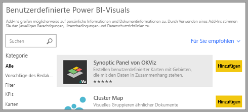
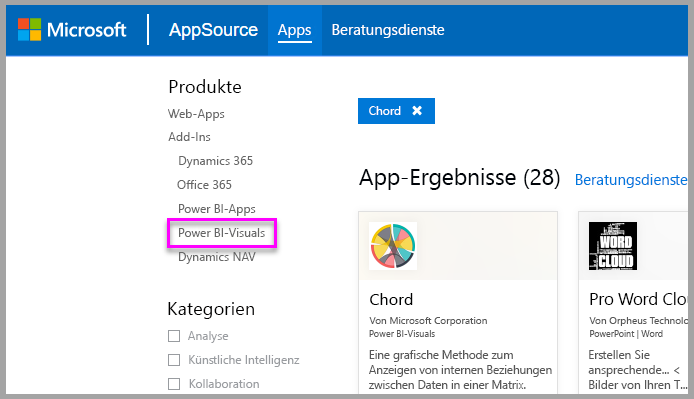
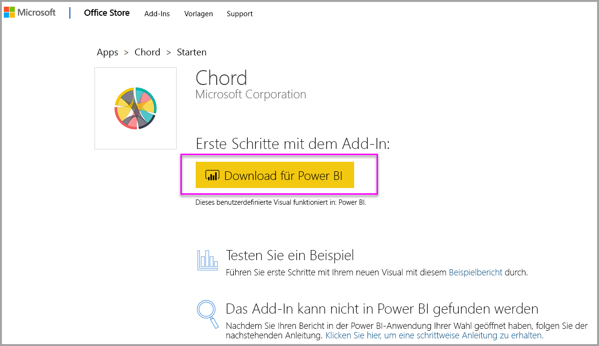

# Benutzerdefinierte Visualisierungen in Power BI

Beim Erstellen oder Bearbeiten eines Power BI-Berichts stehen Ihnen viele verschiedene Typen von Visuals zur Verfügung. Diese Visuals werden im Bereich **Visualisierungen** angezeigt. Wenn Sie [Power BI Desktop](https://powerbi.microsoft.com/desktop/) herunterladen oder den [Power BI-Dienst](https://app.powerbi.com) öffnen, ist dieser Satz von Visuals vorkonfiguriert.

Sie sind jedoch nicht auf diesen Satz von Visuals beschränkt. Durch Auswählen der Auslassungspunkte wird eine weitere Quelle von Berichtsvisuals geöffnet: *benutzerdefinierte Visuals*.

Benutzerdefinierte Visuals werden von Entwicklern mithilfe des SDK für benutzerdefinierte Visuals erstellt. Dadurch können Geschäftskunden die Daten auf die Weise anzeigen, die für das Unternehmen am besten geeignet ist. Berichtsautoren können die Dateien der benutzerdefinierten Visuals dann in ihre Berichte importieren und diese wie die anderen Power BI-Visuals verwenden. Benutzerdefinierte Visuals sind wichtige Bestandteile und können in Power BI unter anderem gefiltert, hervorhoben, bearbeitet und freigegeben werden.

Benutzerdefinierte Visuals können in Form von drei Bereitstellungskanälen vorliegen:

* Benutzerdefinierte Visualdateien
* Visuals für Organisationen
* Visuals im Marketplace

## Benutzerdefinierte Visualdateien

Bei benutzerdefinierten Visuals handelt es sich um Pakete, die Code zum Rendern der Daten enthalten, die für diese bereitgestellt werden. Jeder Benutzer kann ein benutzerdefiniertes Visual erstellen und dieses in eine einzige `.pbiviz`-Datei packen, die in einen Power BI-Bericht importiert werden kann.

> [!WARNING]
> Ein benutzerdefiniertes Visual kann Code mit Sicherheits- oder Datenschutzrisiken enthalten. Stellen Sie sicher, dass Sie dem Autor und der Quelle des benutzerdefinierten Visuals vertrauen können, bevor Sie dieses in Ihren Bericht importieren.

## Visuals für Organisationen

Power BI-Administratoren können benutzerdefinierte Visuals für ihre Organisation bereitstellen, sodass Berichtsautoren die benutzerdefinierten Visuals, deren Verwendung innerhalb der Organisation vom Administrator genehmigt wurde, einfacher ermitteln und verwenden können. Dadurch kann der Administrator steuern, welche benutzerdefinierten Visuals für die Organisation bereitgestellt werden sollen. Zudem können die Visuals auf diese Weise einfach verwaltet werden (z.B. Aktualisieren der Version, Aktivieren/Deaktivieren). Für den Berichtsautor stellt dies einen einfachen Weg dar, um Visuals zu ermitteln, die nur für die Organisation verfügbar sind. Außerdem wird ein nahtloser Support bereitgestellt, um diese Visuals zu aktualisieren.

Weitere Informationen zu benutzerdefinierten Visuals für Organisationen finden Sie [hier](power-bi-custom-visuals-organization.md).

## Visuals im Marketplace

Mitglieder der Community und Microsoft haben benutzerdefinierte Visuals für die Öffentlichkeit erstellt und diese im [AppSource](https://appsource.microsoft.com/marketplace/apps?product=power-bi-visuals)-Marketplace bereitgestellt. Diese Visuals können heruntergeladen und Power BI-Berichten hinzugefügt werden. Alle dieser benutzerdefinierten Visuals wurden von Microsoft auf Funktionalität und Qualität getestet und genehmigt.

Was ist [AppSource](developer/office-store.md)? Einfach ausgedrückt ist es der Ort, an dem Sie Apps, Add-Ins und Erweiterungen für Microsoft-Software finden. In [AppSource](https://appsource.microsoft.com/) finden Millionen von Benutzern Produkte, z.B. Office 365, Azure, Dynamics 365, Cortana und Power BI, mit denen sie die Effizienz ihrer Arbeit steigern, größere Einblicke gewinnen oder die Darstellung der Ergebnisse verbessern können.

### Zertifizierte Visuals

Bei zertifizierten Power BI-Visuals handelt es sich um Marketplace-Visuals, die zusätzlichen strengen Qualitätstests unterzogen wurden. Diese werden für zusätzliche Szenarios unterstützt, z.B. für [E-Mail-Abonnements](https://docs.microsoft.com/power-bi/service-report-subscribe) und die Option [Nach PowerPoint exportieren](https://docs.microsoft.com/power-bi/service-publish-to-powerpoint).
Die Liste der zertifizierten benutzerdefinierten visuellen Elemente sowie eine Anleitung zum Einreichen eigener benutzerdefinierter visueller Elemente finden Sie unter [Zertifizierte benutzerdefinierte visuelle Elemente](https://docs.microsoft.com/power-bi/power-bi-custom-visuals-certified).

Sind Sie Webentwickler und möchten eigene Visualisierungen erstellen und zu AppSource hinzufügen? Lesen Sie [Entwickeln eines benutzerdefinierten Visuals für Power BI](developer/custom-visual-develop-tutorial.md), und erfahren Sie, wie [benutzerdefinierte Visuals in AppSource veröffentlicht werden](https://appsource.microsoft.com/marketplace/apps?product=power-bi-visuals).

### Importieren eines benutzerdefinierten Visuals aus einer Datei

1. Wählen Sie am unteren Rand des Bereichs „Visualisierungen“ die Auslassungspunkte aus.

    

2. Wählen Sie in der Dropdownliste **Aus Datei importieren** aus.

    

3. Klicken Sie im Menü „Datei öffnen“ auf die `.pbiviz`-Datei, die Sie importieren möchten, und klicken Sie dann auf „Öffnen“. Am unteren Ende des Bereichs „Visualisierungen“ wird das Symbol für das benutzerdefinierte Visual hinzugefügt, und dieses kann jetzt in Ihrem Bericht verwendet werden.

    

### Importieren von Visuals für Organisationen

1. Wählen Sie am unteren Rand des Bereichs „Visualisierungen“ die Auslassungspunkte aus.

    

2. Wählen Sie in der Dropdownliste „Aus Marketplace importieren“ aus.

    

3. Klicken Sie auf dem Menü der oberen Registerkarte auf **MEINE ORGANISATION**.

    

4. Scrollen Sie in der Liste, um das Visual zu suchen, das Sie importieren möchten.

    

5. Importieren Sie das benutzerdefinierte Visual, indem Sie **Hinzufügen** auswählen. Am unteren Ende des Bereichs „Visualisierungen“ wird das Symbol für das benutzerdefinierte Visual hinzugefügt, und dieses kann jetzt in Ihrem Bericht verwendet werden.

    

## Herunterladen oder Importieren benutzerdefinierter Visuals von Microsoft AppSource

Sie haben zwei Möglichkeiten zum Herunterladen und Importieren benutzerdefinierter Visuals: in Power BI und über die AppSource-Website.

### Importieren benutzerdefinierter Visuals in Power BI

1. Wählen Sie am unteren Rand des Bereichs „Visualisierungen“ die Auslassungspunkte aus.

    

2. Wählen Sie in der Dropdownliste **Aus Marketplace importieren** aus.

    

3. Scrollen Sie in der Liste, um das Visual zu suchen, das Sie importieren möchten.

    

4. Wenn Sie zu einem der Visuals weitere Informationen erhalten möchten, markieren Sie es, und wählen Sie es aus.

    

5. Auf der Detailseite können Sie Screenshots, Videos, ausführliche Beschreibungen und weitere Elemente anzeigen.

    

6. Scrollen Sie nach unten, um Bewertungen anzuzeigen.

    

7. Importieren Sie das benutzerdefinierte Visual, indem Sie auf „Hinzufügen“ klicken. Am unteren Ende des Bereichs „Visualisierungen“ wird das Symbol für das benutzerdefinierte Visual hinzugefügt, und dieses kann jetzt in Ihrem Bericht verwendet werden.

    

### Herunterladen und Importieren benutzerdefinierter Visuals von Microsoft AppSource

1. Wählen Sie in [Microsoft AppSource](https://appsource.microsoft.com) die Registerkarte für **Apps** aus.

    

2. Wechseln Sie zur Seite [App-Ergebnisse](https://appsource.microsoft.com/marketplace/apps), auf der Sie die beliebtesten Apps in den einzelnen Kategorien, einschließlich *Power BI-Apps*, anzeigen können. Da Sie jedoch benutzerdefinierte Visuals suchen, wählen Sie in der linken Navigationsliste **Power BI-Visuals** aus, um die Ergebnisse einzugrenzen.

    

3. In AppSource wird für jedes benutzerdefinierte Visual eine Kachel angezeigt.  Jede Kachel enthält eine Momentaufnahme des benutzerdefinierten Visuals, eine kurze Beschreibung und einen Downloadlink. Wählen Sie die Kachel aus, um weitere Details anzuzeigen.

    

4. Auf der Detailseite können Sie Screenshots, Videos, ausführliche Beschreibungen und weitere Elemente anzeigen. Klicken Sie auf **Jetzt anfordern**, und stimmen Sie den Nutzungsbedingungen zu, um das benutzerdefinierte Visual herunterzuladen.

    

5. Wählen Sie den Link aus, um das benutzerdefinierte Visual herunterzuladen.

    

    Die Downloadseite enthält auch Anweisungen zum Importieren des benutzerdefinierten Visuals in Power BI Desktop und den Power BI-Dienst.

    Sie können auch einen Beispielbericht herunterladen, der das benutzerdefinierte Visual enthält und dessen Funktionen veranschaulicht.

    

6. Speichern Sie die PBIVIZ-Datei, und öffnen Sie dann Power BI.

7. Importieren Sie die PBIVIZ-Datei in Ihren Bericht. (Siehe obigen Abschnitt [Importieren eines benutzerdefinierten Visuals aus einer Datei](#import-a-custom-visual-from-a-file).)

## Überlegungen und Einschränkungen

* Beim Importieren wird eine benutzerdefinierte Visualisierungen einem bestimmten Bericht hinzugefügt. Wenn Sie die Visualisierung in einem anderen Bericht verwenden möchten, müssen Sie sie in diesen Bericht ebenfalls importieren. Wenn ein Bericht mit einer benutzerdefinierten Visualisierung mit der Option **Speichern unter** gespeichert wird, wird eine Kopie der benutzerdefinierten Visualisierung mit dem neuen Bericht gespeichert.

* Wenn der Bereich **Visualisierungen** nicht angezeigt wird, bedeutet dies, dass Sie über keine Bearbeitungsberechtigungen für den Bericht verfügen.  Sie können benutzerdefinierte Visuals nur Berichten hinzufügen, die Sie bearbeiten können, und keinen Berichten, die für Sie freigegeben wurden.

## Problembehandlung

Informationen zur Problembehandlung finden Sie auf der Seite [Troubleshoot Power BI custom visuals (Problembehandlung für benutzerdefinierte Power BI-Visuals)](power-bi-custom-visuals-troubleshoot.md).

## HÄUFIG GESTELLTE FRAGEN

Weitere Informationen und Antworten auf Fragen finden Sie in den [häufig gestellten Fragen zu benutzerdefinierten Power BI-Visuals](power-bi-custom-visuals-faq.md#organizational-custom-visuals).

## Nächste Schritte

* [Visualisierungen in Power BI](visuals/power-bi-report-visualizations.md)

Weitere Fragen? [Wenden Sie sich an die Power BI-Community](http://community.powerbi.com/).
