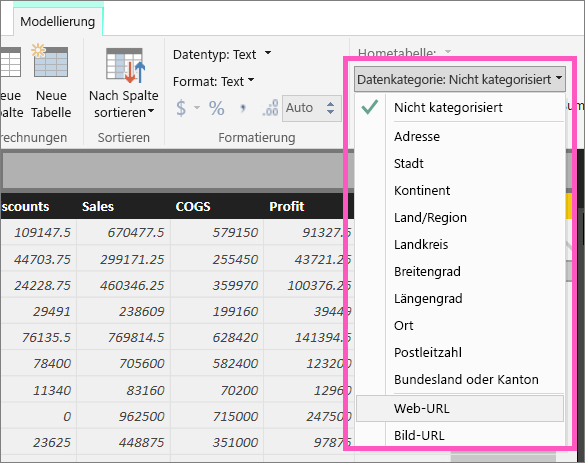
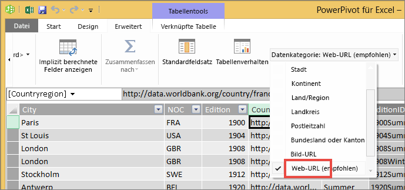

# Links in Tabellen
In diesem Thema wird erläutert, wie in Power BI Desktop Hyperlinks erstellt werden. Nach der Erstellung verwenden Sie dann entweder Desktop oder den Power BI-Dienst, um diese Hyperlinks Ihren Berichtstabellen und Matrizen hinzuzufügen. 

> **HINWEIS:** Hyperlinks in [Kacheln in Dashboards](service-dashboard-edit-tile.md) und [Textfeldern in Dashboards](service-dashboard-add-widget.md) können dynamisch mit dem Power BI-Dienst erstellt werden. Hyperlinks in [Textfeldern in Berichten](service-add-hyperlink-to-text-box.md) können dynamisch mit dem Power BI-Dienst und Power BI Desktop erstellt werden.
> 
> 

## So erstellen Sie mithilfe von Power BI Desktop einen Hyperlink in einer Tabelle oder Matrix
Hyperlinks in Tabellen und Matrizen können zwar in Power BI Desktop, jedoch nicht vom Power BI-Dienst erstellt werden. Hyperlinks können auch in Power Pivot für Excel erstellt werden, bevor die Arbeitsmappe in Power BI importiert wird. Beide Methoden werden nachfolgend beschrieben.

## Erstellen eines Tabellen- oder Matrix-Hyperlinks in Power BI Desktop
Das Verfahren zum Hinzufügen eines Hyperlinks hängt davon ab, ob Sie die Daten importiert oder über DirectQuery eine Verbindung mit ihnen hergestellt haben. Beide Szenarien werden nachfolgend beschrieben.

### Für in Power BI importierte Daten
1. Wenn der Hyperlink nicht bereits als Feld im Dataset vorhanden ist, fügen Sie ihn über die Desktopversion als [benutzerdefinierte Spalte](desktop-common-query-tasks.md) hinzu.
2. Wählen Sie in der Datenansicht die Spalte aus, und wählen Sie auf der Registerkarte **Modellierung** das Dropdownmenü für **Datenkategorie** aus.
   
    
3. Wählen Sie **Web-URL**aus.
4. Wechseln Sie zur Berichtsansicht, und erstellen Sie mit dem als Web-URL kategorisierten Feld eine Tabelle oder Matrix. Die Hyperlinks werden blau und unterstrichen angezeigt.
    
> **HINWEIS:** Die URLs müssen mit **http://, https://** oder **www** beginnen.
> 
>   
5. Wenn keine lange URL in einer Tabelle angezeigt werden soll, können Sie stattdessen ein Hyperlinksymbol  anzeigen lassen. Beachten Sie, dass Symbole nicht in Matrizen angezeigt werden können.
   
   * Wählen Sie das Diagramm aus, um es zu aktivieren.
   * Wählen Sie das Farbrollen-Symbol  aus, um den Formatierungsbereich zu öffnen.
   * Erweitern Sie **Werte**, suchen Sie nach dem **URL-Symbol** und **aktivieren** Sie es.
6. (Optional) [Veröffentlichen Sie den Bericht aus der Desktopversion im Power BI-Dienst](guided-learning/publishingandsharing.yml?tutorial-step=2), und öffnen Sie den Bericht im Power BI-Dienst. Die Hyperlinks werden hier ebenfalls geöffnet.

### Für über DirectQuery verbundene Daten
Im DirectQuery-Modus kann keine neue Spalte erstellt werden.  Wenn die Daten jedoch bereits URLs enthalten, können Sie diese in Hyperlinks umwandeln.

1. Erstellen Sie in der Berichtsansicht eine Tabelle mit einem Feld, das URLs enthält.
2. Wählen Sie die Spalte aus, und wählen Sie anschließend auf der Registerkarte **Modellierung** das Dropdownmenü für **Datenkategorie** aus.
3. Wählen Sie **Web-URL**aus. Die Hyperlinks werden blau und unterstrichen angezeigt.
4. (Optional) [Veröffentlichen Sie den Bericht aus der Desktopversion im Power BI-Dienst](guided-learning/publishingandsharing.yml?tutorial-step=2), und öffnen Sie den Bericht im Power BI-Dienst. Die Hyperlinks werden hier ebenfalls geöffnet.

## Erstellen eines Tabellen- oder Matrix-Hyperlinks in Power Pivot für Excel
Sie können Ihren Power BI-Tabellen und -Matrizen auch Hyperlinks hinzufügen, indem Sie die Hyperlinks im Dataset erstellen, bevor Sie das betreffende Dataset aus Power BI importieren bzw. eine Verbindung damit herstellen. In diesem Beispiel wird eine Excel-Arbeitsmappe verwendet.

1. Öffnen Sie die Arbeitsmappe in Excel.
2. Wählen Sie die Registerkarte **PowerPivot** und anschließend **Verwalten**.
   
   
3. Wenn PowerPivot geöffnet wird, wählen Sie die Registerkarte **Erweitert** aus.
   
   
4. Platzieren Sie den Cursor in der Spalte, die die URLs enthält, die in Links in Power BI-Tabellen umgewandelt werden sollen.
   
   > **HINWEIS:** Die URLs müssen mit **http://, https://** oder **www** beginnen.
   > 
   > 
5. Wählen Sie in der Gruppe **Berichtseigenschaften** die Dropdownliste **Datenkategorie** und wählen Sie dann **Web-URL**aus. 
   
   
6. Stellen Sie aus dem Power BI-Dienst oder Power BI Desktop eine Verbindung mit dieser Arbeitsmappe her, oder importieren Sie sie.
7. Erstellen Sie eine Tabellenvisualisierung, die das URL-Feld enthält.
   
   

## Zu beachtende Aspekte und Problembehandlung
F: Kann ich eine benutzerdefinierte URL als Link in einer Tabelle oder Matrix verwenden?    
A: Nein. Sie können ein Linksymbol verwenden. Wenn Sie benutzerdefinierten Text für Ihre Links benötigen und die Liste der URLs kurz ist, sollten Sie stattdessen ein Textfeld verwenden.

## Nächste Schritte
[Visualisierungen in Power BI-Berichten](visuals/power-bi-report-visualizations.md)

[Power BI – Grundkonzepte](consumer/end-user-basic-concepts.md)

Weitere Fragen? [Wenden Sie sich an die Power BI-Community](http://community.powerbi.com/)

