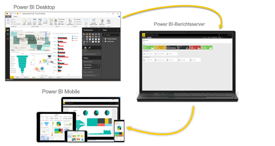

# Was ist Power BI?
**Power BI** ist eine Sammlung von Softwarediensten, Apps und Connectors, die zusammenwirken, um Ihre nicht verbundenen Datenquellen in kohärente, visuell überzeugende und interaktive Einblicke umzuwandeln. Ihre Daten können als Excel-Kalkulationstabelle oder als eine hybride Sammlung von cloudbasierten und lokalen Data Warehouse-Instanzen vorliegen. Powerbi können Sie problemlos eine Verbindung mit Ihren Datenquellen herstellen, visualisieren und entdecken, was wichtig ist und freigeben, die für alle Benutzer oder alle gewünschten.

Powerbi kann sein, einfache und schnelle, schnelleinblicke aus einem Excel-Arbeitsblatt oder einer lokalen Datenbank erstellen kann. Jedoch Power BI ist auch stabil und unternehmenstauglich, für die umfangreiche Modellierung und Analysen in Echtzeit sowie die benutzerdefinierte Entwicklung bereit. Es kann sein, Ihre persönlichen Bericht und das Tool für die datenvisualisierung, und auch als Engine für Analyse und entscheidungsfindung für Gruppenprojekte, Abteilungen oder gesamte Unternehmen dienen.

## Komponenten von Power BI
Powerbi besteht aus: 
- Eine Windows-desktop-Anwendung namens **Power BI Desktop**
- Eine SaaS-Onlinedienst (*Software als Dienst*) Dienst mit dem Namen der **Power BI-Dienst** 
- Power BI **mobilen apps** für Windows, iOS und Android-Geräte

Diese drei Elemente&mdash;Power BI Desktop, den Dienst und den mobilen apps&mdash;sollen Personen erstellen, freigeben und die Möglichkeit, die von ihnen oder ihrer Rolle entsprechend möglichst effektiv geschäftseinblicke nutzen können.

Ein viertes Element, der **Power BI-Berichtsserver**, ermöglicht Ihnen nach der Erstellung in Power BI Desktop das Veröffentlichen von Power BI-Berichten auf einem lokalen Berichtsserver. Informieren Sie sich umfassender über den [Power BI-Berichtsserver](#on-premises-reporting-with-power-bi-report-server).

## Verwendung von Power BI entsprechend Ihrer Rolle
Wie Sie Power BI verwenden, kann von Ihrer Rolle in einem Projekt oder einem Team abhängen. Andere Personen können in anderen Rollen, Power BI anders.

Beispielsweise können Sie in erster Linie den **Power BI-Dienst** verwenden. Aber Ihr mehr mit Zahlen befasster Arbeitskollege nutzt in großem Umfang **Power BI Desktop**, um Berichte zu erstellen und diese Berichte dann im Power BI-Dienst zu veröffentlichen, wo sie Ihnen zur Verfügung stehen. Eine andere Mitarbeiterin im Vertrieb verwendet dagegen hauptsächlich die **Power BI-Smartphone-app** Fortschritt zu ihrer Absatzquoten zu überwachen und um neue Vertriebslead Details anzuzeigen.

Wenn Sie Entwickler sind, können Sie Power BI-APIs verwenden, um Daten per Push in Datasets zu übertragen oder um Dashboards und Berichte in Ihre eigenen benutzerdefinierten Anwendungen zu integrieren. Sie haben eine Idee für ein neues Visual? Erstellen Sie es selbst, und geben Sie es für andere frei.  

Sie können auch jedes Element von Power BI verwenden, zu unterschiedlichen Zeitpunkten, je nachdem was Sie erreichen möchten oder Ihre Rolle für ein bestimmtes Projekt.

Wie Sie Power BI verwenden, kann sich einfach danach richten, welche Funktion oder welcher Dienst von Power BI das beste Tool für Ihre Situation darstellt. Beispielsweise können Sie Power BI Desktop zum Erstellen von Berichten für Ihr Team zu Customer Engagement Statistiken ein, und sehen Sie Bestands- und herstellungsstatus in einem echtzeitdashboard im Power BI-Dienst. Ihnen steht jeder Teil von Power BI zur Verfügung, genau deshalb ist es so flexibel und überzeugend.

Untersuchen Sie Dokumente, die sich auf ihre Rolle beziehen:
- Power BI für [***Designer***](desktop-what-is-desktop.md)
- Power BI für [***Verbraucher***](consumer/end-user-consumer.md)
- Power BI für [***Entwickler***](developer/what-can-you-do.md)
- Power BI für [***Administratoren***](service-admin-administering-power-bi-in-your-organization.md)

## Arbeitsablauf in Power BI
Ein allgemeine Arbeitsablauf in Power BI beginnt mit dem eine Verbindung mit Datenquellen, und Erstellen eines Berichts in Power BI Desktop. Klicken Sie dann diesen Bericht aus Power BI Desktop, Power BI-Dienst veröffentlichen und teilen Sie sie an, damit Endbenutzer in den Power BI-Dienst und den mobilen Geräten anzeigen und mit dem Bericht interagieren können.
Dieser Workflow ist üblich und zeigt, wie sich die drei Hauptelemente von Power BI gegenseitig ergänzen.

Hier finden Sie einen detaillierten [Vergleich von Power BI Desktop und Power BI-Dienst](service-service-vs-desktop.md).

Was aber, wenn Sie noch nicht für eine Migration in die Cloud bereit sind und Ihre Berichte hinter einer Unternehmensfirewall speichern möchten?  Lesen Sie weiter.

## Lokale berichterstellung mit Power BI-Berichtsserver
Erstellen, bereitstellen und Verwalten von Power BI mobile und paginierte Berichte lokal mit einer Reihe von sofort zu bedienende Tools und Dienste, die Power BI-Berichtsserver bietet.

Power BI-Berichtsserver ist eine Lösung, die Sie hinter Ihrer Firewall bereitstellen. Danach stellen Sie Ihre Berichte den richtigen Benutzern auf unterschiedliche Weise zur Verfügung: in einem Webbrowser, auf einem mobilen Gerät oder per E-Mail. Power BI-Berichtsserver ist mit Power BI in der Cloud kompatibel, sodass Sie jederzeit zur Cloud wechseln können. 

Informieren Sie sich umfassender über den [Power BI-Berichtsserver](report-server/get-started.md).

## Nächste Schritte
- [Schnellstart: Machen Sie sich Power BI-Dienst](service-the-new-power-bi-experience.md)   
- [Tutorial: Erste Schritte mit Power BI-Dienst](service-get-started.md)
- [Schnellstart: Herstellen einer Verbindung mit Daten in Power BI Desktop](desktop-quickstart-connect-to-data.md)
