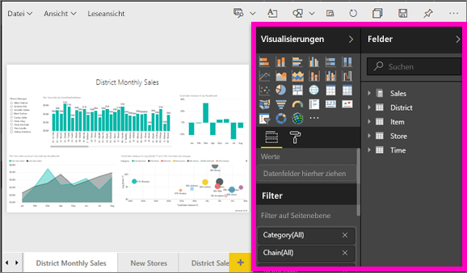
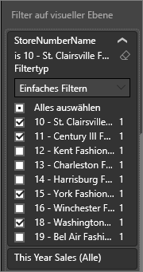

# Hinzufügen eines Filters zu einem Bericht in Power BI (in der Bearbeitungsansicht)
> [!TIP]
> Es wird empfohlen, zuerst den Artikel [Informationen zu Filtern und Hervorhebungen in Power BI-Berichten](power-bi-reports-filters-and-highlighting.md) zu lesen.
> 
> 

## Unterschiede zwischen Berichtsfiltern in der Bearbeitungsansicht und in der Leseansicht
Es gibt zwei Modi für die Interaktion mit Berichten: [Leseansicht](service-interact-with-a-report-in-reading-view.md) und [Bearbeitungsansicht](service-interact-with-a-report-in-editing-view.md).  Es hängt vom Modus ab, in dem Sie sich befinden, welche Filterfunktionen verfügbar sind.

* In der Bearbeitungsansicht können Sie Berichts-, Seiten- und visuelle Filter hinzufügen. Wenn Sie den Bericht speichern, werden die Filter ebenfalls gespeichert. Personen, die den Bericht in der Leseansicht anzeigen, können mit den von Ihnen hinzugefügten Filtern interagieren, aber die Änderungen nicht speichern.
* In der Leseansicht können Sie mit allen Berichts-, Seiten- und visuellen Filtern interagieren, die im Bericht bereits vorhanden sind. Sie können Ihre Filteränderungen allerdings nicht speichern.

> [!NOTE]
> In diesem Artikel wird beschrieben, wie Sie Filter im Bericht **Bearbeitungsansicht** erstellen.  Weitere Informationen zu Filtern in der Leseansicht finden Sie unter [Interagieren mit Filtern und Hervorhebungen in der Leseansicht von Berichten](service-interact-with-a-report-in-reading-view.md).
> 
> 

## Visualfilter, Seitenfilter, Drillthroughfilter und Berichtsfilter
Ein **Seitenfilter** gilt für Visualisierungen auf der Berichtsseite. Ein **visueller Filter** gilt für ein einzelne Visualisierung auf einer Berichtsseite. Ein **Berichtsfilter** gilt für alle Seiten im Bericht.

## Hinzufügen eines Filters zu einer bestimmten Visualisierung (Visualisierungsfilter)
Hierfür gibt es zwei Methoden: 

* Fügen Sie einem Feld, das bereits von der Visualisierung verwendet wird, einen Filter hinzu.
* Suchen Sie ein Feld, das noch nicht von der Visualisierung verwendet wird, und fügen Sie dieses Feld direkt dem Bucket **Filter auf visueller Ebene** hinzu.

### Filtern Sie die Felder, die bereits in der Visualisierung enthalten sind.
1. Öffnen Sie Ihren Bericht in der [Bearbeitungsansicht](service-reading-view-and-editing-view.md).
   
   
2. Öffnen Sie den Bereich für die Visualisierungen und Filter und den Bereich für die Felder (falls nicht bereits geöffnet).
   
   
3. Wählen Sie eine Visualisierung aus, um ihn zu aktivieren. Alle Felder, die vom Visual verwendet werden, sind im Bereich **Felder** angegeben und auch im Bereich **Filter** unter der Überschrift **Filter auf visueller Ebene** aufgeführt.
   
   
4. Jetzt wird einem Feld, das bereits von der Visualisierung verwendet wird, ein Filter hinzugefügt. 
   
   * Scrollen Sie zum Bereich **Filter auf visueller Ebene**, und wählen Sie den Pfeil aus, um das Feld zu erweitern, das Sie filtern möchten. In diesem Beispiel wird **StoreNumberName** gefiltert.
     
       
   * Legen Sie für die Filtersteuerelemente entweder **Einfach**, **Erweitert** oder **Top N** fest (siehe [Verwenden von Berichtsfiltern](power-bi-how-to-report-filter.md)). In diesem Beispiel wird die einfache Filterung ausgewählt, und neben den Zahlen 10, 11, 15 und 18 wird jeweils ein Häkchen gesetzt.
     
       
   * Die Visualisierung ändert sich und spiegelt den neuen Filter wider. Wenn Sie Ihren Bericht mit dem Filter speichern, können Leser des Berichts mit dem Filter in der Leseansicht interagieren und Werte auswählen oder löschen.
     
      
5. Fügen wir der Visualisierung nun ein ganz neues Feld als Filter auf visueller Ebene hinzu.
   
   * Wählen Sie im Bereich „Felder“ das Feld aus, das Sie als neuen Filter auf visueller Ebene hinzufügen möchten, und ziehen Sie es in den Bereich **Filter auf visueller Ebene**.  In diesem Beispiel ziehen wir **District Manager** in den Bucket **Filter auf visueller Ebene** und wählen nur „Andrew Ma“ aus. 
     
      
   * Beachten Sie, dass **District Manager** der Visualisierung selbst *nicht* hinzugefügt wird. Die Visualisierung besteht weiterhin aus **StoreNumberName** als Achse und aus **This Year Sales** als Wert.  
     
      
   * Die Visualisierung selbst wird nun gefiltert, sodass nur die diesjährigen Verkäufe von Andrew für die angegebenen Geschäfte angezeigt werden.
     
     

## Hinzufügen eines Filters für eine komplette Seite (Seitenansichtsfilter)
1. Öffnen Sie Ihren Bericht in der [Bearbeitungsansicht](service-reading-view-and-editing-view.md).
2. Öffnen Sie den Bereich für die Visualisierungen und Filter und den Bereich für die Felder (falls nicht bereits geöffnet).
3. Wählen Sie im Bereich „Felder“ das Feld aus, das Sie als neuen Filter auf Seitenebene hinzufügen möchten, und ziehen Sie es in den Bereich **Filter auf Seitenebene**.  
4. Wählen Sie die Werte aus, die Sie filtern möchten, und legen Sie für die Filtersteuerelemente entweder **Einfach** oder **Erweitert** fest (siehe [Verwenden von Berichtsfiltern](power-bi-how-to-report-filter.md)).
   
   Alle Visualisierungen auf der Seite, die von diesem Filter beeinflusst werden, werden neu gezeichnet, um die Änderung zu übernehmen. 
   
   

Wenn Sie Ihren Bericht mit dem Filter speichern, können Leser des Berichts mit dem Filter in der Leseansicht interagieren und Werte auswählen oder löschen.

## Hinzufügen eines Drillthroughfilters
Mit Drillthrough im Power BI-Dienst und Power BI Desktop können Sie eine *Ziel*-Berichtseite erstellen, die auf eine bestimmte Entität fokussiert ist, z.B. einen Lieferanten, Kunden oder Hersteller. Nun können Benutzer auf den anderen Berichtseiten mit der rechten Maustaste auf einen Datenpunkt für die Entität klicken und einen Drillthrough für die fokussierte Seite ausführen.

### Erstellen eines Drillthroughfilters
Öffnen Sie das Beispiel zur Kundenrentabilität in der Bearbeitungsansicht. Angenommen, Sie benötigen eine Seite, die auf Managementgeschäftsbereiche fokussiert ist.   

1. Fügen Sie dem Bericht eine neue Seite hinzu, und benennen Sie diese **Team Executive** (Teammanager). Dies wird die *Ziel*-Drillthroughseite.
2. Fügen Sie Visualisierungen zum Verfolgen von Schlüsselmetriken für die Geschäftsbereiche der Teammanager hinzu.    
3. Fügen Sie dem Bereich „Drillthroughfilter“ **Executive > Executive Name** (Führungskraft > Name der Führungskraft) hinzu.    
   
    
   
    Beachten Sie, dass Power BI der Berichtseite einen Zurück-Pfeil hinzufügt.  Wenn der Benutzer auf den Zurück-Pfeil klickt, kehrt er zur *Ausgangs*berichtseite zurück – zu der Seite, auf der er den Drillthrough ausgewählt hat. Der Zurück-Pfeil kann nur in der Leseansicht verwendet werden.
   
     

### Verwenden des Drillthroughfilters
Im Folgenden wird beschrieben, wie der Drillthroughfilter funktioniert.

1. Starten Sie auf der Berichtseite **Team-Scorecard**.    
2. Angenommen, Sie sind Andrew Ma und möchten die „Team Executive“-Berichtseite so gefiltert anzeigen, dass nur Ihre Daten enthalten sind.  Klicken Sie im Flächendiagramm oben rechts auf einen grünen Datenpunkt, um die Menüoption „Drillthrough“ zu öffnen.
   
    
3. Wählen Sie **Drillthrough > Team Executive** aus, um einen Drillthrough zur Berichtseite **Team Executive** (Teammanager) durchzuführen. Die Seite wird so gefiltert, dass Informationen zum Datenpunkt angezeigt werden, auf den Sie mit der rechten Maustaste geklickt haben; in diesem Fall „Andrew Ma“. An die Drillthroughberichtseite wird nur das Feld übergeben, das sich im Bereich „Drillthroughfilter“ befindet.  
   
    

## Hinzufügen eines Filters für einen gesamten Bericht (Berichtsfilter)
1. Öffnen Sie Ihren Bericht in der [Bearbeitungsansicht](service-reading-view-and-editing-view.md).
2. Öffnen Sie den Bereich für die Visualisierungen und Filter und den Bereich für die Felder (falls nicht bereits geöffnet).
3. Wählen Sie im Bereich „Felder“ das Feld aus, das Sie als neuen Filter auf Berichtsstufe hinzufügen möchten, und ziehen Sie es in den Bereich **Berichtsstufenfilter**.  
4. Wählen Sie die zu filternden Werte aus (siehe [Verwenden von Berichtsfiltern](power-bi-how-to-report-filter.md)).

Die Visuals auf der aktiven Seite und auf allen Seiten des Berichts ändern sich, um den neuen Filter widerzuspiegeln. Wenn Sie Ihren Bericht mit dem Filter speichern, können Leser des Berichts mit dem Filter in der Leseansicht interagieren und Werte auswählen oder löschen.

1. Wählen Sie den Zurück-Pfeil aus, um zur vorherigen Berichtseite zurückzukehren.

## Problembehandlung
### Gründe für unterschiedliche Ergebnisse Ihres Filters auf Visualisierungsebene und auf Seitenebene
Wenn Sie einen Filter auf Visualisierungsebene hinzufügen, filtert Power BI die aggregierten Ergebnisse.  Die standardmäßige Aggregatfunktion ist „Summe“, Sie können jedoch den [Aggregattyp ändern](service-aggregates.md).  

Wenn Sie einen Filter auf Seitenebene hinzufügen, filtert Power BI ohne Aggregieren.  Dies liegt daran, dass eine Seite über viele Visualisierungen verfügen kann, die jeweils unterschiedliche Aggregationstypen verwenden.  Daher wird der Filter auf jede Datenzeile angewendet.

Wenn der Bereich „Felder“ nicht angezeigt wird, stellen Sie sicher, dass Sie die [Bearbeitungsansicht](service-interact-with-a-report-in-editing-view.md) des Berichts geöffnet haben.

## Nächste Schritte
 [Verwenden von Berichtsfiltern](power-bi-how-to-report-filter.md)

  [Filter und Hervorhebungen in Berichten](power-bi-reports-filters-and-highlighting.md)

[Interagieren mit Filtern und Hervorhebungen in der Leseansicht von Berichten](service-interact-with-a-report-in-reading-view.md)

[Ändern der Kreuzfilterung und -hervorhebung von Berichtsvisualisierungen](service-reports-visual-interactions.md)

Weitere Fragen? [Wenden Sie sich an die Power BI-Community](http://community.powerbi.com/)

