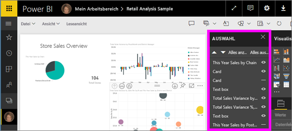

# Einstellungen für die Seitenanzeige in einem Power BI-Bericht
Wir wissen, wie wichtig es ist, dass das Layout des Berichts perfekt ist. Das ist in manchen Fällen jedoch schwierig, da Sie und Ihre Kollegen die Berichte auf Bildschirmen mit unterschiedliche Seitenverhältnissen und Größen anzeigen. 

Die Standardeinstellung für die Anzeige ist **An Seite anpassen** und die Standardgröße ist **16:9**. Wenn Sie ein anderes Seitenverhältnis nutzen oder den Bericht auf eine andere Weise anpassen möchten, stehen Ihnen zwei Tools zur Verfügung: die Einstellungen für die ***Seitenansicht*** und die ***Seitengröße***.

<iframe width="560" height="315" src="https://www.youtube.com/embed/5tg-OXzxe2g" frameborder="0" allowfullscreen></iframe>

## Informationen zu den Einstellungen für die Seitenansicht im Power BI-Dienst und in Power BI Desktop
Einstellungen für die Seitenansicht sind sowohl im Power BI-Dienst als auch in Power BI Desktop verfügbar, die Benutzeroberflächen unterscheiden sich aber leicht. In den folgenden beiden Abschnitten wird erläutert, wo sich die Einstellungen für die Seitenansicht in den verschiedenen Power BI-Tools befinden.

### Power BI Desktop
Wählen Sie in der Berichtsansicht die Registerkarte **Ansicht** aus, um die Einstellungen für die Seitenansicht sowie für das Telefonlayout zu öffnen.

  

### Power BI-Dienst („app.powerbi.com“)
Öffnen Sie im Power BI-Dienst einen Bericht, und wählen Sie in der oberen linken Menüleiste **Ansicht** aus.

Die Einstellungen für die Seitenansicht stehen in der [Leseansicht und der Bearbeitungsansicht](service-reading-view-and-editing-view.md) zur Verfügung. In der Bearbeitungsansicht kann der Besitzer eines Berichts einzelnen Berichtsseiten eine Seitenansichtseinstellung zuweisen; diese Einstellungen werden mit dem Bericht gespeichert. Wenn ein Kollege den Bericht in der Leseansicht öffnet, werden ihm die Berichtsseiten mit den Einstellungen des Besitzers angezeigt.  In der Leseansicht können die Kollegen *einige* der Seitenansichtseinstellungen ändern. Die Änderungen werden aber nicht gespeichert, wenn sie den Bericht schließen.

##    Seitenansichtseinstellungen
Mit der ersten Gruppe von Einstellungen für die *Seitenansicht* wird die Anzeige der Berichtsseite in Relation zum Browserfenster angepasst.  Sie können zwischen folgenden Einstellungen wählen:

* **An Seite anpassen** (Standard): Inhalte werden für die beste Anpassung an die Seitengröße skaliert.
* **An Breite anpassen:**Inhalte werden für die Anpassung an die Seitenbreite skaliert.
* **Originalgröße:**Inhalte werden in voller Größe angezeigt.

Die zweite Gruppe von Einstellungen für die *Seitenansicht* steuert die Positionierung von Objekten im Zeichenbereich des Berichts.

* **Gitternetzlinien anzeigen**: Hiermit werden Gitternetzlinien eingeblendet, damit Sie Objekte leichter auf dem Zeichenbereich des Berichts positionieren können.
* **Am Raster ausrichten**: In Kombination mit **Gitternetzlinien anzeigen** können Sie hiermit Objekte im Zeichenbereich des Berichts genau positionieren und ausrichten. 
* **Objekte sperren**: Hiermit werden alle Objekte im Zeichenbereich gesperrt und können nicht mehr verschoben oder in der Größe geändert werden.
* **Auswahlbereich**: Im Auswahlbereich werden alle Objekte im Zeichenbereich aufgelistet, und Sie können entscheiden, welche Objekte angezeigt und welche ausgeblendet werden sollen.

    

## Seitengrößeeinstellungen

Die Einstellungen für die *Seitengröße* sind nur für den Besitzer eines Berichts verfügbar. Im Power BI-Dienst („app.powerbi.com“) müssen Sie hierzu den Bericht in der [Bearbeitungsansicht](service-reading-view-and-editing-view.md) öffnen können. Mit diesen Einstellungen können Sie das Seitenverhältnis und die tatsächliche Größe (in Pixel) des Zeichenbereichs festlegen.   

* 4:3-Seitenverhältnis
* 16:9-Seitenverhältnis (Standard)
* Cortana
* Brief
* Benutzerdefiniert (Höhe und Breite in Pixel)

## Nächste Schritte
[Erfahren Sie, wie Sie die Einstellungen für Seitenansicht und Seitengröße in Ihren eigenen Power BI-Berichten verwenden können](power-bi-change-report-display-settings.md).

Erfahren Sie mehr über [Berichte in Power BI](service-reports.md).

[Power BI – Grundkonzepte](service-basic-concepts.md)

Weitere Fragen? [Wenden Sie sich an die Power BI-Community](http://community.powerbi.com/)

