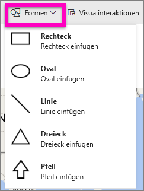

# Statische Inhalte in Power BI-Berichten
Fügen Sie im Power BI-Dienst in der Bearbeitungsansicht einem Bericht Textfelder und Formen hinzu. 

> **HINWEIS**: In Power BI Desktop können Sie [Ihrem Bericht auch statische Bilder hinzufügen](guided-learning/visualizations.yml#step-11) (wie in diesem Video gezeigt).
> 
> <iframe width="560" height="315" src="https://www.youtube.com/embed/_3q6VEBhGew" frameborder="0" allowfullscreen></iframe>
> 
> 

## Hinzufügen eines Textfelds zu einem Bericht
1. Platzieren Sie den Cursor an einer beliebigen Stelle im Berichtszeichenbereich und wählen Sie **Textfeld**aus.
   
   
2. Geben Sie den Text in das Textfeld ein und optional Format, Schriftart, Farbe und Textausrichtung an. 
   
   
3. Um das Textfeld zu positionieren, wählen Sie den grauen Bereich oben und ziehen Sie diesen mit dem Mauszeiger. Um die Größe des Textfeldes zu ändern, wählen und ziehen Sie einen der Konturziehpunkte. 
   
   
4. Um das Textfeld zu schließen, klicken Sie auf eine beliebige leere Stelle im Berichtszeichenbereich.
5. Wählen Sie das Anheftsymbol , um das Textfeld an ein Dashboard anzuheften. 

## Hinzufügen einer Form zu einem Bericht
1. Platzieren Sie den Cursor an einer beliebigen Stelle im Berichtszeichenbereich, und wählen Sie **Formen** aus.
   
   
2. Wählen Sie in der Dropdownliste eine Form aus, um sie dem Berichtszeichenbereich hinzuzufügen. Lassen Sie uns einen Pfeil hinzufügen, um die Aufmerksamkeit auf die Blase mit der höchsten Gesamtabweichung beim Umsatz zu lenken. 
   
   Passen Sie Ihre Form im Bereich **Form formatieren** an. In diesem Beispiel haben wir einen roten um 90 Grad gedrehten Pfeil mit einem dunkelroten Rahmen erstellt.
   
   
3. Um die Form zu positionieren, wählen Sie den grauen Bereich oben aus und ziehen diesen mit dem Mauszeiger. Um die Größe der Form zu ändern, wählen und ziehen Sie einen der Konturziehpunkte. 

> **HINWEIS**: Formen können nicht an ein Dashboard angeheftet werden. 
> 
> 

### Nächste Schritte
[Hinzufügen eines Links zu einem Textfeld](service-add-hyperlink-to-text-box.md)

[Berichte in Power BI](service-reports.md)

[Visualisierungen in Power BI-Berichten](power-bi-report-visualizations.md)

[Power BI – Grundkonzepte](service-basic-concepts.md)

Weitere Fragen? [Wenden Sie sich an die Power BI-Community](http://community.powerbi.com/)

